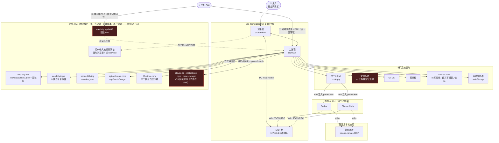

# 01 · 系统上下文总图（C4 Level 1）

> **作用**：划定外部边界。Agent 不得私自新增外部服务调用 —— 要加，先在这张图上加。
> **维护频率**：极低。接入新第三方大服务、新增网络出站端点才改。

## 图

## 外部系统清单

| 外部系统 | 用途 | 接入点 | 凭证 |
|---|---|---|---|
| **Claude Code CLI** | 主 AI 链路 | `src/main/agentChat/adapters/claude.ts`、`claudeEvents.ts` | 用户本机已登录 |
| **Codex CLI** | 第二 AI 链路 | `adapters/codex.ts`、`codexEvents.ts` | 同上，读 `~/.codex/sessions/*` |
| **Claude 额度接口** | 直连取用量（零 token 消耗） | `src/main/quotaApi.ts` | OAuth token，**从钥匙串现取，绝不落盘** |
| **更新检查** | 查新版本，仅提示不自动装；用户点下载才取安装包 | `src/main/updater.ts` | 无 |
| **匿名遥测** | 8 类白名单计数，无内容/无路径/无跨天 ID | `src/main/telemetry.ts` | 无 |
| **隧道服务器** `eas.biily.top:8443` | 手机在外网时中转 | `src/tunnel/hub.ts`（服务端）、`src/main/phone/tunnelClient.ts`（客户端） | agentKey + 端到端 TLS |
| **笔纵画板** | 生图/画布，第三方本机 MCP；**没装时**去 `bzone.biily.top/version.json` 取安装包直链 | `mcp/bizone-mcp.mjs`（只负责拉起 App）、`src/main/bizone.ts` | 本机 app 互信 |
| **CLI 安装脚本** | 用户点「安装 Claude Code / Codex」时执行的远程脚本 | 命令拼在 `src/main/agentInstall.ts`，执行在 `src/main/cliAuth/install.ts` | 无（⚠️ 以用户权限跑，见出站表） |
| **Git CLI** | 版本控制面板，`execFile` 无 shell | `src/main/git.ts` | 用户系统 git 配置 |
| **PTY / Shell** | 终端核心 | `src/main/pty.ts` | 无 |
| **文件系统** | 读写 | `src/main/fs.ts` ← 过 `fsGuard.ts`；另有两条更窄的独立写边界，见下节 | 无 |
| **剪贴板** | 文本/图片 | `src/main/fs.ts`（`clipboard:*`） | 无 |
| **sherpa-onnx** | 语音转写：**推理全程本地**；模型不随包附带（省 ~300MB），首次使用从 `hf-mirror.com` 下到 `userData/models`，就绪后不再出站（dev 下 `resources/models` 已有则不触发） | `src/main/stt.ts`（`HF` / `downloadFile` / `downloadModels`） | 无 |
| **系统钥匙串** | 密钥柜加密后端（macOS Keychain / Win DPAPI） | `src/main/secrets.ts` | 六位数字码解锁 |
| **画布浏览器节点** | 用户在画布上开任意网址的 `<webview>`，本质就是个 Chromium 标签页 | `mcpHandler.ts` 的 `canvas_open_url`、`src/main/index.ts` 的 `webviewTag` | 无 |
| **手机（局域网路）** | 手机→电脑 HTTP，**读 + 受限写**（`READ_ONLY = false`）：读文档/状态/对话；写侧可 `newSession` 建对话节点、`send` 发消息（首条消息会顺带拉起 CLI 进程） | `src/main/phone/server.ts`、`lan.ts`、`pairing.ts`、`audit.ts` | pairing token |
| **手机（隧道路）** | 外网时走 hub | `src/main/phone/tunnelClient.ts` | agentKey + SPKI 指纹钉死 |

## 文件系统：写边界有三条，`fsGuard` 只是其中一条

凡是**路径由渲染层 / MCP 传进来**的写操作，必须落在下面三条之一。三条各自独立、互不复用，
**谁也不许靠放宽 fsGuard 来解决**：

| 边界 | 管哪条路 | 允许写的根 |
|---|---|---|
| `src/main/fsGuard.ts`（`guardPath`/`guardDir`） | `fs:*` IPC（`fs.ts`）· 画布快照（`snapshot.ts`）· 装审批 hook（`agentChat/session.ts` 写 `<cwd>/.claude/settings.json`）；手机读文件也过它（`phone/server.ts`） | `projects.json` 里的项目根 + 知识库根，且**根自己不能动**（改名/删除得走项目管理） |
| `src/main/skillLibrary/write.ts`（落盘在同目录 `index.ts`） | skill 面板的复制 / 编辑 | 已登记的 skill 目录 ∪ 已注册项目的 `<项目>/.claude/skills`，且落点必须在某个 skill 子目录**之内**（不能写根、不能新起一层） |
| `src/main/projectPaths.ts`（`projects:renameFolder`） | 项目根改名 | 恰好等于某个已注册项目根、只改最后一段、留在同一父目录 |

后两条**比 fsGuard 更窄**，是刻意不复用它的（理由写在各自文件头）：skill 目录本来就在
fsGuard 的边界之外，而项目根改名正是 fsGuard 明确拒绝、要求走项目管理的那条路。
**看到它们别当成「绕过红线」去合并** —— 合并的唯一出路是放宽 fsGuard 的根，
而那会把 `fs:*` 的所有写操作一起放宽。

另有两类写**不在**上述任何一条里，也不该硬塞进去（路径全由主进程算死，渲染层碰不到，
不存在路径注入面）：

- **app 自己的状态**：`userData/` 下的 prefs / 画布 / 待办 / 角色 / 辞典…，
  以及 `mcpBridge.ts` 落的 `mcp-endpoint.json`（0600）。
- **app 托管区**：`agentRules.ts` 写 `~/.codex/AGENTS.md` 的标记段、`~/.eas/agent/`、
  `~/.claude/skills/eas-term/`；`agentHook.ts` 写 `~/.claude/settings.json`。
  它有自己一套纪律（标记段内整段重生成、区外一个字不碰、写前备份 `.eas-backup`、
  独占目录写完设 0444、启动时比对内容不一致就重写），见 `agentRules.ts` 文件头。

**加新写入口的判据**：路径来自渲染层/MCP → 挂到上面三条之一，或新加一条**同样窄**的
并补进这张表；路径由主进程算死、落在 userData 或托管区 → 不过守卫，但照托管区那套纪律写。
任何情况下都不放宽 fsGuard 的根。

## 网络出站清单

改代码前先对照这张表。**表里每一条都是既有且合规的，不是待清理的违规。**

| 端点 | 什么时候触发 | 代码位置 | 性质 |
|---|---|---|---|
| `eas.biily.top/download/latest.json` | 启动 12s 后 + 每 6h，设置里可关 | `updater.ts`（`net.request` 主路 + `https.get` 兜底） | 自家 |
| `eas.biily.top` 安装包直链 | 用户在更新提示里点「下载」 | `updater.ts` 的 `download()` | 自家 |
| `eas.biily.top/e` | 每 5min 心跳 + 退出时，设置里可关（dev 默认不报） | `telemetry.ts` | 自家 |
| `eas.biily.top:8443` 隧道 | 手机在外网，且**两个开关都开**（默认关） | `phone/index.ts` 的 `DEFAULT_TUNNEL` + `phone/tunnelClient.ts` | 自家 |
| `bzone.biily.top/version.json` | 打开笔纵面板且本机没装它；2.5s 超时后回退官网 | `bizone.ts` 的 `bizone:check` | 自家，但**不是** eas 域名 |
| `api.anthropic.com/api/oauth/usage` | 取额度；401/403 之后退避 10min | `quotaApi.ts` 的 `fetchUsage` | 第三方只读 |
| `hf-mirror.com` | **第一次点麦克风且模型未就绪**，下 ~300MB 到 `userData/models` | `stt.ts` 的 `HF` / `downloadFile` / `downloadModels`（裸 `fetch`，无超时） | 第三方只读 |
| ⚠️ `claude.ai` · `chatgpt.com` · npm registry · brew / winget | **用户点「安装 CLI」**，远程脚本经 `/bin/sh -c`（Win 是 powershell）**以用户权限执行** | 命令只在 `agentInstall.ts` 的 `optionsFor()` 拼，执行在 `cliAuth/install.ts` 的 `startInstall()` | 第三方**可执行** |
| 用户输入的任意网址 | 画布上开浏览器节点 | `mcpHandler.ts` 的 `canvas_open_url` → 渲染层 `<webview>` | 用户驱动，不算应用自身端点 |

最后两行值得单独记：

- **安装脚本那条是全仓风险最高的出站** —— 别的都是取一段数据，这条是把远程内容当代码跑。
  命令**只在 `agentInstall.ts` 一处拼**，`install.ts` 不自己拼（两处各拼一份必然分叉，
  源码注释已经钉死这一点）。
- **浏览器节点是最大的攻击面**，虽然不是 app 主动发起的出站 —— `fsGuard.ts` 文件头那条
  威胁模型（「渲染进程能被网页内容影响」）正是冲着它写的。做安全审计时别漏。

> 本表与 `site/privacy.html` 第三节「它什么时候联网」讲的是同一件事，两种口径：
> 那份是对用户的承诺，按「你做了什么动作」列（默认关的隧道、走用户自己账号的额度接口
> 不在其中）。任一处改了，**同一个 commit 改另一处**。

## 边界红线

1. **隧道绝不终止 TLS。** 手机↔电脑是一条完整 TLS，hub 只搬字节 —— 它读不到内容不是因为
   承诺了不读，是**手里没有那把钥匙**。`src/tunnel/hub.test.ts` 有测试断言手机拿到的证书
   指纹等于电脑那张，hub 若在中间解开重加密，这条当场就红。
2. **手机服务端绝不绑 `0.0.0.0`。** `src/main/phone/server.ts` 的两个监听（明文给浏览器、
   TLS 给 app）都只绑挑出来的局域网地址。
3. **MCP 桥的门**：只听 `127.0.0.1` · 随机 token 经 PTY env 注入（`EAS_TERM_PORT`/`EAS_TERM_TOKEN`），
   **同时以 0600 写在 `userData/mcp-endpoint.json`**（`mcpBridge.ts` 的 `server.listen` 回调里，
   供手动配置 MCP 读取，**别删**，`scripts/smoke.mjs` 也在探它）·
   `canvas_open_file`/`open_html` 有项目内路径白名单（防渲染 `~/.ssh`）。
   > ⚠️ 因此这个全局 token 只是「**本机同用户可得**」级别的凭证，**不能证明调用方是哪个终端**，
   > 更不能当授权用。真正的按终端授权是密钥柜那道 `x-eas-secret-token`：每个 PTY 一张
   > （`secrets.ts` 的 `issueSecretToken`，`pty.ts` 注入 `EAS_SECRET_TOKEN`），
   > 在全局 token **之上再叠一道**（两张都要过，`/secret-env` 那个分支）。
   > **新增任何取密钥 / 高权限端点一律照 `/secret-env` 走这道，别只认 `x-eas-token`** ——
   > 只认它等于没门：一个零密钥终端里的 npm postinstall 就能拿走整柜（教训写在 `secrets.ts`
   > 「按终端授权」那段）。
4. **不得新增网络出站端点。** 清单见上一节 —— **表里的每一条都是既有且合规的，别「顺手删掉」**。
   判据不看数量看机制：新增 `fetch` / `net.fetch` / `net.request` / `https.get` / `http(s).request`，
   **以及任何会联网的子进程命令**（`curl … | bash`、`irm … | iex`、`npm i -g`、`brew install`），
   都要先改这张图。
5. **生图默认走笔纵画板 —— 是默认路由，不是代码强制的不变量。** 别按 1–4 的读法照抄。
   - **全局那半在提示词层**：`agentRules.ts` 往常驻区注入「要图 / 封面 / 海报 / 视频 →
     **默认**走 `bizone-canvas`，不要调别的图像 API；**但用户点名了别的生成 skill 就用那个**」。
     产品口径是「默认一条 + 用户可点名切换」，不是「只有一条」。改这段等于改所有会话的生图路由。
   - **代码那半只有一个角色有硬拦**：`roles.ts` 的 `illustrator` 用 `tools.deny` 通配符挡
     `mcp__*image*` / `*dalle*` / `*imagen*` / `*flux*` / `*banana*` / `*midjourney*` /
     `*stable*diffusion*` 七类。两点一起记：① 它是**黑名单**，没覆盖到的要用户自己填 `denyServers`；
     ② **只在选了这个角色时生效** —— `runner`（杂役）的 `tools` 是**故意**留空的逃生口，别「顺手补齐」。
   - **没有白名单**：代码里不存在「只允许笔纵」的 allow 名单，contract 原话是
     「生图只允许走**用户指定的生成路径**」，刻意不点名具体工具。
   - 内置角色落盘 `~/.eas/roles.json`，用户可改可删 —— 这条 deny 是**默认值**而非不变量。
     真要强制拦截，得另找挂点，别假设它已经兜住。

## 手机端两条路的选择逻辑

`lan.ts` **不猜"唯一正确"的局域网地址** —— 电脑判断不了手机能路由到哪个网段，
所以给出候选地址表让手机并发试连。隧道是独立开关且**默认关**。

### 手机能写什么 —— 有意开的，别改回只读

`READ_ONLY = false`（`phone/server.ts`）是按用户要求关掉的：**要求逐次在电脑上点确认，
恰恰假设了你能碰到电脑**，而这个功能存在的理由就是人不在电脑前。真正的约束是四层，
改手机相关代码时四层都得在：

1. 设备必须先配过对（配对那一步有人工确认，`pairing.ts`）。
2. 动作白名单 `isAllowed`（`pairing.ts`，默认拒）—— 新动作必须进 `ACTIONS`，
   写动作还要进 `WRITE_ACTIONS`。**藏起手机上的按钮不算白名单。**
3. 每一次请求都留痕，读也记（`audit.record` 记在业务分支**之前** —— 记在各分支里的话，
   漏一个分支就是一个看不见的盲区）。
4. 写动作的具体边界在渲染层 `features/phone/provider.ts`（`createSession` / `startSession`）：
   只能建在已有的顶层 Frame、cwd 取项目自己的路径、已经在跑的拒、CLI 不由手机选 ——
   **只在那一处判，别在 `server.ts` 里再判一遍**。

**风险口径按这个算**：`newSession` 是惰性的（只往画布加一个空节点，不起任何进程），
但 `send` 的**第一条消息会把 CLI 拉起来**。所以「同一个 Wi-Fi 下拿到 token」的最坏情况
不是「能看你 Frame 里的文件」，而是能建对话、发消息、拉起一个能读写项目、能跑命令的 agent ——
明文与 TLS 两个监听共用同一个 `onRequest`，写路径两条都可达。别再按「只读所以风险低」估它。
