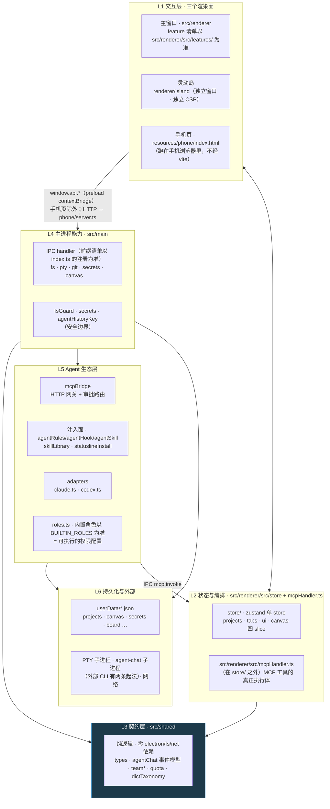

# 02 · 分层架构图

> **作用**：规定每层职责与允许的调用方向，避免把逻辑堆在一处。
> **维护频率**：很低。新增 feature / 新增 MCP 工具**不用**改这张图，整体重构才改。

## 层次划分

本项目实际是**六层**（比通用 AI 项目五层多一个"契约层"，因为 Electron 双进程必须共享类型）：



## 各层职责与红线

| 层 | 职责 | 红线 |
|---|---|---|
| **L1 交互** | 渲染与交互，不做业务判定 | 灵动岛是**独立 BrowserWindow + 独立 preload**，不共享 React 树，只经 `window.island` 通信 —— 别试图让它 import 主窗口的组件 |
| **L2 状态编排** | zustand 单 store 四 slice；MCP 工具的实际执行体在这层 | 撤销栈走**全局 `useStore.subscribe` 单点记录**，新增改 canvas 的 action **不要**手写 `record()` |
| **L3 契约** | 主/渲染共用的纯逻辑与类型 | **禁止 import electron / fs / net** —— 这层要能 `node --test` 直接跑。`envParse.ts` / `quota.ts` / `dictTaxonomy.ts` 文件头写明了「只写一份」的理由（`envParse.ts` 原话："两边解析规则不一致时，用户会遇到鬼故事"）；其余文件头记的是各自的业务教训 |
| **L4 主进程能力** | IPC handler、系统调用、安全守卫 | 写操作的边界判据见下节；`index.ts` 的注册顺序有硬依赖（见「启动顺序」）|
| **L5 Agent 生态** | 对外部 AI CLI 的全部接口：MCP 网关、规则注入、CLI 适配、角色权限 | 全是**契约性代码**，改了外部 agent 就对不上，且多为静默失败 |
| **L6 持久化** | userData 下的分文件 JSON + 子进程 | 每类数据独立文件，不共用一个大 JSON（坏一个不牵连其余）|

### 三个渲染面，只有一个在 `src/renderer`

灵动岛、手机页都不在主窗口的 React 树里。手机页尤其反直觉：

- 它跑在**手机自己的浏览器**里，不是本 app 的窗口。单文件、纯内联、自带一条 `default-src 'none'` 的 CSP；`phone/server.ts` 的 `readPage()` **每次请求现读盘**，不经 vite、不参与 renderer 构建，改完直接生效。
- 被要求「改手机上显示的东西」时别在 `features/phone` 里翻 —— 那块是**电脑侧**的配对面板与取数。
- 版本自愈：`readPage()` 把 `__EAS_BUILD__` 换成内容 sha1，页面里的 `watchVersion()` 轮询 `/health` 的 `build`，不一致就自重载 —— **判新旧看内容不看版本号**（改了页面但版本号没动是开发常态）。

### L4 的边界判据

判据不是「在不在 L4」，是**「这条路径是不是外部能指定的」**：外部能指定 → 必须过一条白名单；
app 自己算死的固定路径（`userData/*.json`、知识库配置、`~/.claude` 与项目 `CLAUDE.md`/`AGENTS.md` 常驻区）
→ 不套守卫，但也不许把用户传进来的片段拼进去。

已知的白名单有两条，**不保证穷尽 —— 新增写入口时自己查一遍**：`fs:*`、快照、手机端取文件走
`guardPath`/`guardDir`（`fs.ts` `snapshot.ts` `agentChat/session.ts` `phone/server.ts`）；skill 写入走
它自己更窄的 `skillWriteRoots()` + `insideRoot()`（`skillLibrary/write.ts`）—— 之所以另起一层，正是
**因为它本就在 fsGuard 白名单之外**（`guardPath` 只认「项目根 + 知识库根」，见 `fsGuard.ts` 的
`projectRoots()` + `wikiPath()`）。给 `~/.claude`、`userData/*.json` 这类固定路径套上 `guardPath`，
结果是**静默写不进去**，规则注入会整条断掉。

## 启动顺序（硬依赖，打乱是静默失效而非报错）

`src/main/index.ts` 的 `whenReady()` 内，**不可调的是「MCP 桥 → 密钥柜 → PTY」这条链**：

```
自定义协议注册（bizone/dictClip/media）——— 必须在 ready 之前，Electron 原生限制
        ↓
registerMcpBridge()      ← 先起，PTY spawn 时要用它的 port/token
        ↓
registerPluginHandlers() → purgeLegacyDsh()
        ↓
registerSecretHandlers() ← 必须排在 PTY 之前，且断言 app 已 ready
        ↓                  （否则 safeStorage 静默用错全局密钥桶）
skill / agentInstall / hook / role / wiki / skillLibrary /
dict / rules 等 handler → refreshInstalledRules()
        ↓
installIpcProfiler()     ← ⚠️ 注释写着「必须在所有 registerXxxHandlers 之前」，实际排在上面那批
        ↓                  之后。它替换的是 ipcMain.handle/on 本身，先注册的包不到
                           —— 上面那批的 IPC 不进 ipc-slow.log
                           （dictClip 不在其列：`dictClips.ts` 零个 ipcMain，
                            注册的是自定义协议，本来就不走 IPC。查「它的 IPC 怎么
                            不在日志里」会白查 —— 它根本没有 IPC）
registerPtyHandlers() + 其余全部业务 handler   ← 只有这些才被计时
        ↓
buildMenu() → createWindow() → 延迟 8s 跑 checkContracts() 自检
```

⚠️ 派生两条纪律：查主进程卡顿（尤其 Windows）时，**「ipc-slow.log 里没有」不等于它不慢**；收口之前
**新增的 `registerXxxHandlers()` 一律放在 `installIpcProfiler()` 之后**，否则那组 IPC 悄悄不被计时。
（收口 = 把 `installIpcProfiler()` 提到 `registerMcpBridge()` 之后第一行；它唯一的约束是内部要读
`app.getPath('userData')`、必须在 `whenReady` 内，上移不影响那条硬依赖链。）

## 进程与窗口

| 进程/窗口 | 创建于 | 回收责任 |
|---|---|---|
| 主 BrowserWindow | `index.ts createWindow()` | `closed` → 触发 `destroyIsland()` |
| 灵动岛 BrowserWindow | `island.ts`（`focusable:false`） | 主窗口 `closed` 钩子里 `destroyIsland()`；**`before-quit` 也必须先 `destroyIsland()` 再杀进程** —— 它会拦住 `window-all-closed`，漏了这句 app 退不掉，屏幕顶上剩一条连不上任何东西的幽灵胶囊 |
| PTY 子进程 | `pty.ts` node-pty spawn | `did-navigate`/`closed` → `killPtysForWebContents()`（**单发** `killTree()`）；`before-quit` 两拍（SIGTERM → 300ms → 硬杀，硬杀前有 `anyPtyAlive()` 把门）；`will-quit` 兜底 `killAllPtys(true)` |
| agent-chat 子进程（claude / codex） | `agentChat/session.ts` 直接 `spawn(built.bin, …)`，**不经 node-pty** | 与 PTY 挂**同一批**钩子，但节奏不一样：`did-navigate`/`closed` → `killAgentChatSessionsForWebContents()` **自己就带两拍**（SIGTERM → 300ms → SIGKILL，定时器 `.unref()` 过）—— 之后没人再盯着，照 PTY 写成单发就是永久孤儿；`before-quit` 与 PTY 同一个两拍，但硬杀 `killAllAgentChatSessions(true)` 是**无条件**的（PTY 那刀有 `anyPtyAlive()` 把门，这个不对称别当「顺手统一」抹平）；`will-quit` 兜底 |
| MCP HTTP 网关 | `mcpBridge.ts` | **进程内 HTTP server，每个 App 实例一个**（不是每会话一个） |
| MCP shim 进程 | 由 CLI 按 MCP 配置拉起 | 每个 CLI 会话一个轻量 stdio 进程，共享上面那个网关 |

手机页不在这张表里：本 app 既不创建也不回收它。
排查孤儿进程时按这张表逐行走 —— **agent-chat 那一类不经 PTY**，只看 `pty.ts` 会整类漏掉。
