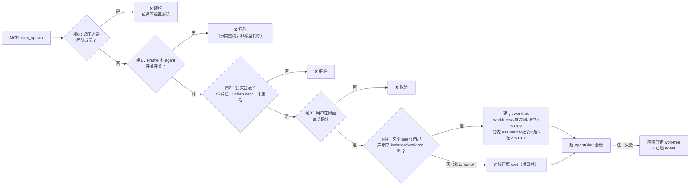

# 03 · Agent 角色边界图

> 分两半读，**别串味**：
> **3A** 是产品能力 —— Eas-Term 托管起来的 agent 各自能干什么，边界由**代码**强制。
> **3B** 是开发纪律 —— 改这个仓库的 agent（你）的禁区，边界靠**文档**约束，没有代码兜底。

---

# 3A · 产品内 agent 角色边界

## 角色表（`src/main/roles.ts`，落盘 `~/.eas/roles.json`，用户可改）

每个角色是**可执行配置**（模型 / effort / 工具 allow-deny / contract 文本），不是人设文案。
`contract` 经 `--append-system-prompt-file`（Claude）或内联单行（Codex，无对应文件参数）下发。

| 角色 | 定位 | 写代码 | 关键权限约束 |
|---|---|---|---|
| `e2e` | 全流程 | ✅ | opus / high effort，`tools: {}` |
| `scout` | 勘探员 | ❌ | **deny `Write`/`Edit`/`NotebookEdit`** |
| `builder` | 工匠 | ✅ | `tools: {}` —— **名字上是写码位，权限上不独占**，见下 |
| `inspector` | 验官 | ❌ | **deny `Write`/`Edit`/`NotebookEdit`**（"禁改代码"这句有代码兜底）|
| `prototyper` | 原型师 | ✅ | `tools: {}`；"不碰生产代码"只写在 contract 里 |
| `writer` | 笔杆子 | ✅（文档） | `tools: {}`；"不污染代码项目"只写在 contract 里 |
| `illustrator` | 画师 | ✅ | **deny `mcp__*image*` 等通配符** ← 对应生图红线；文件照样能写 |
| `runner` | 杂役 | ✅ | `tools: {}` —— 刻意留空的逃生口 |

> **写权限只由 `tools.deny` 决定，跟角色名没关系。** 八个内置角色里只有 `scout` 和
> `inspector` deny 了 `Write`/`Edit`/`NotebookEdit`，其余六个（`e2e`/`builder`/`prototyper`/
> `writer`/`illustrator`/`runner`）都写得动任意文件 —— `illustrator` 只 deny 了生图类
> `mcp__*`，文件不在管辖内。`prototyper` 的"不碰生产代码"、`writer` 的"不污染代码项目"
> **是 contract 里的提示，不是强制**。角色本身还落盘在用户可改的 `~/.eas/roles.json`，
> 所以"某某角色是唯一能写码的"这句话在任何时刻都不成立。
>
> ⛔ **别为了让这句话成立去给其余角色补 deny**：`e2e` 必须能写码（它就是一条会话跑完
> TDD 的角色）、`prototyper` 要写 `docs/prototype/` 下的 HTML、`writer` 要写成稿、
> `runner` 是**刻意无限制**的逃生口（`roles.ts` 注释原话："不给逃生口的系统会被绕过"）。
> 要收紧写权限先问用户。
> 另：`roles.ts` 里 `builder` 的 `desc` 至今写着"唯一有写代码权限的角色"，那是 app 里
> 用户可见的一句错话（会让人以为"没选工匠 = 代码安全"），**别拿它当依据**。

> 工具权限（`tools.allow/deny/denyServers`）**只作用于终端节点拼出来的 CLI 启动命令**
> （`CanvasAgentBar.tsx` 的 `buildClaudeCmd` / `buildCodexCmd`，deny 与 denyServers 展开成
> `--disallowedTools`）。那条命令**不带** `--strict-mcp-config` / `--mcp-config`，
> 它的 MCP 工具面就是用户全局配置的全集。
> **AI 对话节点 / `team_spawn` 起的 agentChat 会话不套用角色 tools** —— `StartOpts`
> （`shared/agentChat.ts`）里根本没有这个字段，那条路径的工具面完全由
> `--strict-mcp-config` + `--mcp-config`（只含自家 server）决定。
> 所以这**不是同一次启动的两层，是两条互不相干的启动路径**。

## 多 agent 编排的五道闸（`team_spawn`）



**关键设计**：

- **闸 0 靠 `EAS_TEAM_ROLE` 环境变量判定**，不是猜测 —— 防止子 agent 递归派活炸开。
- **并发写保护 = git worktree 物理隔离，但要不要隔离是派活方自己填的**：
  `team_spawn` 的 `agents[].isolation` **只认严格的 `'worktree'`，没填 / 写错 / 大小写不同
  一律 `none`**（`teamWorktree.ts` 的 `isolationOf` 与 `batchSpec.ts` 都是同一句，
  注释写着"**不猜**"）。**系统不会替你判断这个角色写不写代码** —— 上面那张角色表是画布上
  角色选择器（`roles.ts` / `CanvasAgentBar`）用的，`team_spawn` 的 `role` 只是一个自由的
  kebab-case 标签（同时是 `.plans/<role>/` 的目录名），两者没有任何代码关联。
  **派写码 agent 忘填 `isolation:'worktree'` = 直接落进 E-07 那个静默覆盖，而且不会报错。**
- **限流闸是现算的**（读真实会话表看是否已有活的 `owner:'team'` agent），
  **不用持久状态位** —— 教训写在注释里：存过状态导致永久锁死过一个 Frame。
- **删 worktree 前检查 `git status --porcelain`，有未提交改动一律拒删**；
  `team_dissolve` 也只报告不清理，避免 `--force` 抹掉未 commit 的成果。
- `team_status(wait:true)` 最长挂 8 分钟；`team_send` 送不进已闲置 3 分钟被回收的会话。

## 逐次审批（Claude 独有）

```
agent 要调危险工具
   ↓
PreToolUse hook（resources/agent-hooks/eas-pretooluse.mjs · 独立进程）
   ↓ POST /agent-approval/request  → 阻塞等待
mcpBridge 同一 HTTP server 上的 approvalRoute.ts
   —— 只留住完整 payload（tool_name / tool_input / cwd）并唤醒等待者，
      **不产 ChatEvent、不 import registry、不碰"会话"概念**
   ↓ onApprovalRequest() 广播
agentChat/session.ts 按 hook 附带的 eas_session_id 点名找会话（找不到就丢弃）
   ↓ 该会话自己的 approvalRegistry.fromHook() 归一化成 approval.request
     （kindOf：Bash→exec / Write·Edit·NotebookEdit→patch / 其余→tool）
渲染层弹审批卡 → 用户点允许/拒绝
   ↓ 渲染层 POST /agent-approval/resolve  → 唤醒 hook
超时 5 分钟 → 兜底一律 deny（安全底线）
```

- 只对带 `EAS_AGENT_CHAT_SESSION` 的会话生效，**其余 Claude 会话无声放行**。
- **Codex 没有逐次审批**（`capabilities.approval: []`），只有沙箱三档权限。
- 用 PreToolUse hook 而非 `--permission-mode`，因为 manual 模式是直接拒绝、不是等待。

## 运行时文件边界（`fsGuard.ts`）

**先看适用范围**：`guardPath`/`guardDir` 出现在四个调用方 —— 其中**三条是写**：`fs.ts` 的各写操作
（writeTextFile / rename / trash / mkdir / createFile / move / copy…）、`snapshot.ts` 落快照、
`agentChat/session.ts` 写 cwd 内的 hook 配置；**另一条是读**：`phone/server.ts` 取文件给手机端
（用同一个守卫限制手机能读到哪些路径）。
所以「fsGuard 管写」这句话要带范围：它管的是**这三条写通道**，不是全项目所有写。
**注入面（`agentRules.ts` / `agentHook.ts` / `agentSkill.ts` / `mcpBridge.ts` / `wiki/schema.ts`）
完全不经过它，直接写用户 home**：`~/.claude/skills/eas-term/`、`~/.eas/agent/`、
`~/.codex/AGENTS.md`、`~/.claude/settings.json` 等。所以下面这张表说的"拒绝写用户 home"
**只对那四条通道成立，不等于"app 写不到 home"**。

| | 范围 |
|---|---|
| ✅ 允许写 | `projects.json` 里每个项目根 + 知识库根（用户在界面上亲手选过的目录） |
| ❌ 拒绝写 | 其余一切：用户 home、系统目录、**别的项目的兄弟目录**、项目根本身（改名/删根走项目管理） |
| 防绕过 | `realResolve()` 先 `realpathSync` 到真实路径再比前缀（软链能击穿纯字符串前缀比对）；目标不存在时退到"最深的真实祖先" |
| 文件名校验 | `invalidNameReason()` 挡 `..` / 斜杠 / `:*?"<>\|` / 控制字符 / 超长 |

> **⚠️ 已知缺口（图纸上必须标出来）**：`fs:readDir`、`fs:readTextFile`、`fs:readImageFile`、
> `fs:openPath`、`fs:showInFolder` **零路径校验**，理论上能读取/在 Finder 打开任意绝对路径。
> 这是"读比写风险低"的设计取舍，不是遗漏 —— 但**要改成有边界时别当成新功能随手加**，
> 先确认不会打断"拖任意文件进画布预览"这类既有用法。

## 密钥的真实边界（别误传）

`secrets.ts` 文件头写得很清楚，图纸原样转述：

- 密钥经 `pty.ts` 注入为**环境变量** → **同进程内任何命令（含 AI）`echo $KEY` 就能读到**。
- 承诺的是：**不进对话、不进 jsonl、不进 shell history**。
  **没有**承诺"AI 读不到"。
- 文件型密钥（SSH key / `.p8` / `.pem`）**不进环境变量**，但取法和文本型完全一样：
  `eas-secret run --vars <变量名> -- <命令>`（或 `--group <组名>` 整组取）——
  **`eas-secret` 没有 `--files` 这个参数**，敲了会以退出码 2 报"不认识的参数"。
  分流发生在主进程侧：`secretsForRun` 按库里的 `file` 标记把它从 `env` 里剔出、
  放进响应的 `files[]`，`mcp/eas-secret.mjs` 再解成 `$HOME` 下 0700 临时目录里的 0600 文件，
  路径以 `<变量名>_PATH` 传入，命令结束或被信号打断即删。
  例：`eas-secret run --vars SSH_ID_ALIYUN -- sh -c 'ssh -i "$SSH_ID_ALIYUN_PATH" root@host'`
  （`src/main/secrets.ts` 的 `StoredVar.file` 注释里还留着 `--files` 的旧写法，别照它敲。）

---

# 3B · 开发期 agent（你）的边界

## 🔪 危险操作 —— 会打到用户正在用的东西

| 别做 | 为什么 / 改做什么 |
|---|---|
| `pkill -f "Eas-Term"` · `killall Eas-Term` · `pkill -f electron` | 用户的正式版跑在 `/Applications/Eas-Term.app`，**而你这个会话就活在它的终端里** —— 宽匹配会连用户的应用带自己的对话一起杀。2026-07-23 真出过（`memory/工作规则-验证只在dev端-不擅自动release-app.md`）。只收自己起的那个：`verify-app.mjs` 前台跑就 Ctrl-C（它的 cleanup 会 `child.kill()` 并删掉隔离目录）；非要按模式杀，只认 `node_modules/electron/dist` 或 CDP 端口 9333 |
| 用 `npm run dev` 做真机验证 | dev 模式的 userData 走 `app.getName()`，**和正式版是同一个目录**（密钥柜就在那儿），不是隔离；且 electron-vite 的 CLI 吃不下 `--user-data-dir`。正确入口是 `npm run verify`（= build + `scripts/verify-app.mjs --seed`）：构建产物 + 显式临时 `--user-data-dir` + `--remote-debugging-port=9333`，配 `scripts/eval-in-app.mjs` 取状态。（memory 里"验证只在 dev 端"那句是旧结论，已被 `verify-app.mjs` 文件头推翻）|
| `npm run dist` | 几分钟起步、产物写 `~/Eas-Term-release`。用户没明说要打包就不跑 —— 2026-08-19 滚出过九个版本 |
| `scripts/install-local.sh` | 会 `mv` 走 `/Applications/Eas-Term.app`、`ditto` 新包、`lsregister`、`open -a` 重开。用户没明说要安装就不跑。脚本自带"应用还开着就拒装"的闸门，判据必须两条一起判（`pgrep -f "MacOS/Eas-Term"` + `ps -axo command \| grep`）—— `pgrep -x` 和 `pgrep -f "Eas-Term.app/Contents/MacOS"` 实测都会漏，**别删这道闸** |
| 挂 `scripts/watch-install.sh` | 它自己**不写** plist（只在收摊时 `rm -f` 掉），要跑就得先往 `~/Library/LaunchAgents/top.biily.eas-term.installer.plist` 写一份并 `launchctl` 注册 —— 等于在用户机器上装了个开机项，之后自动替换并重开他的应用。同样：用户明说才做 |

> 一句话原则：**验证只在自己起的隔离实例上做；用户的 `/Applications/Eas-Term.app` 不碰、不杀、不换。**

## 🚫 绝对禁区 —— 改了会破坏安全模型

| 位置 | 为什么 |
|---|---|
| `src/main/fsGuard.ts` | `fs:*` / `snapshot` / `agentChat` 这三条写通道的路径白名单（另有更窄的独立边界，见 3A「运行时文件边界」）。绕过或弱化 = 渲染层/webview/MCP 桥都能写任意路径。改前必须读懂 `realResolve` 的 symlink 防绕逻辑 |
| `src/main/fs.ts` 里各写操作前的 `guardPath`/`guardDir` 调用 | 注释原话："漏了它的话，'所有文件写操作都限制在你自己加过的目录内'这句话就是假的" |
| `src/main/agentRules.ts` 的四处 `rmSync({recursive, force})` | 删的是用户 home 里的真实目录（`~/.claude/skills/eas-term`、`~/.claude/skills/eas-wiki`、`~/.eas/agent`、旧 DSH 目录），**没有任何守卫兜底**。`claudeSkill()` 返回的是 `<...>/skills/<name>/SKILL.md`，调用点全都套 `path.dirname` —— **改成直接返回目录，dirname 就变成 `~/.claude/skills`，一次卸载抹掉用户全部 skill**。改删除范围、改 `claudeSkill()`/`detailDir()`、改 `home()` 的来源（注释里记着 `os.homedir()` vs `app.getPath('home')` 分叉的实测事故），一律按破坏性改动对待；`legacyDshSkill()` 的基路径还来自 `DSH_HOME` 环境变量 |
| `src/main/secrets.ts` 的 `assertReady()` / seal-open checksum | 删 ready 断言 → 静默用错全局密钥桶；删 checksum → macOS AES-128-CBC 无认证，实测坏 1 bit 有 **62.9%** 概率静默解出错误内容而不报错 |
| `src/main/agentHistoryKey.ts` | 专门抽出来的路径穿越防线 |
| `src/main/phone/server.ts` 的绑定地址 | 绝不能绑 `0.0.0.0` |
| `src/tunnel/hub.ts` 的"不终止 TLS"架构 | 任何"中间解密再转发"的改动都是红线违反，`hub.test.ts` 会红 |
| `src/main/roles.ts` 的 `illustrator` deny 通配符 | 改动等于打开生图红线 |

> **写边界不止 fsGuard 一条，是三条各管一摊 + 一片无守卫区**，不要"统一"它们：
> · `fsGuard.ts` —— 项目根 + 知识库根（`fs:*` / snapshot / agentChat / phone）
> · `skillLibrary/write.ts` 的 `skillWriteRoots()` —— 已登记的 skill 目录 + `<项目>/.claude/skills`，
>   且落点必须在某个 skill 子目录之内（**比 fsGuard 更窄**，文件头写明了故意不复用的理由）
> · `projectPaths.ts` —— 项目根本身的改名/删除（同样更窄，且不引 electron 以便单测）
> · 注入面（`agentRules.ts` 等）—— **无守卫**，靠"只写固定几个写死的路径"自律

## ⚠️ 静默失效区 —— 改了不报错，但功能悄悄坏掉

| 位置 | 症状 |
|---|---|
| `src/main/index.ts` `whenReady()` 内注册顺序 | 见 [02](02-分层架构.md)。打乱后一切照常启动，只是密钥桶错了 / profiler 没生效 / PTY 拿不到 MCP token |
| 自定义协议注册（`bizone`/`dictClip`/`media`） | **必须在 ready 之前**，挪到之后静默失败 |
| `mcpBridge.ts` 与 `eas-mcp.mjs` 各自的 `LONG_WAITS` 集合 | 两处**手动同步**。不一致 → 用户看到连接错误而非业务提示 |
| 三层超时不等式（shim http > invokeRenderer > 渲染层等待窗口） | 破坏后同上 |
| `approvalRoute.ts` 的 `hookResponseBody()` ↔ `resources/agent-hooks/responseBody.mjs` | 跨进程无法 import 的重复代码，两处注释互相钉死，改一处必须改另一处 |
| 审批 payload 的归一化位置 | **不许把 `approvalRegistry` 搬回 `approvalRoute.ts`**。那条边界是修复轮特意划的（`approvalRoute.ts` 文件头）：路由层只留数据，一接 registry 就把"会话"概念拖进这一层，并重演"payload 只剩 approvalId、卡片内容全丢"的历史退化。要改 kind 映射，只改 `approvalRegistry.ts` 的 `PATCH_TOOLS` / `kindOf()` |
| `shared/agentChat.ts` 的 `AGENT_CHAT_EVENT_CHANNEL` ＋ `agentChat/session.ts` 的 `emitEvent()` ＋ `src/preload/index.ts` 的加载期监听器 | **三处必须一起看**：`agentChat:start` 的 handler 在 `return` **之前**就同步走完 deliverMessage→handleEvent→`wc.send`，事件早于 invoke 的 reply 到达。所以频道必须是**固定名**、preload 的监听器必须在**模块加载期**挂上 —— 不能照搬上面 pty 那套"invoke resolve 后再订阅/再缓冲"（`pty:create` 的 handler 里没有同步 send，前提不一样）。改成按 sessionId 动态命名、或改成 await start 之后再订阅：不报错、无测试拦截，只是首批事件被 Electron 静默丢弃（实测同步推 30 条只到 1 条，丢的正是"本次会话没有审批保护"那条 notice）。同一处的 `stoppedAgentChatSessionIds` **只能当黑名单，绝不能反过来做成白名单**（"start resolve 后才允许缓冲"＝把同一个窗口重新打开）|
| **不要给注入面"补上漏掉的 `guardPath`"** | fsGuard 的白名单里永远没有 home，一加规则分发当场全量失败**且不报错**（`syncRules` 静默写不进去），症状是 agent 不再知道画板工具、首启"有更新待安装"反复弹。同理 `skillLibrary/write.ts`、`projectPaths.ts` 也不许换成 fsGuard，两处文件头都写明了理由 |
| `adapters/claude.ts` buildArgs | 绝不能带 `--bare` / `--permission-mode manual`（实测硬约束） |
| `adapters/codex.ts` stdin | 必须 `ignore`，否则卡在等 stdin |
| `src/main/cliContractRun.ts` 的探测命令 | 只能是 `--help` / `--version`。**绝不能加会拉起交互会话的子命令** —— 曾误用 `claude config list` 启动了一次真实会话（教训记在 `agent.ts` 的注释里）。自检每次启动都跑，有副作用就是每次启动都有副作用 |
| `skillLibrary` 的分类口子 | **四处一起改**：`mcp/eas-mcp.mjs` schema + `mcpHandler.ts` 执行 + `skillLibrary/index.ts` 落盘（IPC + `saveConfig` patch 语义 + `skippedLocked` 跳过）与 `category.ts` 校验（`validateCategoryBatch`，有单测）+ `.claude/skills/skill-organizer/SKILL.md` 说明。只改 `category.ts` 会漏掉落盘那半 |

## 🔄 历史修复区 —— 改了会把已修好的问题改回去

| 位置 | 那次事故 |
|---|---|
| `CanvasStage.tsx` L100-110 · L1146-1148 | **故意不订阅 `canvas.shapes`**。注释原话："不为一句引导把那次重渲染优化撤回来"。AI 重构最爱"顺手补全订阅"，一补就回退掉帧修复 |
| `store/index.ts` 撤销 subscribe（250ms 合并窗口） | 撤销记录**单点**触发，不在 53 处 action 里各写 `record()`。新增改 canvas 的 action **不要**手写记录 |
| `store/canvas/persist.ts` | "序列化和 sanitize 是同一件事的两面"，改写入格式必须同步放宽读取校验，否则症状是"下次启动一片白" |
| `features/status/RunMonitor.tsx` | 注释点名："说反左右正是当初『右上角通知不见了』那场事故的起因" |
| `.github/workflows/build.yml` 固定 `windows-2022` | 升级会导致 node-pty 编译失败 |
| `package.json` 的 `asarUnpack`/`x64ArchFiles`/`build.mac.identity` | 原生模块打包规则与签名身份，改坏产出"能打包但一用麦克风就崩"或"下载即被 Gatekeeper 拦" |
| `scripts/publish-site.sh` 的 `OTHER_SITES` / `KEEP` | 同一台服务器上还跑着 5 个生产站；`KEEP` 改小会误删版本导致下载 404 |

## ✍️ 分发产物区 —— 手改无效，下次会被覆盖

| 位置 | 源头在哪 |
|---|---|
| `site/vendor/spb-design/` | `~/Biily/独立站/design-system/`，用 `sync-design-system.mjs` 分发回来 |
| `deploy/tunnel/hub.mjs` | esbuild 打包产物（路径的权威是 `scripts/publish-tunnel.sh` 的 `LOCAL=`）：入口 `src/tunnel/main.ts`，隧道协议与"绝不终止 TLS"的实现在 `src/tunnel/hub.ts`。改完由 `publish-tunnel.sh` 重新打包并 scp 到线上 `/opt/eas-tunnel/hub.mjs`，手改这份下次打包原样覆盖。**它被 git 跟踪、不在 `.gitignore` 里**，在磁盘上长得跟普通源码一样 —— ⛔ 标记是唯一的护栏 |
| `~/.claude/skills/eas-term/*.md`、`~/.eas/agent/*.md` | 由 `agentRules.ts` 分发，写完 `chmod 444` |
| `~/.codex/AGENTS.md` 的 `<!-- eas-term:begin -->` 围栏内 | 每次 `syncRules` 整段重写 |
| 知识库根的 `CLAUDE.md`/`AGENTS.md` 围栏内段 | `wiki/schema.ts` 升级时重写 |
| `out/` | `electron-vite build` 产物，已在 `.gitignore` |

> **`hooks/dictionary-bundle.json` 不在这一区** —— 它不是产物，是 git 跟踪的**源文件**，
> 没有任何脚本会生成或覆盖它，随 `package.json` 的 `extraResources`（`hooks/ → hooks/`）
> 原样打进包，由 `hooks/scan-commit.mjs` 的 `loadDict()` 直接读。要改就直接改它并提交。
> 反过来的风险是：删掉它或把它 gitignore 掉，钩子会因为 `loadDict()` 返回 null 而
> **静默 `exit(0)`**，词典提示从此不再出现且没有任何报错。
> 它与 `src/renderer/src/features/dict/dictionary-bundle.json`（界面 `import`，
> `scripts/dict-svg/*` 只改那一份）是两条独立链路，**目前内容已经分叉**（大小与 mtime 都不同），
> 动之前先确认自己要改的是哪一条。
