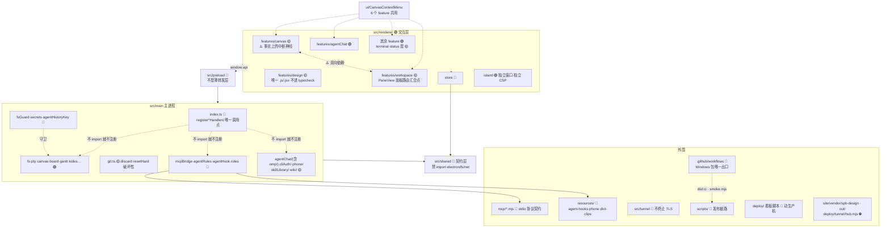

# 10 · 模块领地图（AI 工程地图）

Git 历史操作（2026-09-08）：`main/gitHistory.ts` 为无 Electron 的 Git 操作与 NUL 分隔差异解析；`git:historyAction` 在 `main/git.ts` 校验工作树、git-dir、common-dir 均通过 `guardDir`。Checkout/分支切换拒绝所有未提交改动（含 untracked），不 force/stash；标签不改工作树。`preload/index.ts` 同步 historyAction/historyFiles 与 commitDiff 的 base/origPath；`HistoryView` 提供确认、返回原分支、比较及状态/numstat，`DiffView` 比较旧路径与新路径。旧 Reset 的确认不得移除，新防护不代表旧接口已补齐。测试 `gitHistory.test.ts` + 隔离应用 `scripts/verify-git-history.mjs`；真实用户仓库禁止用于检出验收。

AI 分屏（2026-09-08）：`store/tabsSlice.ts` 的 `splitLeaf` 对 agent 只保留 `kind/cwd`，新 leaf 停在启动页；禁止复制会话 ID、恢复 ID、自动消息、草稿或团队归属。原 leaf 保持不变，终端仍新建 PTY，文件预览仍克隆。回归测试 `store/splitLeaf.test.mjs` 覆盖横纵分屏与非 AI 行为。

CLI 自动更新（2026-09-07，用户要求默认关闭）：`main/cliUpdates/manager.ts` 管持久开关、下载代次、pending→active 和回退；`packages.ts` 只取官方 npm 原生包并校验完整性/基础 CLI 参数；`index.ts` 注册固定 IPC 和后台检查。`shared/cliUpdates.ts` 为界面协议，`workspace/CliUpdatesPanel.tsx` 位于设置→更新。启动只在 registerAgentInstallHandlers 后新增注册，保留原注册顺序；通过 probeEnv 的启动固定路径接入对话/探测和 PTY。更新时绝不能改 PATH 或运行入口，版本路径只能来自固定 userData/cli-versions 下经过校验的版本号。详见 16 号图纸。

> **这是 agent 进入本仓库要读的第一份文件。** 动手前先在这张图上找到自己在哪块地。
> **更新触发**：新增目录 · 重构目录 · 新增禁区 · 新增高耦合点 · 新增文档链接。**与代码同一个 commit 提交。**
> **风险等级**：🟢 常规业务代码，照常改 · 🟡 高耦合 / 有性能约束，先全局搜引用、读文件头注释 ·
> 🔴 安全边界 / 跨进程契约 / 历史修复 / 直接动生产机，**先读
> [03-3B](03-agent角色边界.md#3b--开发期-agent你的边界)** 且改动要在 commit 里说明理由 ·
> ⛔ 分发产物 / 构建输出，**不要手改**，去源头改。

## 全局领地图

## 领地明细 · 渲染层 `src/renderer/`

| 目录 | 责任域 | 风险 | 备注 |
|---|---|---|---|
| `features/plugins/PluginPanel.tsx` `features/plugins/appsProtocol.ts` | **插件面板**：画布组件 `plugin-panel` 的渲染体（sandbox iframe → `eas-plugin://`）＋ 面板桥的判断层（纯函数，有测试） | 🟡 | **画布上开带插件的对话必须走 `addAgentNode`**（先建真 leaf 再摆节点）；`addFileNode({kind:'agent'})` 只放一个带 pane 的节点、不建 leaf，重建逻辑只在启动加载时跑，当场渲染成空白框（2026-09-05 正式版「对话起不来」）。 **只注册一个** `plugin-panel` 组件，插件身份在 `node.component.props`（`{pluginId, panelId}`）—— 别把插件 push 进 `CANVAS_COMPONENTS`。iframe 精确 `sandbox="allow-scripts"`：不给 `allow-same-origin`（否则能读父页）、也没有 `allow-forms`（**插件面板里不能用 `<form>` 提交**，样板为此改成按键处理）。消息判据是 `event.source === iframe.contentWindow`，origin 是 opaque 不能用。 ⚠️ **selector 只返回原始值**：`useStore(s => ({w,h}))` 会无限重渲染 → React #185 → 整个界面进错误边界（2026-09-05 真机撞到，症状是节点挂上就卸掉、30s 后插件进程被回收）。 验证时注意：这个 iframe 是 **OOPIF**（独立进程），不在主页面的 frame 树里、主页面的 `Runtime.evaluate` 进不去；它在 `/json/list` 里是一个 `type:iframe` 的独立目标，直接连它的 webSocketDebuggerUrl（`scratchpad/frame.mjs` 就是这么做的）|
| `features/canvas` | 无限画布、Frame、节点、抽屉 | 🟡 | TypeScript 侧最大块，**事实上的公共层**，见耦合警报 §1 |
| `features/design` | 设计模块节点（Konva 设计 + 关键帧动效双模式） | 🟡 | 全渲染层**唯一的非 TypeScript 源码**，别只数 ts/tsx 就下结论；`composer/` 整体移植自 taptv（见 `composer/index.jsx` 头注释：`cp -r` + `sed dc__→uc__`），三个坑见 §3 |
| `features/workspace` | 应用外壳、侧栏、PaneView 路由 | 🟡 | `PaneView.tsx` 是面板路由中枢，新增面板类型必改，见 §2。`paneSizing.ts` 集中管理 AI 面板 640px 下限及分屏最小树宽；同步 canvasSlice resize、PaneView 恢复和 PaneLayer 分屏几何，保持面板挂载身份 |
| `features/terminal` | xterm 挂载、密钥徽章、路径链接 | 🟡 | xterm 实例跨 ViewMode 共享，**绝不能重挂载**（见 §2） |
| `features/status` | 状态机、待办、运行监控 | 🟡 | `RunMonitor.tsx` 有方向性事故史 |
| `features/git` | 分支图/历史 + 暂存/丢弃/回退 | 🟡 | `SidebarGit.tsx` / `HistoryView.tsx` 里的 `requestConfirm` 弹窗是 `git:discard` / `git:resetHard` 的**唯一护栏**，不得移除；新增入口照抄 |
| `features/phone` | **电脑侧**配对面板与取数（PhonePanel / collect / qr） | 🟢 | **不是手机上看到的那个页面** —— 那是 `resources/phone/index.html` |
| `features/agentChat` | AI 对话面板、审批卡、CLI 登录 | 🟢 | 逻辑与视图分离度高，纯函数各配 `.test.ts` |
> `agentChat/userMessages.ts` 是从组件里提出来的纯函数（用户消息怎么合回轮次流）。提出来的原因就是它埋在 `AgentChatView.tsx` 里没法单测，而它与归约器之间有一条跨模块不变量 —— 「聊几十轮后自己发的话全没了」那个 bug 正藏在那儿。
| 其余 feature（`gantt` `dict` `wiki` `team` `editor` `board` `image` `files` `web` `voice` `notify` `quota` `chat`） | 各自单一职责 | 🟢 | `gantt` 的 collector 被 terminal/agentChat 复用；`dict` / `wiki` 走 lazy 进 PaneView |
| `store/` | zustand 单 store 多 slice | 🔴 | 撤销栈 / persist 有硬约束，见 [03-3B](03-agent角色边界.md#3b--开发期-agent你的边界) |
| `island/` | 灵动岛独立窗口 | 🟢 | 独立 CSP，**不共享主窗口 React 树**；配套 preload 是 `src/preload/island.ts` |
| `ui/` `styles/` | 纯 UI 原子 | 🟢 | **没承担起公共层职责**——公共组件实际长在 canvas 里，见 §1 |

## 领地明细 · 主进程 `src/main/`

| 分组 | 文件 | 责任域 / 坑 | 风险 |
|---|---|---|---|
| `src/main/agentChat/modelCatalog.ts` `src/main/agentChat/codexModels.ts` | 模型清单的**三级取值**：探测 → 上次探测成功的那份（`userData/model-catalog.json`）→ adapter 兜底 | 🟢 | **别把清单写死当主数据源**（用户 2026-09-06：所有模型列表都不要硬编码）。模型名随版本和账号变，Codex 的 gpt-5.6-sol/terra/luna 每个账号都不同。`CliAdapter.probeModels` 是主路径（Codex 问 app-server 的 `model/list`）；**拉不到必须降级**，顺序在 `resolveModels`（8 条测试）：落盘那份不是硬编码，是这台机器真实探测成功过的。 `capabilities.models` 从此只是**第三级兜底**，界面会标注「内置清单」。Claude 目前只有兜底 —— 2.1.263 确实没有列模型的接口（无 models 子命令 · doctor 不报 · 二进制 catalog 无可靠结构 · 非法模型名的报错也不给清单，逐个试过），所以那份写的是**别名**（fable/opus/sonnet/haiku）而不是版本号，别名稳定得多。 接线：`session.ts` 的 `resolveAndBroadcastModels` 先用缓存/兜底立刻填上下拉，探测回来再覆盖一次，全程不 await、失败沉默 | **别改成硬编码**：Codex 模型名带小版本（gpt-5.6-sol / terra / luna）且**每个账号能用的不一样**，写死等于隔三差五给用户一个选了就报错的选项（2026-09-06 用户报「无法下拉选择模型」）。探测起一个短命 `app-server` 进程、结果缓存；失败返回 undefined，工具栏退回没有下拉。 接线：`CliAdapter.probeModels` 可选钩子 → `session.ts` 会话起来后**不 await** 地调一次，拿到就广播 `capabilities` 事件更新下拉 |
| `src/main/diagLog.ts` `src/main/diagRing.ts` `renderer/features/diagnostics/flickerRecorder.ts` | **闪烁黑匣子**：偶发、抓不到瞬间的界面闪烁，靠事后读记录（用户 2026-09-05） | 🟢 | 只记三种事：组件整段卸载/重挂（观察器只挂**容器的直接子级**：`.canvas-world`→Frame、`.cframe`→节点、`.pane-layer`→面板，**绝不进终端内部**）、>100ms 长任务（`PerformanceObserver`）、GPU/渲染进程崩溃重启（`child-process-gone` / `render-process-gone`）。没有轮询没有定时器，空闲开销为零；渲染层事件每秒限 50 条。日志 `userData/flicker.log`（超 1MB 从头砍一半，`trimLog` 有测试）；设置 → 隐私 tab「诊断」段能看最近 80 条。 **已破一案（2026-09-06）**：日志里一小时 11 次 `canvas-band` 挂载后 40~120ms 卸载 —— 那是空白处普通点一下、手抖 1 像素也会 `setBand`，闪出一个强调色小方块。修法是 `CanvasStage.startBoxSelect` 里只在 `moved` 为真时 `setBand`。 用法：用户说「刚才闪了」→ 读最近 30 秒：只有 `child-gone`/`render-gone` 没有 unmount/mount = 系统层合成器抖动，不是应用代码 |
| `src/main/agentChat/stderrReason.ts` | CLI 非零退出时从 stderr 尾巴挑一句人话（纯函数，5 测试） | 🟢 | **退出通知必须带原因**：2026-09-05 正式版 Codex 在非 git 目录秒退，界面只有「CLI 进程退出（code 1）」，原因（`--skip-git-repo-check` 未指定）就在 stderr 里却没人看得到。`session.ts` 的 `wireProc` 留最后 600 字 stderr，退出时 `exitMessage(code, tail)`。噪声行（Codex 的「Reading additional input from stdin」）在 `NOISE` 里维护。 顺带钉住：**`adapters/codex.ts` 永远带 `--skip-git-repo-check`**（`adapters.test.ts` 有测试）—— 用户的资料夹没有一个是 git 仓库，缺它 Codex 在那些项目上一条消息都回不了 |
| `src/main/pluginHost.ts` `src/main/mcpClient.ts` `src/main/pluginManifest.ts` `src/main/panelHtml.ts` `src/main/hostRegistry.ts` `src/main/jsonrpcFrames.ts` `src/main/nodeBin.ts` `mcp/eas-plugin-shim.mjs` | **插件面板宿主**（自家插件 `cli:'eas'`：一个 MCP server ＋ `ui://` HTML 面板）。设计稿 [`docs/superpowers/specs/2026-09-05-插件面板宿主-design.md`](../superpowers/specs/2026-09-05-插件面板宿主-design.md) | 🟡 | **一个插件一个进程**（`hostRegistry` 按名计数，面板与会话共用，归零宽限 30s）。会话里 harness **不直接 spawn 插件**，`agent-mcp.json` 写的是转发 shim → 网关 `/plugin/rpc` → 宿主进程 —— 否则模型调了工具面板看不见、进程成倍涨。shim 靠心跳保活（45s 无心跳即释放）。 面板 HTML 走 **`eas-plugin://<panelSession>/`**，CSP 用**响应头**（`panelHtml.ts` 的 `PANEL_CSP`）—— srcdoc/blob/data 文档继承渲染层 `script-src 'self'`，内联脚本必死（2026-09-05 实测）。渲染层 `index.html` 因此加了 `frame-src eas-plugin:`。 方法名/常量/画布透传白名单**只在 `src/shared/pluginProtocol.ts`**（主进程与渲染层共用；以 ext-apps 1.7.5 核对）。`eas/canvas.call` 双白名单：全局 ∩ 清单，执行走 `invokeRenderer` 同一执行体与路径白名单。插件进程 env **没有** `EAS_TERM_TOKEN`。 ⚠️ `hostRegistry.ts` 别用 TS 参数属性（`node --test` 类型剥离不认，全量跑整文件加载失败，tsx 单跑却能过）。 **起子进程别裸 `spawn('node')`**：走 `nodeBin.ts`（固定候选 → 回退 Electron 当 node），PATH 用 `PROBE_ENV`。Dock 启动的正式版 PATH 里没有 homebrew（2026-09-05 事故）；**要复现得用精简 PATH 直接起 Electron 二进制**（`.bin/electron` 壳本身要 node），数据目录按 verify-app 的白名单自己拷（app 退出会清掉它自己建的临时目录）|
| **入口与装配** | `index.ts` | 窗口生命周期 + **所有 `register*Handlers()` 的唯一调用点**；注册顺序有硬依赖，见 [02 启动顺序](02-分层架构.md#启动顺序硬依赖打乱是静默失效而非报错) | 🔴 |
| **安全边界** | `fsGuard.ts` `secrets.ts` `agentHistoryKey.ts` | 渲染层/外部传入路径的写白名单 · 密钥柜 · 路径穿越防线 | 🔴 |
| **Agent 生态** | `mcpBridge.ts` `agentRules.ts` `rulesRefresh.ts` `agentHook.ts` `agentSkill.ts` `agentInstall.ts` `agent.ts` `roles.ts` `builtinRoles.ts`（内置角色数组本体，electron-free，供 `builtinRoles.test.ts` 裸测；`roles.ts` re-export）`rolesSchema.ts`（清洗 + v1→v2 迁移，electron-free）`cliContract*.ts` `plugins.ts` `mcpOptOut.ts` `statusline*.ts` | 对外部 CLI 的全部接口（`agent.ts` 是 CLI 探测：`agent:probe` / `agent:codexServers`，不碰 PTY） | 🔴 |
| **终端与进程** | `pty.ts` `probeEnv.ts` `probePath.ts` `termTail.ts` | `probeEnv.ts` 是**「CLI 装在哪」的唯一事实源**（`userBinDirs()` 候选目录 + `applyLoginShellPath()` 登录 shell 兜底），`agentInstall` / `agentSkill` / `cliAuth` / `agentChat/adapters/detect` 全引它，别再各列一份；密钥 `secretsEnv` 的**唯一出口**；MCP token 走 `mcpBridge.ts` 的 `mcpEnv()`，**有两个调用点**——`pty.ts`（终端）和 `agentChat/session.ts`（AI 对话会话）：改函数体两边同时生效，但在**调用点**加开关/条件/审计，只改一处必漏 | 🔴 |
| **版本控制** | `git.ts` | 两条破坏性写通道：`git:discard`（`checkout --` 覆盖已跟踪文件、未跟踪文件进废纸篓）与 `git:resetHard`。**它们不过 fsGuard**（git 子命令按 cwd 写，guardPath 不适用），安全性只靠渲染层的确认弹窗兜底 | 🟡 |
| **文件与项目** | `fs.ts` `projects.ts` `projectPaths.ts` `session.ts` `sessionPaths.ts` `teamWorktreeOps.ts` | 文件树 IPC、项目列表、git worktree 实操（写码 agent 的隔离靠它成立）。`projects.ts` 的 `projects:setTestCmd`（角色工作流 P2）写 `Project.testCmd`（回归命令，落 `userData/projects.json`；trim 后 ≤200 字，**空串 = 删掉字段**，回落到 `package.json` 推断）——界面入口是侧栏项目右键菜单「回归命令…」，复用行内编辑的第三个 `mode: 'testCmd'`（`projectMenu.ts` + `Sidebar.tsx`），不另开弹窗 | 🟡 |
| **协同板**（角色工作流 P1） | `collabBoard.ts`（`registerCollabBoardHandlers`）`gitExec.ts` | `collabBoard.ts` 要读会话表却不 `import session.ts`——经 `setSessionSource()` 注入取值函数，避免主进程模块间循环依赖；`gitExec.ts` 是 electron-free 的 git 执行封装（`parsePorcelain`，固定 `GIT_OPTIONAL_LOCKS=0` + `-c core.quotePath=false`），**被 `collabBoard.ts` 与 `teamWorktreeOps.ts` 共用同一份**，别各自摞一份判断逻辑。渲染纯函数在 `shared/board.ts`，落盘 `.eas/board.md`（目标项目根，见下方「`.eas/` 目录」）。P3 起 `doWriteBoard` 落盘后末尾 `void upsertLedgers(...)` 顺手刷各分支台账头部（同一刷新节奏，**不另起钩子**）；`board:read` 先 `ledgerIdle` 等链空再带回 `ledgers`；`board:note` 按 cwd **向上找第一个含 `.git` 的目录**当这棵树的根（终端可能 `cd src/` 之后调），主工作区必须带 `branch`，指名写给别的分支时那条分支得真有台账（磁盘上有文件或板上有这条分支），否则拒绝 —— 拼错的分支名不许造出孤儿台账 | 🟡 |
| **合并官工具**（角色工作流 P2） | `mergeTools.ts`（`registerMergeHandlers`：`merge:preflight` / `merge:impact`）| 两个**只读**工具的事实来源，**不改工作区**：冲突用 `git merge-tree --write-tree --name-only --no-messages` 算（不做试合并），依赖波及调代码地图的 `analyzeProject` 反查；合并动作本身由合并官会话在自己的 cwd 敲 `git merge`，不经这里。`gitExec` 只回 `{ ok, out }`，而 merge-tree 用退出码分「0 无冲突 / 1 有冲突 / ≥2 git 自己失败」，光看 ok 分不清 1 和 2 —— 所以用 `gitExec.ts` 导出的 `gitExecCode`（回 `{ code, stdout, stderr, killed }`；`gitExec` 是它的薄包装，环境参数只写一份），可能跑久的调用传 `timeoutMs: 30_000`；`rev-parse --show-toplevel` 也走它（code 128 且 stderr 为空 = 根本没有 git 命令，与「不是仓库」分开报）。三处 git 一律用全限定名 `refs/heads/<x>`（同名 tag 会压过分支且退出码仍是 0）。图按项目缓存 5 分钟（`graphCache`），**每次 `preflight` 把该项目的缓存清掉**（新一轮合并从这里开始），`impact` 返回带 `cachedAt`。读 `Project.testCmd` 不 `import projects.ts`——`projects.ts` 启动时 `setProjectsSource()` 注入（同 `collabBoard.setSessionSource` 手法）。传入路径经 `projectRootOf()` 归一：角色会话在 worktree 里调，算的仍是整个仓库。项目注册在仓库子目录时 `preflight` 的 `changed` 相对仓库根，`impact` 用 `rev-parse --show-toplevel` 算出子目录后**自动剥前缀**再查图。纯解析在 `shared/mergePreflight.ts` / `shared/repoImpact.ts`（见外围表） | 🟡 |
| **章程与台账**（角色工作流 P3） | `roleCharter.ts`（`ensureCharter`）`branchLedger.ts`（`upsertLedgers` / `appendNote` / `readLedgers` / `ledgerFiles` / `ledgerIdle`）| 两个都**不 import electron**，裸测得了；文本逻辑全在 `shared/roleDocs.ts`，这里只管 fs 与串行。`roleCharter.ts`：章程 `docs/roles/<roleId>.md` **只在不存在时生成**（已存在一个字节不动——用户会改它）；`root` 必须是项目根（调用方先 `projectRootOf`），**`<root>/.git` 不存在直接返回 `null` 一字节不写**（否则传错目录会在 `$HOME` 之类的地方长出一份 `docs/roles/`）；写不出来回 `created:false`，指针照附进系统提示（模型读不到会自己说）；「硬约束」几行只取 `capMatrix` 的 active 行，且**只写起会话那家 harness 的落法**（`row.cells[kind]`，`kind` 由调用方传 `p.cli`），标题下另加一行「按首次起会话的 X 算；换别家 CLI 时落法可能不同，以角色卡为准」，喂的 `ctx` 必须是这次真实起会话的那份（见 [13 同步清单](13-所有权矩阵.md#跨文件同步清单改一处必须改另一处)）。同步 fs：调用点 `agentChat:start` 是同步 handler。`branchLedger.ts`：台账 `.eas/board/<branch>.md`，**同一项目的读改写排成一条 promise 链**（upsert 与 append 都是读→改→写，叠在一起谁后写谁赢、对方那次改动丢）；`upsertLedgers` 板上每条**分支**重算头部、记录段原样接回，`splitLedger` 找不到「## 记录」标题时**整份旧文当 notes 接回**不当空；跳过主工作区那行（`cwd === root`，它的 branch 是展示串）与 `?` / `HEAD`；`appendNote` 只追加，note 截 4000 字；`ledgerFiles` 扫 `.eas/board/*.md` **靠首行 `# 台账 · <branch>` 反推分支名**（文件名是 `/`→`--` 压出来的，反推不回去），`readLedgers` = 磁盘上有的 ∪ 板上有的、每份只留尾部 60 行（头部占 10 行，记录段要留够） —— 会话被回收后文件还在，合并官必须读得到没人在线的分支写下的交接；`markGoneAsStopped`（`upsertLedgers` 尾巴上调）把**不在 rows 里**却还写着「状态：活跃」的台账改成「已停」——用户点停止是把会话从会话表**删掉**，不经 exit 那条路，不补这一手头部会永远停在活跃 | 🟡 |
| **数据持久化** | `canvas.ts` `board.ts` `gantt.ts` `todos.ts` `prefs.ts` `dict.ts` `dictClips.ts` `snapshot*.ts` `agentHistory.ts` | 各自独立 JSON 落盘（写 `userData`，**不过 guardPath**，理由见下方「一种持久化数据」）。**`board.ts` 是看板插件的列数据，与协同板 `collabBoard.ts` 同名不同物，别写错** | 🟢 |
| **系统集成** | `island.ts` `stt.ts` `bizone.ts` `design.ts` `pasteImages.ts` `gpuInfo.ts` `ipcProfiler.ts` | OS 能力接入 + 本地 IPC 耗时埋点 —— `ipcProfiler.ts` **不联网**，别按名字把它当遥测 | 🟢 |
| **更新遥测** | `updater.ts` `telemetry.ts` `quotaStore.ts` `quotaApi.ts` | 出站集中在这里，**但不是全仓唯一出站**：另有 `stt.ts`（下载语音模型，`hf-mirror.com`，**裸 `fetch` 无超时**）、`bizone.ts`（查画板版本 `bzone.biily.top/version.json`，有 2.5s abort）、`phone/tunnelClient.ts`（`tls.connect` 连 `eas.biily.top:8443`）。改超时 / 代理 / 离线开关 / 隐私声明，四处都要动，见 [01](01-系统上下文.md) | 🟡 |
| **子域** | `agentChat/`（含 `agentChat/omp/`） `cliAuth/` `phone/` `skillLibrary/` `wiki/` | 各自完整子系统。**`cliAuth/` 两条硬约束**：登录预检不得 await 进 `agentChat:start`（那个 handler 的同步性是承重的）；登录 `spawn` 跑在用户**真实**的 `~/.claude` / `~/.codex` 上——测登录前先设 `CLAUDE_CONFIG_DIR` / `CODEX_HOME` 隔离（已发生过清空真实凭证的事故） | 🟡 |
| **`resources/omp/`** | omp 的随包二进制。**`manifest.json` 与 `THIRD-PARTY-NOTICES.txt` 入库，二进制不入库**（每平台约 130MB）—— 由 `scripts/fetch-omp.mjs` 按清单下载并校 SHA256，`scripts/check-omp-bundle.mjs` 在打包前硬拦（版本、`extraResources.to` 与代码字面量、`--tools` 白名单、SHA 与可执行位）。⛔ 手放二进制进去没用，SHA 对不上会被拦 | ⛔ |
| **`agentChat/omp/`** | omp（Oh My Pi）那条**独立传输**的全部实现：`transport.ts`（双向 JSON-RPC 状态机，**electron-free**、可 `node --test` 裸跑）· `launch.ts`（受管配置落盘 ＋ spawn 组装 ＋ 进程包装 ＋ MCP 归一，**2026-09-03 起也是 electron-free、可 `node --test` 裸跑**）· `host.ts`（**这一层唯一碰 electron 的地方**，只有 `hostPaths()` 五行）· `paths.ts` · `config.ts` · `approvals.ts` · `store.ts` · `login.ts`（订阅登录）· `setupModel.ts`。事件翻译在同级的 `ompEvents.ts`（omp 专属、不接进 `feed()`）。 **2026-09-02：密钥柜那条路整条删掉了。** 原来它有两种连法（订阅 / 填 API key），后者把 key 存进我们的密钥柜、spawn 时注环境变量、`models.yml` 里写 `apiKey: EAS_OMP_<ID>_KEY`。那是一套**和 omp 平行的凭证系统**，而 omp 的 `auth-broker` 覆盖 69 家、需要 key 的自己会问自己存。平行系统制造的 bug 比它解决的多（apiKey 压过 broker 凭证→登录成功却 401；我们自己记的 `authMode` 保存模型时漏传→静默翻转；`loggedInAt` 写下去永远为真→说配好了其实没有）。 现在只剩一条路：**选服务商 → omp 自己的登录 → 选模型**。`models.yml` 恒为 `providers: {}`（`writeManagedConfig` 干脆不收参数），`ompKeyEnvName` / `OmpProviderConfig` 已删。 **「配好了没有」的判据是问 omp**（`omp models ls --json` 列不列得出这家的模型），不是查我们自己的账本 —— 账本会和现实分叉，而分叉时界面在骗人。 **它整条不走 `feed()` 与 `writeStdin()`**：前者假定翻译器只回事件数组，后者硬写 Claude 的行格式。`session.ts` 里九处 `live.acp` / `transport === 'acp'` 分支对 Claude/Codex 恒为 no-op —— 判据是能力位，不是 CLI 名字。设计与验收判据见 `docs/superpowers/specs/2026-09-01-omp-底座接入-design.md` **2026-09-03：`launch.ts` 拆掉了对 electron 与 `mcpBridge` 的依赖。** `hostPaths()` 搬去 `host.ts`；`mcpEnv` 与 MCP 配置路径改由 `session.ts` 算好传进来（`planOmpLaunch` 收 `mcpEnv?`、`readMcpServers` 收 `configPath`）。动机有两条：① 它构成循环依赖 `launch → mcpBridge → quotaStore → launch`（代码地图查出来的）；② mcpBridge 那条链上有无扩展名的相对 import（`./plugins`），Node 的 ESM 解析器认不了，**整个 launch.ts 因此在 `node --test` 下加载不了** —— `readMcpServers` 里那段角色禁用逻辑一条测试都没有，而它静默失效的表现是「某个角色够到了不该够到的 MCP server」。现在有 `launch.test.ts` 钉着，**加回任何一个 import 那个文件当场红** | 🟡 |

> **`.eas/` 目录**（角色工作流 P1）：**不是本仓库的目录，是被 Eas-Term 管理的目标项目根下**由
> 协同板运行时生成的一个子目录（含 `board.md`）。没起过 `isolation:'worktree'` 角色的项目不会
> 凭空长出它；生成后写进目标项目的 `.git/info/exclude`（幂等，不改用户自己的 `.gitignore`），
> `git status` 里不会显形。
>
> **`.eas/board/` 目录**（角色工作流 P3）：各分支台账 `.eas/board/<branch>.md`（`main/branchLedger.ts` 写，
> 文件名由 `shared/roleDocs.ts` 的 `ledgerRel` 压出来），**与 `.eas/board.md` 并存**——`board.md` 是整块板、
> `board/` 是每条分支一份的交接纪要，别把其中一个当成另一个的替代。exclude 写的是 `.eas/` 整目录，
> 台账一并不显形；**不进 git 是刻意的**（头部是 app 每次刷板重算的，进 git 只会天天冲突）。
> 头部由 app 维护、「## 记录」段只由 `board_note` 追加；会话被回收后文件留着，合并官靠它读没人在线的分支写下的交接。
> 主工作区没有自己的台账（它的 branch 是「主工作区（main）」这种展示串），合并官要写就带 `branch` 指名。
> `upsertLedgers` 挂在 `doWriteBoard` 那条「一条 row 都没有就不造文件」之后：没有会话的目录不会被造出 `.eas/`。
>
> **`docs/roles/` 目录**（角色工作流 P3）：同样是**目标项目根下**的目录，放角色章程 `docs/roles/<roleId>.md`
>（`main/roleCharter.ts` 的 `ensureCharter`）。与 `.eas/` 相反，**它进 git、用户可改**：app **只在文件不存在时**生成一份初稿
>（边界段留空给用户填），之后永不覆盖；不写 exclude，首次生成后在 `git status` 里是未跟踪文件，提交与否由用户决定。
> **只对项目根下有 `.git` 的目录生成**（`<root>/.git` 不存在直接返回 null，一字节不写）。角色会话在 worktree 里起时
> 也是写到主工作树的项目根（`projectRootOf` 先剥回根），所以系统提示里的指针必须是绝对路径。

## 领地明细 · 外围

| 路径 | 责任域 | 风险 | 说明 |
|---|---|---|---|
| `src/shared/` | 主/渲染契约层 | 🔴 | **禁 import electron/fs/net**，要能 `node --test`。`roleBinding.ts`（角色意图 → 三家参数，纯函数）。代码地图那几块纯判定层也在这儿：`codeGraph.ts`（领地归属 / 类型引用识别 / 循环定性 / 领地聚合）· `langImports.ts`（Python·C·Swift 的 import 提取，**纯字符串进、说明符出**）· `gitignore.ts`（`.gitignore` 的目录匹配 —— 它才是每个项目关于「什么不是源码」的权威声明）· `dictTaxonomy.ts`（词典两级分类 ＋ **老一级名的别名表，删了会洗掉用户自建词条的分类**）· `dictBlocks.ts`（词典的区块标签名单 —— **它是分面不是分类第三级**：30% 的词条同时属于 ≥2 个区块、41% 一个都不属于）· `board.ts`（角色工作流 P1，协同板纯渲染：`renderBoard` / `findOverlaps` / `clipForPrompt`，`BOARD_REL='.eas/board.md'`，**不是** `main/board.ts` 那个看板插件）· `roleWorktree.ts`（角色 worktree 命名判断：`.worktrees/<roleId>-<6位id>`，分支 `eas/<roleId>/<id>`，与团队的 `eas-team/…` 前缀区分）· `mergePreflight.ts`（角色工作流 P2，合并预检的纯解析，零依赖、裸测：`parseWorktreeList` / `parseMergeTreeNameOnly`（按退出码 0/1/≥2 分三路，**不解 C 风格引号**）/ `pickDefaultBranch`（origin/HEAD → main → master）/ `inferTestCmd`（`package.json` 有 `scripts.test` 就回 **`npm test`**，不照抄脚本；`no test specified` 不算）/ `isSafeRef` ＋ `PreflightResult` 类型，main / preload / mcpHandler 都从它引）· `repoImpact.ts`（P2，依赖波及的纯计算 `impactFrom(graph, files, testFiles)`：反向依赖 `direct` ＋ `indirect` **只到第二层不是闭包**、涉及的环、`suggestedTests` 只认同目录同名 `*.test.*`；模块级图按最长前缀归属）· `roleDocs.ts`（角色工作流 P3，章程与台账的**纯文本层**，零依赖裸测：`charterRel` / `ledgerRel`（分支名 → 文件名，`/`→`--`、别的怪字符→`-`，字母数字按 `\p{L}\p{N}` 认——中文分支名 `eas/工匠/x` 与 `eas/侦察/x` 不能塌成同一个文件）/ `renderCharter`（四段初稿：边界留空、硬约束来自绑定层（没点亮任何 cap 写「无」）、产出照抄契约、完成判据用 `extractJudge` 从契约里捞）/ `renderLedger`（首行固定 `# 台账 · <branch>`，`main/branchLedger.ts` 靠它反推分支）/ `splitLedger`（`found=false` ≠ 空）/ `appendLedgerNote` / `clipTail` / `roleDocsPrompt`（系统提示末尾的指针段，**只有指针不含全文**，路径给 **`root` + 相对的绝对路径**——角色会话 cwd 在 `.worktrees/<x>` 里，章程是主工作树刚生成的未提交文件、台账只在项目根，相对路径在那棵树里都打不开）/ `branchFromGitFiles`（**不起 git 进程**读当前分支：worktree 的 `.git` 是文件 `gitdir: …`、主工作区是目录；**只看 `<cwd>/.git` 不往上找**，传子目录进来一律 null，`read` 回调必须把目录映射成 null））|
| `scripts/dict-svg/flow.mjs` `flowDetails.mjs` · `apply-flow.mjs` | 后端词条的**分层流向图**（调用方 → 服务 → 存储）| 🟢 | 后端没有「页面上的位置」，前端那套「全景 → 区块」的镜头推进套不上，硬套只能编一个假界面。这套回答的是另一个问题：**作用在哪一层、那一层上发生了什么**。风格与前端那套一致（同 viewBox / 时长 / 配色），多两个语义色：绿=成功路径、红=失败或被拒。 **底部那行字不是装饰** —— 后端机制光看方块动是猜不出来的。 ⚠️ **SMIL 的 keyTimes 必须以 0 开头、以 1 结尾**（还要与 values 等长），任一条不满足就整条动画被忽略且不报错。所以有 `kv()` 构造器把两条规则强制掉，**别手写 keyTimes**；`dictTaxonomy.test.ts` 扫全库钉这两条。 另一个反复犯的错：**层名要用 `lanes()` 的 override 改，别另画一个 text** —— 会和 lanes 画的那个叠在一起（契约测试 / Webhook 重投 / 退避重试三处都中过） |
| `scripts/dict-svg/zoom.mjs` `details.mjs` · `apply-zoom.mjs` | 词条 hover 预览的「全景界面 → 区块」镜头图 | 🟢 | **不能动画 `viewBox`** —— 那是最自然的写法，但 Blink 不支持：`<animate attributeName="viewBox">` 会正常跑（`animationsPaused()` 为 false），而 `viewBox.animVal` 全程等于 `baseVal`，**画面纹丝不动且不报错**（2026-09-04 实测）。改用嵌套两层 `<g>`：外层 translate、内层 scale。 ⚠️ **SMIL 的 `keyTimes` 与 `values` 个数必须相等**，不等长时整条动画被判非法、直接忽略、不报错 —— 症状是「以 `opacity=0` 起手的元素永远不显形」，看代码完全看不出错在哪。`dictTaxonomy.test.ts` 有一条正则扫全库钉这个。 **宽扁 / 高瘦的区块推不动**：桌面导航栏是 212×12，`min(240/212,120/12)` 被卡在 1.13x。所以有 `CAM` 区块级镜头框和 `PLACE` 里的**逐词条镜头框** —— 同一个区块里不同手法演示的位置不一样（页脚的「回到顶部」在最右、「折叠分组」在最左），共用一个框必然框空一个。生成时有断言：倍数 < 2 直接抛错。 **推进后要把全景压暗到 .22**，否则骨架块和演示层同色，演示画上去几乎看不见。 单条 svg 上限 8000 字符 —— 超了 `sanitizeSvg` 是**整个返回空串且不报错**（`main/dict.ts:48`），生成脚本和测试各拦一道 |
| `src/renderer/…/dict/dictionary-bundle.json` | 词库正本（455 条）| 🟡 | **两套提示词模板并存**：前端那套是【外观】【动感】【触发】【实现】【关键参数】【坑】，后端那套是【解决什么】【做法】【放哪一层】【关键参数】【怎么验证】【坑】。**两套都必须把【坑】放最后一段** —— 所有拿词条文本做自动判断的地方都靠「按【坑】切一刀」避开反话（【坑】写的是「别用在哪」，全文扫会把「想要首屏强冲击力时不够看」当成「适用于首屏」），`dictTaxonomy.test.ts` 有一条专门钉这个。 `category` 有四个值，`backend` 是 2026-09-04 加的第四个 —— **白名单只放宽不收紧**，已装的老 skill 只写前三个，不受影响。后端词条**没有 blocks**（区块是页面上的位置，后端没有页面），界面上那排区块筛子按数据自动收起。 写这个文件**必须用压缩格式**（`JSON.stringify(b)`），见 `scripts/dict-svg/apply.mjs:33` 的教训：pretty 过一次是 7475 行插入 1 行删除，真正的改动全被淹没 |
| `src/preload/` | 渲染层拿到主进程能力的唯一闸口 | 🔴 | `index.ts` 经 contextBridge 暴露各 api 域（含 `secrets` `pty` `fs` `shell`）。**不是薄转发层**：pty 首批输出缓冲（`PENDING_MAX_BYTES` + pty 自退出时的 `stopBuffering`，删了会内存涨到崩且无任何报错）、agentChat 常驻事件监听器（模块加载期就挂，改成「start() 之后再订阅」会丢掉最早的事件）。`island.ts` 是**第二份刻意最小化**的 preload，只给灵动岛用——别与 `index.ts` 合并、别给它挂全量 api。类型经 `renderer/src/api.d.ts` 的 `import type { Api }` 派生 |
| `renderer/…/dict/blueprints.json` `BlueprintPanel.tsx` | 原型图预设（词典的第四种实体）| 🟢 | 分类树答「这条词条是什么」、区块标签答「它能用在哪」，**蓝图答「一张页面由什么拼起来」** —— 组合关系不是归属关系，所以它既不是分类也不是词条。 **蓝图只写区块名，不写词条 id。** 写了就得维护：词库还在长，每加一条都要回头想「哪几张蓝图该带上它」，那是必然烂掉的活。词条按区块标签实时匹配 → 加词条零维护。**代价：某个区块标签打错会在所有蓝图里同时错**，所以打标质量比蓝图本身要紧。 `blueprints.test.ts` 钉着两条对称的保证：**被引用的区块必须有词条**（引用空区块 → 用户点进去一片空白，会以为功能坏了，而这种坏法没有任何报错）· **有词条的区块必须被某张蓝图用到**（否则那批词条按蓝图路径永远走不到 —— 这条当场逮到「轮播」17 条没人引用）。 刻意**不做**真实渲染的原型图：需求是「展现页面的关系」，竖排方块＋顺序＋一句说明就够，画成像素级的会立刻和真实产品脱节 |
| `renderer/…/codegraph/GraphCanvas.tsx` `radial.ts` · `Starfield.tsx` | 代码地图的**画法**（节点长什么样 / 连线多粗 / 背景）| 🟢 | **凡是「相对视口」的量法在这个模块里都是错的** —— 它会被最大化进画布节点，而画布整层挂着 `transform: scale()`。撞过两次：① 量尺寸必须用 `clientWidth/clientHeight`，不能用 `getBoundingClientRect()` —— 画布整层挂着 `transform: scale()`，rect 是变换后的，缩到 0.44 时量出 170px 而实际布局是 390px，于是节点被算进一个不存在的小盒子里，看起来像「图只占了左上角一小块」；② CSS 里**不能用 `vh`** —— `vh` 相对真实视口（673px），而 `.cg-body` 实际有 1362px，`min(56vh,520px)` 只给出 377px，下半屏 712px 全空。现在图那块用 `flex:1 1 0` 吃掉剩余高度，`.cg-body` 必须是 flex 列容器（改回 block 就退回固定高度）。 节点是**同色系三档明度的同心圆**（alpha 0.14 / 0.34 / 0.95，半径 r / 0.68r / 0.34r）＋ 一段出入弧。这里试错过两轮：拟物（高光 + 暗角）土，而为了「克制」把 alpha 全压低又变得灰扑扑 —— **克制该体现在面积上，不是把每个颜色都调淡**。绿色/冻结档的 rgb 是纯白（`255,255,255`），靠明度而不是色相区分，对齐图纸 15 的第 ④ 条。 `Starfield.tsx` 是背景环境光（canvas-2d，**不是 WebGL**：这是画布节点里的一块背景，同屏还跑着 xterm 与 webview，为几百个缓慢漂移的点多开一个 GL 上下文 ＋ 50KB 依赖不划算）。三处一写就错：不按 DPR 放大后备缓冲会糊 · **看不见时必须停 raf**（IntersectionObserver ＋ visibilitychange，本仓库有过「后台节流」那一整轮教训）· 鼠标偏转要阻尼不能跟手 |
| `renderer/…/codegraph/forceLayout.ts` | 力导向（「聚类」）布局 ＋ 标签去重叠 | 🟢 | **确定性是它能被采用的前提** —— `radial.ts` 的文件头记着不用力导向的三条理由，这里逐条回应：① 没有任何随机数（初始位置来自 id 的哈希 ＋ 环形起手，迭代次数固定），测试里「跑十次结果一模一样」钉着；② 不做动画，一次算完再画；③ 和环形**并列**不是替换 —— 环形答「谁和谁连」，力导向答「哪几块抱团」。 调参靠**可测的判据**不靠肉眼：三条测试量「铺开范围 > 画布一半」「任意两点距离 > 半径和」「孤立点不霸占画布」。第一版就是没有这些才调出一团挤在角落的疙瘩 —— 根因是引力 `d²/k` 无上限且枢纽节点被几十条边同时拉，现在按度数摊薄 ＋ 封顶。 `pickLabels` 做标签取舍（叠上了只留大的）：环形天然不用，力导向里节点抱团、标签必然互相压 |
| `renderer/…/canvas/dropPoint.ts` | 「屏幕上一个点」→「Frame 内插入坐标」| 🟢 | **零 import，可 `node --test`。** 抽出来是因为插组件有两条路 —— 从抽屉拖入、在 Frame 里右键新建 —— 两条必须落在同一个地方，否则同一个光标位置给出不同结果，用起来像有 bug。 **先减平移再除缩放，顺序不能反**：`viewport.x/y` 是屏幕像素的平移量不是世界坐标的，写反在 scale=1 时看不出错、一缩放就越偏越远。有一条测试专门钉这个顺序。 右键菜单里的组件项**从 `components/registry.tsx` 现取，不另抄清单** —— 注册表的契约是「新增组件只改那一个文件」，抄一份这里必然漏掉新组件 |
| `renderer/…/canvas/nodeCap.ts` | 画布上**内容模块**的数量上限与淘汰规则 | 🟢 | **零 import（只引类型），可 `node --test`。** 用户 2026-09-06 定的规矩：一个 Frame 最多 5 个内容模块（web/code/image），超了自动关掉**最早的**；钉住的（`node.pinned`）既不占名额也不被淘汰；**终端 / AI 对话（有 `leafId`）与画布组件永远不数、永远不淘汰** —— 那是活的进程和用户摆的工具，删了就断了。 接在 `addFileNode` 与 `addWebNode` 两个 action 里（两条都要，只接一条就是「从 MCP 开会清、从抽屉拖不会清」这种说不清的行为）。数值改了要同步两份 skill 文档，见 [13 的跨文件同步清单](13-所有权矩阵.md) |
| `renderer/…/canvas/dropTarget.ts` | 「拖到画布空白处」→ 落进哪个 Frame | 🟢 | **零 import，可 `node --test`。** 存在的理由是上面那条上限**按 Frame 计数**：自由节点（不属于任何 Frame）天然绕开它，从知识库/skill 抽屉拖照样能堆几十个。现在 `useOpenInCanvas` 先过这里定 Frame 再 `addFileNode`，只有**一个 Frame 都没有**时才退回自由节点。 落点在多个 Frame 内（子 Frame 套在父 Frame 里）取**面积最小**的；落在空白处取**最近**的并把坐标夹回内框（不夹会把 Frame 撑成一条） |
| `renderer/…/canvas/zoomMath.ts` | 缩放的纯数学（画布视口 ＋ 最大化内容）| 🟢 | **零 import，可 `node --test`。** 抽出来是因为 `wheelPassthrough.ts` import 了 store（目录 import，Node ESM 认不了），整个文件进不了单测 —— 而里面那段「触控板 vs 鼠标滚轮」的步长判据是用事故换来的（旧公式在滚轮下算出 0 甚至负数，表现是「往后拉一下一步到底 20%」）。`wheelPassthrough` 再导出，调用点不用改。 **捏合与 ⌘+/⌘- 共用同一对上下限**（`CONTENT_MIN/MAX`）—— 两条路范围不同会让人以为其中一条坏了。为什么要两条：HTML 节点是 `<webview>`（独立进程），滚轮落在上面时宿主一个事件都收不到，键盘那条不经过那一层 |
| `src/shared/lspFraming.ts` `src/main/lspClient.ts` `src/main/lspProvider.ts` | 语言服务器（第三期）：C/C++ · Swift · Python 的邻域查询 | 🟢 | **加一门语言 = 往 `LANG_SERVERS` 加一行**（可执行文件名 ＋ 参数 ＋ 扩展名），这正是第二期把抽象按 LSP 形状定死换来的。IPC 按扩展名分流：TS 走内置（更快更准、不起进程），其余走 LSP。 `lspFraming.ts` 是**纯分帧**（零依赖、19 条测试）——它有三处只会静默出错的地方：Content-Length **数字节不数字符**（中文路径下按字符切会切在半个字上，之后全部错位）· 一次 data 事件可能是半条也可能是好几条 · URI 是**百分号编码**的（不解码的话中文路径显示成 `../%E6%8A%95…`，点进去找不到文件 —— clangd 实测撞到）。 `lspClient.ts` 照 `omp/transport.ts` 的纪律写：进程死了要叫醒所有等待中的请求、每个请求有超时、stderr 只留尾部且失败时给**一句人话**。⚠️ **不能用 TS 的参数属性**（`constructor(private x: T)`）—— Node 的类型剥离不支持，加载即抛。 实测：clangd 与 sourcekit-lsp 随 Xcode 装在 `/usr/bin`；带 `compile_commands.json` 的 C 项目上跨文件调用层级答得对（compute ← main）。**缺项目配置时不报错、只是答得少** —— 所以 `needs()` 会给一句提醒，界面上如实列出来 |
| `src/shared/symbolProvider.ts` `src/main/tsProvider.ts` `src/main/tsAst.ts` | 邻域视图「谁调用了这个 / 这个调用了谁」（第二期）| 🟢 | **`symbolProvider.ts` 是按 LSP 的形状定的契约** —— `SymbolRef` 用 0-based 行列，就是 `prepareCallHierarchy` 要的那种。TS 那条作为「内置 provider」接进来（直接用 typescript 包更快更准，不起进程），以后加 clangd / sourcekit-lsp / pyright **只需按扩展名换 provider，入参出参一个字不用改**。⚠️ 这个抽象改动很贵：每个已接入的 provider 都要跟着改。 `tsAst.ts` 是 `tsSymbols` 与 `tsProvider` **共用**的 AST 小判断（解 alias / 挡 import 绑定 / 认声明 / 判顶层 / 找 tsconfig）——**只许有这一份**，两份拷贝必然漂移，而症状只是「有的视图数字不一样」。 三个真机撞出来的坑：① `SymbolNode.character` 必须记**名字的列**，传 0 的话缩进过的符号全查不到 · ② 「只通过引用发现的」符号不能填占位坐标（session.ts 前 25 个符号全中） · ③ outgoing 只认 `declOf(d)` 本身，拿 `d.parent` 兜底会把形参报成「调用了谁」 |
| `src/main/tsSymbols.ts` `src/shared/symbolGraph.ts` | 代码地图的**符号级**（第一期：文件内结构 ＋ 死代码清单）| 🟢 | `tsSymbols.ts` 是 TS Compiler API 那层（**零 electron，可 `node --test`**），`symbolGraph.ts` 是纯判定（可信度 / 死代码定性）。**typescript 已在依赖里，零新增。** 四个坑写在对应位置，改动前先读：① 不解 alias → 跨文件调用全变自环（假阳性 644→24）· ② 只数 CallExpression → `setInterval(fn)` 这类回调引用全被判死 · ③ `checkJs:false` 区解析静默失效，必须标「判不准」不能混进清单 · ④ 动态 `import()` 连不上，所以那些模块的导出一律算被引用（**刻意做粗**）。 还有一条不在报告里、是做的时候撞出来的：**只有顶层声明能进死代码清单** —— 对象字面量方法是接口成员的实现，调用方引的是接口那侧的声明，键对不上，会让每个接口实现都被判死（实测 27 条里 20 条是这么来的）。 实测本仓库：2.7 秒 / 497 文件 / 22967 符号，死代码 8 条**逐条手工核实全对**。设计与还剩的局限见 [`docs/代码地图-AST符号级可视化-可行性与设计.html`](../代码地图-AST符号级可视化-可行性与设计.html) |
| `src/main/codeGraphAnalyze.ts` `src/main/multiLang.ts` | 代码地图的分析器（**零 electron**，可 `node --test`）| 🟢 | 前者管 JS/TS（dependency-cruiser）＋ 入口发现（候选表 / `index.html` 的 script / package.json / 目录兜底）；后者管 **Python · C/C++ · Swift** 的路径解析。**两条完全并行**，混合项目两边都出结果、最后合并。IPC 口在 `codeGraph.ts`（只有那一个文件碰 electron）。适配范围与还剩的局限：[`docs/代码地图-适配范围.md`](../代码地图-适配范围.md)（跑过 29 个真实项目的实测账）|
| `src/tunnel/` | 隧道服务端（部署到服务器） | 🔴 | 不终止 TLS 是红线 |
| `mcp/` | 2 个 stdio 入口（`eas-mcp` / `bizone-mcp`）+ 1 个 shell 命令（`eas-secret`，走 HTTP 到 mcpBridge，见 [11](11-MCP工具网络.md)） | 🔴 | 改字段格式 → 用户已注册的旧配置连不上 |
| `resources/agent-hooks/` | 注入用户 CLI 的独立 Node 进程脚本：`eas-pretooluse.mjs`（审批钩子）· `eas-statusline.mjs`（额度回传）· `responseBody.mjs` | 🔴 | **跨进程契约**，与 `agentChat/session.ts` 的 `hookScriptPath()`、`mcpBridge.ts` 的 `/agent-approval/*`、`approvalRoute.ts` 的 `hookResponseBody()` 成对，改一边必改另一边；`scripts/verify-agent-chat.mjs` 会静态校验，改坏了 CI 直接红 |
| `resources/phone/index.html` | **手机端整页 UI**（单文件、纯内联零依赖、自带 `default-src 'none'` 的 CSP） | 🟡 | 手机上看到的界面就是这一个文件；`src/main/phone/server.ts` 的 `pageFile()` 每次请求读盘直发，**不经 vite、不参与 renderer 构建，改完直接生效**。别引任何外部依赖（CSP 会让它在手机上静默失效），别删 `__EAS_BUILD__` 占位符（手机靠它轮询自重载，删了用户长期跑旧 JS） |
| `resources/dict-clips/` | 辞典动效词条 hover 播的实录短片（webm） | 🟢 | 别手工录，用 `scripts/dict-clips/record.mjs`，规则见该目录 README；主进程读取在 `dictClips.ts` |
| `resources/models/` | 语音识别模型（sherpa-onnx） | 🟢 | **唯一不在 `extraResources` 里的 resources 子目录**：只有 dev 从这里读，打包版首次使用时下到 `userData/models`（见 `stt.ts` 的候选目录顺序）。别照 agent-hooks 的样子给它加打包项，包体会涨 300MB |
| `hooks/scan-commit.mjs` | 提交即复盘钩子（PostToolUse） | 🟡 | **手写源文件，这里就是源头**；经 `package.json` 的 `extraResources`（`from: hooks`）打包进 app，`src/main/agentHook.ts` 打包态读 `Resources/hooks/`、开发态读 `app.getAppPath()/hooks/`。改它 = 改所有用户机器上钩子的行为 |
| `hooks/arch-guard.mjs` | **图纸守门**钩子（PreToolUse） | 🟡 | agent 要 `git commit` 时，检查改动有没有碰「图纸描述的事实」——碰了却没一起改 `docs/architecture/` 就 **exit 2 挡下**，并指名该更新哪一份。零 token 纯本地。挂在 `.claude/settings.json`（**项目级，不进版本库**，见 12）。逃生门是 commit message 里写 `[skip-arch]`（留在 git log 里可追溯）。**规则宁可少报**：一道天天误拦的闸活不过一周 —— 加规则前先想清楚「这个变化是不是几乎必然要动图纸」 |
| `hooks/dictionary-bundle.json` | 钩子自带的词典快照 | 🟡 | 冻结快照，仓库内**无生成脚本**（`generatedFrom` 里写的源文件在本仓库不存在）。**不要**从 `features/dict/dictionary-bundle.json`（条数与结构都不同）拷贝或加构建步骤生成——两份各自独立维护 |
| `skills/` | 分发给用户 CLI 的 skill 源文件 | 🟡 | 改这里 = 改用户机器上 agent 的行为；已装的那份由 `rulesRefresh.ts` 在启动时更新 |
| `scripts/` | 构建/发布/校验脚本（mac 打包 + 站点/隧道发布） | 🔴 | 发布脚本关系到同机上的多个生产站 |
| `.github/workflows/build.yml` | **Windows 包的唯一构建出口**（mac 走本地 `npm run dist`） | 🔴 | 它硬编码了三样东西，改任一处必须同步改它：`npm run dist:ci`、`node scripts/smoke.mjs`（`smoke.mjs` 的唯一调用者）、产物路径 `release/win-unpacked/Eas-Term.exe`（= `productName` + `directories.output`）。改产品名/输出目录/升 node，本地 mac 全绿、只有 Windows 侧才炸。runner 固定 `windows-2022` 不许升 |
| `tools/` | `approval-check.mjs` 是审批解析器的**唯一测试**（`node tools/approval-check.mjs`），另有图标 SVG 与渲染脚本 | 🟡 | 它**不在 `npm test` 的 glob 里**，改 `features/terminal/approvalParse.ts` 后必须手跑 |
| `build/` | afterPack / notarize / 图标 | 🔴 | 签名与公证 |
| `site/` | 营销站 | 🟡 | `site/vendor/spb-design/` 是 ⛔ 分发产物 |
| `deploy/tunnel/hub.mjs` | 隧道构建产物 | ⛔ | 手改无效；改 `src/tunnel/main.ts`，由 `scripts/publish-tunnel.sh` 的 esbuild 重新生成（那个脚本会顺带 scp + 重启 pm2 + 比对现有生产站，是一次完整发布，不是本地重打） |
| `deploy/` 其余（`eas-stats.py` · `install-dashboard.sh` · `dashboard/`） | 官网数据看板，**手写源码、仓库唯一一份** | 🔴 | 装/改都动生产机：改宝塔 vhost `eas.biily.top.conf`、写 crontab、写 logrotate。动手前先 `bash deploy/install-dashboard.sh --check`（脚本幂等、自动备份 `.bak.*`、只 `nginx -t` 不 reload）。`eas-stats.py` 必须兼容服务器的 Python 3.6.8（无 `fromisoformat`、无 dict `\|`）。**`deploy/` 不是纯产物目录，禁止整目录清理重建**——重打包只写回 `tunnel/hub.mjs` |
| `docs/` `memory/` `.plans/` | 方案评审页 · 踩坑档案 · 多 agent 产出 | 🟢 | 新增评审页放 `docs/` 根目录，架构图纸放 `architecture/`；`memory/` 风格是现象→根因→修复→教训、`[[wikilink]]` 互链；`.plans/` 每个角色一个子目录放 `findings.md` |
| `out/` `release/` `node_modules/` | 构建产物 | ⛔ | 手改无效 |

> **打包坑**：`mcp/` `skills/` `hooks/` `resources/agent-hooks/` `resources/dict-clips/` `resources/phone/` 随 `package.json` 的 `build.extraResources` 分发，其中 `resources/*` 三项的 `to` **去掉了 `resources/` 前缀**（代码里拼 `process.resourcesPath` + `'agent-hooks'`/`'phone'`/`'dict-clips'`）。改 `to` 必须同步改所有 `resourcesPath` 拼接处，否则 **dev 正常、打包后静默失效**。
> 另注意 `hooks/`（git 提交扫描 + 词典包 + 图纸守门）与 `resources/agent-hooks/`（Claude Code 的 PreToolUse / statusline 钩子）用途无关，别混。**`arch-guard.mjs` 是给本仓库开发用的，不随包分发**（不在 `extraResources` 里），和同目录那两个「装到用户机器上」的东西性质不同。

## ⚠️ 耦合警报（改动前必看）

### 1. canvas 的两条耦合

- **`ui/CanvasContextMenu.tsx` 是六个 feature 的共用件**（2026-08-31 从 `features/canvas/` 搬来）：被 agentChat / workspace(3 处) / terminal / gantt / files / git 依赖，但**不都在用组件本体** —— workspace/`ModeSwitch.tsx` 与 gantt 只拿 `useMenuAnchor` / `useDismiss`（gantt **刻意不复用组件本体**，文件头写了理由：`.canvas-ctxmenu` 的 z-index 比甘特浮层低），workspace/`projectMenu.ts` 只 import 类型。它的导出全是对外 API，动哪个都要全量 `grep -r CanvasContextMenu src/renderer`。
  **组件 2026-08-31 搬进 `ui/`，样式 2026-09-01 跟着搬进 `styles/base.css`**（跟 Tooltip 的 `.app-tooltip`、ConfirmDialog 的 `.confirm-*` 放一起，那是 `ui/` 组件样式的既有落点）。原来样式留在 `canvas.css` 还能生效，靠的是「`App.tsx` 无条件 import `CanvasStage` → 它无条件 import `canvas.css`」这条**巧合而非设计**的链路。
  **刻意没动的两样**：① 组件名保留 `Canvas` 前缀；② CSS 类名 `.canvas-ctxmenu` 一个字不改 —— 它有四处按它做**逻辑判断**（`menuOwnership.ts` 的 `OVERLAY_SELECTOR`、`CanvasDrawer`、`CanvasWikiDrawer`、`menuOwnership.test.ts`），改名后右键弹错菜单、点菜单关掉抽屉，且只有那一条测试会喊。排期第 3 步就是改名，结论是**非必要不做**。
- **canvas ↔ workspace 双向依赖（近似循环）**：`canvas → workspace`（`projectMenu.ts`）；`workspace → canvas`（大量）。canvas 还依赖 editor / web / status / files / voice，并经 `components/registry.tsx` 依赖 git / team / design。

### 2. 面板路由与共享 leaf

- **`features/workspace/PaneView.tsx` 是路由中枢**：静态 import terminal / editor(CodeView+DiffView) / image / git / chat / agentChat / web / canvas，另 **lazy import 了 dict / wiki**（`lazy()` + `<Suspense>`）。**新增一种面板类型必须改它；重的面板照 dict/wiki 走 lazy**（辞典的内联 SVG bundle 有 368KB，静态 import 会进主包）。
- **`src/renderer/src/layout.ts` 是共享 leaf 契约**：`PaneKind` 里的这些 leaf 在 split / canvas / board 三种 ViewMode 间**共享同一份实例**（绝对定位保证 xterm 永不重挂载）。

### 3. `features/design/composer/` —— 移植来的独立子系统

整体从 taptv 的 DesignComposer / MotionComposer `cp -r` 过来，三条不能忽略的性质：

- **不进类型检查**：`tsconfig.web.json` 里 `checkJs: false`，仓库也没有 eslint —— `npm run typecheck` / `npm run check` 对这里的调用错误、未定义变量一律不报。**全绿 ≠ 没坏**，改完必须按 open-app-verify 真机验证（这么大一块只有一个 `restored.test.mjs`）。
- **自己的 store**：`designer/store.js`、`animate/store.js` 是**独立 zustand store**，不走 `src/renderer/src/store/` 的那些 slice。
- **存档有 schema 版本链**：加字段 / 改结构必须同步 `composer/_shared/composerStateMigration.js` 的 `SCHEMA_VERSIONS` 与迁移步骤（文件头有 4 步清单），漏了旧存档**静默丢数据**。

## 新增东西要改哪些文件（AI 最常问的问题）

| 想加什么 | 改这几处 |
|---|---|
| **一种画布组件节点** | 只写一个 `CanvasComponentDef` push 进 `features/canvas/components/registry.tsx` 的 `CANVAS_COMPONENTS`。**无需改其它文件**（协议见 `docs/画布组件协议.html`） |
| **一种共享面板类型（leaf）** | ① `layout.ts` 的 `PaneKind` 联合类型 ② `store/tabsSlice.ts` 的 `setPaneKind` 穷尽匹配（编译器会挡）③ `features/workspace/PaneView.tsx` **两处**：`KIND_OPTIONS` 下拉选项数组 + 底部 `pane.kind === …` 的渲染分支链，**编译器两处都挡不住**。漏前者＝面板存在但下拉框里选不出来（`agent` 曾因此在画布上建不出来，见 `docs/superpowers/rulings/2026-08-15-对话界面-裁定.md`）；漏后者＝切过去一片空白。 注：新类型**不一定**要进 `KIND_OPTIONS`（`history` 就故意不在，靠侧栏「版本」进；`dict` 在画布模式下被过滤掉）——但要显式决定并写清入口，不是默默不加 |
| **一个 MCP 工具** | ① `mcp/eas-mcp.mjs` 的 schema ② `src/renderer/src/mcpHandler.ts` 的执行体 ③ 长等待的话，`LONG_WAITS` **两处**都要加 ④ 更新 [11-MCP工具网络.md](11-MCP工具网络.md) |
| **一个 skill 分类能力** | **四处同步**：`mcp/eas-mcp.mjs` schema + `mcpHandler.ts` 执行 + `skillLibrary/index.ts` 落盘（IPC + `saveConfig` + `skippedLocked`）与 `skillLibrary/category.ts` 校验（`validateCategoryBatch`，有单测）+ `.claude/skills/skill-organizer/SKILL.md` 说明 |
| **一个 IPC 通道** | ① `src/main/<域>.ts` 的 handler ② **新建域文件时**：在 `src/main/index.ts` 里 `import` 并在 `whenReady()` 内调用 `register<域>Handlers()` —— **编译器挡不住**（通道名是字符串，preload 与 main 无类型关联），漏了照样编译通过，运行时一调就是 `No handler registered for 'xxx'`；往已有域里加通道则无需改 `index.ts`，但注册顺序另有硬约束见 [02](02-分层架构.md#启动顺序硬依赖打乱是静默失效而非报错) ③ `src/preload/index.ts` 的 `api.<域>.*` ④ **路径来自渲染层/外部（webview、MCP 桥、手机端）的写操作必须过 `guardPath`/`guardDir`**，边界**只有**「`projects.json` 里的项目根 + 知识库根」（`src/main/fsGuard.ts`：其它位置一律拒绝 —— 包括用户 home、系统目录、别的项目的兄弟目录），例外见下 |
| **一种持久化数据** | 在 `userData` 下开**独立 JSON 文件**，别塞进现有大文件（坏一个不牵连其余）。**这类 handler 不走 `guardPath`** —— userData 不在任何项目根或知识库根下，加了会被直接拒，而这些 handler 多半吞掉写失败（`prefs.ts` 的 catch 是空的），症状是**功能静默不落盘** |
| **设计模块的一种图形 / 一个可持久化属性** | ① `features/design/composer/designer/store.js`（或 `animate/store.js`）② `KonvaCanvas.jsx` 渲染分支 ③ **`composer/_shared/composerStateMigration.js` 的 `SCHEMA_VERSIONS` 与迁移链** —— 漏了旧存档静默丢字段，且这块不进 typecheck |
| **一个新的 AI CLI 适配** | 读 `.claude/skills/agent-onboarding/SKILL.md`，它是专门的检查清单 |

> **`guardPath` 的两类例外**（刻意的，不是漏加）：
> ① 写 `userData` 下自家 JSON 的 handler（`canvas.ts` / `prefs.ts` / `todos.ts` / `board.ts` /
> `gantt.ts` / `quotaStore.ts`），理由见上表「一种持久化数据」；
> ② `skillLibrary/write.ts` 有一套**更窄**的自有边界 `skillWriteRoots()`（只允许已登记 skill 目录
> + `<项目>/.claude/skills`），论证写在 `skillLibrary/index.ts` 与 `write.ts` 的文件头。
>
> 另有一处**已知缺口**，别当可参照的写法：`design.ts` 的 `design:exportToDemo` 收的是渲染层传来的
> `projectPath`，却只对 filename 做了 `path.basename`，`projectPath` 本身没过 `guardDir`。

## 2026-09-07：AI 对话目录与资源

详见 [16-AI对话公共协议](16-AI对话公共协议.md)。模型探测在 main/agentChat/codexModels.ts；目录状态与刷新在 session.ts / preload；公共能力在 shared/agentChat.ts。资源文本归一在 toolResult.ts，入口验证与面板映射在 agentChat/resourceLink.ts，交互在 ToolResourceLink.tsx；面板继续由既有 PluginPanel 宿主管理。

首轮模型入口：StartupModelPicker.tsx → preload.modelCatalog → session.resolveAdapterModels；首轮参数优先级在 startupParams.ts，Codex 的启动沙箱/角色只读优先级在 startupSandbox.ts，AgentChatView 的两条启动路径都复用。

2026-09-07 原型接入：StartupSetupCard 只派生当前 CLI 的安装/认证状态，AgentChatView 管理切换代次并复用 CliSetupPanel / OmpSetupPanel；QuestionNavigator 复用 MessageList 的真实提问 DOM，portal 固定锚定 AI 对话模块外侧，兼容画布、最大化和分屏，不依赖 Frame 边界，仅所属模块选中/激活时显示（复用 PaneView 的 .sel/.active），取消选中同步隐藏预览与导航留白，保持吸顶零 padding-top。SemanticIcons / semanticIconKinds 为 FileTree、BranchBadge、工具执行和位置提供共享双色图标；ExecKind 同步 shared、三翻译器、reducer、history。约束与验证入口详见 16-AI对话公共协议。

分屏视觉层级由 App 的 `.app.split-mode` 作用域和 workspace.css 的 split 语义变量控制：项目选中 > 标签页选中 > 面板类型标识，不能改全局高亮色来修分屏，以免影响画板的平级浮窗。面板焦点仍由 activeLeafId 决定。

- CLI 选择入口共用 `ui/CliBrandIcon.tsx`（`ui/cliBrands/` 保存官方资源和来源；本地 harness 引用 `build/icon.png`）。调用点：AgentChatView、FrameStart、CanvasAgentBar。新增 CLI 时优先补真实品牌资源；不支持的 CLI 使用通用终端图标。

- `features/agentChat/StartupSandboxButton.tsx`：Codex 启动操作行的三态权限图标与浮动说明；默认值由 `startupSandbox.ts` 管理，角色只读优先，AgentChatView 复用同一参数用于首轮及恢复失败重试。

- 对话强度：`EffortSlider.tsx` 读取 `toolbarModel` 能力档位。CLI 身份：`ChatToolbar` 读取当前 `CliInfo`。Codex 失败诊断：`codexEvents`（结构化 error/turn.failed）→ `session.wireProc`（stderrDiagnostics 后备原因）→ notices；MCP 认证错误与 `cliAuth/detect` 的模型登录判据分离。

### 0.4.83 发版修复

- `main/phone/identity.ts` 的随机序列号必须编码为最短、非零正数 DER INTEGER：去掉前导零，再按符号位决定是否补零。`identity.test.ts` 固定全零、多前导零、最高位为 1 等输入并验证 OpenSSL/TLS 接受；不改已有身份与 SPKI 钉指纹规则。

## 2026-09-07：Review 02 输入候选

`features/agentChat/SlashPicker.tsx` 是启动与对话输入框唯一的 @ / 候选控制器和 portal。`composerCandidates.ts` 只处理光标范围、候选身份/搜索、命令和视口定位；`composerSources.ts` 只调用现有只读 API，内置辞典按需加载、用户辞典独立加载，文件按实际 effectiveCwd 走已有预算扫描，技能与插件独立报告失败。浏览器来源仅为 Eas-Term 已有网页节点。`ComposerActions.tsx` 提供显式 @ / 入口与实际发送内容预览。

选词不发送，词条先按 id 加入现有 chips，再插入正文引用。`chips.ts` 的 fallback=false 仅用于标注正文引用，原发送默认仍保留“没有辞典引用时附带全部备选”的兼容行为。图片、失败恢复、语音、审批和消息归约器继续走原链路。候选 portal 只属于聚焦输入框，跟随画布位置，隐藏/失焦后收起；同源异步响应受打开代次与 cwd/CLI 生命周期约束。

跨进程唯一新增字段是 `CliCapabilities.nativeSlash`：adapter 明确声明已验证的 headless 命令，缺省为空。Claude 从旧 `shared/slashCommands.ts` 清单保留 context/cost/usage/mcp/clear；model/effort/mention/compact 是既有本地控件入口，不按 CLI 名字猜命令。未绑定的插件/应用候选不可用，不新建连接或自动安装。未修改注册顺序、fsGuard、会话传输、权限与画布持久化。

验证入口：`node scripts/verify-agent-chat-ui.mjs --composer`，通过既有可还原隔离夹具测试，不给生产 preload 留测试入口。详见 `docs/verification/composer/README.md`。

自建辞典身份通过 `features/dict/userTermIdentity.ts` 共用：辞典面板和候选列表都使用 `user:` 前缀及 `zh || en` 回退；不要直接把 raw UserTerm 混进内置词条，否则会产生 ID 覆盖、重复预载和空标签引用。该身份契约有纯函数与界面回归。

画布 Esc 在 window 捕获阶段运行：`CanvasStage` 对 `aria-expanded=true` 的输入框让出 Esc，候选在 React 冒泡阶段关闭；无候选时继续退出最大化。不要仅靠 stopPropagation 推断能拦住捕获监听。发送预览为跟随按钮的非模态 portal，不增加输入操作区高度。

## 2026-09-07：正文引用 chip 与悬停预览

`ComposerInput.tsx` 在启动页与对话页共用项目已有的 CodeMirror（无新增依赖）。文档仍是原始引用文本，`composerReferences.ts` 的匹配范围仅用于 replace decoration 与 atomicRanges；显示标签、图标和 HTML 绝不进入发送数据。编辑器暴露 value/selectionStart/selectionEnd/setSelectionRange 的轻量 DOM 适配，原焦点、候选、语音、发送链路继续以文本和偏移量协作。复制、粘贴、撤销、原子删除由编辑器处理；IME keydown 在外层捕获时让给浏览器，避免 Enter keymap 提前换行。

`SlashPicker` 保存选中候选的展示快照，目录/CLI/插件绑定变化后清理非辞典引用元数据。辞典仍来自 chips 身份契约，保持原来的显式展开和兜底附带语义。`ReferencePreview.tsx` 为正文引用、辞典备选、图片附件共用悬停与键盘聚焦卡片；内容显示准确发送文本，插件注明选择不代表新建连接。图片仅在悬停时复用已有 `fs.readImageFile`，关闭后丢弃晚到结果；没有新 IPC 或出站。

启动 `.ac-attach-row.in-empty` 的 padding 为 12px 16px 0。新编辑器与预览样式均为 ac- 局部作用域，浅深主题使用既有背景/文字 token 与类型色。验证脚本改用 data-composer-input 定位真实编辑器，结果见 `docs/verification/reference-chips/`。

编辑器更新通过 microtask 中的 flushSync 在下一次按键前提交 React 草稿，禁止在 CodeMirror update 中同步回写。外部成功发送/本地动作清空时通过 editing Compartment 清除撤销历史，防止恢复已消费的引用；普通用户删除仍可撤销。长文候选锚定可见 cm-scroller，不能使用完整 contentDOM 的高度。`/compact` 与工具栏按钮共用 confirmCompact，禁止依赖 DOM 查找按钮。

## Computer Use 生命周期发布边界（2026-09-07）

外部 Codex Computer Use 的残留指针与自带 computer 插件不是同一实现。自动清理必须有本软件所属会话/租约，不可在 turn.done 中退出全局原生服务。问题尚未修复，证据、接入边界及安装包验收见 [Computer Use 生命周期](../verification/releases/computer-use-lifecycle.md)。

## 2026-09-07：导航移动与 Codex 续发时序

QuestionNavigator 的 body portal 必须跟随已提交的 pane 几何：观察所属 pane 及祖先的 style/class，在 MutationObserver 回调中同步测量并提交位置，不能只依赖 store 通知后的下一帧（通知先于 React DOM 提交，连续平移会落后两帧）。保留原内容/滚动调度与 FLIP 动画采样，无闲置轮询。

Codex exec 没有 stdin；`sessionState.planSend` 在明确 busy=false 时选择 restart/resume，即便旧进程尚未退出。`session.deliverMessage` 在 Codex busy=true 时拒绝续发，不能因为 pending 参数误杀当前任务。`wireProc` 用每次 spawn 的 processGeneration 隔离旧进程全部异步回调；不能单用 live.proc 身份判定，否则当前进程 exit 后仍在排空的 stdout 会被误丢。前端 Codex 快捷键与停止按钮保持一致。

待续页 `.ac-empty:has(.ac-restored)` 保留零外层 gap/padding，底部 `.ac-ctxbar` 单独设 `margin:12px 16px 16px` 并与 resumed 输入框共用阅读宽度，避免恢复历史后选项贴框/贴底。该规则同时覆盖窄栏，不改变新对话布局。

### 对话待发送队列（2026-09-07）

`agentChat/messageQueue.ts` 是每个会话的渲染层 FIFO 控制器，`useMessageQueue.ts` 按 sessionId 隔离生命周期。普通发送在忙碌或投递未返回时入队；只有实际投递才进入现有乐观消息/失败回滚路径。`turn.done` 释放下一条，fatal 或投递失败暂停并保留；手动停止也暂停。调整方向优先选中消息，经过原有 interrupt IPC，收到终止事件后发送，其他消息保留。主进程仍保留忙碌校验；非 ACP 显式中断需淘汰旧 processGeneration，禁止旧输出污染新轮次。不得用渲染完成或定时器猜测可发送。

队列当前为会话内存状态，不跨应用重启持久化；新建对话有放弃队列确认，销毁后不得继续投递。验证入口：`node scripts/verify-agent-chat-ui.mjs --queue`（三端真实 Electron UI、隔离模拟 CLI）。

发版审查补充：保留当前队列投递身份直到终止事件，fatal 无论早于还是晚于 IPC ACK 都恢复待发项；显式重试复用该身份，替换失败的乐观提问，避免重复显示。调整方向同样先消费本地斜杠命令，压缩确认不可跳过。OMP opening（含首轮参数设置）取消必须撤销未发出的旧任务并确认完成，新方向等同一握手结束再发送。

## 内置能力插件改造（进行中）

`shared/builtinCapabilities.ts` 描述模块与服务器组合，`main/capabilitySnapshot.ts` 写 app-owned 不可变配置快照。Codex 显式接收 `StartOpts.sessionMcp`，每次 restart 都根据当前全局名称和本次服务快照重新编译角色限制。基础能力不占业务插件槽。

`main/capabilitySessions.ts` 管实例/代次/会话凭证和父子撤销；`mcpBridge` 给 AI 对话进程签发独立租约，`mcp/eas-capability-shim.mjs` 经 `/capability/rpc` 转发。PTY 仍在旧链路，尚待接线。`main/builtinCapabilityHost.ts` 复用 `pluginHost.ts` 的同一 HostRegistry，保留命名空间与主进程注册，不接受普通插件自称内置。连接引用与在飞调用引用分离，撤销在异步目录/后端启动之后重新检查。

工作台 schema 单一源为 `mcp/workbench-tools.json`，旧 `eas-mcp.mjs` 与内置宿主共读。完整工具执行仍走 `invokeRenderer` 和既有路径/确认边界。AI Frame 定位使用受管 `agentLeafId/agentSessionId`；明确身份失配返回空，不回退同项目或活动 Frame。首轮由已存在 leafId 定位，后续 sessionId 不能与该 pane 冲突。

`main/bizoneConnector.ts` 串行管理正式 MCP 客户端，目录阶段不拉 GUI，调用前按端口/凭证版本换连接；不重试任何工具。`capabilityRequestJournal.ts` 在出站前写 submitting，重启转 unknown，只有可靠查询证据才能 reconcile。两模块尚待正式运行时组合验收。`resources/plugins/eas-capabilities/bundle.json` 是版本化定义；迁移和正式验收尚未完成。

## 内置能力改造补充导航（2026-09-08，未发版）

`capabilityPreferences` / `capabilityBundlePaths` / `capabilityGuidance` 管随包三模块和唯一指引源；UI 是 FootprintPanel 内的 BuiltinCapabilitiesCard，旧全局安装条目只读待迁移。`capabilityPtyShims` / `capabilityPtyCommand` / `eas-pty-launcher` 处理终端入口；`codexCapabilityLaunch` / `codex-capability-config.mjs` / `eas-codex-launcher` 处理原生有效配置合并；`ompCapabilityPlugin` 生成原生 `-e` 插件。它们复用现有宿主与 gateway，不创建第二套权限平台。

修改这些入口必须同时检查父子租约撤销、用户配置保留和真实 CLI 参数。未完成项以 `docs/verification/builtin-capabilities/implementation-status.md` 为准，不能将纯模块测试视为正式包验收。

Selected plugin ownership: selectedCapabilityServers.ts normalizes registry-owned native configurations; eas-selected-mcp-launcher.mjs launches immutable 0600 snapshots. capabilityMigrationService.ts handles exact-owned legacy rule regions only after a successful scoped workbench call.

发布验证：Windows CI 在既有打包/冒烟之后运行内置能力路径契约及真实设置 IPC 检查，独立上传证据。该检查不执行真实 CLI 模型或付费生成，不能标为完整端到端验收。`builtinCapabilityHost.loadTools` 同时管理目录读取与调用前刷新状态；零工具或读取失败必须标记 failed，不能沿用旧 ready 状态。

## 2026-09-08：Windows 官方 npm CLI 入口

`mcp/cli-entry.mjs` 是 PTY、Codex 配置探针/执行与主进程探测共用的只读解析器；`src/main/cliInvocation.ts` 用既有 `nodeRunner` 提供解释器。Windows 只接纳首个 PATH 项的原生入口或相邻 `node_modules` 中身份、bin、realpath containment 均验证的官方 Codex/Claude npm 包，不解析 `.cmd` 文本、不退到另一版本、不安装依赖。Claude 的 `cli.js` / `bin/claude.exe` 与 Codex 的 `bin/codex.js` 为限定支持布局；Codex 已声明平台 alias 时必须验证匹配版本、平台、架构和 PE，再直跑原生入口，缺包显式失败。未知包装器或原生占位 stub 拒绝。`.bat` 不支持。

主进程 AI Claude / 模型探测 / availability / help-version / 更新面板当前版本经 `cliInvocation`；Codex owned launcher 在两次 config/read 与最终执行之间复用同一 command/prefix/env。PTY 解析器只传 binary 到原授权通道，Claude 命令装配再解析并使用主进程 `nodeRunner`，不接受请求方提供解释器。新解析器仅对脚本 runner 添加 Electron mode，不给 native 入口添加；既有 Claude 审批 hook 的继承环境机制不变。Windows CI 的 `cliEntry.test.mjs` / `windowsCliLaunch.test.mjs` 是真实子进程 fixture 验证，不是模型验收。

2026-09-08 评审修订：Codex `bin/codex.js` 仅用于识别官方包，不作为可执行 JS 入口。无平台 alias 的旧包必须有主包内 `vendor/<windows-triple>/{bin,codex}/codex.exe`，同样验证 realpath/PE/架构，缺失拒绝；不产生 Node dispatcher→native 孙进程，Windows 配置取消可直接终止所拥有的 native PID。`cliInvocationEnv` 应用解析结果的 unsetEnv，再加验证后的 `CODEX_MANAGED_PACKAGE_ROOT` 与唯一 `CODEX_MANAGED_BY_NPM=1`，避免继承其他包/管理器的来源标记；所有直接探针/版本调用与 owned launcher 共同使用。Claude 的真实 `cli.js` 入口继续支持。Windows fixture 用 runner 已有 .NET 编译器生成 PE 协议程序，并放入一个若执行就会 spawn native 的 dispatcher，以断言生产解析器跳过 dispatcher 且取消后无遗留 native PID。

2026-09-08 第二轮评审：Windows AI Codex 的外层 `eas-codex-launcher.mjs` 必须通过 Node IPC fd 保持所属控制通道。`mcp/owned-launcher-control.mjs` 用 ChildProcess 对象 WeakSet 标记，`session.ts` 的重启/启动失败/空闲回收/用户打断/关闭/窗口销毁/应用退出两拍全部经 `stopAgentProcess`；只对已标记的 launcher 发 cancel 消息，失联则断开通道，**不强杀外层 Node**。launcher 收 cancel 或 parent disconnect 时自己终止正在运行的配置探针/native 并等待退出，finally 移除 IPC listener 并断通道；初始失联不得再进入模型执行。POSIX、Claude、OMP 未标记，仍为既有直接 kill。CI 用打好的 `Eas-Term.exe` 的 Electron Node 模式验证 owned IPC 与原生 fixture，不代替模型验收。旧包 `vendor/<triple>/path` 若存在必须为 package realpath 内目录，经 pathPrepend 在 cliInvocationEnv 加到 Windows PATH 首部；损坏/越界路径拒绝。

## 2026-09-08 · OMP 原生登录与输入光标

- `shared/ompLogin.ts`：跨层登录状态、**打开网页** URL 白名单和输入类型提示。回填内容是文本，不使用网页 URL 校验。
- `main/agentChat/omp/login.ts`：单笔原生 auth-broker 控制器，按进程对象和窗口所有者隔离事件；stdout/stderr 独立解析，`close` 排空后结合保存标记与退出码判成功。原始输出不进入日志/IPC，只保留诊断类别；授权指令仅保存在进行中的状态，终态清空。
- `loginParse.ts`：分块解析原生输出，快捷入口跨块时重新发布；设备码/授权指令独立于日志，重复提示在回答后重新允许。不能把 `https:` 的半行当作提问。
- `renderer/features/agentChat/OmpLoginPanel.tsx`：按原生事件展示账号授权；并行的手动回填折叠为备用，不强迫原生回调用户填 URL。账号成功显式确认再选模型，供应商列表不再截断 60 项。
- `agentChat.css` 的 `.ac-rich-input`：CodeMirror 绘制光标 2 px，用 CSS 变量切换亮暗，不重挂编辑器、不改输入法/引用/发送逻辑。
- 不新建 OAuth server、不占原生回调端口、不接管 token/续期、不改 OMP 二进制或 fsGuard/启动注册顺序。验收及限制：`../verification/omp-native-login/README.md`。

### 2026-09-08：OMP Google 项目配置失败提示
`omp/loginParse.ts` 将原生 `requires setting ... GOOGLE_CLOUD_PROJECT` 错误归一为
`GOOGLE_CLOUD_PROJECT_REQUIRED`，`login.ts` 保留该安全类别到失败事件，
`shared/ompSetup.ts` / `OmpLoginPanel.tsx` 显示配置要求与条件重试。
不转发原始 OAuth 错误 URL、不将浏览器成功视为凭证已保存；本次未新增项目配置输入或改变 OMP 环境变量管理。

### 2026-09-08：Codex 调整方向后工具编号隔离
`codexEvents.ts` 的 Live 级 translator 在再次收到 `thread.started` 时递增恢复代次，
给该代次 exec.start / exec.done 使用同一前缀，避免 Codex resume 重置 item 编号后
覆盖前端历史工具结果。仅 Codex 翻译边界变化，不改 Claude/OMP 或公共 reducer。

### 2026-09-08：OMP ACP 空目录防护
`omp/transport.ts` 在 spawn 前拒绝空/相对 cwd，给出项目关联提示，不默认切 HOME、
不修改公共 cwd 解析，不影响其他 CLI。项目 Frame 应从所属项目继承目录；测试 Frame
误建成 projectId:null 是本次空 cwd 的来源，与 Antigravity 凭证无关。

### 2026-09-08：OMP 登录误关闭防护与原生验证进度
`shared/ompLogin.ts` 统一被动关闭/显式关闭判据；`OmpSetupPanel` 授权中遮罩/Esc 不取消，
关闭按钮使用面板内二次确认（不占全局确认槽）。原生终态自动撤掉确认提示。
`loginParse` 消费无换行手动备用问句后的原生输出；`login.ts` 仅将已知原生进度白名单
翻译成中文验证状态，不透传 URL/账号/任意日志、不推测完成；成功仍需保存标记+退出码0。
不改 Claude/Codex 或全局弹窗行为。

### 2026-09-08：图片预览统一 FIFO（待下次发版）
`mcpHandler` 图片验证后复用 `addFileNode → capContent → nodesToEvict`，不预先删除。仅当前Frame未固定内容参与FIFO，返回 evicted_node_ids；校验失败不影响旧内容。同步workbench schema的destructiveHint与随包guidance。不改源文件/终端/AI/组件。

2026-09-08：canvas.css 的 .cfile-badge::after 改为固定圆角镂空边环（1.5px），仅渐变边缘透明度参与950ms一次性hover动画；禁止旋转/缩放遮罩或恢复整块铺色。触发区仍为整个模块，图标位移与配色令牌不变。回归：ui/motion/badgeEdge.test.mjs。

## 2026-09-08 浏览器收藏实施第一批
内置网站路由单一来源 shared/browserRoutes.json；scripts/build-browser-routes.mjs生成docs/browser/routes.json与index.html。当前只读入口，尚未接入安装包/MCP/收藏持久化。发布意图路由不代表发布授权。BlueprintPanel词条级onMouseLeave关闭hover；真实应用验证 scripts/verify-dict-blueprint-hover.mjs。

## 浏览器收藏完成接线（2026-09-09）
`shared/browserFavorites.ts` 管版本化模型/校验/合并；`main/browserFavorites.ts` 管固定 userData/browser-favorites 原子存储、最多 50 文件夹/500 网站、显式同意的本地 guest 缩略图（640×480 以内/350KB/缓存 30MB）及仅主窗口会话的只读预览 scheme；`preload.browser` 是唯一 UI IPC。`web/FavoritesPanel.tsx` 管一级贴纸目录、收藏闭环、单排 340px 大卡、越界提示与 reduced-motion。不引入 OGL，不更换 persist:browser，不批量读取或外发网页/登录状态。
`browser_routes` MCP 读共享路由；`canvas_open_url` 另允许校验后的 eas-favorites home/save UI 路由。HTML/JSON 由 build-browser-routes 生成到 docs/browser 和 resources/browser，构建与分发自动刷新。网站 guest 导航私有路由只触发表单，不可直接保存或发布。

### 2026-09-09 语音输入链路
`features/voice/voiceTarget.ts` 集中选区插入：CodeMirror transaction/isolateHistory，native textarea flushSync + 有界语音撤销（普通 input/发送失效）。ChatToolbar、AgentChatView 启动页、TerminalInput、Todo 详情均接入。`voiceRouter.ts` 按 editor UUID/文档 revision 路由并按 segment 去重；跨框连续录音，旧片段只回原目标，人工编辑或卸载冲突保留候选。`voiceRun.ts` 失效初始化及停止期间迟到结果；`voiceControl.ts` 原子占有唯一 stopper，发送无条件广播 discard。
`main/voiceVad.ts`/`voiceVadWorker.ts` 独立 Worker 等待 WASM runtime 后运行 Silero；`voiceGate.ts` 有界前置/尾部缓存。`stt.ts` 校验 sender + epoch；按 target 分段，等待 VAD drain/定稿任务，限制录音帧和 ASR 队列。`voiceAsrWorker.ts` 保留本地 SenseVoice，在线预览仍是 Zipformer。标准/强过滤/基础设备降噪可选。`stt:error`、mode、targetId、segmentId 必须与 preload 同步。
验收入口 `scripts/verify-agent-chat-ui.mjs --voice`（真实编辑器，模拟 ASR）；`verify-voice-audio.mjs`（真实本地 VAD/ASR 与音频样本）。两类证据不可混称实麦；详见 docs/verification/voice/README.md。`open-voice-acceptance.mjs` 开启不注入假 ASR 的隔离开发实例；测试 CI 不发布。

### 2026-09-09 OMP 调整方向的取消轮次边界
`agentChat/omp/transport.ts` 的 cancel 超时只属于发起取消的 prompt 身份及进程；RPC 成功/失败、prompt finally、进程退出、close 均清理计时器。禁止只按 phase=prompting 杀当前进程：旧轮取消后新方向会马上 prompting，3 秒后就被旧计时器误杀。重复取消幂等；真正无响应仍保留所属进程超时兜底。`redirect.real.test.ts` 用 bundled OMP + 隔离 localhost 模型让第二轮运行超过 3 秒，断言新方向完成且未 kill。

### 2026-09-09 Frame 新建模块紧凑选址
`canvas/layout.ts` 的 `placeNodeInFrame` 通过纯函数 `compactPlacement.ts` 选址：已有内容包围盒内可用空位优先，其次优先使包围盒宽高比接近 1，再比较面积，按行序破同分。按真实宽高及 GAP 避让，直属子 Frame 也是障碍（折叠按标题高度）。不移动旧模块，不改变手动拖放的 placeNodeAtPoint/findFreePos，也不改变 tidyFrame 整体整理。测试 compactPlacement.test.ts；隔离应用四个 AI 新建模块形成 2×2 验证。

## 更多 / 项目用量（2026-09-10）

`main/usage/core.ts` 负责每请求 FIFO 账本、计量标准化、累计费用差与聚合；`storage.ts` 为固定格式文件验证、90 天/50,000 轮保留、分页查询和 CSV；`index.ts` 仅负责 userData 固定文件、Electron IPC 与采集入口。`agentChat/session.ts` 的 start/done/error 和明确 stop/retire 路径旁路调用，不改变对话状态机。显式停止必须清空所有已投递轮次，不能依赖已退休进程的 exit 回调。

`shared/usage.ts` + `ChatEvent.turn.done.meter/interrupted` 是新增契约；原 Usage/tally 不变。Claude 缓存读写合入总输入，Codex 不重复加缓存，OMP 优先 `totalTokens-outputTokens`；缺报不变成零。费用只计算 Claude 同计数域连续累计样本差，首样本/断档/重启未知。原生 OMP 18.0.11 源码 `acp-agent.ts:#buildTurnUsage` 已核对是本轮累计差，省略 usage 不代表零消耗。

`CanvasWikiDrawer` 对外改「更多」，内含用量/技能库/知识库，内部 wikiDrawerOpen 名保持兼容；`UsageDashboard` 为纵向 UI，时间轴按真实请求时间分桶，采集/保留边界之前断线，阶段仅手动标记。查询 IPC 不返回聊天正文，返回 100 轮/页及完整筛选范围汇总；关闭页签停止轮询。CSV 写出必须 guardPath（项目/知识库范围），账本只写固定 app-owned 路径。

验证：`main/usage/*.test.ts`、`scripts/verify-usage-service.mjs`（真实 Electron IPC/真实 guardPath；仅保存对话框为测试桩）、`scripts/verify-usage-drawer.mjs`（无凭证隔离模拟数据）。不扫描旧聊天日志，不含外部终端 CLI；不作为供应商账单对账。

用量视觉微调（2026-09-10）：`renderer/features/canvas/usageTrend.ts` 为无依赖平滑路径函数，保留数据点、约束控制点范围并对 null 断线。`CanvasWikiDrawer` 页签按用户反馈恢复 `.wk-shell` 内、aside 外左侧竖排，不要再添加顶部横排覆盖。抽屉玻璃背景/模糊/边框原值不变；收起位移必须包含外侧页签。测试 `usageTrend.test.ts` / `usageDrawerLayout.test.mjs`，截图在 `docs/verification/usage-drawer-refinement/`。

- 右侧更多抽屉展开时，canvas.css 通过既有 .app.wiki-open 隐藏底部比例/快捷工具（含键盘焦点）；不再左移。关闭恢复，最大化退场规则独立保留；错误与待处理提示仍避让。
