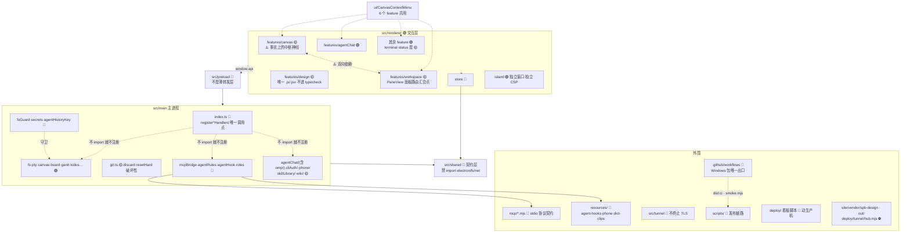

# 10 · 模块领地图（AI 工程地图）

Codex 路由超时安全恢复（2026-09-23，开发分支；当晚上限调整为 5 次）：`mcp/codex-task-recovery.mjs` 只认原生终止轮的精确 `workspace routing discovery timed out`，并要求无执行活动、无用量、无 active goal、无其他 active turn、未取消且未达到五次上限；`codex-task-error.mjs` 只输出固定类别和真实重试次数，绝不回显提供商错误正文。桥接分叉接线另见 03 号图纸。
`mcp/codex-task-bridge.mjs` 持有恢复状态机与同一 app-server 子进程，先只读探测再按 `beforeTurnId` 分叉；只确认新 thread ID 后才更新会话指针、发新付费轮。launcher 仍唯一拥有子进程生命周期，未知 ACK、用户停止及任何原生活动均不重试。
恢复进度只走固定 `retry.status` 事件 → `agentChat/codexEvents.ts` → `features/agentChat/reduce.ts` → `MessageList` 现有 busy 提示；不新增可见用户提问或红色 notice，停止仍走原按钮。`turn.done`／fatal 清除临时状态；分叉后的 `session.ready` 只更新 resumeId。

设计选型台 CDN（2026-09-12）：`features/dict/design-previews.json` 的 307 个 previewUrl 改为自有 `https://design.biily.top/cdn-mirror/template-kits/`，保留文件路径、版本查询及本地 cover。`designCdn.test.mjs` 防止回退旧域名；界面与 popup 行为不变。CDN 来自私有 OSS STS 回源，不向应用注入云凭证。

Git 历史操作（2026-09-08）：`main/gitHistory.ts` 为无 Electron 的 Git 操作与 NUL 分隔差异解析；`git:historyAction` 在 `main/git.ts` 校验工作树、git-dir、common-dir 均通过 `guardDir`。Checkout/分支切换拒绝所有未提交改动（含 untracked），不 force/stash；标签不改工作树。`preload/index.ts` 同步 historyAction/historyFiles 与 commitDiff 的 base/origPath；`HistoryView` 提供确认、返回原分支、比较及状态/numstat，`DiffView` 比较旧路径与新路径。旧 Reset 的确认不得移除，新防护不代表旧接口已补齐。测试 `gitHistory.test.ts` + 隔离应用 `scripts/verify-git-history.mjs`；真实用户仓库禁止用于检出验收。

AI 分屏（2026-09-08）：`store/tabsSlice.ts` 的 `splitLeaf` 对 agent 只保留 `kind/cwd`，新 leaf 停在启动页；禁止复制会话 ID、恢复 ID、自动消息、草稿或团队归属。原 leaf 保持不变，终端仍新建 PTY，文件预览仍克隆。回归测试 `store/splitLeaf.test.mjs` 覆盖横纵分屏与非 AI 行为。

空 Frame 选 CLI（2026-09-22）：`FrameStart` 的显式选择经 `addAgentNode` → `openAgentPane` 落到 `pane.cli`。`AgentChatView` 对**无 resumeId 的新面板**必须先用 `pickNewPaneCli` 从完整清单识别它，再做可用性推测；未安装的 CLI 也要保留身份并进入其安装流程，不得让 `lastCli` 把它换成另一家。已有对话仍按 resume 签发者决定归属。入口展示文案与 hover 解释由 `canvas/startChoicePresentation.ts` 统一给出；内置 `omp` 的用户名称是「原生 Harness」，同步于 `main/agentChat/adapters/omp.ts` 的 CLI 清单和 `shared/roleBinding.ts` 的角色编辑器标签，内部 ID 不改。

创作参考入口（2026-09-22）：原「辞典」的用户可见名称统一为「创作参考」，覆盖标题栏 `DictBubbleToggle`、浮层 `CanvasDictBubble`、独立 `DictView`、`PaneView` 及 AI 输入框候选/引用标签；内部 `dict` 类型、词条身份、路径和持久化键不改。标题栏 hover 解释预设提示词、蓝图与设计选型用途。密钥柜首次启用 UI 在 `VaultGate` 用 `[data-tip]` 悬停/聚焦气泡披露安全说明，不做内联 `details` 展开；错误和锁定状态始终直接可见。

创作参考词条列表（2026-09-23）：`dict/dict.css` 的 `.dict-list` 保留 DOM/键盘顺序，气泡间距固定 8px；`DictView.tsx` 测量每行自然宽度，用 `rowLetterSpacing.ts` 将完整行余宽分到词条中文字距，末行保持自然字距并靠左。筛选及面板宽度变化时先清旧字距再测量，避免布局累积误差。不要改为 `space-between` 或固定列数。

密钥弹窗色彩（2026-09-23）：`workspace.css` 的 `.vault-backdrop` 是密钥柜及 AI 索要密钥弹窗共用调色板；暗色面层/内层对齐主应用冷蓝黑 `--glass-3` 色相，亮色覆写仍保持独立。调整它要同时看首次建柜、解锁与 `SecretRequestModal`，不要只改单个卡片背景造成内外色温分裂。

交互展开反馈（2026-09-22）：`ui/motion/MotionDisclosure.tsx` + `disclosurePresence.ts` 是短内容/按需内容的进退场通道；关闭后等 180ms 再卸载，重开会取消旧退出，减少动效时瞬时切换。用于终端待办、AI 工具调用详情和 Skill 分类/文件树；大列表不可为动画永久挂载，按钮必须同步 `aria-expanded` 并在隐藏焦点内容前交还触发器。

全局 hover 气泡（2026-09-23）：`ui/Tooltip.tsx` 接管 `[data-tip]`，入/出场各 200ms；退出延迟卸载与 `styles/base.css` 动画时长必须同步。位移用 CSS 独立 `translate` 属性，不覆盖上方气泡定位用的 `transform`；减少动态效果时立即卸载。

CLI 自动更新（2026-09-07，用户要求默认关闭）：`main/cliUpdates/manager.ts` 管持久开关、下载代次、pending→active 和回退；`packages.ts` 只取官方 npm 原生包并校验完整性/基础 CLI 参数；`index.ts` 注册固定 IPC 和后台检查。`shared/cliUpdates.ts` 为界面协议，`workspace/CliUpdatesPanel.tsx` 位于设置→更新。启动只在 registerAgentInstallHandlers 后新增注册，保留原注册顺序；通过 probeEnv 的启动固定路径接入对话/探测和 PTY。更新时绝不能改 PATH 或运行入口，版本路径只能来自固定 userData/cli-versions 下经过校验的版本号。详见 16 号图纸。 **2026-09-13 起下载/解包/校验经 `cliUpdates/managedStage.ts` → `runtime/sessionStartup.runAppTask`（应用级托管任务：全窗口可见、窗口不可取消、窗口关闭不带走）；`packages.verifyVersionAsync` 是 stage 路径的校验，`verifyVersion`（同步）只留给 `boot()`/`rollback()`，别把同步版拿回 stage 路径。**

> **这是 agent 进入本仓库要读的第一份文件。** 动手前先在这张图上找到自己在哪块地。
> **更新触发**：新增目录 · 重构目录 · 新增禁区 · 新增高耦合点 · 新增文档链接。**与代码同一个 commit 提交。**
> **风险等级**：🟢 常规业务代码，照常改 · 🟡 高耦合 / 有性能约束，先全局搜引用、读文件头注释 ·
> 🔴 安全边界 / 跨进程契约 / 历史修复 / 直接动生产机，**先读
> [03-3B](03-agent角色边界.md#3b--开发期-agent你的边界)** 且改动要在 commit 里说明理由 ·
> ⛔ 分发产物 / 构建输出，**不要手改**，去源头改。

## 全局领地图

## 领地明细 · 渲染层 `src/renderer/`

| 目录 | 责任域 | 风险 | 备注 |
|---|---|---|---|
| `features/plugins/PluginPanel.tsx` `features/plugins/appsProtocol.ts` | **插件面板**：画布组件 `plugin-panel` 的渲染体（sandbox iframe → `eas-plugin://`）＋ 面板桥的判断层（纯函数，有测试） | 🟡 | **画布上开带插件的对话必须走 `addAgentNode`**（先建真 leaf 再摆节点）；`addFileNode({kind:'agent'})` 只放一个带 pane 的节点、不建 leaf，重建逻辑只在启动加载时跑，当场渲染成空白框（2026-09-05 正式版「对话起不来」）。 **只注册一个** `plugin-panel` 组件，插件身份在 `node.component.props`（`{pluginId, panelId}`）—— 别把插件 push 进 `CANVAS_COMPONENTS`。iframe 精确 `sandbox="allow-scripts"`：不给 `allow-same-origin`（否则能读父页）、也没有 `allow-forms`（**插件面板里不能用 `<form>` 提交**，样板为此改成按键处理）。消息判据是 `event.source === iframe.contentWindow`，origin 是 opaque 不能用。 ⚠️ **selector 只返回原始值**：`useStore(s => ({w,h}))` 会无限重渲染 → React #185 → 整个界面进错误边界（2026-09-05 真机撞到，症状是节点挂上就卸掉、30s 后插件进程被回收）。 验证时注意：这个 iframe 是 **OOPIF**（独立进程），不在主页面的 frame 树里、主页面的 `Runtime.evaluate` 进不去；它在 `/json/list` 里是一个 `type:iframe` 的独立目标，直接连它的 webSocketDebuggerUrl（`scratchpad/frame.mjs` 就是这么做的）|
| `features/canvas` | 无限画布、Frame、节点、抽屉 | 🟡 | TypeScript 侧最大块，**事实上的公共层**，见耦合警报 §1 |
| `features/design` | 设计模块节点（Konva 设计 + 关键帧动效双模式） | 🟡 | 全渲染层**唯一的非 TypeScript 源码**，别只数 ts/tsx 就下结论；`composer/` 整体移植自 taptv（见 `composer/index.jsx` 头注释：`cp -r` + `sed dc__→uc__`），三个坑见 §3 |
| `features/workspace` | 应用外壳、侧栏、PaneView 路由 | 🟡 | `PaneView.tsx` 是面板路由中枢，新增面板类型必改，见 §2。`paneSizing.ts` 集中管理 AI 面板 640px 下限及分屏最小树宽；同步 canvasSlice resize、PaneView 恢复和 PaneLayer 分屏几何，保持面板挂载身份 |
| `features/terminal` | xterm 挂载、密钥徽章、路径链接 | 🟡 | xterm 实例跨 ViewMode 共享，**绝不能重挂载**（见 §2） |
| `features/status` | 状态机、待办、运行监控 | 🟡 | `RunMonitor.tsx` 有方向性事故史 |
| `features/git` | 分支图/历史 + 暂存/丢弃/回退 | 🟡 | `SidebarGit.tsx` / `HistoryView.tsx` 里的 `requestConfirm` 弹窗是 `git:discard` / `git:resetHard` 的**唯一护栏**，不得移除；新增入口照抄 |
| `features/phone` | **电脑侧**配对面板与取数（PhonePanel / collect / qr） | 🟢 | **不是手机上看到的那个页面** —— 那是 `resources/phone/index.html` |
| `features/agentChat` | AI 对话面板、审批卡、CLI 登录 | 🟢 | 逻辑与视图分离度高，纯函数各配 `.test.ts` |
> `agentChat/userMessages.ts` 是从组件里提出来的纯函数（用户消息怎么合回轮次流）。提出来的原因就是它埋在 `AgentChatView.tsx` 里没法单测，而它与归约器之间有一条跨模块不变量 —— 「聊几十轮后自己发的话全没了」那个 bug 正藏在那儿。
| 其余 feature（`gantt` `dict` `wiki` `team` `editor` `board` `image` `files` `web` `voice` `notify` `quota` `chat`） | 各自单一职责 | 🟢 | `gantt` 的 collector 被 terminal/agentChat 复用；`dict` / `wiki` 走 lazy 进 PaneView |
| `store/` | zustand 单 store 多 slice | 🔴 | 撤销栈 / persist 有硬约束，见 [03-3B](03-agent角色边界.md#3b--开发期-agent你的边界) |
| `island/` | 灵动岛独立窗口 | 🟢 | 独立 CSP，**不共享主窗口 React 树**；配套 preload 是 `src/preload/island.ts` |
| `ui/` `styles/` | 纯 UI 原子 | 🟢 | **没承担起公共层职责**——公共组件实际长在 canvas 里，见 §1 |

## 领地明细 · 主进程 `src/main/`

| 分组 | 文件 | 责任域 / 坑 | 风险 |
|---|---|---|---|
| `src/main/agentChat/modelCatalog.ts` `src/main/agentChat/codexModels.ts` | 模型清单的**三级取值**：探测 → 上次探测成功的那份（`userData/model-catalog.json`）→ adapter 兜底 | 🟢 | **别把清单写死当主数据源**（用户 2026-09-06：所有模型列表都不要硬编码）。模型名随版本和账号变，Codex 的 gpt-5.6-sol/terra/luna 每个账号都不同。`CliAdapter.probeModels` 是主路径（Codex 问 app-server 的 `model/list`）；**拉不到必须降级**，顺序在 `resolveModels`（8 条测试）：落盘那份不是硬编码，是这台机器真实探测成功过的。 `capabilities.models` 从此只是**第三级兜底**，界面会标注「内置清单」。Claude 目前只有兜底 —— 2.1.263 确实没有列模型的接口（无 models 子命令 · doctor 不报 · 二进制 catalog 无可靠结构 · 非法模型名的报错也不给清单，逐个试过），所以那份写的是**别名**（fable/opus/sonnet/haiku）而不是版本号，别名稳定得多。 接线：`session.ts` 的 `resolveAndBroadcastModels` 先用缓存/兜底立刻填上下拉，探测回来再覆盖一次，全程不 await、失败沉默 | **别改成硬编码**：Codex 模型名带小版本（gpt-5.6-sol / terra / luna）且**每个账号能用的不一样**，写死等于隔三差五给用户一个选了就报错的选项（2026-09-06 用户报「无法下拉选择模型」）。探测起一个短命 `app-server` 进程、结果缓存；失败返回 undefined，工具栏退回没有下拉。 接线：`CliAdapter.probeModels` 可选钩子 → `session.ts` 会话起来后**不 await** 地调一次，拿到就广播 `capabilities` 事件更新下拉 |
| `src/main/diagLog.ts` `src/main/diagRing.ts` `renderer/features/diagnostics/flickerRecorder.ts` | **闪烁黑匣子**：偶发、抓不到瞬间的界面闪烁，靠事后读记录（用户 2026-09-05） | 🟢 | 只记三种事：组件整段卸载/重挂（观察器只挂**容器的直接子级**：`.canvas-world`→Frame、`.cframe`→节点、`.pane-layer`→面板，**绝不进终端内部**）、>100ms 长任务（`PerformanceObserver`）、GPU/渲染进程崩溃重启（`child-process-gone` / `render-process-gone`）。没有轮询没有定时器，空闲开销为零；渲染层事件每秒限 50 条。日志 `userData/flicker.log`（超 1MB 从头砍一半，`trimLog` 有测试）；设置 → 隐私 tab「诊断」段能看最近 80 条。 **已破一案（2026-09-06）**：日志里一小时 11 次 `canvas-band` 挂载后 40~120ms 卸载 —— 那是空白处普通点一下、手抖 1 像素也会 `setBand`，闪出一个强调色小方块。修法是 `CanvasStage.startBoxSelect` 里只在 `moved` 为真时 `setBand`。 用法：用户说「刚才闪了」→ 读最近 30 秒：只有 `child-gone`/`render-gone` 没有 unmount/mount = 系统层合成器抖动，不是应用代码 **空闲看门狗（2026-09-14，`runtime/idleWatchdog.ts` + 纯逻辑 `idleWatchdogPolicy.ts`）**：黑匣子抓不到「很多小任务」型的空闲负载（那天正式版空闲时主线程 25%、GPU 40% 烧了 25 分钟、事后复现不出）。主进程每 30 秒 `app.getAppMetrics()` 看主窗口渲染进程 CPU（**乘核数换成单核口径**，原值按全部核心归一化、烧满一核只读 7%），没会话在跑、没采麦、连续两次 ≥20% 就 `webContents.debugger` 附 5 秒抓 JS profile + 探针（谁在调 rAF/定时器、动画清单），写 `userData/diagnostics/idle-<时间>.cpuprofile/.json`，黑匣子记一行摘要（`idle-watchdog`）。冷却 10 分钟、一次运行最多 5 份、调试器被占用时让路。渲染层平时零开销；副作用是 `cpuSnapshot` 的「距上次调用」窗口从此 ≤30s。验收：`EAS_IDLE_WATCHDOG_INTERVAL_MS=5000 EAS_IDLE_WATCHDOG_THRESHOLD=20` 起 verify 实例、在渲染层放一个烧 CPU 的 rAF 循环，日志行里应点名那个函数 |
| `src/main/agentChat/stderrReason.ts` | CLI 非零退出时从 stderr 尾巴挑一句人话（纯函数，5 测试） | 🟢 | **退出通知必须带原因**：2026-09-05 正式版 Codex 在非 git 目录秒退，界面只有「CLI 进程退出（code 1）」，原因（`--skip-git-repo-check` 未指定）就在 stderr 里却没人看得到。`session.ts` 的 `wireProc` 留最后 600 字 stderr，退出时 `exitMessage(code, tail)`。噪声行（Codex 的「Reading additional input from stdin」）在 `NOISE` 里维护。 顺带钉住：**`adapters/codex.ts` 永远带 `--skip-git-repo-check`**（`adapters.test.ts` 有测试）—— 用户的资料夹没有一个是 git 仓库，缺它 Codex 在那些项目上一条消息都回不了 |
| `src/main/pluginHost.ts` `src/main/mcpClient.ts` `src/main/pluginManifest.ts` `src/main/panelHtml.ts` `src/main/hostRegistry.ts` `src/main/jsonrpcFrames.ts` `src/main/nodeBin.ts` `mcp/eas-plugin-shim.mjs` | **插件面板宿主**（自家插件 `cli:'eas'`：一个 MCP server ＋ `ui://` HTML 面板）。设计稿 [`docs/superpowers/specs/2026-09-05-插件面板宿主-design.md`](../superpowers/specs/2026-09-05-插件面板宿主-design.md) | 🟡 | **一个插件一个进程**（`hostRegistry` 按名计数，面板与会话共用，归零宽限 30s）。会话里 harness **不直接 spawn 插件**，`agent-mcp.json` 写的是转发 shim → 网关 `/plugin/rpc` → 宿主进程 —— 否则模型调了工具面板看不见、进程成倍涨。shim 靠心跳保活（45s 无心跳即释放）。 面板 HTML 走 **`eas-plugin://<panelSession>/`**，CSP 用**响应头**（`panelHtml.ts` 的 `PANEL_CSP`）—— srcdoc/blob/data 文档继承渲染层 `script-src 'self'`，内联脚本必死（2026-09-05 实测）。渲染层 `index.html` 因此加了 `frame-src eas-plugin:`。 方法名/常量/画布透传白名单**只在 `src/shared/pluginProtocol.ts`**（主进程与渲染层共用；以 ext-apps 1.7.5 核对）。`eas/canvas.call` 双白名单：全局 ∩ 清单，执行走 `invokeRenderer` 同一执行体与路径白名单。插件进程 env **没有** `EAS_TERM_TOKEN`。 ⚠️ `hostRegistry.ts` 别用 TS 参数属性（`node --test` 类型剥离不认，全量跑整文件加载失败，tsx 单跑却能过）。 **起子进程别裸 `spawn('node')`**：走 `nodeBin.ts`（固定候选 → 回退 Electron 当 node），PATH 用 `PROBE_ENV`。Dock 启动的正式版 PATH 里没有 homebrew（2026-09-05 事故）；**要复现得用精简 PATH 直接起 Electron 二进制**（`.bin/electron` 壳本身要 node），数据目录按 verify-app 的白名单自己拷（app 退出会清掉它自己建的临时目录） **2026-09-13：`acquire` 起进程前先过 `startManagedSession`（应用级、`startingPlugins` 合并并发、预算随 `McpClient.exited` 释放）。别把 `registry.acquire` 挪回准入外面，也别给它加第二套引用计数。** |
| `src/main/pluginMarket.ts` `src/main/pluginRegistry.ts` `src/main/pluginInstall.ts` `src/main/pluginInstallGate.ts` `src/main/pluginUnzip.ts` `src/main/pluginEnabledState.ts` `src/shared/pluginCategories.ts`（分类分类法） `renderer/…/CanvasMarketPanel.tsx`（「更多 › 插件」页） `renderer/…/PluginMarketModal.tsx`（完整市场弹窗） `renderer/…/pluginLogos.tsx`（品牌 logo） `scripts/pack-plugin.mjs` `scripts/build-plugin-registry.mjs` `scripts/publish-plugins.sh` | **插件市场第一步**（官方目录 + 一键装自家 `cli:'eas'` 插件到 `~/.eas/plugins/`）。设计稿 [`docs/superpowers/specs/2026-09-15-插件市场-第一步-design.md`](../superpowers/specs/2026-09-15-插件市场-第一步-design.md) | 🟡 | 纯逻辑全在 `pluginRegistry`（目录校验）/`pluginInstall`（写边界·zip-slip·sha256）/`pluginInstallGate`（确认 token）/`pluginUnzip`（解压），`pluginMarket` 只做网络+落盘胶水。**只写 `~/.eas/plugins/`**（自家插件），`plugins.ts` 扫 codex/claude 的「只读绝不写」纪律不动。 **两段式安装**：`install` 下载→校验 sha256→解压临时→`parseManifest`→**返回待确认权限**；`installCommit(token)` 才落盘（延续「不静默装」红线）。 ⚠️ staging 内层目录名必须等于插件名（`parseManifest` 认目录名）。 来源信任 = **HTTPS + 域名白名单**（`ALLOWED_HOSTS`）；切 OSS/CDN 时四处一起改（见 13 号图纸同步清单）。第一步不签名，只 sha256 + 官方域名。 **总开关**（2026-09-15）：市场页在「更多」抽屉（`CanvasMarketPanel`），管**所有**插件（自家 + Claude/Codex）的开/关，落 `userData/plugin-enabled.json`（纯逻辑 `pluginEnabledState`）。**只有开启的**才进双击插入面板与输入框 @ —— 那两个消费点都 `filter(enabled)`，新增列插件的界面必须一起筛（13 号图纸有钉）。 |
| **入口与装配** | `index.ts` | 窗口生命周期 + **所有 `register*Handlers()` 的唯一调用点**；注册顺序有硬依赖，见 [02 启动顺序](02-分层架构.md#启动顺序硬依赖打乱是静默失效而非报错) | 🔴 |
| **安全边界** | `fsGuard.ts` `secrets.ts` `agentHistoryKey.ts` | 渲染层/外部传入路径的写白名单 · 密钥柜 · 路径穿越防线 | 🔴 |
| **Agent 生态** | `mcpBridge.ts` `agentRules.ts` `rulesRefresh.ts` `agentHook.ts` `agentSkill.ts` `agentInstall.ts` `agent.ts` `roles.ts` `builtinRoles.ts`（内置角色数组本体，electron-free，供 `builtinRoles.test.ts` 裸测；`roles.ts` re-export）`rolesSchema.ts`（清洗 + v1→v2 迁移，electron-free）`cliContract*.ts` `plugins.ts` `mcpOptOut.ts` `statusline*.ts` | 对外部 CLI 的全部接口（`agent.ts` 是 CLI 探测：`agent:probe` / `agent:codexServers`，不碰 PTY） | 🔴 |
| **终端与进程** | `pty.ts` `probeEnv.ts` `probePath.ts` `termTail.ts` | `probeEnv.ts` 是**「CLI 装在哪」的唯一事实源**（`userBinDirs()` 候选目录 + `applyLoginShellPath()` 登录 shell 兜底），`agentInstall` / `agentSkill` / `cliAuth` / `agentChat/adapters/detect` 全引它，别再各列一份；密钥 `secretsEnv` 的**唯一出口**；MCP token 走 `mcpBridge.ts` 的 `mcpEnv()`，**有两个调用点**——`pty.ts`（终端）和 `agentChat/session.ts`（AI 对话会话）：改函数体两边同时生效，但在**调用点**加开关/条件/审计，只改一处必漏 | 🔴 |
| **版本控制** | `git.ts` | 两条破坏性写通道：`git:discard`（`checkout --` 覆盖已跟踪文件、未跟踪文件进废纸篓）与 `git:resetHard`。**它们不过 fsGuard**（git 子命令按 cwd 写，guardPath 不适用），安全性只靠渲染层的确认弹窗兜底 | 🟡 |
| **文件与项目** | `fs.ts` `projects.ts` `projectPaths.ts` `session.ts` `sessionPaths.ts` `teamWorktreeOps.ts` | 文件树 IPC、项目列表、git worktree 实操（写码 agent 的隔离靠它成立）。`projects.ts` 的 `projects:setTestCmd`（角色工作流 P2）写 `Project.testCmd`（回归命令，落 `userData/projects.json`；trim 后 ≤200 字，**空串 = 删掉字段**，回落到 `package.json` 推断）——界面入口是侧栏项目右键菜单「回归命令…」，复用行内编辑的第三个 `mode: 'testCmd'`（`projectMenu.ts` + `Sidebar.tsx`），不另开弹窗 | 🟡 |
| **协同板**（角色工作流 P1） | `collabBoard.ts`（`registerCollabBoardHandlers`）`gitExec.ts` | `collabBoard.ts` 要读会话表却不 `import session.ts`——经 `setSessionSource()` 注入取值函数，避免主进程模块间循环依赖；`gitExec.ts` 是 electron-free 的 git 执行封装（`parsePorcelain`，固定 `GIT_OPTIONAL_LOCKS=0` + `-c core.quotePath=false`），**被 `collabBoard.ts` 与 `teamWorktreeOps.ts` 共用同一份**，别各自摞一份判断逻辑。渲染纯函数在 `shared/board.ts`，落盘 `.eas/board.md`（目标项目根，见下方「`.eas/` 目录」）。P3 起 `doWriteBoard` 落盘后末尾 `void upsertLedgers(...)` 顺手刷各分支台账头部（同一刷新节奏，**不另起钩子**）；`board:read` 先 `ledgerIdle` 等链空再带回 `ledgers`；`board:note` 按 cwd **向上找第一个含 `.git` 的目录**当这棵树的根（终端可能 `cd src/` 之后调），主工作区必须带 `branch`，指名写给别的分支时那条分支得真有台账（磁盘上有文件或板上有这条分支），否则拒绝 —— 拼错的分支名不许造出孤儿台账 | 🟡 |
| **合并官工具**（角色工作流 P2） | `mergeTools.ts`（`registerMergeHandlers`：`merge:preflight` / `merge:impact`）| 两个**只读**工具的事实来源，**不改工作区**：冲突用 `git merge-tree --write-tree --name-only --no-messages` 算（不做试合并），依赖波及调代码地图的 `analyzeProject` 反查；合并动作本身由合并官会话在自己的 cwd 敲 `git merge`，不经这里。`gitExec` 只回 `{ ok, out }`，而 merge-tree 用退出码分「0 无冲突 / 1 有冲突 / ≥2 git 自己失败」，光看 ok 分不清 1 和 2 —— 所以用 `gitExec.ts` 导出的 `gitExecCode`（回 `{ code, stdout, stderr, killed }`；`gitExec` 是它的薄包装，环境参数只写一份），可能跑久的调用传 `timeoutMs: 30_000`；`rev-parse --show-toplevel` 也走它（code 128 且 stderr 为空 = 根本没有 git 命令，与「不是仓库」分开报）。三处 git 一律用全限定名 `refs/heads/<x>`（同名 tag 会压过分支且退出码仍是 0）。图按项目缓存 5 分钟（`graphCache`），**每次 `preflight` 把该项目的缓存清掉**（新一轮合并从这里开始），`impact` 返回带 `cachedAt`。读 `Project.testCmd` 不 `import projects.ts`——`projects.ts` 启动时 `setProjectsSource()` 注入（同 `collabBoard.setSessionSource` 手法）。传入路径经 `projectRootOf()` 归一：角色会话在 worktree 里调，算的仍是整个仓库。项目注册在仓库子目录时 `preflight` 的 `changed` 相对仓库根，`impact` 用 `rev-parse --show-toplevel` 算出子目录后**自动剥前缀**再查图。纯解析在 `shared/mergePreflight.ts` / `shared/repoImpact.ts`（见外围表） | 🟡 |
| **章程与台账**（角色工作流 P3） | `roleCharter.ts`（`ensureCharter`）`branchLedger.ts`（`upsertLedgers` / `appendNote` / `readLedgers` / `ledgerFiles` / `ledgerIdle`）| 两个都**不 import electron**，裸测得了；文本逻辑全在 `shared/roleDocs.ts`，这里只管 fs 与串行。`roleCharter.ts`：章程 `docs/roles/<roleId>.md` **只在不存在时生成**（已存在一个字节不动——用户会改它）；`root` 必须是项目根（调用方先 `projectRootOf`），**`<root>/.git` 不存在直接返回 `null` 一字节不写**（否则传错目录会在 `$HOME` 之类的地方长出一份 `docs/roles/`）；写不出来回 `created:false`，指针照附进系统提示（模型读不到会自己说）；「硬约束」几行只取 `capMatrix` 的 active 行，且**只写起会话那家 harness 的落法**（`row.cells[kind]`，`kind` 由调用方传 `p.cli`），标题下另加一行「按首次起会话的 X 算；换别家 CLI 时落法可能不同，以角色卡为准」，喂的 `ctx` 必须是这次真实起会话的那份（见 [13 同步清单](13-所有权矩阵.md#跨文件同步清单改一处必须改另一处)）。同步 fs：调用点 `agentChat:start` 是同步 handler。`branchLedger.ts`：台账 `.eas/board/<branch>.md`，**同一项目的读改写排成一条 promise 链**（upsert 与 append 都是读→改→写，叠在一起谁后写谁赢、对方那次改动丢）；`upsertLedgers` 板上每条**分支**重算头部、记录段原样接回，`splitLedger` 找不到「## 记录」标题时**整份旧文当 notes 接回**不当空；跳过主工作区那行（`cwd === root`，它的 branch 是展示串）与 `?` / `HEAD`；`appendNote` 只追加，note 截 4000 字；`ledgerFiles` 扫 `.eas/board/*.md` **靠首行 `# 台账 · <branch>` 反推分支名**（文件名是 `/`→`--` 压出来的，反推不回去），`readLedgers` = 磁盘上有的 ∪ 板上有的、每份只留尾部 60 行（头部占 10 行，记录段要留够） —— 会话被回收后文件还在，合并官必须读得到没人在线的分支写下的交接；`markGoneAsStopped`（`upsertLedgers` 尾巴上调）把**不在 rows 里**却还写着「状态：活跃」的台账改成「已停」——用户点停止是把会话从会话表**删掉**，不经 exit 那条路，不补这一手头部会永远停在活跃 | 🟡 |
| **数据持久化** | `canvas.ts` `board.ts` `gantt.ts` `todos.ts` `prefs.ts` `dict.ts` `dictClips.ts` `snapshot*.ts` `agentHistory.ts` | 各自独立 JSON 落盘（写 `userData`，**不过 guardPath**，理由见下方「一种持久化数据」）。**`board.ts` 是看板插件的列数据，与协同板 `collabBoard.ts` 同名不同物，别写错** | 🟢 |
| **系统集成** | `island.ts` `stt.ts` `bizone.ts` `design.ts` `pasteImages.ts` `gpuInfo.ts` `ipcProfiler.ts` | OS 能力接入 + 本地 IPC 耗时埋点 —— `ipcProfiler.ts` **不联网**，别按名字把它当遥测 | 🟢 |
| **更新遥测** | `updater.ts` `telemetry.ts` `quotaStore.ts` `quotaApi.ts` | 出站集中在这里，**但不是全仓唯一出站**：另有 `stt.ts`（下载语音模型，`hf-mirror.com`，**裸 `fetch` 无超时**）、`bizone.ts`（查画板版本 `bzone.biily.top/version.json`，有 2.5s abort）、`phone/tunnelClient.ts`（`tls.connect` 连 `eas.biily.top:8443`）。改超时 / 代理 / 离线开关 / 隐私声明，四处都要动，见 [01](01-系统上下文.md) | 🟡 |
| **子域** | `agentChat/`（含 `agentChat/omp/`） `cliAuth/` `phone/` `skillLibrary/` `wiki/` | 各自完整子系统。**`cliAuth/` 两条硬约束**：登录预检不得 await 进 `agentChat:start`（那个 handler 的同步性是承重的）；登录 `spawn` 跑在用户**真实**的 `~/.claude` / `~/.codex` 上——测登录前先设 `CLAUDE_CONFIG_DIR` / `CODEX_HOME` 隔离（已发生过清空真实凭证的事故） | 🟡 |
| **`resources/omp/`** | omp 的随包二进制。**`manifest.json` 与 `THIRD-PARTY-NOTICES.txt` 入库，二进制不入库**（每平台约 130MB）—— 由 `scripts/fetch-omp.mjs` 按清单下载并校 SHA256，`scripts/check-omp-bundle.mjs` 在打包前硬拦（版本、`extraResources.to` 与代码字面量、`--tools` 白名单、SHA 与可执行位）。⛔ 手放二进制进去没用，SHA 对不上会被拦 | ⛔ |
| **`agentChat/omp/`** | omp（Oh My Pi）那条**独立传输**的全部实现：`transport.ts`（双向 JSON-RPC 状态机，**electron-free**、可 `node --test` 裸跑）· `launch.ts`（受管配置落盘 ＋ spawn 组装 ＋ 进程包装 ＋ MCP 归一，**2026-09-03 起也是 electron-free、可 `node --test` 裸跑**）· `host.ts`（**这一层唯一碰 electron 的地方**，只有 `hostPaths()` 五行）· `paths.ts` · `config.ts` · `approvals.ts` · `store.ts` · `login.ts`（订阅登录）· `setupModel.ts`。事件翻译在同级的 `ompEvents.ts`（omp 专属、不接进 `feed()`）。 **2026-09-02：密钥柜那条路整条删掉了。** 原来它有两种连法（订阅 / 填 API key），后者把 key 存进我们的密钥柜、spawn 时注环境变量、`models.yml` 里写 `apiKey: EAS_OMP_<ID>_KEY`。那是一套**和 omp 平行的凭证系统**，而 omp 的 `auth-broker` 覆盖 69 家、需要 key 的自己会问自己存。平行系统制造的 bug 比它解决的多（apiKey 压过 broker 凭证→登录成功却 401；我们自己记的 `authMode` 保存模型时漏传→静默翻转；`loggedInAt` 写下去永远为真→说配好了其实没有）。 现在只剩一条路：**选服务商 → omp 自己的登录 → 选模型**。`models.yml` 恒为 `providers: {}`（`writeManagedConfig` 干脆不收参数），`ompKeyEnvName` / `OmpProviderConfig` 已删。 **「配好了没有」的判据是问 omp**（`omp models ls --json` 列不列得出这家的模型），不是查我们自己的账本 —— 账本会和现实分叉，而分叉时界面在骗人。 **它整条不走 `feed()` 与 `writeStdin()`**：前者假定翻译器只回事件数组，后者硬写 Claude 的行格式。`session.ts` 里九处 `live.acp` / `transport === 'acp'` 分支对 Claude/Codex 恒为 no-op —— 判据是能力位，不是 CLI 名字。设计与验收判据见 `docs/superpowers/specs/2026-09-01-omp-底座接入-design.md` **2026-09-03：`launch.ts` 拆掉了对 electron 与 `mcpBridge` 的依赖。** `hostPaths()` 搬去 `host.ts`；`mcpEnv` 与 MCP 配置路径改由 `session.ts` 算好传进来（`planOmpLaunch` 收 `mcpEnv?`、`readMcpServers` 收 `configPath`）。动机有两条：① 它构成循环依赖 `launch → mcpBridge → quotaStore → launch`（代码地图查出来的）；② mcpBridge 那条链上有无扩展名的相对 import（`./plugins`），Node 的 ESM 解析器认不了，**整个 launch.ts 因此在 `node --test` 下加载不了** —— `readMcpServers` 里那段角色禁用逻辑一条测试都没有，而它静默失效的表现是「某个角色够到了不该够到的 MCP server」。现在有 `launch.test.ts` 钉着，**加回任何一个 import 那个文件当场红** | 🟡 |

> **`.eas/` 目录**（角色工作流 P1）：**不是本仓库的目录，是被 Eas-Term 管理的目标项目根下**由
> 协同板运行时生成的一个子目录（含 `board.md`）。没起过 `isolation:'worktree'` 角色的项目不会
> 凭空长出它；生成后写进目标项目的 `.git/info/exclude`（幂等，不改用户自己的 `.gitignore`），
> `git status` 里不会显形。
>
> **`.eas/board/` 目录**（角色工作流 P3）：各分支台账 `.eas/board/<branch>.md`（`main/branchLedger.ts` 写，
> 文件名由 `shared/roleDocs.ts` 的 `ledgerRel` 压出来），**与 `.eas/board.md` 并存**——`board.md` 是整块板、
> `board/` 是每条分支一份的交接纪要，别把其中一个当成另一个的替代。exclude 写的是 `.eas/` 整目录，
> 台账一并不显形；**不进 git 是刻意的**（头部是 app 每次刷板重算的，进 git 只会天天冲突）。
> 头部由 app 维护、「## 记录」段只由 `board_note` 追加；会话被回收后文件留着，合并官靠它读没人在线的分支写下的交接。
> 主工作区没有自己的台账（它的 branch 是「主工作区（main）」这种展示串），合并官要写就带 `branch` 指名。
> `upsertLedgers` 挂在 `doWriteBoard` 那条「一条 row 都没有就不造文件」之后：没有会话的目录不会被造出 `.eas/`。
>
> **`docs/roles/` 目录**（角色工作流 P3）：同样是**目标项目根下**的目录，放角色章程 `docs/roles/<roleId>.md`
>（`main/roleCharter.ts` 的 `ensureCharter`）。与 `.eas/` 相反，**它进 git、用户可改**：app **只在文件不存在时**生成一份初稿
>（边界段留空给用户填），之后永不覆盖；不写 exclude，首次生成后在 `git status` 里是未跟踪文件，提交与否由用户决定。
> **只对项目根下有 `.git` 的目录生成**（`<root>/.git` 不存在直接返回 null，一字节不写）。角色会话在 worktree 里起时
> 也是写到主工作树的项目根（`projectRootOf` 先剥回根），所以系统提示里的指针必须是绝对路径。

## 领地明细 · 外围

| 路径 | 责任域 | 风险 | 说明 |
|---|---|---|---|
| `src/shared/` | 主/渲染契约层 | 🔴 | **禁 import electron/fs/net**，要能 `node --test`。`roleBinding.ts`（角色意图 → 三家参数，纯函数）。代码地图那几块纯判定层也在这儿：`codeGraph.ts`（领地归属 / 类型引用识别 / 循环定性 / 领地聚合）· `langImports.ts`（Python·C·Swift 的 import 提取，**纯字符串进、说明符出**）· `gitignore.ts`（`.gitignore` 的目录匹配 —— 它才是每个项目关于「什么不是源码」的权威声明）· `dictTaxonomy.ts`（词典两级分类 ＋ **老一级名的别名表，删了会洗掉用户自建词条的分类**）· `dictBlocks.ts`（词典的区块标签名单 —— **它是分面不是分类第三级**：30% 的词条同时属于 ≥2 个区块、41% 一个都不属于）· `board.ts`（角色工作流 P1，协同板纯渲染：`renderBoard` / `findOverlaps` / `clipForPrompt`，`BOARD_REL='.eas/board.md'`，**不是** `main/board.ts` 那个看板插件）· `roleWorktree.ts`（角色 worktree 命名判断：`.worktrees/<roleId>-<6位id>`，分支 `eas/<roleId>/<id>`，与团队的 `eas-team/…` 前缀区分）· `mergePreflight.ts`（角色工作流 P2，合并预检的纯解析，零依赖、裸测：`parseWorktreeList` / `parseMergeTreeNameOnly`（按退出码 0/1/≥2 分三路，**不解 C 风格引号**）/ `pickDefaultBranch`（origin/HEAD → main → master）/ `inferTestCmd`（`package.json` 有 `scripts.test` 就回 **`npm test`**，不照抄脚本；`no test specified` 不算）/ `isSafeRef` ＋ `PreflightResult` 类型，main / preload / mcpHandler 都从它引）· `repoImpact.ts`（P2，依赖波及的纯计算 `impactFrom(graph, files, testFiles)`：反向依赖 `direct` ＋ `indirect` **只到第二层不是闭包**、涉及的环、`suggestedTests` 只认同目录同名 `*.test.*`；模块级图按最长前缀归属）· `roleDocs.ts`（角色工作流 P3，章程与台账的**纯文本层**，零依赖裸测：`charterRel` / `ledgerRel`（分支名 → 文件名，`/`→`--`、别的怪字符→`-`，字母数字按 `\p{L}\p{N}` 认——中文分支名 `eas/工匠/x` 与 `eas/侦察/x` 不能塌成同一个文件）/ `renderCharter`（四段初稿：边界留空、硬约束来自绑定层（没点亮任何 cap 写「无」）、产出照抄契约、完成判据用 `extractJudge` 从契约里捞）/ `renderLedger`（首行固定 `# 台账 · <branch>`，`main/branchLedger.ts` 靠它反推分支）/ `splitLedger`（`found=false` ≠ 空）/ `appendLedgerNote` / `clipTail` / `roleDocsPrompt`（系统提示末尾的指针段，**只有指针不含全文**，路径给 **`root` + 相对的绝对路径**——角色会话 cwd 在 `.worktrees/<x>` 里，章程是主工作树刚生成的未提交文件、台账只在项目根，相对路径在那棵树里都打不开）/ `branchFromGitFiles`（**不起 git 进程**读当前分支：worktree 的 `.git` 是文件 `gitdir: …`、主工作区是目录；**只看 `<cwd>/.git` 不往上找**，传子目录进来一律 null，`read` 回调必须把目录映射成 null））|
| `scripts/dict-svg/flow.mjs` `flowDetails.mjs` · `apply-flow.mjs` | 后端词条的**分层流向图**（调用方 → 服务 → 存储）| 🟢 | 后端没有「页面上的位置」，前端那套「全景 → 区块」的镜头推进套不上，硬套只能编一个假界面。这套回答的是另一个问题：**作用在哪一层、那一层上发生了什么**。风格与前端那套一致（同 viewBox / 时长 / 配色），多两个语义色：绿=成功路径、红=失败或被拒。 **底部那行字不是装饰** —— 后端机制光看方块动是猜不出来的。 ⚠️ **SMIL 的 keyTimes 必须以 0 开头、以 1 结尾**（还要与 values 等长），任一条不满足就整条动画被忽略且不报错。所以有 `kv()` 构造器把两条规则强制掉，**别手写 keyTimes**；`dictTaxonomy.test.ts` 扫全库钉这两条。 另一个反复犯的错：**层名要用 `lanes()` 的 override 改，别另画一个 text** —— 会和 lanes 画的那个叠在一起（契约测试 / Webhook 重投 / 退避重试三处都中过） |
| `scripts/dict-svg/zoom.mjs` `details.mjs` · `apply-zoom.mjs` | 词条 hover 预览的「全景界面 → 区块」镜头图 | 🟢 | **不能动画 `viewBox`** —— 那是最自然的写法，但 Blink 不支持：`<animate attributeName="viewBox">` 会正常跑（`animationsPaused()` 为 false），而 `viewBox.animVal` 全程等于 `baseVal`，**画面纹丝不动且不报错**（2026-09-04 实测）。改用嵌套两层 `<g>`：外层 translate、内层 scale。 ⚠️ **SMIL 的 `keyTimes` 与 `values` 个数必须相等**，不等长时整条动画被判非法、直接忽略、不报错 —— 症状是「以 `opacity=0` 起手的元素永远不显形」，看代码完全看不出错在哪。`dictTaxonomy.test.ts` 有一条正则扫全库钉这个。 **宽扁 / 高瘦的区块推不动**：桌面导航栏是 212×12，`min(240/212,120/12)` 被卡在 1.13x。所以有 `CAM` 区块级镜头框和 `PLACE` 里的**逐词条镜头框** —— 同一个区块里不同手法演示的位置不一样（页脚的「回到顶部」在最右、「折叠分组」在最左），共用一个框必然框空一个。生成时有断言：倍数 < 2 直接抛错。 **推进后要把全景压暗到 .22**，否则骨架块和演示层同色，演示画上去几乎看不见。 单条 svg 上限 8000 字符 —— 超了 `sanitizeSvg` 是**整个返回空串且不报错**（`main/dict.ts:48`），生成脚本和测试各拦一道 |
| `src/renderer/…/dict/dictionary-bundle.json` | 词库正本（455 条）| 🟡 | **两套提示词模板并存**：前端那套是【外观】【动感】【触发】【实现】【关键参数】【坑】，后端那套是【解决什么】【做法】【放哪一层】【关键参数】【怎么验证】【坑】。**两套都必须把【坑】放最后一段** —— 所有拿词条文本做自动判断的地方都靠「按【坑】切一刀」避开反话（【坑】写的是「别用在哪」，全文扫会把「想要首屏强冲击力时不够看」当成「适用于首屏」），`dictTaxonomy.test.ts` 有一条专门钉这个。 `category` 有四个值，`backend` 是 2026-09-04 加的第四个 —— **白名单只放宽不收紧**，已装的老 skill 只写前三个，不受影响。后端词条**没有 blocks**（区块是页面上的位置，后端没有页面），界面上那排区块筛子按数据自动收起。 写这个文件**必须用压缩格式**（`JSON.stringify(b)`），见 `scripts/dict-svg/apply.mjs:33` 的教训：pretty 过一次是 7475 行插入 1 行删除，真正的改动全被淹没 |
| `src/preload/` | 渲染层拿到主进程能力的唯一闸口 | 🔴 | `index.ts` 经 contextBridge 暴露各 api 域（含 `secrets` `pty` `fs` `shell`）。**不是薄转发层**：pty 首批输出缓冲（`PENDING_MAX_BYTES` + pty 自退出时的 `stopBuffering`，删了会内存涨到崩且无任何报错）、agentChat 常驻事件监听器（模块加载期就挂，改成「start() 之后再订阅」会丢掉最早的事件）。`island.ts` 是**第二份刻意最小化**的 preload，只给灵动岛用——别与 `index.ts` 合并、别给它挂全量 api。类型经 `renderer/src/api.d.ts` 的 `import type { Api }` 派生。**`browser.onRoute` / `onFavorites` 走 `shared/sharedChannel.ts`**：一个频道只挂一个 ipc 监听、订阅者 Set 分发（每个网页节点组件都订阅，几十个节点就是几十个 ipc 监听，2026-09-14 正式版数到 11 个触发 MaxListeners 警告）。preload 引的值模块必须放 `shared/`——web 工程经 `api.d.ts` 收录 preload，`preload/` 下的值模块 web 工程看不见、typecheck 直接红 |
| `renderer/…/dict/blueprints.json` `BlueprintPanel.tsx` | 原型图预设（词典的第四种实体）| 🟢 | 分类树答「这条词条是什么」、区块标签答「它能用在哪」，**蓝图答「一张页面由什么拼起来」** —— 组合关系不是归属关系，所以它既不是分类也不是词条。 **蓝图只写区块名，不写词条 id。** 写了就得维护：词库还在长，每加一条都要回头想「哪几张蓝图该带上它」，那是必然烂掉的活。词条按区块标签实时匹配 → 加词条零维护。**代价：某个区块标签打错会在所有蓝图里同时错**，所以打标质量比蓝图本身要紧。 `blueprints.test.ts` 钉着两条对称的保证：**被引用的区块必须有词条**（引用空区块 → 用户点进去一片空白，会以为功能坏了，而这种坏法没有任何报错）· **有词条的区块必须被某张蓝图用到**（否则那批词条按蓝图路径永远走不到 —— 这条当场逮到「轮播」17 条没人引用）。 刻意**不做**真实渲染的原型图：需求是「展现页面的关系」，竖排方块＋顺序＋一句说明就够，画成像素级的会立刻和真实产品脱节 |
| `renderer/…/codegraph/GraphCanvas.tsx` `radial.ts` · `Starfield.tsx` | 代码地图的**画法**（节点长什么样 / 连线多粗 / 背景）| 🟢 | **凡是「相对视口」的量法在这个模块里都是错的** —— 它会被最大化进画布节点，而画布整层挂着 `transform: scale()`。撞过两次：① 量尺寸必须用 `clientWidth/clientHeight`，不能用 `getBoundingClientRect()` —— 画布整层挂着 `transform: scale()`，rect 是变换后的，缩到 0.44 时量出 170px 而实际布局是 390px，于是节点被算进一个不存在的小盒子里，看起来像「图只占了左上角一小块」；② CSS 里**不能用 `vh`** —— `vh` 相对真实视口（673px），而 `.cg-body` 实际有 1362px，`min(56vh,520px)` 只给出 377px，下半屏 712px 全空。现在图那块用 `flex:1 1 0` 吃掉剩余高度，`.cg-body` 必须是 flex 列容器（改回 block 就退回固定高度）。 节点是**同色系三档明度的同心圆**（alpha 0.14 / 0.34 / 0.95，半径 r / 0.68r / 0.34r）＋ 一段出入弧。这里试错过两轮：拟物（高光 + 暗角）土，而为了「克制」把 alpha 全压低又变得灰扑扑 —— **克制该体现在面积上，不是把每个颜色都调淡**。绿色/冻结档的 rgb 是纯白（`255,255,255`），靠明度而不是色相区分，对齐图纸 15 的第 ④ 条。 `Starfield.tsx` 是背景环境光（canvas-2d，**不是 WebGL**：这是画布节点里的一块背景，同屏还跑着 xterm 与 webview，为几百个缓慢漂移的点多开一个 GL 上下文 ＋ 50KB 依赖不划算）。三处一写就错：不按 DPR 放大后备缓冲会糊 · **看不见时必须停 raf**（IntersectionObserver ＋ visibilitychange，本仓库有过「后台节流」那一整轮教训）· 鼠标偏转要阻尼不能跟手  **2026-09-14：文件级视图点节点 / 文件列表即打开代码——落点判定在 `codegraph/openFileTarget.ts`（画布里 `openArtifact` 在同 Frame 开预览节点，分屏里 `openFile`）；注册表给 `CodeGraphView` 传 `frameId`，别去掉。** |
| `renderer/…/codegraph/forceLayout.ts` | 力导向（「聚类」）布局 ＋ 标签去重叠 | 🟢 | **确定性是它能被采用的前提** —— `radial.ts` 的文件头记着不用力导向的三条理由，这里逐条回应：① 没有任何随机数（初始位置来自 id 的哈希 ＋ 环形起手，迭代次数固定），测试里「跑十次结果一模一样」钉着；② 不做动画，一次算完再画；③ 和环形**并列**不是替换 —— 环形答「谁和谁连」，力导向答「哪几块抱团」。 调参靠**可测的判据**不靠肉眼：三条测试量「铺开范围 > 画布一半」「任意两点距离 > 半径和」「孤立点不霸占画布」。第一版就是没有这些才调出一团挤在角落的疙瘩 —— 根因是引力 `d²/k` 无上限且枢纽节点被几十条边同时拉，现在按度数摊薄 ＋ 封顶。 `pickLabels` 做标签取舍（叠上了只留大的）：环形天然不用，力导向里节点抱团、标签必然互相压 |
| `renderer/…/canvas/dropPoint.ts` | 「屏幕上一个点」→「Frame 内插入坐标」| 🟢 | **零 import，可 `node --test`。** 抽出来是因为插组件有两条路 —— 从抽屉拖入、在 Frame 里右键新建 —— 两条必须落在同一个地方，否则同一个光标位置给出不同结果，用起来像有 bug。 **先减平移再除缩放，顺序不能反**：`viewport.x/y` 是屏幕像素的平移量不是世界坐标的，写反在 scale=1 时看不出错、一缩放就越偏越远。有一条测试专门钉这个顺序。 右键菜单里的组件项**从 `components/registry.tsx` 现取，不另抄清单** —— 注册表的契约是「新增组件只改那一个文件」，抄一份这里必然漏掉新组件 |
| `renderer/…/canvas/nodeCap.ts` | 画布上**内容模块**的数量上限与淘汰规则 | 🟢 | **零 import（只引类型），可 `node --test`。** 用户 2026-09-06 定的规矩：一个 Frame 最多 5 个内容模块（web/code/image），超了自动关掉**最早的**；钉住的（`node.pinned`）既不占名额也不被淘汰；**终端 / AI 对话（有 `leafId`）与画布组件永远不数、永远不淘汰** —— 那是活的进程和用户摆的工具，删了就断了。 接在 `addFileNode` 与 `addWebNode` 两个 action 里（两条都要，只接一条就是「从 MCP 开会清、从抽屉拖不会清」这种说不清的行为）。数值改了要同步两份 skill 文档，见 [13 的跨文件同步清单](13-所有权矩阵.md) |
| `renderer/…/canvas/dropTarget.ts` | 「拖到画布空白处」→ 落进哪个 Frame | 🟢 | **零 import，可 `node --test`。** 存在的理由是上面那条上限**按 Frame 计数**：自由节点（不属于任何 Frame）天然绕开它，从知识库/skill 抽屉拖照样能堆几十个。现在 `useOpenInCanvas` 先过这里定 Frame 再 `addFileNode`，只有**一个 Frame 都没有**时才退回自由节点。 落点在多个 Frame 内（子 Frame 套在父 Frame 里）取**面积最小**的；落在空白处取**最近**的并把坐标夹回内框（不夹会把 Frame 撑成一条） |
| `renderer/…/canvas/zoomMath.ts` | 缩放的纯数学（画布视口 ＋ 最大化内容）| 🟢 | **零 import，可 `node --test`。** 抽出来是因为 `wheelPassthrough.ts` import 了 store（目录 import，Node ESM 认不了），整个文件进不了单测 —— 而里面那段「触控板 vs 鼠标滚轮」的步长判据是用事故换来的（旧公式在滚轮下算出 0 甚至负数，表现是「往后拉一下一步到底 20%」）。`wheelPassthrough` 再导出，调用点不用改。 **捏合与 ⌘+/⌘- 共用同一对上下限**（`CONTENT_MIN/MAX`）—— 两条路范围不同会让人以为其中一条坏了。为什么要两条：HTML 节点是 `<webview>`（独立进程），滚轮落在上面时宿主一个事件都收不到，键盘那条不经过那一层 |
| `src/shared/lspFraming.ts` `src/main/lspClient.ts` `src/main/lspProvider.ts` | 语言服务器（第三期）：C/C++ · Swift · Python 的邻域查询 | 🟢 | **加一门语言 = 往 `LANG_SERVERS` 加一行**（可执行文件名 ＋ 参数 ＋ 扩展名），这正是第二期把抽象按 LSP 形状定死换来的。IPC 按扩展名分流：TS 走内置（更快更准、不起进程），其余走 LSP。 `lspFraming.ts` 是**纯分帧**（零依赖、19 条测试）——它有三处只会静默出错的地方：Content-Length **数字节不数字符**（中文路径下按字符切会切在半个字上，之后全部错位）· 一次 data 事件可能是半条也可能是好几条 · URI 是**百分号编码**的（不解码的话中文路径显示成 `../%E6%8A%95…`，点进去找不到文件 —— clangd 实测撞到）。 `lspClient.ts` 照 `omp/transport.ts` 的纪律写：进程死了要叫醒所有等待中的请求、每个请求有超时、stderr 只留尾部且失败时给**一句人话**。⚠️ **不能用 TS 的参数属性**（`constructor(private x: T)`）—— Node 的类型剥离不支持，加载即抛。 实测：clangd 与 sourcekit-lsp 随 Xcode 装在 `/usr/bin`；带 `compile_commands.json` 的 C 项目上跨文件调用层级答得对（compute ← main）。**缺项目配置时不报错、只是答得少** —— 所以 `needs()` 会给一句提醒，界面上如实列出来 |
| `src/shared/symbolProvider.ts` `src/main/tsProvider.ts` `src/main/tsAst.ts` | 邻域视图「谁调用了这个 / 这个调用了谁」（第二期）| 🟢 | **`symbolProvider.ts` 是按 LSP 的形状定的契约** —— `SymbolRef` 用 0-based 行列，就是 `prepareCallHierarchy` 要的那种。TS 那条作为「内置 provider」接进来（直接用 typescript 包更快更准，不起进程），以后加 clangd / sourcekit-lsp / pyright **只需按扩展名换 provider，入参出参一个字不用改**。⚠️ 这个抽象改动很贵：每个已接入的 provider 都要跟着改。 `tsAst.ts` 是 `tsSymbols` 与 `tsProvider` **共用**的 AST 小判断（解 alias / 挡 import 绑定 / 认声明 / 判顶层 / 找 tsconfig）——**只许有这一份**，两份拷贝必然漂移，而症状只是「有的视图数字不一样」。 三个真机撞出来的坑：① `SymbolNode.character` 必须记**名字的列**，传 0 的话缩进过的符号全查不到 · ② 「只通过引用发现的」符号不能填占位坐标（session.ts 前 25 个符号全中） · ③ outgoing 只认 `declOf(d)` 本身，拿 `d.parent` 兜底会把形参报成「调用了谁」 |
| `src/main/tsSymbols.ts` `src/shared/symbolGraph.ts` | 代码地图的**符号级**（第一期：文件内结构 ＋ 死代码清单）| 🟢 | `tsSymbols.ts` 是 TS Compiler API 那层（**零 electron，可 `node --test`**），`symbolGraph.ts` 是纯判定（可信度 / 死代码定性）。**typescript 已在依赖里，零新增。** 四个坑写在对应位置，改动前先读：① 不解 alias → 跨文件调用全变自环（假阳性 644→24）· ② 只数 CallExpression → `setInterval(fn)` 这类回调引用全被判死 · ③ `checkJs:false` 区解析静默失效，必须标「判不准」不能混进清单 · ④ 动态 `import()` 连不上，所以那些模块的导出一律算被引用（**刻意做粗**）。 还有一条不在报告里、是做的时候撞出来的：**只有顶层声明能进死代码清单** —— 对象字面量方法是接口成员的实现，调用方引的是接口那侧的声明，键对不上，会让每个接口实现都被判死（实测 27 条里 20 条是这么来的）。 实测本仓库：2.7 秒 / 497 文件 / 22967 符号，死代码 8 条**逐条手工核实全对**。设计与还剩的局限见 [`docs/代码地图-AST符号级可视化-可行性与设计.html`](../代码地图-AST符号级可视化-可行性与设计.html) |
| `src/main/codeGraphAnalyze.ts` `src/main/multiLang.ts` | 代码地图的分析器（**零 electron**，可 `node --test`）| 🟢 | 前者管 JS/TS（dependency-cruiser）＋ 入口发现（候选表 / `index.html` 的 script / package.json / 目录兜底）；后者管 **Python · C/C++ · Swift** 的路径解析。**两条完全并行**，混合项目两边都出结果、最后合并。IPC 口在 `codeGraph.ts`（只有那一个文件碰 electron）。适配范围与还剩的局限：[`docs/代码地图-适配范围.md`](../代码地图-适配范围.md)（跑过 29 个真实项目的实测账）|
| `src/tunnel/` | 隧道服务端（部署到服务器） | 🔴 | 不终止 TLS 是红线 |
| `mcp/` | 2 个 stdio 入口（`eas-mcp` / `bizone-mcp`）+ 1 个 shell 命令（`eas-secret`，走 HTTP 到 mcpBridge，见 [11](11-MCP工具网络.md)） | 🔴 | 改字段格式 → 用户已注册的旧配置连不上 |
| `resources/agent-hooks/` | 注入用户 CLI 的独立 Node 进程脚本：`eas-pretooluse.mjs`（审批钩子）· `eas-statusline.mjs`（额度回传）· `responseBody.mjs` | 🔴 | **跨进程契约**，与 `agentChat/session.ts` 的 `hookScriptPath()`、`mcpBridge.ts` 的 `/agent-approval/*`、`approvalRoute.ts` 的 `hookResponseBody()` 成对，改一边必改另一边；`scripts/verify-agent-chat.mjs` 会静态校验，改坏了 CI 直接红 |
| `resources/phone/index.html` | **手机端整页 UI**（单文件、纯内联零依赖、自带 `default-src 'none'` 的 CSP） | 🟡 | 手机上看到的界面就是这一个文件；`src/main/phone/server.ts` 的 `pageFile()` 每次请求读盘直发，**不经 vite、不参与 renderer 构建，改完直接生效**。别引任何外部依赖（CSP 会让它在手机上静默失效），别删 `__EAS_BUILD__` 占位符（手机靠它轮询自重载，删了用户长期跑旧 JS） |
| `resources/dict-clips/` | 辞典动效词条 hover 播的实录短片（webm） | 🟢 | 别手工录，用 `scripts/dict-clips/record.mjs`，规则见该目录 README；主进程读取在 `dictClips.ts` |
| `resources/models/` | 语音识别模型（sherpa-onnx） | 🟢 | **唯一不在 `extraResources` 里的 resources 子目录**：只有 dev 从这里读，打包版首次使用时下到 `userData/models`（见 `stt.ts` 的候选目录顺序）。别照 agent-hooks 的样子给它加打包项，包体会涨 300MB |
| `hooks/scan-commit.mjs` | 提交即复盘钩子（PostToolUse） | 🟡 | **手写源文件，这里就是源头**；经 `package.json` 的 `extraResources`（`from: hooks`）打包进 app，`src/main/agentHook.ts` 打包态读 `Resources/hooks/`、开发态读 `app.getAppPath()/hooks/`。改它 = 改所有用户机器上钩子的行为 |
| `hooks/arch-guard.mjs` | **图纸守门**钩子（PreToolUse） | 🟡 | agent 要 `git commit` 时，检查改动有没有碰「图纸描述的事实」——碰了却没一起改 `docs/architecture/` 就 **exit 2 挡下**，并指名该更新哪一份。零 token 纯本地。挂在 `.claude/settings.json`（**项目级，不进版本库**，见 12）。逃生门是 commit message 里写 `[skip-arch]`（留在 git log 里可追溯）。**规则宁可少报**：一道天天误拦的闸活不过一周 —— 加规则前先想清楚「这个变化是不是几乎必然要动图纸」 |
| `hooks/dictionary-bundle.json` | 钩子自带的词典快照 | 🟡 | 冻结快照，仓库内**无生成脚本**（`generatedFrom` 里写的源文件在本仓库不存在）。**不要**从 `features/dict/dictionary-bundle.json`（条数与结构都不同）拷贝或加构建步骤生成——两份各自独立维护 |
| `skills/` | 分发给用户 CLI 的 skill 源文件 | 🟡 | 改这里 = 改用户机器上 agent 的行为；已装的那份由 `rulesRefresh.ts` 在启动时更新 |
| `scripts/` | 构建/发布/校验脚本（mac 打包 + 站点/隧道发布） | 🔴 | 发布脚本关系到同机上的多个生产站 |
| `.github/workflows/build.yml` | **Windows 包的唯一构建出口**（mac 走本地 `npm run dist`） | 🔴 | 它硬编码了三样东西，改任一处必须同步改它：`npm run dist:ci`、`node scripts/smoke.mjs`（`smoke.mjs` 的唯一调用者）、产物路径 `release/win-unpacked/Eas-Term.exe`（= `productName` + `directories.output`）。改产品名/输出目录/升 node，本地 mac 全绿、只有 Windows 侧才炸。runner 固定 `windows-2022` 不许升 |
| `tools/` | `approval-check.mjs` 是审批解析器的**唯一测试**（`node tools/approval-check.mjs`），另有图标 SVG 与渲染脚本 | 🟡 | 它**不在 `npm test` 的 glob 里**，改 `features/terminal/approvalParse.ts` 后必须手跑 |
| `build/` | afterPack / notarize / 图标 | 🔴 | 签名与公证 |
| `site/` | 营销站 | 🟡 | `site/vendor/spb-design/` 是 ⛔ 分发产物 |
| `deploy/tunnel/hub.mjs` | 隧道构建产物 | ⛔ | 手改无效；改 `src/tunnel/main.ts`，由 `scripts/publish-tunnel.sh` 的 esbuild 重新生成（那个脚本会顺带 scp + 重启 pm2 + 比对现有生产站，是一次完整发布，不是本地重打） |
| `deploy/` 其余（`eas-stats.py` · `install-dashboard.sh` · `dashboard/`） | 官网数据看板，**手写源码、仓库唯一一份** | 🔴 | 装/改都动生产机：改宝塔 vhost `eas.biily.top.conf`、写 crontab、写 logrotate。动手前先 `bash deploy/install-dashboard.sh --check`（脚本幂等、自动备份 `.bak.*`、只 `nginx -t` 不 reload）。`eas-stats.py` 必须兼容服务器的 Python 3.6.8（无 `fromisoformat`、无 dict `\|`）。**`deploy/` 不是纯产物目录，禁止整目录清理重建**——重打包只写回 `tunnel/hub.mjs` |
| `docs/` `memory/` `.plans/` | 方案评审页 · 踩坑档案 · 多 agent 产出 | 🟢 | 新增评审页放 `docs/` 根目录，架构图纸放 `architecture/`；`memory/` 风格是现象→根因→修复→教训、`[[wikilink]]` 互链；`.plans/` 每个角色一个子目录放 `findings.md` |
| `out/` `release/` `node_modules/` | 构建产物 | ⛔ | 手改无效 |

> **打包坑**：`mcp/` `skills/` `hooks/` `resources/agent-hooks/` `resources/dict-clips/` `resources/phone/` 随 `package.json` 的 `build.extraResources` 分发，其中 `resources/*` 三项的 `to` **去掉了 `resources/` 前缀**（代码里拼 `process.resourcesPath` + `'agent-hooks'`/`'phone'`/`'dict-clips'`）。改 `to` 必须同步改所有 `resourcesPath` 拼接处，否则 **dev 正常、打包后静默失效**。
> 另注意 `hooks/`（git 提交扫描 + 词典包 + 图纸守门）与 `resources/agent-hooks/`（Claude Code 的 PreToolUse / statusline 钩子）用途无关，别混。**`arch-guard.mjs` 是给本仓库开发用的，不随包分发**（不在 `extraResources` 里），和同目录那两个「装到用户机器上」的东西性质不同。

## ⚠️ 耦合警报（改动前必看）

### 1. canvas 的两条耦合

- **`ui/CanvasContextMenu.tsx` 是六个 feature 的共用件**（2026-08-31 从 `features/canvas/` 搬来）：被 agentChat / workspace(3 处) / terminal / gantt / files / git 依赖，但**不都在用组件本体** —— workspace/`ModeSwitch.tsx` 与 gantt 只拿 `useMenuAnchor` / `useDismiss`（gantt **刻意不复用组件本体**，文件头写了理由：`.canvas-ctxmenu` 的 z-index 比甘特浮层低），workspace/`projectMenu.ts` 只 import 类型。它的导出全是对外 API，动哪个都要全量 `grep -r CanvasContextMenu src/renderer`。
  **组件 2026-08-31 搬进 `ui/`，样式 2026-09-01 跟着搬进 `styles/base.css`**（跟 Tooltip 的 `.app-tooltip`、ConfirmDialog 的 `.confirm-*` 放一起，那是 `ui/` 组件样式的既有落点）。原来样式留在 `canvas.css` 还能生效，靠的是「`App.tsx` 无条件 import `CanvasStage` → 它无条件 import `canvas.css`」这条**巧合而非设计**的链路。
  **刻意没动的两样**：① 组件名保留 `Canvas` 前缀；② CSS 类名 `.canvas-ctxmenu` 一个字不改 —— 它有四处按它做**逻辑判断**（`menuOwnership.ts` 的 `OVERLAY_SELECTOR`、`CanvasDrawer`、`CanvasWikiDrawer`、`menuOwnership.test.ts`），改名后右键弹错菜单、点菜单关掉抽屉，且只有那一条测试会喊。排期第 3 步就是改名，结论是**非必要不做**。
- **canvas ↔ workspace 双向依赖（近似循环）**：`canvas → workspace`（`projectMenu.ts`）；`workspace → canvas`（大量）。canvas 还依赖 editor / web / status / files / voice，并经 `components/registry.tsx` 依赖 git / team / design。

### 2. 面板路由与共享 leaf

- **`features/workspace/PaneView.tsx` 是路由中枢**：静态 import terminal / editor(CodeView+DiffView) / image / git / chat / agentChat / web / canvas，另 **lazy import 了 dict / wiki**（`lazy()` + `<Suspense>`）。**新增一种面板类型必须改它；重的面板照 dict/wiki 走 lazy**（辞典的内联 SVG bundle 有 368KB，静态 import 会进主包）。
- **`src/renderer/src/layout.ts` 是共享 leaf 契约**：`PaneKind` 里的这些 leaf 在 split / canvas / board 三种 ViewMode 间**共享同一份实例**（绝对定位保证 xterm 永不重挂载）。

### 3. `features/design/composer/` —— 移植来的独立子系统

整体从 taptv 的 DesignComposer / MotionComposer `cp -r` 过来，三条不能忽略的性质：

- **不进类型检查**：`tsconfig.web.json` 里 `checkJs: false`，仓库也没有 eslint —— `npm run typecheck` / `npm run check` 对这里的调用错误、未定义变量一律不报。**全绿 ≠ 没坏**，改完必须按 open-app-verify 真机验证（这么大一块只有一个 `restored.test.mjs`）。
- **自己的 store**：`designer/store.js`、`animate/store.js` 是**独立 zustand store**，不走 `src/renderer/src/store/` 的那些 slice。
- **存档有 schema 版本链**：加字段 / 改结构必须同步 `composer/_shared/composerStateMigration.js` 的 `SCHEMA_VERSIONS` 与迁移步骤（文件头有 4 步清单），漏了旧存档**静默丢数据**。

## 新增东西要改哪些文件（AI 最常问的问题）

| 想加什么 | 改这几处 |
|---|---|
| **一种画布组件节点** | 只写一个 `CanvasComponentDef` push 进 `features/canvas/components/registry.tsx` 的 `CANVAS_COMPONENTS`。**无需改其它文件**（协议见 `docs/画布组件协议.html`） |
| **一种共享面板类型（leaf）** | ① `layout.ts` 的 `PaneKind` 联合类型 ② `store/tabsSlice.ts` 的 `setPaneKind` 穷尽匹配（编译器会挡）③ `features/workspace/PaneView.tsx` **两处**：`KIND_OPTIONS` 下拉选项数组 + 底部 `pane.kind === …` 的渲染分支链，**编译器两处都挡不住**。漏前者＝面板存在但下拉框里选不出来（`agent` 曾因此在画布上建不出来，见 `docs/superpowers/rulings/2026-08-15-对话界面-裁定.md`）；漏后者＝切过去一片空白。 注：新类型**不一定**要进 `KIND_OPTIONS`（`history` 就故意不在，靠侧栏「版本」进；`dict` 在画布模式下被过滤掉）——但要显式决定并写清入口，不是默默不加 |
| **一个 MCP 工具** | ① `mcp/eas-mcp.mjs` 的 schema ② `src/renderer/src/mcpHandler.ts` 的执行体 ③ 长等待的话，`LONG_WAITS` **两处**都要加 ④ 更新 [11-MCP工具网络.md](11-MCP工具网络.md) |
| **一个 skill 分类能力** | **四处同步**：`mcp/eas-mcp.mjs` schema + `mcpHandler.ts` 执行 + `skillLibrary/index.ts` 落盘（IPC + `saveConfig` + `skippedLocked`）与 `skillLibrary/category.ts` 校验（`validateCategoryBatch`，有单测）+ `.claude/skills/skill-organizer/SKILL.md` 说明 |
| **一个 IPC 通道** | ① `src/main/<域>.ts` 的 handler ② **新建域文件时**：在 `src/main/index.ts` 里 `import` 并在 `whenReady()` 内调用 `register<域>Handlers()` —— **编译器挡不住**（通道名是字符串，preload 与 main 无类型关联），漏了照样编译通过，运行时一调就是 `No handler registered for 'xxx'`；往已有域里加通道则无需改 `index.ts`，但注册顺序另有硬约束见 [02](02-分层架构.md#启动顺序硬依赖打乱是静默失效而非报错) ③ `src/preload/index.ts` 的 `api.<域>.*` ④ **路径来自渲染层/外部（webview、MCP 桥、手机端）的写操作必须过 `guardPath`/`guardDir`**，边界**只有**「`projects.json` 里的项目根 + 知识库根」（`src/main/fsGuard.ts`：其它位置一律拒绝 —— 包括用户 home、系统目录、别的项目的兄弟目录），例外见下 |
| **一种持久化数据** | 在 `userData` 下开**独立 JSON 文件**，别塞进现有大文件（坏一个不牵连其余）。**这类 handler 不走 `guardPath`** —— userData 不在任何项目根或知识库根下，加了会被直接拒，而这些 handler 多半吞掉写失败（`prefs.ts` 的 catch 是空的），症状是**功能静默不落盘** |
| **设计模块的一种图形 / 一个可持久化属性** | ① `features/design/composer/designer/store.js`（或 `animate/store.js`）② `KonvaCanvas.jsx` 渲染分支 ③ **`composer/_shared/composerStateMigration.js` 的 `SCHEMA_VERSIONS` 与迁移链** —— 漏了旧存档静默丢字段，且这块不进 typecheck |
| **一个新的 AI CLI 适配** | 读 `.claude/skills/agent-onboarding/SKILL.md`，它是专门的检查清单 |

> **`guardPath` 的两类例外**（刻意的，不是漏加）：
> ① 写 `userData` 下自家 JSON 的 handler（`canvas.ts` / `prefs.ts` / `todos.ts` / `board.ts` /
> `gantt.ts` / `quotaStore.ts`），理由见上表「一种持久化数据」；
> ② `skillLibrary/write.ts` 有一套**更窄**的自有边界 `skillWriteRoots()`（只允许已登记 skill 目录
> + `<项目>/.claude/skills`），论证写在 `skillLibrary/index.ts` 与 `write.ts` 的文件头。
>
> 另有一处**已知缺口**，别当可参照的写法：`design.ts` 的 `design:exportToDemo` 收的是渲染层传来的
> `projectPath`，却只对 filename 做了 `path.basename`，`projectPath` 本身没过 `guardDir`。

## 2026-09-07：AI 对话目录与资源

详见 [16-AI对话公共协议](16-AI对话公共协议.md)。模型探测在 main/agentChat/codexModels.ts；目录状态与刷新在 session.ts / preload；公共能力在 shared/agentChat.ts。资源文本归一在 toolResult.ts，入口验证与面板映射在 agentChat/resourceLink.ts，交互在 ToolResourceLink.tsx；面板继续由既有 PluginPanel 宿主管理。

首轮模型入口：StartupModelPicker.tsx → preload.modelCatalog → session.resolveAdapterModels；首轮参数优先级在 startupParams.ts，Codex 的启动沙箱/角色只读优先级在 startupSandbox.ts，AgentChatView 的两条启动路径都复用。

2026-09-07 原型接入：StartupSetupCard 只派生当前 CLI 的安装/认证状态，AgentChatView 管理切换代次并复用 CliSetupPanel / OmpSetupPanel；QuestionNavigator 复用 MessageList 的真实提问 DOM，portal 固定锚定 AI 对话模块外侧，兼容画布、最大化和分屏，不依赖 Frame 边界，仅所属模块选中/激活时显示（复用 PaneView 的 .sel/.active），取消选中同步隐藏预览与导航留白，保持吸顶零 padding-top。SemanticIcons / semanticIconKinds 为 FileTree、BranchBadge、工具执行和位置提供共享双色图标；ExecKind 同步 shared、三翻译器、reducer、history。约束与验证入口详见 16-AI对话公共协议。

分屏视觉层级由 App 的 `.app.split-mode` 作用域和 workspace.css 的 split 语义变量控制：项目选中 > 标签页选中 > 面板类型标识，不能改全局高亮色来修分屏，以免影响画板的平级浮窗。面板焦点仍由 activeLeafId 决定。

- CLI 选择入口共用 `ui/CliBrandIcon.tsx`（`ui/cliBrands/` 保存官方资源和来源；本地 harness 引用 `build/icon.png`）。调用点：AgentChatView、FrameStart、CanvasAgentBar。新增 CLI 时优先补真实品牌资源；不支持的 CLI 使用通用终端图标。

- `features/agentChat/StartupSandboxButton.tsx`：Codex 启动操作行的三态权限图标与浮动说明；默认值由 `startupSandbox.ts` 管理，角色只读优先，AgentChatView 复用同一参数用于首轮及恢复失败重试。

- 对话强度：`EffortSlider.tsx` 读取 `toolbarModel` 能力档位。CLI 身份：`ChatToolbar` 读取当前 `CliInfo`。Codex 失败诊断：`codexEvents`（结构化 error/turn.failed）→ `session.wireProc`（stderrDiagnostics 后备原因）→ notices；MCP 认证错误与 `cliAuth/detect` 的模型登录判据分离。

### 0.4.83 发版修复

- `main/phone/identity.ts` 的随机序列号必须编码为最短、非零正数 DER INTEGER：去掉前导零，再按符号位决定是否补零。`identity.test.ts` 固定全零、多前导零、最高位为 1 等输入并验证 OpenSSL/TLS 接受；不改已有身份与 SPKI 钉指纹规则。

## 2026-09-07：Review 02 输入候选

`features/agentChat/SlashPicker.tsx` 是启动与对话输入框唯一的 @ / 候选控制器和 portal。`composerCandidates.ts` 只处理光标范围、候选身份/搜索、命令和视口定位；`composerSources.ts` 只调用现有只读 API，内置辞典按需加载、用户辞典独立加载，文件按实际 effectiveCwd 走已有预算扫描，技能与插件独立报告失败。浏览器来源仅为 Eas-Term 已有网页节点。`ComposerActions.tsx` 提供显式 @ / 入口与实际发送内容预览。

选词不发送，词条先按 id 加入现有 chips，再插入正文引用。`chips.ts` 的 fallback=false 仅用于标注正文引用，原发送默认仍保留“没有辞典引用时附带全部备选”的兼容行为。图片、失败恢复、语音、审批和消息归约器继续走原链路。候选 portal 只属于聚焦输入框，跟随画布位置，隐藏/失焦后收起；同源异步响应受打开代次与 cwd/CLI 生命周期约束。

跨进程唯一新增字段是 `CliCapabilities.nativeSlash`：adapter 明确声明已验证的 headless 命令，缺省为空。Claude 从旧 `shared/slashCommands.ts` 清单保留 context/cost/usage/mcp/clear；model/effort/mention/compact 是既有本地控件入口，不按 CLI 名字猜命令。未绑定的插件/应用候选不可用，不新建连接或自动安装。未修改注册顺序、fsGuard、会话传输、权限与画布持久化。

验证入口：`node scripts/verify-agent-chat-ui.mjs --composer`，通过既有可还原隔离夹具测试，不给生产 preload 留测试入口。详见 `docs/verification/composer/README.md`。

自建辞典身份通过 `features/dict/userTermIdentity.ts` 共用：辞典面板和候选列表都使用 `user:` 前缀及 `zh || en` 回退；不要直接把 raw UserTerm 混进内置词条，否则会产生 ID 覆盖、重复预载和空标签引用。该身份契约有纯函数与界面回归。

画布 Esc 在 window 捕获阶段运行：`CanvasStage` 对 `aria-expanded=true` 的输入框让出 Esc，候选在 React 冒泡阶段关闭；无候选时继续退出最大化。不要仅靠 stopPropagation 推断能拦住捕获监听。发送预览为跟随按钮的非模态 portal，不增加输入操作区高度。

## 2026-09-07：正文引用 chip 与悬停预览

`ComposerInput.tsx` 在启动页与对话页共用项目已有的 CodeMirror（无新增依赖）。文档仍是原始引用文本，`composerReferences.ts` 的匹配范围仅用于 replace decoration 与 atomicRanges；显示标签、图标和 HTML 绝不进入发送数据。编辑器暴露 value/selectionStart/selectionEnd/setSelectionRange 的轻量 DOM 适配，原焦点、候选、语音、发送链路继续以文本和偏移量协作。复制、粘贴、撤销、原子删除由编辑器处理；IME keydown 在外层捕获时让给浏览器，避免 Enter keymap 提前换行。

`SlashPicker` 保存选中候选的展示快照，目录/CLI/插件绑定变化后清理非辞典引用元数据。辞典仍来自 chips 身份契约，保持原来的显式展开和兜底附带语义。`ReferencePreview.tsx` 为正文引用、辞典备选、图片附件共用悬停与键盘聚焦卡片；内容显示准确发送文本，插件注明选择不代表新建连接。图片仅在悬停时复用已有 `fs.readImageFile`，关闭后丢弃晚到结果；没有新 IPC 或出站。

启动 `.ac-attach-row.in-empty` 的 padding 为 12px 16px 0。新编辑器与预览样式均为 ac- 局部作用域，浅深主题使用既有背景/文字 token 与类型色。验证脚本改用 data-composer-input 定位真实编辑器，结果见 `docs/verification/reference-chips/`。

编辑器更新通过 microtask 中的 flushSync 在下一次按键前提交 React 草稿，禁止在 CodeMirror update 中同步回写。外部成功发送/本地动作清空时通过 editing Compartment 清除撤销历史，防止恢复已消费的引用；普通用户删除仍可撤销。长文候选锚定可见 cm-scroller，不能使用完整 contentDOM 的高度。`/compact` 与工具栏按钮共用 confirmCompact，禁止依赖 DOM 查找按钮。

## Computer Use 生命周期发布边界（2026-09-07）

外部 Codex Computer Use 的残留指针与自带 computer 插件不是同一实现。自动清理必须有本软件所属会话/租约，不可在 turn.done 中退出全局原生服务。问题尚未修复，证据、接入边界及安装包验收见 [Computer Use 生命周期](../verification/releases/computer-use-lifecycle.md)。

## 2026-09-07：导航移动与 Codex 续发时序

QuestionNavigator 的 body portal 必须跟随已提交的 pane 几何：观察所属 pane 及祖先的 style/class，在 MutationObserver 回调中同步测量并提交位置，不能只依赖 store 通知后的下一帧（通知先于 React DOM 提交，连续平移会落后两帧）。保留原内容/滚动调度与 FLIP 动画采样，无闲置轮询。

Codex exec 没有 stdin；`sessionState.planSend` 在明确 busy=false 时选择 restart/resume，即便旧进程尚未退出。`session.deliverMessage` 在 Codex busy=true 时拒绝续发，不能因为 pending 参数误杀当前任务。`wireProc` 用每次 spawn 的 processGeneration 隔离旧进程全部异步回调；不能单用 live.proc 身份判定，否则当前进程 exit 后仍在排空的 stdout 会被误丢。前端 Codex 快捷键与停止按钮保持一致。**进程在 busy=true 时非自杀退出（CLI 报错 code=1、被信号带走），`wireProc` 的 exit 回调必须先推一条零用量 `turn.done` 再报 fatal**——归约器收到 fatal 只复位 turnActive，跑过工具的那一轮 sawExecStartSinceTurnDone 仍为真，busy 永不落地（2026-09-13「Selected model is at capacity」实拍：新消息一直排队）。补 turn.done 时保住 `retries`，否则自动恢复永远数不到「试到头」；先 `endSilence()`，否则 slash 静默期会吞掉它。单测在 `processHandoff.test.ts`。

待续页 `.ac-empty:has(.ac-restored)` 保留零外层 gap/padding，底部 `.ac-ctxbar` 单独设 `margin:12px 16px 16px` 并与 resumed 输入框共用阅读宽度，避免恢复历史后选项贴框/贴底。该规则同时覆盖窄栏，不改变新对话布局。

### 对话待发送队列（2026-09-07）

`agentChat/messageQueue.ts` 是每个会话的渲染层 FIFO 控制器，`useMessageQueue.ts` 按 sessionId 隔离生命周期。普通发送在忙碌或投递未返回时入队；只有实际投递才进入现有乐观消息/失败回滚路径。`turn.done` 释放下一条，fatal 或投递失败暂停并保留；手动停止也暂停。调整方向优先选中消息，经过原有 interrupt IPC，收到终止事件后发送，其他消息保留。主进程仍保留忙碌校验；非 ACP 显式中断需淘汰旧 processGeneration，禁止旧输出污染新轮次。不得用渲染完成或定时器猜测可发送。

队列当前为会话内存状态，不跨应用重启持久化；新建对话有放弃队列确认，销毁后不得继续投递。验证入口：`node scripts/verify-agent-chat-ui.mjs --queue`（三端真实 Electron UI、隔离模拟 CLI）。

发版审查补充：保留当前队列投递身份直到终止事件，fatal 无论早于还是晚于 IPC ACK 都恢复待发项；显式重试复用该身份，替换失败的乐观提问，避免重复显示。调整方向同样先消费本地斜杠命令，压缩确认不可跳过。OMP opening（含首轮参数设置）取消必须撤销未发出的旧任务并确认完成，新方向等同一握手结束再发送。

## 内置能力插件改造（进行中）

`shared/builtinCapabilities.ts` 描述模块与服务器组合，`main/capabilitySnapshot.ts` 写 app-owned 不可变配置快照。Codex 显式接收 `StartOpts.sessionMcp`，每次 restart 都根据当前全局名称和本次服务快照重新编译角色限制。基础能力不占业务插件槽。

`main/capabilitySessions.ts` 管实例/代次/会话凭证和父子撤销；`mcpBridge` 给 AI 对话进程签发独立租约，`mcp/eas-capability-shim.mjs` 经 `/capability/rpc` 转发。PTY 仍在旧链路，尚待接线。`main/builtinCapabilityHost.ts` 复用 `pluginHost.ts` 的同一 HostRegistry，保留命名空间与主进程注册，不接受普通插件自称内置。连接引用与在飞调用引用分离，撤销在异步目录/后端启动之后重新检查。

工作台 schema 单一源为 `mcp/workbench-tools.json`，旧 `eas-mcp.mjs` 与内置宿主共读。完整工具执行仍走 `invokeRenderer` 和既有路径/确认边界。AI Frame 定位使用受管 `agentLeafId/agentSessionId`；明确身份失配返回空，不回退同项目或活动 Frame。首轮由已存在 leafId 定位，后续 sessionId 不能与该 pane 冲突。

`main/bizoneConnector.ts` 串行管理正式 MCP 客户端，目录阶段不拉 GUI，调用前按端口/凭证版本换连接；不重试任何工具。`capabilityRequestJournal.ts` 在出站前写 submitting，重启转 unknown，只有可靠查询证据才能 reconcile。两模块尚待正式运行时组合验收。**2026-09-13：`createBizoneConnector` 的 `admit` 必填，`clientFor` 只在准入回调里 `createClient`（completed = `client.exited`）；`bizoneHosted` 注入应用级 `startManagedSession`。别给 deps 加默认直通，那会静默绕过准入。**`resources/plugins/eas-capabilities/bundle.json` 是版本化定义；迁移和正式验收尚未完成。

## 内置能力改造补充导航（2026-09-08，未发版）

`capabilityPreferences` / `capabilityBundlePaths` / `capabilityGuidance` 管随包三模块和唯一指引源；UI 是 FootprintPanel 内的 BuiltinCapabilitiesCard，旧全局安装条目只读待迁移。`capabilityPtyShims` / `capabilityPtyCommand` / `eas-pty-launcher` 处理终端入口；`codexCapabilityLaunch` / `codex-capability-config.mjs` / `eas-codex-launcher` 处理原生有效配置合并；`ompCapabilityPlugin` 生成原生 `-e` 插件。它们复用现有宿主与 gateway，不创建第二套权限平台。

修改这些入口必须同时检查父子租约撤销、用户配置保留和真实 CLI 参数。未完成项以 `docs/verification/builtin-capabilities/implementation-status.md` 为准，不能将纯模块测试视为正式包验收。

Selected plugin ownership: selectedCapabilityServers.ts normalizes registry-owned native configurations; eas-selected-mcp-launcher.mjs launches immutable 0600 snapshots. capabilityMigrationService.ts handles exact-owned legacy rule regions only after a successful scoped workbench call.

发布验证：Windows CI 在既有打包/冒烟之后运行内置能力路径契约及真实设置 IPC 检查，独立上传证据。该检查不执行真实 CLI 模型或付费生成，不能标为完整端到端验收。`builtinCapabilityHost.loadTools` 同时管理目录读取与调用前刷新状态；零工具或读取失败必须标记 failed，不能沿用旧 ready 状态。

## 2026-09-08：Windows 官方 npm CLI 入口

`mcp/cli-entry.mjs` 是 PTY、Codex 配置探针/执行与主进程探测共用的只读解析器；`src/main/cliInvocation.ts` 用既有 `nodeRunner` 提供解释器。Windows 只接纳首个 PATH 项的原生入口或相邻 `node_modules` 中身份、bin、realpath containment 均验证的官方 Codex/Claude npm 包，不解析 `.cmd` 文本、不退到另一版本、不安装依赖。Claude 的 `cli.js` / `bin/claude.exe` 与 Codex 的 `bin/codex.js` 为限定支持布局；Codex 已声明平台 alias 时必须验证匹配版本、平台、架构和 PE，再直跑原生入口，缺包显式失败。未知包装器或原生占位 stub 拒绝。`.bat` 不支持。

主进程 AI Claude / 模型探测 / availability / help-version / 更新面板当前版本经 `cliInvocation`；Codex owned launcher 在两次 config/read 与最终执行之间复用同一 command/prefix/env。PTY 解析器只传 binary 到原授权通道，Claude 命令装配再解析并使用主进程 `nodeRunner`，不接受请求方提供解释器。新解析器仅对脚本 runner 添加 Electron mode，不给 native 入口添加；既有 Claude 审批 hook 的继承环境机制不变。Windows CI 的 `cliEntry.test.mjs` / `windowsCliLaunch.test.mjs` 是真实子进程 fixture 验证，不是模型验收。

2026-09-08 评审修订：Codex `bin/codex.js` 仅用于识别官方包，不作为可执行 JS 入口。无平台 alias 的旧包必须有主包内 `vendor/<windows-triple>/{bin,codex}/codex.exe`，同样验证 realpath/PE/架构，缺失拒绝；不产生 Node dispatcher→native 孙进程，Windows 配置取消可直接终止所拥有的 native PID。`cliInvocationEnv` 应用解析结果的 unsetEnv，再加验证后的 `CODEX_MANAGED_PACKAGE_ROOT` 与唯一 `CODEX_MANAGED_BY_NPM=1`，避免继承其他包/管理器的来源标记；所有直接探针/版本调用与 owned launcher 共同使用。Claude 的真实 `cli.js` 入口继续支持。Windows fixture 用 runner 已有 .NET 编译器生成 PE 协议程序，并放入一个若执行就会 spawn native 的 dispatcher，以断言生产解析器跳过 dispatcher 且取消后无遗留 native PID。

2026-09-08 第二轮评审：Windows AI Codex 的外层 `eas-codex-launcher.mjs` 必须通过 Node IPC fd 保持所属控制通道。`mcp/owned-launcher-control.mjs` 用 ChildProcess 对象 WeakSet 标记，`session.ts` 的重启/启动失败/空闲回收/用户打断/关闭/窗口销毁/应用退出两拍全部经 `stopAgentProcess`；只对已标记的 launcher 发 cancel 消息，失联则断开通道，**不强杀外层 Node**。launcher 收 cancel 或 parent disconnect 时自己终止正在运行的配置探针/native 并等待退出，finally 移除 IPC listener 并断通道；初始失联不得再进入模型执行。POSIX、Claude、OMP 未标记，仍为既有直接 kill。CI 用打好的 `Eas-Term.exe` 的 Electron Node 模式验证 owned IPC 与原生 fixture，不代替模型验收。旧包 `vendor/<triple>/path` 若存在必须为 package realpath 内目录，经 pathPrepend 在 cliInvocationEnv 加到 Windows PATH 首部；损坏/越界路径拒绝。

## 2026-09-08 · OMP 原生登录与输入光标

- `shared/ompLogin.ts`：跨层登录状态、**打开网页** URL 白名单和输入类型提示。回填内容是文本，不使用网页 URL 校验。
- `main/agentChat/omp/login.ts`：单笔原生 auth-broker 控制器，按进程对象和窗口所有者隔离事件；stdout/stderr 独立解析，`close` 排空后结合保存标记与退出码判成功。原始输出不进入日志/IPC，只保留诊断类别；授权指令仅保存在进行中的状态，终态清空。
- `loginParse.ts`：分块解析原生输出，快捷入口跨块时重新发布；设备码/授权指令独立于日志，重复提示在回答后重新允许。不能把 `https:` 的半行当作提问。
- `renderer/features/agentChat/OmpLoginPanel.tsx`：按原生事件展示账号授权；并行的手动回填折叠为备用，不强迫原生回调用户填 URL。账号成功显式确认再选模型，供应商列表不再截断 60 项。
- `agentChat.css` 的 `.ac-rich-input`：CodeMirror 绘制光标 2 px，用 CSS 变量切换亮暗，不重挂编辑器、不改输入法/引用/发送逻辑。
- `agentChat/MessageList.tsx` 与 `agentChat.css` 的消息节奏：`.ac-messages` 的轮次 gap 与吸顶哨兵/路标负 margin 共用 `--ac-turn-gap`；轮次和轮内间距依 `agent-chat` Frame 的容器宽度 `cqi` 缩放，而非显示器宽度，避免分屏时疏密失衡。Markdown 回答覆盖纯文本的 `pre-wrap`，避免渲染器块间换行叠加段落留白；仅有图片或图片错误的工具调用才生成媒体行，纯文本工具调用不得插入空 flex 子项。隔离应用响应式回归见 `scripts/verify-agent-chat-ui.mjs --spacing`。
- 不新建 OAuth server、不占原生回调端口、不接管 token/续期、不改 OMP 二进制或 fsGuard/启动注册顺序。验收及限制：`../verification/omp-native-login/README.md`。

### 2026-09-08：OMP Google 项目配置失败提示
`omp/loginParse.ts` 将原生 `requires setting ... GOOGLE_CLOUD_PROJECT` 错误归一为
`GOOGLE_CLOUD_PROJECT_REQUIRED`，`login.ts` 保留该安全类别到失败事件，
`shared/ompSetup.ts` / `OmpLoginPanel.tsx` 显示配置要求与条件重试。
不转发原始 OAuth 错误 URL、不将浏览器成功视为凭证已保存；本次未新增项目配置输入或改变 OMP 环境变量管理。

### 2026-09-08：Codex 调整方向后工具编号隔离
`codexEvents.ts` 的 Live 级 translator 在再次收到 `thread.started` 时递增恢复代次，
给该代次 exec.start / exec.done 使用同一前缀，避免 Codex resume 重置 item 编号后
覆盖前端历史工具结果。仅 Codex 翻译边界变化，不改 Claude/OMP 或公共 reducer。

### 2026-09-08：OMP ACP 空目录防护
`omp/transport.ts` 在 spawn 前拒绝空/相对 cwd，给出项目关联提示，不默认切 HOME、
不修改公共 cwd 解析，不影响其他 CLI。项目 Frame 应从所属项目继承目录；测试 Frame
误建成 projectId:null 是本次空 cwd 的来源，与 Antigravity 凭证无关。

### 2026-09-08：OMP 登录误关闭防护与原生验证进度
`shared/ompLogin.ts` 统一被动关闭/显式关闭判据；`OmpSetupPanel` 授权中遮罩/Esc 不取消，
关闭按钮使用面板内二次确认（不占全局确认槽）。原生终态自动撤掉确认提示。
`loginParse` 消费无换行手动备用问句后的原生输出；`login.ts` 仅将已知原生进度白名单
翻译成中文验证状态，不透传 URL/账号/任意日志、不推测完成；成功仍需保存标记+退出码0。
不改 Claude/Codex 或全局弹窗行为。

### 2026-09-08：图片预览统一 FIFO（待下次发版）
`mcpHandler` 图片验证后复用 `addFileNode → capContent → nodesToEvict`，不预先删除。仅当前Frame未固定内容参与FIFO，返回 evicted_node_ids；校验失败不影响旧内容。同步workbench schema的destructiveHint与随包guidance。不改源文件/终端/AI/组件。

2026-09-08：canvas.css 的 .cfile-badge::after 改为固定圆角镂空边环（1.5px），仅渐变边缘透明度参与950ms一次性hover动画；禁止旋转/缩放遮罩或恢复整块铺色。触发区仍为整个模块，图标位移与配色令牌不变。回归：ui/motion/badgeEdge.test.mjs。

## 2026-09-08 浏览器收藏实施第一批
内置网站路由单一来源 shared/browserRoutes.json；scripts/build-browser-routes.mjs生成docs/browser/routes.json与index.html。当前只读入口，尚未接入安装包/MCP/收藏持久化。发布意图路由不代表发布授权。BlueprintPanel词条级onMouseLeave关闭hover；真实应用验证 scripts/verify-dict-blueprint-hover.mjs。

## 浏览器收藏完成接线（2026-09-09）
`shared/browserFavorites.ts` 管版本化模型/校验/合并；`main/browserFavorites.ts` 管固定 userData/browser-favorites 原子存储、最多 50 文件夹/500 网站、显式同意的本地 guest 缩略图（640×480 以内/350KB/缓存 30MB）及仅主窗口会话的只读预览 scheme；`preload.browser` 是唯一 UI IPC。`web/FavoritesPanel.tsx` 管一级贴纸目录、收藏闭环、单排 340px 大卡、越界提示与 reduced-motion。不引入 OGL，不更换 persist:browser，不批量读取或外发网页/登录状态。
`browser_routes` MCP 读共享路由；`canvas_open_url` 另允许校验后的 eas-favorites home/save UI 路由。HTML/JSON 由 build-browser-routes 生成到 docs/browser 和 resources/browser，构建与分发自动刷新。网站 guest 导航私有路由只触发表单，不可直接保存或发布。

### 2026-09-09 语音输入链路
`features/voice/voiceTarget.ts` 集中选区插入：CodeMirror transaction/isolateHistory，native textarea flushSync + 有界语音撤销（普通 input/发送失效）。ChatToolbar、AgentChatView 启动页、TerminalInput、Todo 详情均接入。`voiceRouter.ts` 按 editor UUID/文档 revision 路由并按 segment 去重；跨框连续录音，旧片段只回原目标，人工编辑或卸载冲突保留候选。`voiceRun.ts` 失效初始化及停止期间迟到结果；`voiceControl.ts` 原子占有唯一 stopper，发送无条件广播 discard。
`main/voiceVad.ts`/`voiceVadWorker.ts` 独立 Worker 等待 WASM runtime 后运行 Silero；`voiceGate.ts` 有界前置/尾部缓存。`stt.ts` 校验 sender + epoch；按 target 分段，等待 VAD drain/定稿任务，限制录音帧和 ASR 队列。`voiceAsrWorker.ts` 保留本地 SenseVoice，在线预览仍是 Zipformer。标准/强过滤/基础设备降噪可选。`stt:error`、mode、targetId、segmentId 必须与 preload 同步。
验收入口 `scripts/verify-agent-chat-ui.mjs --voice`（真实编辑器，模拟 ASR）；`verify-voice-audio.mjs`（真实本地 VAD/ASR 与音频样本）。两类证据不可混称实麦；详见 docs/verification/voice/README.md。`open-voice-acceptance.mjs` 开启不注入假 ASR 的隔离开发实例；测试 CI 不发布。

### 2026-09-09 OMP 调整方向的取消轮次边界
`agentChat/omp/transport.ts` 的 cancel 超时只属于发起取消的 prompt 身份及进程；RPC 成功/失败、prompt finally、进程退出、close 均清理计时器。禁止只按 phase=prompting 杀当前进程：旧轮取消后新方向会马上 prompting，3 秒后就被旧计时器误杀。重复取消幂等；真正无响应仍保留所属进程超时兜底。`redirect.real.test.ts` 用 bundled OMP + 隔离 localhost 模型让第二轮运行超过 3 秒，断言新方向完成且未 kill。

### 2026-09-09 Frame 新建模块紧凑选址
`canvas/layout.ts` 的 `placeNodeInFrame` 通过纯函数 `compactPlacement.ts` 选址：已有内容包围盒内可用空位优先，其次优先使包围盒宽高比接近 1，再比较面积，按行序破同分。按真实宽高及 GAP 避让，直属子 Frame 也是障碍（折叠按标题高度）。不移动旧模块，不改变手动拖放的 placeNodeAtPoint/findFreePos，也不改变 tidyFrame 整体整理。测试 compactPlacement.test.ts；隔离应用四个 AI 新建模块形成 2×2 验证。

## 更多 / 项目用量（2026-09-10）

`main/usage/core.ts` 负责每请求 FIFO 账本、计量标准化、累计费用差与聚合；`storage.ts` 为固定格式文件验证、90 天/50,000 轮保留、分页查询和 CSV；`index.ts` 仅负责 userData 固定文件、Electron IPC 与采集入口。`agentChat/session.ts` 的 start/done/error 和明确 stop/retire 路径旁路调用，不改变对话状态机。显式停止必须清空所有已投递轮次，不能依赖已退休进程的 exit 回调。

`shared/usage.ts` + `ChatEvent.turn.done.meter/interrupted` 是新增契约；原 Usage/tally 不变。Claude 缓存读写合入总输入，Codex 不重复加缓存，OMP 优先 `totalTokens-outputTokens`；缺报不变成零。费用只计算 Claude 同计数域连续累计样本差，首样本/断档/重启未知。原生 OMP 18.0.11 源码 `acp-agent.ts:#buildTurnUsage` 已核对是本轮累计差，省略 usage 不代表零消耗。

`CanvasWikiDrawer` 对外改「更多」，内含用量/技能库/知识库，内部 wikiDrawerOpen 名保持兼容；`UsageDashboard` 为纵向 UI，时间轴按真实请求时间分桶，采集/保留边界之前断线，阶段仅手动标记。查询 IPC 不返回聊天正文，返回 100 轮/页及完整筛选范围汇总；关闭页签停止轮询。CSV 写出必须 guardPath（项目/知识库范围），账本只写固定 app-owned 路径。

验证：`main/usage/*.test.ts`、`scripts/verify-usage-service.mjs`（真实 Electron IPC/真实 guardPath；仅保存对话框为测试桩）、`scripts/verify-usage-drawer.mjs`（无凭证隔离模拟数据）。不扫描旧聊天日志，不含外部终端 CLI；不作为供应商账单对账。

项目就地展开（2026-09-21）：`UsageDashboard` 的汇总、整体趋势、分布、总明细和 CSV 始终以全部项目＋所选时间范围查询，不再持有项目筛选状态。`UsageProject` 仅切换自身展开态，展开才挂载项目查询与独立分页；收起/关闭抽屉/切换时段使旧请求失效，切换时段重置详情页码。沿用全局刷新时钟，不为每个项目新增轮询；刷新保留已展开的会话/轮次。`UsageDetails` 复用指标、会话及每轮展示，未知值口径、阶段写入和安全边界不变。`scripts/verify-usage-project-expansion.mjs` 在隔离 fixture 应用上验证总览不变、项目明细隔离、多项目展开、分页、时间范围与键盘收起。

两层三条视窗（同日用户确认）：`UsageDetails.ThreeRowScroll` 为会话列表和每轮列表分别提供独立 `overflow-y:auto` 容器，保留全部本页记录，默认露出 3 条；分页在容器外。用 ResizeObserver 按前三条实际布局测量，兼容换行/宽度变化；轮次详情展开不扩大轮次视窗，会话展开可容纳该嵌套视窗。不足三条自然收缩，翻页重置列表滚动。观察器卸载断开，不加定时器。上述交互脚本新增两层三条几何断言、滚动到末条及展开限高验证。

明细视觉层级（同日用户确认）：`.ud-session-list` 使用现有 `--ink-1` 中性底色、顶部分隔线与内边距，和统计区区分；标题小字号/常规字重，正文用 `--text-2`、辅助信息用 `--text-3`，不整体叠透明度、不新增强调色边框。项目详情与总览明细共用；保留 hover/focus 可见性与两层三条滚动。验证脚本同时断言指标字号/字重大于明细标题、次级颜色及区域分隔。

明细默认折叠（同日用户追加）：`.ud-session-list` 使用原生 `details/summary`，初次显示只露出标题、轮数和箭头；用户点击或键盘激活标题后才显示两层三条滚动区与分页。项目内与总览一致，不默认 `open`。脚本覆盖两处初始折叠及再次收起隐藏列表。

用量视觉微调（2026-09-10）：`renderer/features/canvas/usageTrend.ts` 为无依赖平滑路径函数，保留数据点、约束控制点范围并对 null 断线。`CanvasWikiDrawer` 页签按用户反馈恢复 `.wk-shell` 内、aside 外左侧竖排，不要再添加顶部横排覆盖。抽屉玻璃背景/模糊/边框原值不变；收起位移必须包含外侧页签。测试 `usageTrend.test.ts` / `usageDrawerLayout.test.mjs`，截图在 `docs/verification/usage-drawer-refinement/`。

- 右侧更多抽屉展开时，canvas.css 通过既有 .app.wiki-open 隐藏底部比例/快捷工具（含键盘焦点）；不再左移。关闭恢复，最大化退场规则独立保留；错误与待处理提示仍避让。

## 设置层级导航（2026-09-10）
workspace/SettingsPanel.tsx 保留偏好/审批/状态栏/快捷键处理器；settingsNavigation.ts 仅承载11页/3组及搜索关键词（2026-09-14 加 `runtime` 运行与资源），无偏好副本。settingsHierarchy.css 仅通过 cset-settings 作用于设置弹层，复用 cset-box 的更新弹层材质不变。McpIndicator 的 eas:open-settings 目标改为 mcp；旧 ai 目标仍为AI对话。黑匣子UI移到perf，Footprint仍在privacy；权限档位沿用原setApproval/安全规则。

## 2026-09-10 后台数据/视觉预算
- `features/terminal/writeScheduler.ts`：前台最多约60Hz合帧；后台(!hasFocus 或 hidden)由数据到达/解析完成驱动，不等rAF。单个xterm写入在途、每块最多65536字符；卸载取消调度。**分块不是总队列上限**，极端持续超解析吞吐仍需另做背压。
- `ui/motion/useBackgroundVisuals.ts` + `backgroundVisuals.css`：主页面后台暂停CSS装饰、关闭过渡时长；ThinkingOrb/Starfield额外结合IntersectionObserver停止canvas循环。UsageDashboard后台停界面轮询，前台补查；不停止主进程用量记录。
- **webview 的 `window.open` → 受控子窗口**（`main/index.ts` + `webviewPopup.ts`，2026-09-15，用户报「用 Google 登录点了没反应」）：原来所有 `window.open` 被拦成「当前 webview 内 `loadURL`」，破坏 OAuth 弹窗流 —— Google 登录先 `window.open('about:blank')` 拿引用、再设 `location`，被拦后 about:blank 顶掉登录页（变空白）、`window.open` 返回 null，后续全落空。现在 webview 的 `setWindowOpenHandler` 对非 `eas-favorites:` 的返回 `allow`（`pendingWebviewPopups++`）；`type==='window'` 分支据计数认出弹窗，给它无 preload/沙箱/共享 `persist:browser` 会话的 `overrideBrowserWindowOptions`，且**不装主窗口那套 `will-navigate→external`**（否则 OAuth 跳转被踢到系统浏览器）。真机验证：原页保住、弹窗自导航到目标、弹窗无 `window.api`/`require`（`docs/verification/webview-oauth/`）。安全边界见 03 / 13 图纸。
- `main/index.ts`不再加全局禁节流三个开关；主工作台仍保留backgroundThrottling:false用于解析/状态事件调度。不能把“恢复装饰节流”误解成“挂起数据处理”。已有webview默认节流和120秒离屏回收保持；同窗实际合成预算仍受Electron主窗口配置影响，不能宣称独立网页已完全休眠。
- 验证：`docs/verification/background-render/`，隔离测试不代表正在运行的旧正式版本已升级。

## 2026-09-10 密钥柜主从布局
SecretsPanel保留原IPC，仅重排为左侧元数据导航/搜索、右侧详情或录入表单。secretNavigation为纯元数据过滤，不读reveal；新建成功按返回元数据选中所存分组。name/note/autoInject、vars[varName/value/from]沿用SecretSaveInput；文件型file/readable只来自SecretVarMeta，不伪造账户、额度、有效期。导入仍分commitImport与commitKeyFile两路。展示备注须注明AI可读取；成功提示依据实际autoInject，不再一律称自动带入。验证见docs/verification/secret-vault。

### 2026-09-10 亮色配色微调
亮色灰阶由 styles/base.css 集中维护：近白画布、浅灰内嵌面、纯白浮层，保留近黑正文及中性强调。辅助文字加深，边框轻重分级；workspace.css 的文件密钥标签仅在亮色下使用 semantic-icon-purple。只参考 ChatGPT 本地语料配色，不迁移字体/布局/圆角/动效，不影响暗色与密钥逻辑。

### 2026-09-10 画布会话节点固定标题
PaneView 的 PaneKindSelect 在画布 terminal/agent 分支只显示 cfile-badge + cfile-title，与网页节点一致，无下拉转换入口。分屏切换保持；不改变会话、PTY、节点拖动与重命名生命周期。

会话角标裁切边界：pane保留overflow:hidden（保护终端/聊天内容），header内cfile-badge必须取消网页角标的负margin并居中。不能照搬cfile-node的外悬位置，也不能为角标全局放开pane裁剪。类型标题不占满整行，保留原节点名称位置。

### 2026-09-10 23:30 统一画布会话外壳（覆盖内缩方案）
画布terminal/agent非看板复用cfile-node/cfile-head/cfile-body，外悬角标与整节点hover抬起/边光直接使用canvas.css。删除内缩特例；pane.cfile-node外壳开放，内容由cfile-body单独裁剪。分屏不改；不得修改PTY/会话生命周期来实现视觉。

### 2026-09-11 测试运行资源边界
package.json test统一--test-concurrency=4，避免大量文件中的真实PTY/HTTP/CLI子进程争抢启动资源。全量原默认并发曾报native CLI not ready；同断言同超时并发4全量通过。不得删除Ctrl-C、租约关闭或权限断言来规避；此设置只影响测试运行器，不限制产品会话并行。

### 2026-09-11 甘特图异常中断显示策略
GanttStage默认用taskVisibility.visibleTasks排除aborted，筛选项gantt-show-aborted存localStorage（失败退到本次会话）。原始tasks保留用于明确清空操作，筛选不删记录。主图/阶段/导航共用过滤后的safeTasks；taskDisplayEnd将未知结束的aborted定位于startAt，不虚构结束时刻、不延伸到now。真正运行中仍延伸now；清空时间范围沿用主进程原有契约，不受显示过滤偷改。

### 2026-09-11 · 终端自定义背景文字对比度
TerminalView 的 xterm 统一启用 minimumContrastRatio:4.5，由渲染器按单元格的 ANSI 背景修正低对比前景。CLI 吸顶条不是应用 CSS 标题，不应覆盖全局 ANSI 色表或重写 PTY 数据。xterm 的 dim 字符仍按自身弱化规则显示；不保证弱化字达到4.5。

### 2026-09-11 · 密钥柜会话通行证（待最终交互验收）
- `secretShim.ts` 为唯一 eas-secret shim生成器，PTY和agent共用；`agentSecretEnv.ts`只发token+PATH，不调用secretsEnv。
- `agentChat/session.ts` 普通spawn最终env通过withAgentSecrets；OMP launch通过依赖注入finalizeEnv在ompBaseEnv scrub后发票，onStopped按原token回收防止旧进程误伤新进程。
- secrets.ts兼容PTY API名，内部授权保存稳定组ID，token重发先撤旧；credentialEpoch是非秘密审批版本标识，批准时核对，拒绝旧弹窗授权给重启后的会话。audit使用sessionKey，仅存变量名。
- SecretRequestModal 支持unlock模式、首次六位码确认/介绍、已有变量仅授权；secret_check自动唤起解锁并继续；unlock和ask分开限流。mcpBridge与eas-mcp长等待清单必须包含三个密钥工具。
- 验证脚本`docs/verification/secret-vault/session-acceptance.mjs`用假Electron/假柜+真实wrapper，不得指向生产userData。旧audit-repro是旧缺陷复现，不是修复验收，部分断言现在应失败。

### 2026-09-11 · 密钥柜Popup V2
`VaultGate.tsx`是手动密钥柜与AI请求弹窗共用的首次建柜/解锁输入面：单个password输入覆盖六个视觉格，创建与确认分步，码仅组件内存。`vault-backdrop`为两入口唯一画布弱化层（4px blur、降饱和与明暗遮罩），挂body，不修改画布节点的样式/数据。忘记码沿用原恢复流程，不借视觉改动放宽授权。基准稿docs/prototypes/secret-vault-popup-v2.html。

密钥请求回调边界：`SecretRequestHost` 将当前请求对象绑定到 resolve；`resolveSecretRequest` 拒绝不同请求对象的迟到回调，避免关闭旧弹窗后异步保存误批准新请求。`VaultGate` 同步 pending 锁防止重复提交，卸载后不触发解锁续接。

密钥柜新增表单的预设选择同时替换组名称与变量列表（`SecretsPanel`），不可用旧名称非空作为保留条件，否则会出现 Lovart 名称搭配阿里云变量。预设仅用于新增表单，不影响已有组。

对话图片放大统一走 `ui/ImagePopup.tsx`：body Portal + 原生 dialog top layer，避开画布 transform/overflow 裁剪，背景 inert、Esc/遮罩/关闭按钮退出，恢复焦点不滚动。`agentChat/MessageList` 在捕获阶段拦截附件与 Markdown 图片点击，避免触发旧访达/链接跳转；`chat/ChatNavView` 复用同一弹窗，不保留独立 chat-lightbox 实现。

明确产物交付：MCP `canvas_open_file/html/image` 校验后统一调用 `features/canvas/openArtifact.ts`，仅同 Frame 同类型同文件去重（纯匹配规则 `store/canvas/artifactNode.ts`），新建仍走原有限额/FIFO；复用发 targeted refresh 并聚焦原节点。文件 IO 后重新核对 Frame 归属，不能借失效身份落入其他 Frame。CanvasFileNode 对未保存代码草稿延后刷新；图片刷新带版本查询避免缓存。能力 guidance 与 workbench-tools 描述要求 AI 最终回复前显式提交本次产物，不解析自然语言路径、不自动扫描 shell 输出。

密钥柜审计区用 `.sec-audit` 紧凑折叠布局，不复用 `.sec-lock`（后者专属解锁/恢复面板，含350px最小高度）。

AI 消息工具归属：reduce.ts 在 turn.start 记录上一请求尾段引用；exec.start 不得复用该尾段或 user 段，工具先行时新建 assistant 段，使 mergeUserMessages 的发送游标将新用户消息放在新工具组之前。同轮工具继续聚合，exec.done 仍按 execId 更新原项目。测试 toolTurnBoundary.test.ts。

### 2026-09-11 验收修复接线
- `features/workspace/secretRequest.ts`：弹窗自身 9 分钟到期清理，早于主进程 10 分钟和 MCP shim 15 分钟；测试覆盖连续超时不拉黑、后续请求和迟到回调。
- `features/canvas/artifactRefresh.ts`：单节点刷新闸门；`CanvasFileNode` 接 `CodeView.onEditingChange/onDirtyChange`，编辑/脏稿均延后重复提交刷新。
- `features/editor/CodeView.tsx`：正文同步挂载、高亮异步增强并捕获加载失败。`markdown.ts`：图片目的路径允许空格/尖括号，输出属性仍转义，媒体读取仍走既有 easfile 白名单。

### 2026-09-12 辞典设计选型台
- `features/dict/DesignPicker.tsx`：第三同级页签，本地 307 套摘要检索、配色示意、参考范围、可编辑确认窗。
- `design-systems.json` 源自 `docs/design-system-picker/index.html` 的 DATA；`designSystems.ts` 负责纯检索/提示词生成。
- `CanvasDictBubble` 通过 DictView 的 `onDesignViewChange` 在选型页扩展尺寸，返回词条/蓝图恢复原尺寸。
- 2026-09-12 紧凑调整：选型浮窗上限 760×540（原980×680）；共享辞典头部搜索独占下一行，分段入口禁止收缩/文字换行，避免360px词条面板竖排。
- 2026-09-12 操作可达性：详情拆为独立滚动区和不收缩底部操作区，确认弹窗正文滚动、按钮不滚动。原站按钮复用 shell.openExternal；仅维护已核实的四个产品官网，无地址时明确提示，禁止按slug拼接官网。
- 真实封面：`design-previews.json` 按slug关联原始预览URL与`public/design-covers/*.jpg`；构建前离线渲染脚本在`scripts/design/render-covers.cjs`，不是运行时307个iframe。卡片和详情共用图片，懒加载，失败明确提示、不回退统一假示意。

### 2026-09-12 设计选型台界面类型
dict/design-systems.json 的 interfaceTypes / classificationNote 独立于 services 业务标签；designSystems.ts 集中类型显示、搜索和明暗+类型交集筛选。无类型回退 unknown，不依据品牌推断桌面客户端。DesignPicker 使用紧凑类型选择器，保留固定底部操作区。

### 2026-09-12 完整设计规范接入
scripts/design/import-specs.py 从已有本地库导入274份独立设计页及正文+全量tokens。public/design-specs 按选中slug读取，不把全库注入模型。独立规范以原页产品AI Context/Patterns优先，区分文档壳tokens；缺页33条明确仅摘要。规范iframe以srcDoc+空sandbox+CSP禁止脚本/网络/表单，不能扩大权限；本地file直接iframe加载曾被阻止。两层dialog均支持外部点击返回，保持辞典DOM所有权。
规范弹窗宿主返回按钮由 designPicker.css 的 .dsp-spec-dialog header button 显式维护主题及焦点样式，不依赖iframe内CSS。

### 2026-09-12 设计选型台分类标签
界面类型筛选复用 `dsp-filters` 按钮样式，与亮暗筛选一致；不再使用原生 select。类型行不换行，窄宽度横向滚动，保持详情底部操作区不被挤出。

### 2026-09-12 设计规范入口增强
DesignPicker 右侧样例与显式按钮共用 openSpec；有规范才开放点击。指针提示通过 body portal 避免容器裁切，仅提示层 pointer-events:none，规范 dialog 仍保持原有 DOM 边界与 sandbox。

2026-09-12 06:00 更新：按用户确认，移除样例下方重复的查看规范按钮及样式，仅保留可点击样例（角标/悬停提示）；预览提示词不变。

2026-09-12 设计选型浏览入口：样例默认打开网页，底部同排「网页 / 规范」。二者都使用 addWebNode / focusCanvasNode 内置浏览器，当前项目优先，同 URL 复用；无 Frame 切分屏 openWeb。规范使用本地导入 HTML，取消旧 dialog，不改安全配置。eas-dict-close 事件复用 CanvasDictBubble 的 260ms 收起逻辑。

2026-09-12 06:32 覆盖上一版承载决策：设计选型预览效果/规范统一使用 DesignPicker 内的 modal dialog，复用 WebView（不传 Frame/nodeId）；不新增画布模块、不平移画布。移除 eas-dict-close 事件。dialog 留在辞典 DOM 内以兼容外点关闭边界，关闭仅清 preview 保留选择，WebView 随弹窗卸载。

- 2026-09-12：右侧更多抽屉收起入口仅显示「更多」，移除知识库 inbox 数字气泡及其专用样式，与左侧文件信息保持相同文字抽屉入口；抽屉内部收件箱计数不变。

- 2026-09-12：QuestionNavigator 在正文底部锁定最新提问，活动项变化时仅滚动定位栏确保可见；手动滚动定位栏不抢回。上方存在历史条目时顶部 24px 渐隐。

### 2026-09-12 对话归档改造（进行中）
`agentHistoryStorage.ts` 为主进程历史快照的原子写入原语；key 校验继续由 `agentHistoryKey.ts`/调用方执行。空快照不再删除旧文件，取消全局 200 份自动淘汰。`agentHistoryStorage.test.ts` 覆盖旧记录保护与 205 份保留。完整增量归档、切换保存屏障及历史 UI 尚未接入；不能宣称历史完整性问题已解决。计划见 `docs/superpowers/plans/2026-09-12-conversation-archive.md`。
`features/agentChat/archiveTransition.ts` 是尚未接入的切换门闩，stop 回调必须等待真实停止收尾确认；现有 preload `stop():void` 不满足，禁止用 Promise.resolve 伪装完成。11 项存储/切换/key 测试通过，UI 仍待接入。

### 2026-09-13 历史 UI 实际接线（覆盖上文“UI 未接入”状态）
- AgentChatView 两种状态都挂 historyControls，ChatToolbar 删除重复的新建入口；原 PaneView 窗口栏不变。
- HistoryPanel 读取 agentHistory:list/load，项目正文搜索在主进程；historyCatalog 只回摘要。moduleId/pinned 随快照保存，pin IPC 核对 key 与 cwd；旧记录模块归属未知，仍在本项目可见。尚无分页索引。
- MessageList 的 historyPreview 不贴底、不创建外置 QuestionNavigator；预览不发消息。窄模块（<=760 CSS px）列表/详情分步，footer 固定。不能为了演示改掉 paneSizing 的 640px 最小宽度。
- 外部 document pointerdown 捕获只关闭，不阻止原点击；Escape 关闭。真机已验证另一分屏点击关闭；webview 内点击跨文档路径仍未验证。
- mountChatHistory 只改稳定 chatId，禁止同记录被两个画布节点同时挂载；不复制后删除。恢复目前仅空画布节点，需 resumeId/原 CLI 可用，真实 CLI 续聊未验收。
- 新建复用 requestConfirm；空闲态显式保存成功再切换，保存失败保留 UI；运行中保守拒绝，提示先停止/等待，未接 archiveTransition 的真实停止收尾确认。完整主进程增量归档和分屏独立 ID 仍未实现，不宣称全面防丢。

### 2026-09-13 确认按钮统一 CTA
ConfirmDialog（全局 requestConfirm 共用）与 CanvasStage 快照清标记确认统一使用现有 primary-btn，继承主题/hover/active/focus；移除 base.css 的 danger-btn 以及设计器未使用的 uc__complib-confirm-del 红色规则，避免历史样式回流。不改危险操作的文案、确认回调、取消/键盘行为；菜单删除图标与错误状态色不是确认 CTA，不作全局去红。confirmStyle.test.mjs 两项样式接线测试通过，typecheck/build通过；隔离实例“保存并新建”暗色弹窗同位置目视通过。亮色及独立快照弹窗未逐项真机验证。

### 2026-09-13 分屏 AI 窄屏（覆盖分屏 640px 限制）
paneSizing 的 minimumTreeWidth/constrainPaneWidths 仅用于分屏，AI 最小内容宽度改为 SPLIT_AGENT_MIN_WIDTH=320；paneMinimumWidth 仍返回画布 AI 640，不改 compactPlacement/FIFO 或已存比例。agentChat.css 现有 <=540px 容器查询补控件换行和标题适配。两 AI 分屏在常规窗口不再因1292px虚拟宽度挤出屏幕；极端多栏宽度不足仍保留横滚兜底。7项尺寸/画布布局测试、typecheck、build通过。隔离实例双栏与分隔线拖至约320px目视验证，空态发送按钮、模型控件可见；运行中长内容未专项验收。

运行资源闸门前置（2026-09-13）：`src/main/runtime/cpuMetrics.ts` 为无副作用整机CPU ticks归一化函数，未知/重置返回null；尚无生产调用、采样器或限流。边界及P0证据见17号图纸，禁止宣称80%/50%已生效。
资源采样前置续（2026-09-13）：`runtime/sampler.ts` 显式生命周期单循环CPU采样，协议 `shared/runtimeResources.ts`；仍未接应用启动/IPC。17项定向测试通过，生产闸门未生效。
资源核心续（2026-09-13）：新增runtime/policy.ts（80/50策略）、scheduler.ts（有界队列）、serviceRegistry.ts（观测与安全停止状态）；40项定向测试通过。均未接生产入口；内存适配、成本预留、嵌套额度与UI未完成，详17号图纸。
R1登记层续（2026-09-13）：serviceRegistry.stop确认改为实例/归属版本绑定的主进程内一次性对象，禁布尔确认；执行前再次检查，阻止微任务期间归属变化。HostRegistry draining与IPC授权仍未接，详17号图纸。
资源整改续（2026-09-13）：HostRegistry增租约版本与drain互斥（未开放用户停止）；pluginHost退出回调按host实例核对，防迟到退出摘新host。runtime/resourceLedger.ts接scheduler.acquire原子预留CPU/内存；仍无生产资源策略装配。详17号图纸。
运行管理器（2026-09-13）：runtime/manager.ts已连接policy/ledger/scheduler，submit要求成本，统一模式与快照/取消。56项定向测试通过，尚无生产bootstrap与平台内存适配，见17号图纸。
平台观测前置（2026-09-13）：runtime/platformMetrics.ts解析、readPlatformMetrics.ts异步单次读取/并发合并；mac内存明确估计且memoryAdmissionVerified=false。未接应用循环，详17号图纸。
只读资源入口（2026-09-13）：main/runtime/ipc.ts注册→preload.runtimeMonitor→workspace/RuntimeMonitorPanel，挂设置perf页；按需读数无后台全局循环。监测已可见，限流仍未启用。
**2026-09-14 运行中心收进设置**：右侧贴边的 `RuntimeCenter` 对话框与 `RuntimeMonitorPanel`、`runtimeCenter.css` 已删。现在是设置 `runtime` 页「系统管理 › 运行与资源」（`settingsNavigation.ts` 第 11 页）：`workspace/RuntimeSettingsPage.tsx`（3 秒轮询只在本页挂着时跑；模式开关、带阈值刻度的 CPU/内存量表、项目筛选、按项目/类型分组、三段准入说明折进「包含什么」、托管服务与最近结束默认折叠留一行摘要）+ `RuntimeServiceCards.tsx`（项目卡片 + 芯片 + 点芯片弹出：状态/时长/归属/定位/关闭）+ 纯函数 `runtimeView.ts`（分组 / 摘要 / 标签 / 服务 id 解析，8 测）与 `runtimeLocate.ts`（服务 id ↔ leaf pane 的 ptyId/sessionId → 画布节点，2 测；副作用在 `runtimeLocateActions.ts`：发 `eas:close-settings`、切画布、`setCanvasSel` + `focusCanvasNode`）。视觉稿 `docs/prototype/2026-09-14-runtime-center.html`，决定见 `docs/superpowers/specs/2026-09-14-runtime-settings-page-design.md`。
**标题栏只剩 `TitlebarAlert.tsx`**（`McpIndicator` 那盏灯拆了，文件只留设置里的 `McpBody`）：有事才渲染——「等待 N」来自主进程推送 `runtime:waiting`（`scheduler.onChange` → manager/controller 透传 → `runtime/ipc.ts` 200ms 合并广播；preload `runtimeWaiting()` / `onRuntimeWaiting()` 走 sharedChannel），点开设置 `runtime` 页；「MCP 已拒 N」= `mcpEnabled=false` 且 `mcpLog` 里有未看过的 `ok:false`，点开 `mcp` 页即清零。不轮询。
插件资源投影（2026-09-13）：pluginHost.observedPluginServices将现有host租约映射到runtime:monitor；panel项目可识别，shim归属标未知。性能页服务只读，关闭未开放，真实服务列表UI未e2e。

- 2026-09-13 资源服务续：runtime/ipc 手动停止插件经主进程原生确认 + stopGate 防重 + pluginHost 实际租约 drain；只支持当前窗口已知面板引用，未知 shim/跨窗口禁止。实现与未验收边界见 17 号图纸末节。
- 手动停止事务现在由 runtime/stopHost.ts 承载，pluginHost 和真实 McpClient 子进程测试共用，禁止另写一套只供测试的停止实现；生命周期移除仍在 host onExit。
- runtime/scheduler 准入扫描先按项目轮转、再逐候选原子预算匹配，避免大任务队头阻塞；不修改真实执行器、不自动重试。范围与未完成项见17号图纸02:44节。
- runtime/manager 新采样周期最多准入1项；只有lease成功消耗名额，完成/tick/模式切换不重置，避免恢复后突发。细节见17号图纸03:03节。
- runtime/driver 显式控制异步采样和独立维护tick生命周期；构造无副作用、dispose不可重启，未接bootstrap。避免采样挂起造成队列永久等待，详17号图纸03:26节。
- RuntimeMonitorPanel 停止结果按 shared/runtimeStopNotice 对照带generation服务ID与新列表，退出后显示已关闭；真实插件原生确认UI已验。刷新后自动重启缺陷见17号图纸03:51节，未修。
- pluginHost统一acquire受runtime/manualStop停止意图约束，面板/后台shim不可借renderer重挂载自动拉起；显式重试走主进程确认+版本核对。停止状态尚未跨应用重启持久化，见17号图纸03:59节。
- runtime资源标签复用shared/runtimeProjectLabels；index注入projects.loadProjects只读源用于原生确认的名称+ID，不改变注册顺序与身份授权，显示变更待UI复验。
- runtime/policy decision为allow唯一依据，manager快照带policyDecision；它不包含任务成本/并发名额结果，不能当完整队列原因。见17号图纸04:37节。
- runtime scheduler/manager.details输出有界冻结任务元数据，不含可执行内容；取消运行未退出保持cancel-requested。尚未接IPC/UI，见17号图纸05:17节。
- scheduler的AsyncLocalStorage仅用于拒绝仍占同池槽位的嵌套提交，不传入IPC、不替代预算交接。父Entry结束后不误拒，见17号图纸05:22节。
- runtime/driver.invalidate必填，采样故障应接manager.invalidateMetrics立即关准入，不等旧样本超时；dispose后迟到错误无回调。范围见17号图纸05:36节。
- runtime/manager拒绝未来/非有限采样时钟，不污染单调排序且立即关准入；正常后续采样可恢复，见17号图纸06:17节。

2026-09-13：runtime/stateStore.ts + persistentState.ts 管插件手动停止持久化；fsGuard.guardRuntimeStateFile 仅固定 userData/runtime-state.json，禁止改为调用方任意路径。stopHost prepare 保存成功后才 drain，详见17号图纸。80/50仍未生产接入。

2026-09-13：McpClient.requestTracked + runtime/managedMcp.ts 区分调用方超时与真实完成；调度预算跟随后者。生产入口尚未接线，详见17号。

2026-09-13：pluginHost 面板/shim tools/call已接requestTracked；仅生命周期跟踪与有界未完成请求，不代表资源调度启用。

2026-09-13：runtime/controller.ts 是应用启动/退出拥有的manager+driver组合，ipc注册显式start/before-quit dispose，监测IPC读同一缓存；内存未验证则不准入。详见17号。

2026-09-13：runtime:setMode主frame守卫，固定状态文件先保存后切controller；preload/runtime UI同步。mac内存适配读取hw.memsize_usable计入物理carveouts，不等同已校准启用限流。

2026-09-13 流式语音驻留：`stt.ts → runtime/voicePreviewAdmission.openManagedPreview → voicePreviewSession / voicePreviewWorker`，取代旧主线程ensureRecognizer/loadVoicePreview。runtime IPC `voice-preview:` 使用ownedSessions停止/原生确认；RuntimeMonitorPanel范围文案同步。测试voicePreview{Session,Worker,Stt}、runtime/{managedPreview,voicePreviewAdmission,voicePreviewLoading,voicePreviewWiring,voiceStartCancellation,asrStopRouting}；实际模型测试voicePreviewWorker.real。资源/取消边界见17号最新节。
**2026-09-14 语音永不排队 + 识别 worker 常驻**（用户：「语音输入不要性能的等待队列」；实测每次录音等的 3 秒是 74MB int8 zipformer 在 WASM onnxruntime 里加载 2.8s，与队列无关）：`voicePreviewAdmission.openManagedPreview` 与 `managedVad.openManagedVad` **不再经 startManagedSession**，不排队、不占 ledger，只登记 `ownedSessions`（可见、可从运行与资源页关闭）。`voicePreviewSession.ts` 改成「一条 link 一个常驻 worker，每次录音一个 lease」（旧 lease 的迟到 partial 按消息 id 隔离；lease.completed = 这次录音结束，不是 worker 退出）；`voicePreviewPool.ts` 管常驻（acquire / release 闲置 10 分钟 / drop，退出时 `dropVoicePreviewWorker`）；worker 加 `reset` 消息换新 stream。真机：第一次 3153ms，之后 123 / 133ms。VAD 仍一次录音一个 worker（~250ms）。
### 2026-09-16 时间线插件（开发分支）
`resources/plugins/timeline/` 为独立内置插件，复用 plugin-panel；`lib/store.mjs` 固定项目 `.eas/timeline.json`，taskKey 幂等、原子写与排他锁、拒绝软链与坏库覆盖。宿主 `pluginHost.ts` 必须先 guardDir/guardPath 并注入可信项目元数据，不能信任工具参数路径。UI 保留批准稿的月热力图→弧形拨轮→详情；仅按需加载摘要与详情。测试和隔离应用入口 `scripts/verify-timeline.mjs`。

时间线背景层（2026-09-16）：`ui/panel.html` 的 `.atmosphere` 为 aria-hidden / pointer-events:none 的纯 CSS 装饰层，8 个柔焦粒子配墨绿—灰蓝径向渐变；位于所有 view 下方，不承载数据和交互。`.motion-pause` 与系统 reduced-motion 均关闭粒子动画；不新增渲染循环、依赖或网络请求。批准稿同步更新。
粒子呼吸增强：位移与 opacity/scale 分属两个 CSS 动画；奇偶反向、部分幅度错开，沿用各自负延迟。呼吸周期约 6–9 秒、漂移单程约 15–22 秒；无 JS 逐帧循环。隔离验收采样间隔 2.2 秒断言位移与透明度均变化。

### 2026-09-17 Frame 插入入口
`CanvasFilePicker.tsx` 双击入口仅文件夹/最近，`filePickerMode.ts` 以 renderer localStorage 同步恢复最后文件视图（默认文件夹，插件不覆盖）。`mediaExts.ts` 的 `is3DPath` 仅筛选 GLB/GLTF/OBJ/FBX/STL，不增加模型渲染能力；目录始终保留，最近模式仍在既有 60 条内过滤并提示可切目录。`stageMenu.ts` 的 Frame 右键「插件」经 `CanvasStage` 打开独立插件选择视图，复用原面板/真 AI leaf 创建回调；未绑定目录时禁用。不改 IPC、fsGuard 或启动注册次序。

### 2026-09-17 亮色 Frame 标题栏
`canvas.css` 的 light 专属 `.cframe-head` 从黑底白字改为银灰纵向渐变、顶部内高光与轻底影；名称和操作按钮改深灰，hover 采用低透明深色。Frame 本体、状态点、暗色默认渐变不变；保留折叠态圆角与无底边规则。验证：`scripts/verify-frame-light-header.mjs`。

### 2026-09-17 AI 返回图片
`shared/chatImages.ts` 校验内联 PNG/JPEG/GIF/WebP 的 MIME、签名前缀、base64 与体积（单图 2 MiB、单结果 4 张）；不接受 SVG/远端 URL/模型给的本地路径，不新增出站或文件读写接口。`main/agentChat/toolResult.ts` 为三 CLI 共用的 MCP/ACP 结果归一化，图片不再 JSON 化到 output；Claude source base64 与 OMP 回答 content 图片另产通用 `images` 事件，Codex 的 MCP result.content 复用共用链路。不宣称 CLI 未输出的原生图片可以恢复。
`reduce.ts` / `history.ts` 贯通 ExecItem.images、Turn.returnedImages、imageNotice，图片 data URL 随既有历史 JSON 保存，活动视图与单份历史图片字符串预算各 8 MiB；恢复重验，旧用户附件机制不变。`ReturnedImages.tsx` 图片条不依赖工具列表折叠；原生 dialog 放大，按所属 owner 占用/归还 fullscreenOverlay，防 Esc/删除穿透画布。图片无法解码与超限有提示。
验证：returnedImages.test.mjs 为三 adapter→归约→历史集成夹具；verify-chat-returned-images.mjs 为三家夹具历史 IPC/真实 UI 图片解码与点击。不是三家在线模型实测。

### 2026-09-18 发布集成
0.4.102 以 0.4.101 为基线，时间线宿主接线保留 runtime 准入/工具跟踪、secret 生命周期与计量；图片历史保留 seq 全量归档契约。is3DPath（文件分类）独立于 isModelPath（仅 GLB 预览），isMediaPath 仍包含 GLB。Windows 构建补跑返回图片与时间线契约测试。图片 8 MiB 预算约束单次保存窗口/活动视图，不能宣称全量历史归档文件总量受此上限约束。

### 2026-09-18 插件统一接入：兼容性第一阶段（实现中）
`shared/pluginCompatibility.ts` 定义 requirements，`main/pluginCompatibility.ts` 严格解析并比较版本/系统/架构/能力；`pluginRegistry` 不可丢掉未知约束后放行。`pluginMarket` 下载前与 commit 前检查，stage 记录 requirements，包内与目录声明必须语义一致。当前只声明 mcp.stdio，不得提前宣称 remote/OAuth 可用；线上仍 schema 1，v2 目录与后续远程授权尚未实现。设计和台账见 docs/superpowers/specs/2026-09-18-plugin-market-unified-design.md。

插件分发补充：`scripts/pack-plugin.mjs` 对 requirements 做同源校验，有要求的包必须显式 registrySchema:2 才打包，防新包混入旧目录。`pluginMarketBoundary.test.ts` 在隔离文件系统执行真实 IPC handler，验证拒绝无下载、commit 重验不动旧安装、旧包安装与一次性凭证。`scripts/plugin-progress.py` 是开发期本地监测器，每5秒写 standalone进度页，不是应用远程调度器。

2026-09-18 远程 MCP 基础（未接宿主）：`pluginConnections/endpointPolicy` 精确HTTPS origin及公开IP策略；`remoteClient` 使用锁定的官方SDK 1.30.0，网络适配器为必填注入，无默认fetch；并发connect合并，不重试工具写请求，listTools有分页与数量上限。当前只在隔离HTTP服务测试，尚缺生产网络固定DNS/代理策略、OAuth、生命周期接线，因此不得将mcp.remote加入宿主能力列表。

`pluginConnections/networkPlan` 负责系统代理决策和固定目标；`pinnedFetch` 发包前策略；`httpsSender` 负责真实TLS/CONNECT与响应流限额；`pluginNetwork` 装配Electron session代理和DNS。HTTPS代理库锁7.0.6，无关闭TLS验证的选项。新网络层仍未注册插件宿主，授权与生命周期未完成。

插件远程网络增量：`pluginConnections/pinnedFetch.ts` 对 DNS/PAC 准备阶段设置默认 15 秒期限，取消立即拒绝并禁止迟到解析触发发送。底层 OS 解析不可取消；这不代表 CONNECT/TLS 总超时已实现。生产宿主仍未接线。
`httpsSender.ts` 另设默认60秒响应头期限（覆盖CONNECT/TLS建立），AbortSignal同时传给请求和代理底层socket；收到响应头后撤销该期限，保留流的空闲/体积限制，不按响应头期限截断SSE。真实不响应CONNECT的本地代理测试验证远端socket关闭。尚未接生产宿主，不能据此宣称三CLI远程可用。

`pluginConnections/oauthCallback.ts`：主进程内部授权尝试原语，随机127.0.0.1端口+随机路径，32字节state（PKCE现由授权编排统一交给SDK产生）；回调严格Host/GET/路径/重复参数/state/iss校验，单次消费，取消或默认180秒超时关闭所有所属socket。不打开浏览器、不交换/保存token；要求上游返回iss，未支持的上游失败关闭，不能声称已完成OAuth或账号连接。

`pluginConnections/oauthAuthorization.ts`：预审固定端点的public-client授权码编排，SDK单一PKCE→系统浏览器接口→本地回调→精确token endpoint的POST。fetch必须由主进程注入pinned网络层，非全局fetch；显式取消/总期限覆盖浏览器等待与token交换，迟到结果不接收，不自动重放POST，外部错误体不透传。当前仅隔离测试，没有生产调用者、发现/DCR/refresh/密钥柜持久化。

2026-09-18持续推进：
- `credentialLease.ts` + `secrets.acquirePluginCredentialAccess` 为插件提供独立主进程加解密租约，复用app-ready/系统加密/六位码锁；拒绝Linux basic_text。显式锁、闲置到期、重新解锁/重置使旧租约永久失效，不借PTY token或读取env条目。
- `credentialStore.ts` 按plugin/issuer/resource/account加密绑定，0600临时文件原子替换；损坏、作用域掉包、符号链接/硬链接拒绝，无明文回退。只允许主进程构造userData内部路径；尚无renderer IPC。`authorizationManager.ts` 同账号授权单飞、断开/锁后晚到结果不能落盘。
- `pluginHost.ts` 支持显式no-auth远程descriptor，通过系统session代理+pinned网络。清单必须声明mcp.remote；目前市场能力仍未公布remote，OAuth清单仍拒绝。stdio预算依然等待真实进程退出，remote等待connectionClosed，不称远端执行停止。tracked超时/取消不算上游完成。
- `pluginReplace.ts` 更新先复制到目标卷临时目录，再备份旧目录/晋升；普通IO失败恢复旧目录。不是断电恢复日志，活跃插件升级锁仍待做。
- `pluginMarket.ts` 确认闸门记录完整manifest摘要，commit拒绝确认后变化；远程来源必须和目录声明相符，并在确认权限列表展示。

凭证后续：credentialStore持久化savedAt，读取时扣除expires_in已消耗时间，缺时间或时钟回退按过期处理，不能每次读取重置有效期。authorizationManager新增同账号refresh单飞与取消/断开保护；显式登录会取消尚未完成的refresh。oauthAuthorization的SDK refresh仅访问精确预审token端点、受取消/总期限控制，不自动重放工具请求；尚未接OAuth宿主/界面。

### 2026-09-18 OAuth 宿主连接链路（尚未广告能力）
`pluginManifest`/`PluginInfo.remote` 增加显式 OAuth public-client 固定端点描述，要求 `auth.oauth`，拒绝内嵌 secret/额外 resource/未知字段/未确认 origin。`pluginAuthorization.ts` 只从已安装清单构造配置，固定 canonical userData/plugin-credentials；配置变化关闭旧 runtime，客户端/权限/端点变化不复用旧授权（旧密文暂保留，不算已撤销上游授权）。`authorizationRuntime` 编排既有 manager/store/密钥柜租约，连接令牌经 `authenticatedFetch` 仅发送精确 resource，过期先刷新，不在 401 或调用失败后重放。`pluginHost.spawnHosted` OAuth 分支使用它，锁定关闭所属 RemotePluginClient、停止信号沿原生命周期释放；stdio/no-auth 保持旧路径。
登录尚无 IPC/UI 入口，不会自动打开浏览器；不能将已接宿主说成用户已能登录。尚缺卸载清理所有历史配置凭证、真实 safeStorage/UI/供应商/实际三 CLI 验收，市场暂不声明 `mcp.remote`/`auth.oauth`。测试含真实 shim 三子进程→宿主→本地 HTTP fixture 的 Bearer 与锁定关闭，不是实际模型 CLI。

插件账号控制增量：`PluginAccountControls.tsx`放在完整市场已安装OAuth卡片，读取一次状态/显式刷新/连接/断开；原设计token不变。主进程`plugins:authorization`经guardedHandle，只接受固定动作和已安装ID。登录和断开都原生确认，确认后重扫清单拒绝配置替换；没有向renderer开放凭证接口。隔离市场验证器动态创建临时builtin fixture并在finally删除，不改用户插件。账号真实登录/测试连接尚待验收。

2026-09-18 测试连接：`plugins:authorization`新增`test`动作（无凭证不探测，不隐式登录）。动态调用`pluginHost.testPluginConnection`，复用`acquire`资源准入/手动停止保护/共享连接，以临时test ref持有、finally释放；仅握手及`tools/list`，不发`tools/call`。返回当前工具数和时间，probe后再验清单与授权未变化；UI与凭证保存状态分开，刷新/重新授权/断开均清除旧检测结果。不代表任何业务工具已验收，也不代表实际三CLI模型调用通过。

插件升级/卸载门禁：`pluginHost.assertPluginPackageIdle` + `pluginMarket`同步commit/uninstall写前调用；`pluginAuthorization.invalidatePluginAuthorization`失效待返回授权，升级保留绑定密文，卸载调用`credentialStore.removePlugin`删除所属文件。凭证文件采用未发布的新格式 `<plugin>-<scope sha256>.json`，便于锁定时清理所有历史配置；先验证所有目标为常规非符号/硬链接文件，再删除，不解密、不清其他插件。早期开发分支无前缀格式不做猜测删除，正式版此前不存在该插件凭证存储。

2026-09-18 双目录构建：`scripts/plugin-registry-build.mjs`被build-plugin-registry调用，先暂存打包/清单+目录校验、全量检查版本包不可变性，再复制新包并分别rename原子更新v2/registry.json/registry.json。v1严格排除所有带requirements的包，v2保留requirements和unavailable。两个目录不是跨文件事务；默认仍仅收录已有两包，新增能力/32项不能由构建通过推定已发布。生产publish脚本已接双目录且仅本地演练，本批不运行生产上传、不改宿主默认URL。

2026-09-18 插件独立上传：`scripts/publish-plugins.sh` → `publish-plugins.mjs --publish` → `plugin-publish.mjs`，默认不连接。双目录/本地包先完整校验并快照；远端 owner 锁、同版本包预检、单文件 SCP + 大小/SHA256、硬链接独占创建包、备份旧目录后逐目录 rename。保留 release 目录/旧包，不 reload、不覆盖版本、不抢旧锁。真实 POSIX 本地演练见 `pluginPublish.test.mjs`，服务器执行与 CDN/宿主更新尚未验收；恢复边界见 `docs/verification/plugin-marketplace/publishing.md`。

插件市场独立更新 UI：`PluginMarketModal` 增加显式刷新目录与已装自家插件更新入口；`shared/pluginUpdate` 按数字版本比较，不给内置插件/其他CLI/未知版本/同版/降级提供更新。`pluginManifest` 将有效安装版本带入 `PluginInfo.version`；权限确认仍调用原 install/installCommit 两段式，活动宿主拒绝边界不变。隔离同进程 UI 验收脚本 `verify-plugin-hot-update.mjs` 使用临时启动适配器（homedir + 单条受控包URL重定向）、临时userData和OS沙箱；不改变正式 allowlist、TLS、安全处理器或软件启动顺序，不是生产HTTPS/CDN验证。

市场卡片实际眼验发现长描述撑开 grid 的隐式最小宽度，右列被裁；`.pm-grid` 使用 `minmax(0,1fr)` 且 `.pm-card` `min-width:0`，不换视觉系统。热更新验收增加真实 DOM 边界断言，避免只检查按钮存在而漏掉卡片被裁。

维基百科候选连接器：`plugins-store/wikipedia`（server stdio → lib/client参数/返回整形 → lib/network固定公开HTTPS），lib/address-policy.mjs由`scripts/build-wikipedia-policy.mjs`从`main/pluginConnections/endpointPolicy.ts`转译生成，禁止手改/松绑私网。`verify-wikipedia-plugin.mjs`真实打包解包后用宿主McpClient起子进程，`--live`失败退出2并记录livePassed=false；未纳入默认目录，缺代理与真实网络成功验收。

安装版本真实性：`pluginMarket.installStage`解包parseManifest之后必须比对`man.info.version===entry.version`，否则删除暂存并拒绝；防止有效hash的旧包冒充新版本。实际IPC红测和隔离市场更新按钮版本谎报验收同步维护。

统一配置声明第一阶段：`shared/pluginConfig.ts` → `PluginInfo.config` → `pluginManifest` 严格解析1–32个具名字段（bounded string / enum / secret引用 / directory显式read或read-write）。禁止未知属性、内嵌值、默认密钥、任意校验脚本/正则和清单路径。要求config.fields能力但当前不广告；`pluginHost.acquire`对手动安装的配置插件也失败关闭。配置保存/值解析/安全注入/UI仍未接通，不得把声明可读说成已能配置或启动。

配置密文存储：`PluginCredentialStore.saveConfiguration/loadConfiguration`以独立命名空间及version2/kind隔离OAuth，scope绑定和固定主进程目录、租约、原子0600写入/64KB上限沿用凭证策略。全字段加密，包含普通字符串；removePlugin一起清理配置与OAuth且不碰其他插件。仅存储层，字段语义/目录授权/连接+schema作用域构造及UI/运行时注入尚待接线，不能把字符串路径当已授权目录。

配置表单接线：PluginConfigurationControls → preload.plugins.configuration → guarded plugins:configuration → configurationActions → pluginConfiguration → CredentialStore。软件输入secret只向主进程提交，不提供明文读取；状态仅configured字段名，省略保留、null仅清可选字段。保存原生默认取消确认后重验安装描述和宿主idle，无await穿过写盘；scope由主进程hash绑定config/mcp/remote/root/permissions。目录保存暂明确拒绝，必须接原生picker再开放；配置宿主运行时注入尚未接通，当前表单不能承诺插件可调用。

2026-09-18 本地文件纵向接通：configurationActions.directory → Electron原生目录picker+默认取消二次确认 → directoryGrant(path/dev/ino/access)加密存储；renderer不传路径。启动connectPluginConfiguration持有长租约，configurationEnvironment重验必填/枚举/长度/目录身份，只给该stdio子进程EAS_PLUGIN_CONFIG，不给CLI shim；锁定关闭所属子进程，预算等真实exit。acquire仅继续拒绝尚不支持的remote+config；mcp.stdio+config.fields接通后公布config.fields。目录授权不是OS沙箱。
`plugins-store/local-files`自写零依赖stdio工具list/read/write（1MB文本，覆盖需SHA256，拒symlink/多硬链/越界）；加入默认v2构建，v1因requirements自动排除。`verify-local-files-plugin.mjs`是真实应用+市场安装+safeStorage+共享宿主+三shim临时文件读写/锁定的纵向验证，native对话框返回值与网络下载目的地为测试适配；不证明真实模型CLI/生产HTTPS/Windows验收。

2026-09-18 配置确认安全：configurationActions 在 await 原生确认前持有 vault lease，锁定会永久作废这一代确认，即使重新解锁也不写入。McpClient 增 suppressStderr 选项，仅配置插件由 pluginHost 启用，避免任意 stderr 分块进入主进程日志；非配置插件日志行为不变。verify-local-files-plugin 在真实隔离密钥柜中验证 save/directory 两条跨代次拒绝及原密文不变。

2026-09-18 Bearer配置连接：pluginManifest 只接受 mcp.bearer.field 指向唯一必填secret，要求 mcp.remote/auth.bearer/config.fields；pluginConfiguration.connectPluginBearer 通过原 scope 密文与长期租约读取，bearerConfiguration 校验 token 并复用 exact-resource authenticatedFetch。pluginHost 为该显式分支解除 remote+config 临时拒绝；其余远程配置组合继续拒绝。能力尚未广告，GitHub仅候选包。

### 2026-09-18 配置连接测试与撤销
`pluginConnections/configurationLeases.ts` 在密钥柜租约上叠加插件级撤销；`pluginConfiguration` 的短存储访问、stdio 和 Bearer 长连接及配置对话均消费同一作用域。完整市场 `PluginConfigurationControls` 增加测试连接/断开并清除；guarded IPC 仍只返回字段存在性与工具数。`verify-local-files-plugin.mjs` 实际隔离应用覆盖测试不写业务文件、清除阻断旧 shim/悬挂确认、重新授权恢复读取。原生对话框返回值受控，不能冒充人工 native picker 或实际模型 CLI 验收。

### Word连接器开发候选（2026-09-18）
`plugins-store/word` 独立stdio包，不进入默认目录。正文顶层段落读取、带格式DOCX创建、简单段落跟踪修订；复杂结构拒绝，不丢内容强写。8MB输入/32MB展开/2000项ZIP限制，目录IO延续local-files副本边界；非OS沙箱。第三方处理源在scripts/word-connector/document.mjs，锁定专属package-lock，经build-word-plugin生成离线document.cjs和22份依赖许可；禁止手改生成bundle或运行时npm下载。真实Word渲染/应用安装/完整Demo范围仍未完成。

### 插件设置独立面板（2026-09-18）
用户指出内联配置撑高市场同排卡片：配置和OAuth账号统一使用PluginSettingsDialog原生dialog top layer，卡片仅保留入口，pm-grid align-items:start。原生focus trap/恢复焦点，Esc仅关面板、不冒泡关闭市场；配置busy时不允许关闭，secret草稿关闭清空。目录状态只显示目录授权，不使用留空保留文案；目录-only表单不展示空保存按钮。危险操作独立分区。既有IPC/原生确认/密钥边界不改，dialog不新增preload能力。

插件市场卡片的连接/目录入口位于 `.pm-cact`，由绝对定位的 `.pm-setting-entry` 在 hover/focus-within 时显示通高右侧操作面。默认不占布局空间，悬停时简介让位，卡片外尺寸不变。`PluginSettingsIcon` 共用图标；只对 entry 做显隐，独立 dialog 不继承透明度。触屏保留常显入口；更新入口单独保留可点击空间。

插件目录来源：`pluginCatalogSource.ts` 定义新客户端默认 `/plugins/v2/registry.json` 与完整来源 URL 的 SHA-256 缓存文件名；`pluginMarket.ts` 只使用该来源缓存。旧无来源 `plugin-registry-v2.json` 保留不导入，不把其他目录内容冒充当前来源的离线结果。首次升级离线且无本来源缓存时明确失败，安装目录和凭证不迁移不删除。生产目录发布仍是独立步骤。

更新授权对比：`pluginMarket.installStage` 对已校验新清单与已安装旧清单的画布权限/远程 approvedOrigins 作集合差异，`shared/pluginPermissionChanges.ts` 返回 added/removed。经 preload 返回 `permissionChanges`，市场确认框显式显示新增/移除；旧清单不可核验时为 null，必须提示未知而非“无变化”。本对比不等于全部运行权限审计，不扩大宿主能力集合或绕过安装确认。

### 2026-09-18 Word 矩形表格增量
Word 候选 createDocument/word_create 支持追加矩形文本表格；readDocument/word_read 单列顶层表格文本，不改变段落索引；简单段落修订保持原表格。限50表、200行/50列、总5000单元格；合并/嵌套表格标记complex，不伪称还原复杂布局或支持单元格编辑。库源码变更后重建离线bundle；不加入默认目录。官方Table/TableCell文档来源记入包README。

2026-09-18 远程插件输入框分类：composerSources.loadPlugins 将 validated remote 与 mcp/mcpServers 同视为插件，避免远程 MCP 落入应用分类；仍过滤禁用与跨 CLI 条目，引用名称不会建立连接，只有当前绑定插件可选。composerSources.test.mjs 执行真实模块验证三 CLI，verify-composer 用受控 remote 清单验证真实 React chip/绑定提示；不代表供应商授权或模型调用已验。

2026-09-18 OAuth自动发现基础：pluginConnections/oauthDiscovery.ts 仅限已批准origin/issuer的无凭证元数据读取，精确resource与issuer匹配，64KB/15秒/禁止跳转及公共客户端S256校验；支持path-aware RFC9728/8414/OIDC候选，仅404回退。尚未接授权按钮或manifest，不得广告为DCR/CIMD/Notion/Sentry已接入；生产调用必须注入pinned network。来源及后续接线清单见 verification/plugin-marketplace/oauth/discovery-2026-09-18.md。

2026-09-18 动态OAuth授权基础：oauthAuthorization.authorizeDynamicPlugin 复用authorizeWithClient的本地回调/PKCE/取消范围，在打开浏览器前完成已批准端点的公共客户端注册。注册返回必须匹配精确回调和none，不接受client_secret；返回clientId+tokens供后续加密身份绑定。未接manifest/UI，禁止先启用再补持久化；静态authorizePlugin API保持不变。

2026-09-18 动态授权存储：PluginCredentialStore新增独立dynamic-oauth命名空间与version3信封，把clientId和OAuthTokens原子加密写入同一文件。沿用唯一目录/文件/硬链/租约/原子rename检查；静态OAuth与configuration文件名不变。removeDynamicAuthorization仅删该scope；removePlugin覆盖三类。尚待动态runtime接线，不得把单独存储API当作按钮已完成。

2026-09-18 动态授权管理：DynamicAuthorizationManager将注册授权结果交给version3原子存储，刷新从密文取原clientId与refresh_token，不重新注册。完整配置hash绑定scope；登录/刷新single-flight，主动登录取消旧刷新，disconnect/close/锁定后拒绝迟到写入，IPC结果仅authorized状态。后续runtime仍必须关闭已建MCP连接；该管理器本身未接manifest/UI。

2026-09-18 DynamicAuthorizationRuntime已将动态manager/version3存储接到既有createAuthenticatedFetch：每次请求从租约保护密文读取令牌；只发精确资源URL，过期前刷新不重新注册，401不重放；disconnect关闭全部连接并清当前动态记录，close永久关闭runtime，锁定信号传到连接。尚未被pluginAuthorization工厂/manifest选中，不能宣称供应商已接入。

### 2026-09-18 动态 OAuth 真实宿主接线
`PluginInfo.remote.oauth`/`pluginManifest` 只允许固定 clientId 或显式 registrationEndpoint 二选一；动态方式额外要求 auth.oauth.dcr，拒绝内嵌密钥和未批准注册来源。`pluginAuthorization` 工厂为动态描述构造 DynamicAuthorizationRuntime，沿用主进程固定存储、密钥柜、pinned network、浏览器限制、替换/退出失效。显式登录先发现并逐项核对 issuer/resource/auth/token/register 全部批准地址（包括同 origin 路径），再注册；发现不能扩权。刷新仍用加密记录 clientId，不重新注册。兼容能力暂不广告，未加入真实供应商默认目录。
账号控件的凭证状态与连接探测分开：成功探测存在时显示“凭证已保存”＋独立工具数/时间，不能同时说“尚未测试”；刷新/重授权清除探测结果后仍明确尚未测试。不把握手可用推定业务操作成功。

Notion/Sentry 候选（2026-09-18）：`plugins-store/notion` / `plugins-store/sentry` 为纯远程动态 OAuth 清单，无可执行脚本/内嵌密钥；批准来源分别仅 mcp.notion.com / mcp.sentry.dev，要求 mcp.remote/auth.oauth/auth.oauth.dcr。官方端点与待验 PRM/iss 边界见 oauth/providers-2026-09-18.md。默认打包列表不含两者，不宣称上游可用；pluginOAuthCandidates.test.mjs 对实际包验证 v2保留/v1排除。

### 网页抓取插件（2026-09-18）
`plugins-store/web-fetch` 无账号stdio工具web_fetch：server→network（每跳公开DNS校验/pinned HTTPS/15秒/2MB）→extract（htmlparser2非执行事件解析/50000字符/100链接）。地址策略由build-web-fetch-plugin从endpointPolicy.ts转译；解析器离线bundle与许可证源在scripts/web-fetch-connector，禁止手改生成物/运行时npm下载。只读公开静态网页，不读取浏览器登录态，不支持私网/系统PAC/fake-IP；业务范围与网络限制均写包README。三CLI经同一宿主，不另接各家配置。
web-fetch已加入默认v2本地构建（第4包），v1仍排除带requirements包；公网非公开DNS拒绝与系统PAC未接属于明确网络限制，不以用户未登录解释。实际市场安装脚本在临时打包前注入自有网络适配，生产包不含适配。

### Excel 基础插件（2026-09-18）
plugins-store/excel 提供授权目录内 XLSX read/create/update 三工具，共用宿主配置及三 CLI shim。scripts/excel-connector 固定依赖 + build-excel-plugin 离线打包 Workbook/JSZip/Saxes，按 metafile 收录实际依赖许可证；生成 bundle 不手改。读取前实际解压限额及 XML/外部关系检查，复杂部件拒绝编辑；覆盖校验 SHA256。公式只写入不计算、读缓存非实时结果；图表/透视未实现，不标记整个 Demo Excel 完成。默认 v2 本地打包加入 Excel 基础包（第5包），非生产发布。

### PowerPoint 基础插件（2026-09-21）
plugins-store/powerpoint：授权目录 read/create/edit 三工具，沿用共享宿主与三 CLI shim，不另配CLI。scripts/powerpoint-connector 的 PptxGenJS/JSZip/Saxes 由 build-powerpoint-plugin 离线打包及收录许可证；create只文本幻灯片，read按真实关系顺序，edit按文本run边界替换并保持其他ZIP条目内容。8MB文件/32MB实际展开/100页限制，实体/宏/外部关系/嵌入对象拒绝；覆盖校验SHA256。图片/图表/动画编辑与视觉渲染未实现，勿宣称完整PPT体验。默认本地v2加入第6包，非生产发布。

### 天气插件（2026-09-21）
plugins-store/weather 无第三方依赖stdio实包，weather_current/forecast只接受6位高德adcode，固定restapi.amap.com/v3/weather/weatherInfo。用户Key由config.fields secret注入，不接受工具传Key或URL；只发送固定HTTPS主机，公开DNS/IP固定、拒跳转、15秒/1MB；网络错误通用化，返回白名单字段与reporttime/来源。build-weather-plugin从canonical endpointPolicy转译地址策略。实际市场/密钥柜/三shim查询fixture与清配置15项已验，真实高德账号/TLS/Windows未验；地域为高德支持的中国行政区，不宣称全球。默认本地v2第7包，非生产发布。

### 高德地图插件（2026-09-21）
plugins-store/amap 无第三方依赖stdio包：地理编码、周边分页POI、步行/驾车路线；固定四条官方restapi.amap.com路径，不透传URL/key。GCJ-02坐标范围/精度与输入白名单校验；输出字段/条数/体积有界并隐藏凭证。key由宿主secret配置与生命周期管理，网络同天气公开DNS/IP固定/15秒/1MB/拒跳转，build-amap-plugin从canonical策略生成。实际隔离市场/密文配置/三shim12次业务/清配置21项已验，真实上游和Windows未验。默认本地v2第8包，未发布；不把范围外公交/骑行等隐含为已支持。

### Excel原定功能补齐中的依赖资格验证（2026-09-21）
`scripts/excel-engine/`锁定Excelize v2.11.0并用真实工作簿验证跨表计算、原生图表/透视及二次编辑保留；尚未接入`plugins-store/excel`运行路径。不得删除旧ZIP/XML/路径守卫或把此测试目录算作已完成插件。引擎后续接线、离线多平台构建、许可与应用/Excel视觉验收见该目录README。
2026-09-21后续：Excel引擎新增`engine.go`内存calculate/update/chart/pivot、`protocol.go`单请求JSON与`cmd/excel-engine`15秒退出入口，真实子进程已测试；不是MCP直接入口，路径授权/覆盖仍须经原文件adapter。ZIP/XML/宏/外链/活动内容守卫独立保留。Go软GC预算不等于OS硬内存上限；父进程超时/取消/输出控制及离线包哈希和许可仍待接线。

### Excel引擎父进程适配（2026-09-21，未接入正式插件）
`scripts/excel-engine/worker.mjs` 仅执行可信插件根目录内固定平台binary，以integrity.json校验size/SHA256，拒绝链接/硬链接；空env、无shell、16秒/12MBstdout/64KBstderr、AbortSignal取消，仅杀本次child，close后释放。`scripts/verify-excel-worker.mjs` 临时目录验证真实Go工作簿业务，非市场/Excel视觉验收。包路径不得成为MCP用户参数，不能把校验哈希描述成OS沙箱或抵抗本地同步篡改。后续打包必须汇总许可证并版本递增，保持文件授权/SHA覆盖守卫。
2026-09-21追加：`scripts/excel-engine/io.go`提供create/read，将新工作簿和读类型/公式旧缓存统一到Excelize；读取不改写文件，calculated=false，日期序列值不转换ISO且显式披露。worker对read增加结构/4MB/50000cells校验。实际进程验证不再借ExcelJS创建fixture，旧插件入口尚未换用。
2026-09-21第1项增量：`mutation.go`统一范围解析与交集检查，chart多series/等长向量检查，update合并区域拒绝及旧公式清除，pivot目的区域拒绝源/现有值公式/合并/表格/已有透视交集。防护不代表能预测Excel刷新扩张；图表Name上游strRef语义还需处理，未接插件/未完成视觉验收。
2026-09-21图表名称收尾：`chart_names.go`只修本次新chart的series/tx为字面量v，XML转义后重跑完整预检；旧chart不变，禁止全包字符串替换。Name不再隐式接受公式引用。无本机Microsoft Excel，真实显示/透视刷新仍未验。

Excel native staging (2026-09-21): `scripts/excel-engine/package.mjs` builds all three worker targets offline with qualified Go 1.26.8, collects linked module/runtime notices and seals fixed-name binaries using the existing worker integrity contract. It only accepts a new staging destination; no installed plugin/app or catalog modification. This payload is not yet wired into the marketplace Excel server. Cross-build success does not assert platform execution, signing or GUI acceptance.

Excel native MCP candidate (2026-09-21): staging now includes `scripts/excel-engine/{connector,server}.mjs` plus an exact copy of the existing authorized `plugins-store/excel/lib/files.mjs`. Six tools route path-free requests to the worker; reads/calculation do not write, all workbook mutations recheck SHA through the existing writer. Candidate manifest is 1.1.0; default registry/store stays 1.0.1 until host, GUI, expansion-protection and platform gates pass. `verify-excel-native-plugin.mjs` packs/extracts and exercises the real stdio server without touching installed plugins.

Native worker installation mode boundary (2026-09-21): `pluginUnzip.ts` deliberately ignores ZIP modes; retain that policy. The Excel worker opens only its fixed platform binary with O_NOFOLLOW, matches inode/dev/link-count/size and SHA-256 on that descriptor, then gives that descriptor owner-only 0700 on Unix. Never chmod unverified bytes, arbitrary request paths or all extracted files. New test reproduces host's 0600/nonexecutable extraction and verifies tampering remains nonexecutable. `verify-excel-plugin.mjs [absolute-native-package]` exercises the candidate through the unchanged actual market extractor, encrypted config and three shim processes.

Excel pivot reservation (2026-09-21): `mutation.go/pivotDestination` requires conservative space from fixed source record count and hierarchy/value field counts before existing empty/merge/table/pivot overlap checks. `rejectPivotOutput` blocks ordinary updates inside the currently recorded pivot output range, while source updates remain supported. Do not claim this protects arbitrary subsequent edits/layout/source changes made in Excel itself, or that cached pivot totals have been computed.

Excel candidate verification (2026-09-21): `verify-excel-plugin.mjs <candidate> --update`
uses real old/new packages, real encrypted config and live-host mutation gate;
`verify-excel-update-rollback.mjs` injects promotion IO failure in production
replacement logic with complete Excel package trees. `security_test.go` covers
shared-string index preflight; x/text 0.39.0 removes its reachable advisory.
Remaining Excelize and binary audit findings are release blockers, recorded in
`docs/verification/plugin-marketplace/excel-audit/README.md`; default store unchanged.

Excel security follow-up: x/crypto 0.56.0 (and required x/net 0.57.0/x/text 0.41.0)
rebuilds into all native candidates. `security_test.go` now also exercises genuine
malformed XLSX through Process and the pinned dependency directly. Stripped-binary
scanner fallback is evidenced by `govulncheck -mode=extract` and a separate symbol
build; findings are not suppressed. See excel-audit-resolution for remaining
upstream temporary-SST path concern and continued candidate-only release boundary.
Shared-string preflight now also verifies indices against the actual canonical
SST entry count after scanning every ZIP part; invalid positive indices cannot be
silently accepted by the dependency's bulk reader. All five existing-workbook
operations pass this same validation before opening the engine.

Excel temporary-SST guard closure: production options now share
`workbookReadOptions()` with the positive/negative spill regression. Equal 32 MiB
XML/total limits plus cumulative-size-first dependency logic rule out temporary
SST under this configuration. Never independently lower XML limit without a new
security review. Raw audit findings remain; see excel-audit-resolution README.

Excel WPS cache correction (2026-09-22): update now invalidates cached formula values across worksheets via UpdateLinkedValue, restores prior calculation properties, and requests full recalculation on load. Without this, WPS-saved cached SUM remains stale after source updates despite CalcCellValue returning the right value. Real WPS-saved regression fixture and desktop before/after evidence are under excel-real. Read/calculate remain nonmutating. This is not universal formula engine support.

### 2026-09-22 WPS 三件套验收补充
- `scripts/excel-engine/engine.go` 显式设置透视值字段展示名；`pivot_caption_test.go` 钉住原生透视 XML 的非空、正确标题。既有路径白名单/缓存失效边界保持。
- `scripts/verify-wps-office.mjs` 负责三类候选真实 stdio 文件夹样本与分阶段回读，WPS GUI 环节独立人工自动操作核验；证据见 `docs/verification/plugin-marketplace/wps-office/README.md`。候选验收不代表默认市场发布。

### 2026-09-18 全局时间线内核（尚未接线）
`timeline/lib/global.mjs` 仅聚合宿主可信授权项目快照，不自行发现目录；按 projectId+id 联合寻址，筛选后全局分页、相同真实根去重、坏库局部错误。`capture.mjs` 仅产摘录式待确认候选，不写成果表、不生成证据。`main/pluginEvents.ts` 是主进程专用可撤销事件传输：项目白名单、有界队列、AbortSignal 撤销；enable 不是授权接口，后续宿主必须先校验清单权限与用户授权，不能直接暴露给模型/renderer。以上尚未接入正式记录路径。计划 docs/superpowers/plans/2026-09-18-global-timeline.md。

### 2026-09-18 全局时间线接线
全局时间线主链路已接通：pluginEventHost.ts 管 userData/plugin-event-grants.json 和已登记授权项目；session.ts 正规化完成事件→pluginEvents.ts→pluginHost.ts 私有 events/turn-completed→timeline/lib/candidates.mjs。UI 默认全局聚合，筛选与采集授权独立。卸载/更新主动重握手仍未完成，不能宣称完整生命周期。

### 2026-09-18 插件更新/卸载生命周期修复
`pluginLifecycle.ts` 只监听所属插件目录，文件状态快照过滤 macOS FSEvents 在重装后重放的旧通知。`pluginHost.retirePlugin` 统一撤销事件队列、摘除 registry、标记旧 panel stale、撤销旧 shim、关闭所属 MCP 进程。面板与 shim 入口检查安装身份/目录，更新后旧面板需重试重新握手，不重启宿主。旧进程 onExit/onNotification 必须校验 Hosted 身份，不能删除新进程或把旧通知转发给新面板。只清所属进程，不全局杀服务。隔离脚本 verify-global-timeline-lifecycle.mjs 验证旧 PID 退出、新代码握手、卸载拒绝与重装恢复。

用量小票周报/月报（2026-09-21）：`UsageReceipt.tsx` 为 portal 原生模态 dialog，`receiptReport.ts` 是本地自然周（周一）/自然月截至点击时刻的范围与小票内容纯函数，`usageReceipt.css` 提供 1.5 秒出纸动画；遵守 reduced-motion 与已有后台暂停动画策略，关闭后取消异步回填。报告范围不跟随仪表盘近 7/30 天筛选，不改变项目展开和原计费口径。`storage.queryLedger` 新增 `activity`（完整筛选范围的本地日去重、会话去重），禁止用当前 100 条分页推算总活跃量。PNG 与屏幕共用同一 SVG，文本转义、只列项目显示名，不携带路径/会话 ID/聊天正文；分享前界面提示会包含项目名称。无外部请求、无 AI 生成调用。

`usage:receipt` / preload `usage.receipt` 只接受 copy/save 模式、限 5MB 的 PNG data URL 与固定 880×1600 小票尺寸；主窗口 frame 守卫、主进程原生剪贴板、保存对话框及 `guardPath` 全保留。保存位置仍限项目/知识库授权目录，取消不写文件。费用未知显示未知，不作为账单或套餐扣额；采集边界不覆盖完整周期时明确标注不完整。验证：`scripts/usageReceipt.test.mjs`、`storage.test.ts`、`scripts/verify-usage-receipt-service.mjs`（真实 IPC、剪贴板、写文件与 guard，仅保存对话框测试桩）、`scripts/verify-usage-receipt.mjs`（隔离应用、周/月、图片/文字复制、居中、Esc、减少动态效果）。
小票 portal 的点击边界：`CanvasWikiDrawer` 的 document capture mousedown 外点收起逻辑须将 `.ur-dialog` 视作自身区域，否则真实点击复制/保存按钮会先关闭抽屉并卸载小票。不可仅靠组件 stopPropagation（capture 已先执行）。验收使用真实 mousePressed/mouseReleased。
小票出纸真实感（2026-09-21 追加）：纸窗 z-index 高于机身，顶边定位在槽口内部而非被整个机身遮住；独立 `.ur-paper-curve` 使用顶部轴心透视、轻微回落、出口接触阴影/弯折明暗和侧边投影。预览装饰不进入 receiptSvg/PNG，不改导出内容。reduced-motion 同时停纸张与回落动画。集成验收新增槽口交叠及前后层级断言。

时间轴成果周报（2026-09-21）：`timeline/lib/weekly.mjs` 只按授权项目、自然周发生日期统计正式成果，本周截至今天/上周完整周；复用 `global.collectGlobal` 在分页前聚合，跨月取两个月、不计候选、不重复计算同 taskKey 的更新。状态是当前 pending/verified/accepted，不推算验收发生时间、工时或费用；不可读项目显式 partial。无授权/空筛选不扩大范围。

面板入口 `ui/panel.html` 底栏周期选择＋打印周报 → shared/pluginProtocol `panel/timeline-report`（握手后白名单）→ `PluginPanel` 核对 iframe source 与插件身份 → `pluginHost.panelRpc` 核对存活面板及 timeline 身份、注入真实授权项目 → 插件私有方法。非模型 tools、不允许 iframe 传入任意小票内容或直接写剪贴板/文件；返回后再验面板失效。`timelineReceipt.ts` 只保留计数、项目显示名、精选标题和当前状态，不带正文、路径、证据。

`ReceiptDialog.tsx` 从 UsageReceipt 抽出共享机器、纸张动效、模态和复制保存；UsageReceipt 只加载用量，PluginPanel 只提交成果模板。成果纸高960（导出880×1920），用量纸高800（880×1600）；usage:receipt 兼容两种固定高度，仍校验 PNG 头、输入体积、nativeImage、主窗口与 guardPath。验收 `weekly.test.ts`、`timelineReceipt.test.ts`、`verify-timeline-receipt.mjs`、原用量小票回归；测试数据独立临时项目，不覆盖安装版。
## Codex 原生目标生命周期（2026-09-18）

AI 对话专用 `taskLifecycle: true` 由 `session.ts` 传给 `codexCapabilityLaunch.ts`，经 `mcp/eas-codex-launcher.mjs` 转入 `mcp/codex-task-bridge.mjs`。外层仍用 adapter 的 exec 参数与 stdin ignore，但 launcher 内部实际运行 app-server，原生子进程 stdin/stdout 为 JSON-RPC 管道；终端入口不启用此模式。

Codex 对话正文流式（2026-09-23）：原生 `item/agentMessage/delta` 由桥接层按当前 thread、turn/item 完成状态过滤，转成内部 JSONL `item.delta`；`codexEvents.ts` 翻译为既有 `text.delta`，`item/completed(agentMessage)` 仍翻译为权威 `text.done`。渲染归约器已有增量累积/完成覆盖逻辑，IPC、续聊、权限、目标生命周期和终端入口均不改。没有 delta 的旧 CLI 保持整段回复。

原生每轮 completed 不等于宿主任务结束：本地 thread/goal/get 为 active 时保留服务、等待原生续轮，不造目标、不发送“继续”。只在无活动轮次且 goal 非 active 时输出一次宿主 turn.completed。事件按 thread 过滤而非锁死初始 turn；工具 ID 带 turn 前缀。停止只关闭所属进程，协议不兼容失败关闭，不静默回退 exec，不额外付费轮询。角色、配置合并、MCP 和沙箱约束沿用现有预检。证据与边界见 `../verification/codex-goal/`。

## 画布平移第一阶段（2026-09-21，12闲置对话场景已验收）
CanvasStage 的鼠标拖动以 frameLatest 合并绝对位置，每帧最多提交一次，松手/失焦/卸载收尾 flush 并取消残留帧；不改变全局 setViewport 同步语义，不改滚轮/缩放算法。PaneView 对 TerminalView 与 AgentChatView 使用 React.memo 默认浅比较：位置只影响外壳，内容内部 store/state 更新不被阻断。禁止通过卸载不可见面板或停止进程换取性能。源码基于 main 471456f，不混入其他未提交修改。

2026-09-22 插件更新入口：shared/pluginUpdate.ts 统一数值版本更新与显式独立版迁移；main/pluginCopies.ts 保留用户副本优先同时输出内置遮挡说明；PluginMarketModal 显式检查更新与版本操作。事件订阅同步纳入 pluginMarket 权限确认，不代用户开全局记录。

2026-09-22 外部来源接入口：pluginMarketSource.ts负责规范化来源身份与固定userData源列表（原子写/软链拒绝/代次）；pluginMarket.ts负责原生来源确认、独立缓存、受限下载、安装来源收据与commit重验。收据 `.eas-market-source.json` 只由宿主写入，与包共同晋升回退；plugins.ts只读展示marketSource。不是第三方市场格式自动适配器，不直接改CLI全局配置。

### 2026-09-22 时间线独立化
- `pluginMigration.ts`：仅启动时的固定路径离线迁移，不是下载器/更新器；`registerPluginHandlers`内调用，whenReady注册顺序不变。
- 正式包将时间线放在 `plugin-migrations/timeline` 而非 `plugins/timeline`；源码仍留resources用于独立打包和宿主授权共享模块编译。
- 首次将可信迁移包原子晋升到 `~/.eas/plugins/timeline` 并写官方来源收据；已有任何用户副本都不覆盖、不擅自绑定来源。完成标记 `~/.eas/timeline-independent-v1.json` 不随卸载删除，避免复活。
- 历史/授权/开关/画布ID均不改。失败时保留错误日志并仅在没有可用用户副本时加载显式标注的离线恢复副本。正常启动不扫描时间线为内置。
- 固定目录锁拒绝并发，不抢未知存活锁；异常强杀留下的锁需核查所属进程后清理，恢复副本保障旧面板可用，不能无条件删除锁。

插件市场卡片（2026-09-22）：PluginMarketModal 的 pm-card 固定96px、标题/简介/状态分槽，pm-card-details 原生可键盘展开；长简介/迁移/来源警告在绝对定位浮层，不能再将可换行说明堆回主卡片撑高网格。来源冲突仍直接显示；原安装确认和悬停配置链路不改。回归 pluginCardLayout.test.mjs 与 docs/verification/plugin-marketplace/card-height/。

插件市场详情（2026-09-23）：上述 `pm-card-details` 浮层已替换为整块卡片内容区 `pm-card-open` → 同弹窗详情视图；安装、更新、配置仍是卡片右侧独立操作。详情结构位于 `src/shared/pluginDetail.ts`，v2 registry 可带受限纯文本 `detail`；8 个已审核的官方包元数据位于 `resources/plugin-market-details/`，客户端仅在名称、版本、SHA256 全匹配时使用内置回退文案。`scripts/plugin-registry-build.mjs` 可将匹配包的详情附入 v2 目录，v1 不附入。详情阅读不下载插件、不替代安装确认；更新或发布生产目录是另一个任务。

抽屉面板 popup（2026-09-24）：`CanvasMarketPanel` 已装且启用的 Eas 插件卡片内容区可打开 `PluginDrawerPopup`，开关/卸载仍为独立按钮。popup 复用 `PluginPanel` 与原有 `plugin:panelOpen/panelClose` 沙箱链路；`PanelCtx.surface:'popup'` 标明没有画布节点，`shared/pluginPanelSurface` 和主进程 `pluginHost.panelRpc` 双重去掉/拒绝 `eas/canvas.call`，不要只在 iframe UI 隐藏。卡片/安装后的必填 secret 检查在 `pluginDrawerGate`，只返回配置字段 ID；Jev 等缺密钥先走现有加密配置对话框，取消不启动面板，保存不代表联网验证。隔离验收 `scripts/verify-plugin-drawer-popup.mjs`。

### 2026-09-22 设计选型源码引用
`dict:designSource` 在原有 dict 注册函数里接入，不改启动注册顺序。主进程 `designSource.ts` 只允许固定选型索引中的既有 design.biily.top HTML，拒绝重定向、不带凭据、20秒/2MB限制，源码只落盘不执行。目标项目先 guardDir，`.eas/design-references/<slug>-<sha256>.html` 每次经 guardPath；不覆盖已有不同内容。预加载仅暴露slug与项目参数，不允许任意URL。`composerCwd` 与 composerAddChip 同次登记，空态和对话态同步，非持久字段；源码chip引用完整本地文件避免大HTML撑爆CLI argv。请求代次和目标callback校验拒绝迟到插入。DesignPicker分类/明暗共用一个sticky容器，仍在catalog内部滚动。与03图纸、preload及测试同步维护。

设计引用交互追加：`引用提示词` 点击后弹出配色/完整系统菜单，选定直接挂chip；去除常驻scope和预览确认弹窗。完整项必须成功读取规范文件，不用摘要冒充完整规范；请求代次及目标回调校验同源码。菜单portal带`data-dict-overlay="prompt-scope"`，CanvasDictBubble的capture outside-dismiss必须视为辞典内部，否则异步完整规范在辞典卸载后丢失。两文件与接线回归同步。

设计引用范围切换补充：agentChat/chips.ts 的 addChip 对同 ID `design:` 引用原位更新 label/text，使完整规范与仅配色切换真实生效；普通辞典仍按 ID 去重，重复选择同内容返回原数组。不要把设计引用还原成无条件去重，否则界面报成功但发送内容仍旧。

## 2026-09-22 插件任务不进入全局等待队列
`pluginHost.acquire`、内置 `bizoneHosted` 的共享连接器启动和 `runtime/toolActivity.track` 使用主进程内部 `immediate:true`。`scheduler.submit` 直接登记 running，不经过 queue（包括队列满、严重压力）；不占后台并发槽位。`manager` 仍强制登记预算，实际 completed/stopped 后释放；已有授权、来源归属、取消、共享进程去重和手动停止保护不变。该标记不是 IPC/插件参数，不能开放给外部调用者。普通及 interactive 任务原策略不变，不能把所有 interactive 都改成免等待。覆盖 pluginHostAdmission、toolActivity、scheduler 的压力/满队列/取消/嵌套测试；隔离 Bearer 应用脚本验证真实 shim 调用中等待数为 0。

Jev 热插拔插件（2026-09-22）：`resources/plugins/jev/` 包含独立 stdio 服务、固定 Typesafe 客户端、七项策略、按需技能及面板。`plugins.ts` 排除 Jev 内置发现，仅接受用户安装；未连接仅展示引导。`configurationStartup.ts` / `deferredConfiguration.ts` 通过宿主可信租约延迟注入加密配置，验证连接与启用同意分离，锁定/撤销关闭所属进程。禁止 iframe 或 shim 直接调用 host/configure、host/timeline。`pluginIcon.ts` 校验包内真实路径后提供注册图标，市场、模块标题和面板统一使用。

时间线增强由 `pluginHost.ts` 在本地候选记录后独立异步触发（最多两项），不阻塞捕获队列；只取已授权项目元数据和截断摘要，不自动启动 Jev。发送前、返回后校验代次/项目权限/取消信号；取消传至服务和 fetch。建议经仅宿主可用的 `host/attach-jev-suggestion` RPC 交由时间线子进程同步写入，使用 captureAuthorized 再校验授权；主进程不直接写候选，避免与基础捕获竞争文件锁。`timeline/lib/candidates.mjs` 原子附加待确认建议，不自动验收或计入热力图。偏好仅保存选择，用量保存元数据，不保存密钥或输入；重启不恢复连接和启用。

Spec/plan：`docs/superpowers/{specs,plans}/2026-09-22-jev-plugin.md`。实机验收脚本：`scripts/verify-jev-plugin.mjs`、`verify-jev-market.mjs`。隔离实机使用显式 HTTP 夹具，不代表在线 Typesafe、实际三家模型或 Windows 验收。

### 2026-09-23 辞典位置蓝图与分屏空态
`DictView` 移除区块/二级筛选UI和残留筛选状态，保留分类元数据用于搜索与蓝图匹配。`blueprintGeometry.ts` 为10张预设定义位置与说明；`BlueprintDiagram` 使用可聚焦SVG区域，hover/focus联动说明，Enter/点击展开原有词条。只给当前区域opacity动效，遵循减少动态及应用后台暂停。`FrameStart` 保留画布绑定，抽出同文件`StartOptions`供App分屏空态复用；分屏调用原openAgentPane({cli})/openTerminal，不创建画布节点、不切视图、不发模型消息，安装登录由既有AgentChatView处理。未改store/主进程或辞典数据。

## CLI 安装引导（2026-09-22）
- 窗口级设置宿主：App.tsx 常驻 CliSetupHost；原 CliSetupPanel 是入口请求，发起节点卸载不取消安装。第二入口复用/拒绝后清空自己的 pending，避免后续同 CLI 无法再打开。
- 主进程 cliAuth/install.ts 保留唯一安装槽；installSnapshot 为只读内存快照。取消校验 CLI、taskId、发送窗口；stopping 等实际 close，POSIX 有 5 秒强制停止升级、Windows 定向 taskkill /T /F。启动点清单同步记录。
- 安装进度不是估算百分比：installOut.createInstallOutput 按完整 `\r`/`\n` 行脱敏与限流，主进程只广播最近 80 行和真实最后输出；CliSetupPanel 默认看 3 行，可展开详情，30 秒无输出提示等待状态。官方 POSIX curl 管道由 shellForInstall 启用 bash pipefail，否则下载失败可能被右侧空 shell 的成功退出掩盖；命令仍须由 installPlan 白名单提供。
- 安装失败先以子进程退出码为准并带回脱敏输出，非 0 不再进入 checkAuth（旧 CLI 或二次探测故障不能覆盖这次安装错误）；仅退出 0 才验证可用性。cliInstallFeedback 对 DNS/HTTP/TLS/权限/磁盘/安装环境/校验异常分类，未知错误保留诊断详情与手动终端退路，不自动切换安装器或重复执行命令。
- 安装成功时 cliAuth/install.ts 在广播 done 前调用 agentChat/session.refreshCliCache；AgentChatView 监听 done 并重新取得 listClis、接着查登录状态。否则设置弹窗已进入登录而 StartupSetupCard 仍显示缓存的“未安装/安装并继续”。关闭登录弹窗后卡片必须为“待登录/登录并继续”。
- shared/cliInstallPolicy.ts 定义取消所有权/历史快照恢复，cliInstallFeedback.ts 提供保守中文错误分类；IPC types 与 preload 同步。
- SettingsPanel → AI 对话 → AI 助手（AiAssistantsSettings）；模型菜单未安装项可重入；handleSend 未安装/未登录守卫保留草稿，成功不自动发送。
- SetupSnake.tsx / snakeEngine.ts 是独立前景小游戏与纯状态机，只在安装进行中提供；游戏关闭/Esc/安装终态停止计时器。
- 设计沿用 base.css surface、text、accent、radius、pop spacing。验证记录：docs/verification/cli-onboarding/；实施计划：docs/superpowers/plans/2026-09-22-cli-onboarding-production.md。

## 2026-09-23 看板项目右键快速归区
`features/board/BoardStage.tsx` 项目卡片右键使用既有 CanvasContextMenu；`board/moveMenu.ts` 构造动态「移动到看板区」子菜单，共享给画布 stageMenu 替换旧「设置项目状态」组。分区源仍为 boardColumns，不硬编码；当前目标置灰且回调幂等，不再点击当前状态清空。调用时重验项目/列存在，使用既有 setProjectStatus/setFrameStatus 及其落盘路径，看板按状态自然归列，不改画布坐标/会话内容/拖拽逻辑。未绑定项目的Frame禁用入口，子Frame仍按已有所属项目语义操作。

### 0.4.106 辞典渐进披露与蓝图定位
BlueprintPanel 在展开后通过局部refs滚动自身容器；SVG重复选择不折叠，图/列表共享slot配色，悬停与选中分层。DictHookBar默认短提示，信息按钮展开说明，安装仍保留明确授权确认。缩略图hover以中性色增强轮廓。词条二级筛选沿用已合入的移除逻辑。词条完整行动态字距对齐已在主线实现，末行保持自然宽度。

### 2026-09-23 蓝图中性底图
`dict.css` 的SVG区域默认只用bg/t中性token，缩略图hover不再全图染色；仅is-active/focus-visible/is-selected区域使用原slot高亮色，选中移出后仍有高亮填充。保留图/词条配色对应、点击局部滚动与键盘行为。回归blueprintNeutral.test.mjs及verify-dict-split.mjs。

### 2026-09-23 蓝图可辨识线框图
`BlueprintDiagram` 的主SVG在各区块内按角色绘制中性UI线框（搜索、首屏、网格、列表、表单、表格等），缩略图仍保留简化结构以免小尺寸过密。主图置于说明前，默认无自动高亮；仅交互/选中时上色。局部容器滚动、键盘和重复定位不变；验证脚本点击前先滚动目标SVG到可见范围，避免较大主图的遮挡。

蓝图切换细节：`BlueprintPanel` 的bpId变化须在layout effect将`bp-view`滚动归零，取消先前区块跳转遗留的平滑滚动；否则下一张蓝图可能开在词条区而非SVG顶部。`verify-dict-split.mjs` 延时断言覆盖移动列表/详情/表单。

### 2026-09-24 · 时间轴初始问题与插件面板鼠标边界

时间轴 `originalQuestion` 是可选、最多 4000 字的**用户发起成果的原话**，与完成摘要分存。主动 `timeline_record` 从用户上下文传入，无法确定不得编造；全局候选从 `agentChat/session.ts` 已规范化的 `user.message` 经 `pluginEvents.ts` 的有界白名单事件传到 `capture.mjs`，续接短语沿用最近明确请求，确认候选时由 `candidates.mjs` 交给同一 `store.mjs`。旧 `.eas/timeline.json` v1 兼容；更新省略字段时保留已有原话，详情/候选按需展示，不把原话塞进热力图摘要。

画布插件面板的 sandbox iframe 在未选中时不参与鼠标命中，正文 mousedown 放给 `CanvasStage` 原有框选/空格平移；标题栏仍可选中。选中后普通交互回到插件；按住 Ctrl 缩放期间临时让 iframe 让出事件，仍由 `CanvasStage` 负责画板 zoom（最大化内容缩放约定不改）。iframe 已获键盘焦点时父窗口收不到 keydown，`panelHtml.ts` 在插件脚本前注入固定修饰键桥，`PluginPanel.tsx` 只接受匹配 `contentWindow` 的布尔状态通知并切换本 iframe 命中；不新增外联权限或把缩放算法放进插件。该规则只作用于 `c-plugin-panel`，不是所有 iframe/webview，也不改 `PluginPanel` 的消息权限。

时间线这次字段变更将插件版本升到 `1.0.2`；宿主的 `pluginMigration.ts` 仅首次离线迁移，不是更新器。旧 `~/.eas/plugins/timeline` 不会随主程序构建自动覆盖；远端插件市场发包/目录更新是另一个显式发布步骤。
