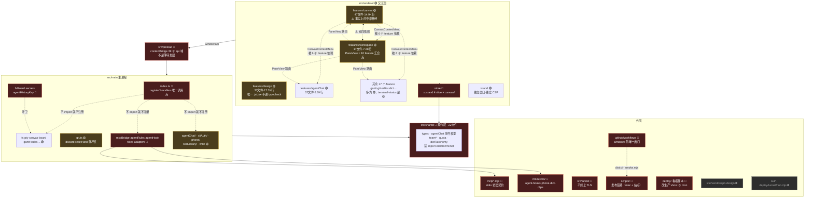

# 10 · 模块领地图（AI 工程地图）

> **这是 agent 进入本仓库要读的第一份文件。** 动手前先在这张图上找到自己在哪块地。
> **更新触发**：新增目录 · 重构目录 · 新增禁区 · 新增高耦合点 · 新增文档链接。
> **与代码同一个 commit 提交。**
>
> 维护人全项目均为 **Biily**（独立开发者，无多人分工）—— 所以"维护人"这一列没有信息量，
> 换成更有用的 **责任域** 与 **改动风险等级**。

## 风险等级图例

| 标记 | 含义 | 动手前要做什么 |
|---|---|---|
| 🟢 | 常规业务代码 | 照常改 |
| 🟡 | 高耦合 / 有性能约束 | 先全局搜引用，读文件头注释 |
| 🔴 | 安全边界 / 跨进程契约 / 历史修复 / 直接动生产机 | **先读 [03-3B](03-agent角色边界.md#3b--开发期-agent你的边界)**，改动要在 commit 里说明理由 |
| ⛔ | 分发产物 / 构建输出 | **不要手改**，去源头改 |

## 全局领地图

## 领地明细

> **「规模」口径**：目录内**全部文件**的文件数 / 行数（`find <dir> -type f | xargs wc -l`），
> 含 `.ts` `.tsx` `.js` `.jsx` `.css` 与测试文件。
> 全渲染层只有 `features/design` 有非 TypeScript 源码，别只数 ts/tsx 就下结论。

### 渲染层 `src/renderer/`

| 目录 | 规模 | 责任域 | 风险 | 关联 MCP 工具 | 备注 |
|---|---|---|---|---|---|
| `features/design` | 37 / 17.7K | 设计模块节点（Konva 设计 + 关键帧动效双模式） | 🟡 | — | 行数上最大，但**只有 `DesignNode.tsx` + `design.css` 是本仓库原生**；`composer/` 是 35 文件 17.5K 行（`.js`/`.jsx` 占 15.4K，其余是 CSS），整体移植自 taptv（见 `composer/index.jsx` 头注释：`cp -r` + `sed dc__→uc__`）。三个坑见下方耦合警报 §5 |
| `features/canvas` | 47 / 14.9K | 无限画布、Frame、节点、抽屉 | 🟡 | `canvas_*` 全部（14 个） | **TypeScript 侧最大块，也是事实上的公共层**（design 行数更多但那是移植来的独立子系统），见下方耦合警报 |
| `features/agentChat` | 32 / 8.6K | AI 对话面板、审批卡、CLI 登录 | 🟢 | `team_*` 间接 | 逻辑与视图分离度高，纯函数各配 `.test.ts` |
| `features/workspace` | 17 / 7.2K | 应用外壳、侧栏、PaneView 路由 | 🟡 | — | `PaneView.tsx` 汇合 10 个 feature（含 lazy 的 dict/wiki），新增面板类型必改 |
| `features/gantt` | 8 / 3.5K | 甘特视图（第 4 种 ViewMode） | 🟢 | — | 有 collector 被 terminal/agentChat 复用 |
| `features/terminal` | 10 / 2.6K | xterm 挂载、密钥徽章、路径链接 | 🟡 | — | xterm 实例跨 ViewMode 共享，**绝不能重挂载** |
| `features/phone` | 8 / 1.8K | **电脑侧**配对面板与取数（PhonePanel / collect / qr） | 🟢 | — | **不是手机上看到的那个页面** —— 那是 `resources/phone/index.html` |
| `features/team` | 12 / 1.8K | 多 agent 团队面板（只读态） | 🟢 | `team_status` | — |
| `features/status` | 10 / 1.5K | 状态机、待办、运行监控 | 🟡 | `todo_list`、`notify` | `RunMonitor.tsx` 有方向性事故史 |
| `features/git` | 5 / 1.5K | 分支图/历史 + 暂存/丢弃/回退 | 🟡 | — | `SidebarGit.tsx` / `HistoryView.tsx` 里的 `requestConfirm` 弹窗是 `git:discard` / `git:resetHard` 的**唯一护栏**，不得移除；新增入口照抄 |
| `features/dict` | 6 / 1.4K | 术语辞典 | 🟢 | `dict_add` | 走 lazy 进 PaneView（内联 SVG bundle 368KB） |
| `features/editor` `board` `wiki` `image` `files` `web` `voice` `notify` `quota` `chat` | 各 < 1.4K | 各自单一职责 | 🟢 | `wiki_*` | `wiki` 同样走 lazy |
| `store/` | 25 / 5.0K | zustand 单 store 4 slice | 🔴 | — | 撤销栈 / persist 有硬约束，见 [03-3B](03-agent角色边界.md#3b--开发期-agent你的边界) |
| `island/` | 6 / 1.5K | 灵动岛独立窗口 | 🟢 | — | 独立 CSP，**不共享主窗口 React 树**；配套 preload 是 `src/preload/island.ts` |
| `ui/` `styles/` | 14 文件 | 纯 UI 原子 | 🟢 | — | `ui/` 13 + `styles/` 1，**没承担起公共层职责**（见耦合警报） |

### 主进程 `src/main/`

| 分组 | 文件 | 责任域 | 风险 |
|---|---|---|---|
| **入口与装配** | `index.ts` | 窗口生命周期 + **所有 `register*Handlers()` 的唯一调用点**；注册顺序有硬依赖，见 [02 启动顺序](02-分层架构.md#启动顺序硬依赖打乱是静默失效而非报错) | 🔴 |
| **安全边界** | `fsGuard.ts` `secrets.ts` `agentHistoryKey.ts` | 渲染层/外部传入路径的写白名单 · 密钥柜 · 路径穿越防线 | 🔴 |
| **Agent 生态** | `mcpBridge.ts` `agentRules.ts` `rulesRefresh.ts` `agentHook.ts` `agentSkill.ts` `agentInstall.ts` `agent.ts` `roles.ts` `cliContract*.ts` `plugins.ts` `mcpOptOut.ts` `statusline*.ts` | 对外部 CLI 的全部接口（`agent.ts` 是 CLI 探测：`agent:probe` / `agent:codexServers`，不碰 PTY） | 🔴 |
| **终端与进程** | `pty.ts` `probeEnv.ts` `probePath.ts` `termTail.ts` | PTY 创建、env 注入（**密钥 `secretsEnv` 的唯一出口**；MCP token 走 `mcpBridge.ts` 的 `mcpEnv()`，**有两个调用点**：`pty.ts`（终端）和 `agentChat/session.ts`（AI 对话会话）—— 改函数体两边同时生效，但在**调用点**加开关/条件/审计，只改一处必漏） | 🔴 |
| **版本控制** | `git.ts` | git 状态/历史 + **两条破坏性写通道**：`git:discard`（`checkout --` 覆盖已跟踪文件、未跟踪文件进废纸篓）与 `git:resetHard`。**它们不过 fsGuard**（git 子命令按 cwd 写，guardPath 不适用），安全性只靠渲染层的确认弹窗兜底 | 🟡 |
| **文件与项目** | `fs.ts` `projects.ts` `projectPaths.ts` `session.ts` `sessionPaths.ts` `teamWorktreeOps.ts` | 文件树 IPC、项目列表、git worktree 实操（写码 agent 的隔离靠它成立） | 🟡 |
| **数据持久化** | `canvas.ts` `board.ts` `gantt.ts` `todos.ts` `prefs.ts` `dict.ts` `dictClips.ts` `snapshot.ts` `snapshotPaths.ts` `agentHistory.ts` | 各自独立 JSON 落盘（写 `userData`，**不过 guardPath**，理由见下表「一种持久化数据」） | 🟢 |
| **系统集成** | `island.ts` `stt.ts` `bizone.ts` `design.ts` `pasteImages.ts` `gpuInfo.ts` `ipcProfiler.ts` | OS 能力接入（灵动岛窗口 / 语音 / 画板 / 设计导出 / 粘贴图片 / GPU 信息）+ 本地 IPC 耗时埋点 —— `ipcProfiler.ts` **不联网**，别按名字把它当遥测 | 🟢 |
| **更新遥测** | `updater.ts` `telemetry.ts` `quotaStore.ts` `quotaApi.ts` | 更新 / 遥测 / 额度的出站集中在这里，**但不是全仓唯一出站**：另有 `stt.ts`（下载语音模型，`hf-mirror.com`，**裸 `fetch` 无超时**）、`bizone.ts`（查画板版本 `bzone.biily.top/version.json`，有 2.5s abort）、`phone/tunnelClient.ts`（`tls.connect` 连 `eas.biily.top:8443`）。改超时 / 代理 / 离线开关 / 隐私声明，四处都要动，见 [01](01-系统上下文.md) | 🟡 |
| **子域** | `agentChat/`(32) `cliAuth/`(13) `phone/`(13) `skillLibrary/`(14) `wiki/`(10) | 各自完整子系统。**`cliAuth/` 另有两条硬约束**：登录预检不得 await 进 `agentChat:start`（那个 handler 的同步性是承重的），且登录 `spawn` 跑在用户**真实**的 `~/.claude` / `~/.codex` 上——测登录前先设 `CLAUDE_CONFIG_DIR` / `CODEX_HOME` 隔离（已发生过清空真实凭证的事故） | 🟡 |
| **遗留清理** | `legacyDshCleanup.ts` | 清 0.4.27–0.4.30 残留，只删不写 | 🟢 |

### 外围

| 路径 | 责任域 | 风险 | 说明 |
|---|---|---|---|
| `src/shared/` | 主/渲染契约层 | 🔴 | **禁 import electron/fs/net**，要能 `node --test` |
| `src/preload/` | 渲染层拿到主进程能力的唯一闸口 | 🔴 | `index.ts` 1045 行 / contextBridge 暴露 39 个 api 域（含 `secrets` `pty` `fs` `shell`）。**不是薄转发层**：pty 首批输出缓冲（`PENDING_MAX_BYTES` + pty 自退出时的 `stopBuffering`，删了会内存涨到崩且无任何报错）、agentChat 常驻事件监听器（模块加载期就挂，改成「start() 之后再订阅」会丢掉最早的事件）。另有 `island.ts`（56 行）是**第二份刻意最小化**的 preload，只给灵动岛用——别与 `index.ts` 合并、别给它挂全量 api。类型经 `renderer/src/api.d.ts` 的 `import type { Api }` 派生 |
| `src/tunnel/` | 隧道服务端（部署到服务器） | 🔴 | 不终止 TLS 是红线 |
| `mcp/` | 2 个 stdio 入口（`eas-mcp` / `bizone-mcp`）+ 1 个 shell 命令（`eas-secret`，走 HTTP 到 mcpBridge，见 [11](11-MCP工具网络.md)） | 🔴 | 改字段格式 → 用户已注册的旧配置连不上 |
| `resources/agent-hooks/` | 注入用户 CLI 的独立 Node 进程脚本：`eas-pretooluse.mjs`（审批钩子）· `eas-statusline.mjs`（额度回传）· `responseBody.mjs` | 🔴 | **跨进程契约**，与 `agentChat/session.ts` 的 `hookScriptPath()`、`mcpBridge.ts` 的 `/agent-approval/*`、`approvalRoute.ts` 的 `hookResponseBody()` 成对，改一边必改另一边；`scripts/verify-agent-chat.mjs` 会静态校验，改坏了 CI 直接红 |
| `resources/phone/index.html` | **手机端整页 UI**（39KB 单文件，纯内联零依赖、自带 `default-src 'none'` 的 CSP） | 🟡 | 手机上看到的界面就是这一个文件；`src/main/phone/server.ts` 的 `pageFile()` 每次请求读盘直发，**不经 vite、不参与 renderer 构建，改完直接生效**。别引任何外部依赖（CSP 会让它在手机上静默失效），别删 `__EAS_BUILD__` 占位符（手机靠它轮询自重载，删了用户长期跑旧 JS） |
| `resources/dict-clips/` | 辞典动效词条 hover 播的实录短片（138 段 webm，约 12MB） | 🟢 | 别手工录，用 `scripts/dict-clips/record.mjs`，规则见该目录 README；主进程读取在 `dictClips.ts` |
| `resources/models/` | 语音识别模型（sherpa-onnx，302MB） | 🟢 | **唯一不在 `extraResources` 里的 resources 子目录**：只有 dev 从这里读，打包版首次使用时下到 `userData/models`（见 `stt.ts` 的候选目录顺序）。别照 agent-hooks 的样子给它加打包项，包体会涨 300MB |
| `hooks/scan-commit.mjs` | 提交即复盘钩子（PostToolUse） | 🟡 | **手写源文件，这里就是源头**；经 `package.json` 的 `extraResources`（`from: hooks`）打包进 app，`src/main/agentHook.ts` 打包态读 `Resources/hooks/`、开发态读 `app.getAppPath()/hooks/`。改它 = 改所有用户机器上钩子的行为 |
| `hooks/dictionary-bundle.json` | 钩子自带的词典快照（242 条） | 🟡 | 冻结快照，仓库内**无生成脚本**（`generatedFrom` 里写的源文件在本仓库不存在）。**不要**从 `features/dict/dictionary-bundle.json`（381 条、结构不同）拷贝或加构建步骤生成——两份是各自独立维护的 |
| `skills/` | 分发给用户 CLI 的 skill 源文件 | 🟡 | 改这里 = 改用户机器上 agent 的行为；已装的那份由 `rulesRefresh.ts` 在启动时更新 |
| `scripts/` | 18 个构建/发布/校验脚本（mac 打包 + 站点/隧道发布） | 🔴 | 发布脚本关系到 5 个生产站 |
| `.github/workflows/build.yml` | **Windows 包的唯一构建出口**（mac 走本地 `npm run dist`） | 🔴 | 它硬编码了三样东西，改任一处必须同步改它：`npm run dist:ci`、`node scripts/smoke.mjs`（`smoke.mjs` 的唯一调用者）、产物路径 `release/win-unpacked/Eas-Term.exe`（= `productName` + `directories.output`）。改产品名/输出目录/升 node，本地 mac 全绿、只有 Windows 侧才炸。runner 固定 `windows-2022` 不许升 |
| `tools/` | `approval-check.mjs` 是审批解析器的**唯一测试**（`node tools/approval-check.mjs`），另有图标 SVG 与渲染脚本 | 🟡 | 它**不在 `npm test` 的 glob 里**，改 `features/terminal/approvalParse.ts` 后必须手跑 |
| `build/` | afterPack / notarize / 图标 | 🔴 | 签名与公证 |
| `site/` | 营销站 | 🟡 | `site/vendor/spb-design/` 是 ⛔ 分发产物 |
| `deploy/tunnel/hub.mjs` | 隧道构建产物 | ⛔ | 手改无效；改 `src/tunnel/main.ts`，由 `scripts/publish-tunnel.sh` 的 esbuild 重新生成（那个脚本会顺带 scp + 重启 pm2 + 比对 6 个生产站，是一次完整发布，不是本地重打） |
| `deploy/` 其余（`eas-stats.py` · `install-dashboard.sh` · `dashboard/`） | 官网数据看板，**手写源码、仓库唯一一份** | 🔴 | 装/改都动生产机：改宝塔 vhost `eas.biily.top.conf`、写 crontab、写 logrotate。动手前先 `bash deploy/install-dashboard.sh --check`（脚本幂等、自动备份 `.bak.*`、只 `nginx -t` 不 reload）。`eas-stats.py` 必须兼容服务器的 Python 3.6.8（无 `fromisoformat`、无 dict `\|`）。**`deploy/` 不是纯产物目录，禁止整目录清理重建**——重打包只写回 `tunnel/hub.mjs` |
| `docs/` | 35 个方案与评审 HTML（根目录）+ 本目录 | 🟢 | 新增评审页放根目录，架构图纸放 `architecture/` |
| `memory/` | 9 条踩坑档案 | 🟢 | 风格：现象→根因→修复→教训，`[[wikilink]]` 互链 |
| `.plans/` | 多 agent 产出目录 | 🟢 | 每个角色一个子目录，放 `findings.md` |
| `out/` `release/` `node_modules/` | 构建产物 | ⛔ | — |

> **打包坑**：`mcp/` `skills/` `hooks/` `resources/agent-hooks/` `resources/dict-clips/` `resources/phone/`
> 六项随 `package.json` 的 `build.extraResources` 分发，其中 `resources/*` 三项的 `to` **去掉了 `resources/` 前缀**
> （代码里拼的是 `process.resourcesPath` + `'agent-hooks'`/`'phone'`/`'dict-clips'`）。
> 改 `to` 必须同步改所有 `resourcesPath` 拼接处，否则 **dev 正常、打包后静默失效**。
> 另注意区分：`hooks/` 是 git 提交扫描 + 词典包，`resources/agent-hooks/` 才是 Claude Code 的
> PreToolUse / statusline 钩子，两者都随包分发但用途无关。

## ⚠️ 耦合警报（改动前必看）

### 1. `features/canvas/CanvasContextMenu.tsx` —— 违章建筑

被 **agentChat / workspace(3处) / terminal / gantt / files / git** 六个 feature 依赖，
但**不都是在用那个菜单组件**：agentChat · workspace/`Sidebar.tsx` · terminal · files · git
用组件本身；workspace/`ModeSwitch.tsx` 与 gantt 只拿 `useMenuAnchor` / `useDismiss`
（gantt 刻意不复用组件本体——文件头写了理由：`.canvas-ctxmenu` 的 z-index 比甘特浮层低）；
workspace/`projectMenu.ts` 只 import 类型 `CanvasMenuItem`。
**它本该在 `ui/`，实际长在 canvas 里。** 5 个导出（`CanvasContextMenu` · `useMenuAnchor` ·
`useDismiss` · `CanvasMenuItem` · `MenuHeader`）全是对外 API，动哪个都要全量
`grep -r CanvasContextMenu src/renderer`。

> 想重构？把它挪进 `ui/` 是正确方向，但那是一次独立的重构，别在别的改动里顺手做。

### 2. canvas ↔ workspace 双向依赖（近似循环）

`canvas → workspace`（`projectMenu.ts`）；`workspace → canvas`（大量）。
canvas 还依赖 editor / web / status / files / voice，并经 `components/registry.tsx`
依赖 git / team / design。

### 3. `features/workspace/PaneView.tsx` —— 面板路由中枢

静态 import 了 terminal / editor(CodeView+DiffView) / image / git / chat / agentChat / web / canvas；
另 **lazy import 了 dict / wiki**（`lazy()` + `<Suspense>`）—— 共汇合 **10 个 feature**。
**新增一种面板类型必须改它。重的面板照 dict/wiki 走 lazy**
（辞典 242 词条的内联 SVG bundle 有 368KB，静态 import 会进主包）。

### 4. `src/renderer/src/layout.ts` —— 共享 leaf 契约

`PaneKind = terminal | code | image | history | chat | agent | dict | web | wiki`。
这些 leaf 在 split / canvas / board 三种 ViewMode 间**共享同一份实例**
（绝对定位保证 xterm 永不重挂载）。

### 5. `features/design/composer/` —— 移植来的独立子系统

`.js` / `.jsx` 15.4K 行，整体从 taptv 的 DesignComposer / MotionComposer `cp -r` 过来。
三条不能忽略的性质：

- **不进类型检查**：`tsconfig.web.json` 里 `checkJs: false`，仓库也没有 eslint ——
  `npm run typecheck` / `npm run check` 对这里的调用错误、未定义变量一律不报。
  **全绿 ≠ 没坏**，改完必须按 open-app-verify 真机验证（15.4K 行只有一个 49 行 `restored.test.mjs`）。
- **自己的 store**：`designer/store.js`、`animate/store.js` 是**独立 zustand store**，
  不走 `src/renderer/src/store/` 那 4 个 slice。
- **存档有 schema 版本链**：加字段 / 改结构必须同步 `composer/_shared/composerStateMigration.js`
  的 `SCHEMA_VERSIONS` 与迁移步骤（文件头有 4 步清单），漏了旧存档**静默丢数据**。

单文件最大 `designer/KonvaCanvas.jsx` 3013 行、`animate/AnimateView.jsx` 2843 行。
产物导出到项目 `demo/`。

## 新增东西要改哪些文件（AI 最常问的问题）

| 想加什么 | 改这几处 |
|---|---|
| **一种画布组件节点** | 只写一个 `CanvasComponentDef` push 进 `features/canvas/components/registry.tsx` 的 `CANVAS_COMPONENTS`。**无需改其它文件**（协议见 `docs/画布组件协议.html`） |
| **一种共享面板类型（leaf）** | ① `layout.ts` 的 `PaneKind` 联合类型 ② `store/tabsSlice.ts` 的 `setPaneKind` 穷尽匹配（编译器会挡）③ `features/workspace/PaneView.tsx` **两处**：`KIND_OPTIONS` 下拉选项数组 + 底部 `pane.kind === …` 的渲染分支链，**编译器两处都挡不住**。漏前者＝面板存在但下拉框里选不出来（`agent` 曾因此在画布上建不出来，见 `docs/superpowers/rulings/2026-08-15-对话界面-裁定.md`）；漏后者＝切过去一片空白。 注：新类型**不一定**要进 `KIND_OPTIONS`（`history` 就故意不在，靠侧栏「版本」进；`dict` 在画布模式下被过滤掉）——但要显式决定并写清入口，不是默默不加。同文件的 `KIND_LABEL` 是 `Record<PaneKind, …>`，编译器会挡，不用记 |
| **一个 MCP 工具** | ① `mcp/eas-mcp.mjs` 的 schema ② `src/renderer/src/mcpHandler.ts` 的执行体 ③ 长等待的话，`LONG_WAITS` **两处**都要加 ④ 更新 [11-MCP工具网络.md](11-MCP工具网络.md) |
| **一个 skill 分类能力** | **四处同步**：`mcp/eas-mcp.mjs` schema + `mcpHandler.ts` 执行 + `skillLibrary/index.ts` 落盘（IPC + `saveConfig` + `skippedLocked`）与 `skillLibrary/category.ts` 校验（`validateCategoryBatch`，有单测）+ `.claude/skills/skill-organizer/SKILL.md` 说明 |
| **一个 IPC 通道** | ① `src/main/<域>.ts` 的 handler ② **新建域文件时**：在 `src/main/index.ts` 里 `import` 并在 `whenReady()` 内调用 `register<域>Handlers()` —— **编译器挡不住**（通道名是字符串，preload 与 main 无类型关联），漏了照样编译通过，运行时渲染层一调就是 `No handler registered for 'xxx'`；往已有域里加通道则无需改 `index.ts`，但注册顺序另有硬约束见 [02](02-分层架构.md#启动顺序硬依赖打乱是静默失效而非报错) ③ `src/preload/index.ts` 的 `api.<域>.*` ④ **路径来自渲染层/外部（webview、MCP 桥、手机端）的写操作必须过 `guardPath`/`guardDir`**，边界只有「`projects.json` 里的项目根 + 知识库根」（`src/main/fsGuard.ts`）。两类例外别硬套见下 |
| **一种持久化数据** | 在 `userData` 下开**独立 JSON 文件**，别塞进现有大文件（坏一个不牵连其余）。**这类 handler 不走 `guardPath`** —— userData 不在任何项目根或知识库根下，加了会被直接拒，而这些 handler 多半吞掉写失败（`prefs.ts` 的 catch 是空的），症状是**功能静默不落盘** |
| **设计模块的一种图形 / 一个可持久化属性** | ① `features/design/composer/designer/store.js`（或 `animate/store.js`）② `KonvaCanvas.jsx` 渲染分支 ③ **`composer/_shared/composerStateMigration.js` 的 `SCHEMA_VERSIONS` 与迁移链** —— 漏了旧存档静默丢字段，且这块不进 typecheck |
| **一个新的 AI CLI 适配** | 读 `.claude/skills/agent-onboarding/SKILL.md`，它是专门的检查清单 |

> **`guardPath` 的两类例外**（不是漏加，是刻意的）：
> ① 写 `userData` 下自家 JSON 的 handler（`canvas.ts` / `prefs.ts` / `todos.ts` / `board.ts` /
> `gantt.ts` / `quotaStore.ts`）——理由见上表「一种持久化数据」；
> ② `skillLibrary/write.ts` 有一套**更窄**的自有边界 `skillWriteRoots()`（只允许已登记 skill 目录
> + `<项目>/.claude/skills`），论证写在 `skillLibrary/index.ts` 与 `write.ts` 的文件头。
>
> 另有一处**已知缺口**，别当可参照的写法：`design.ts` 的 `design:exportToDemo` 收的是渲染层传来的
> `projectPath`，却只对 filename 做了 `path.basename`，`projectPath` 本身没过 `guardDir` ——
> 按上面这条规则它是要补的。
