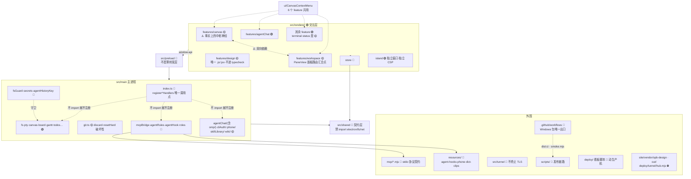

# 10 · 模块领地图（AI 工程地图 · 索引）

> **这是 agent 进入本仓库要读的第一份文件。** 动手前先在这张图上找到自己在哪块地。
> **更新触发**：新增目录 · 重构目录 · 新增禁区 · 新增高耦合点 · 新增文档链接。**与代码同一个 commit 提交。** **就地改对应分册里那一节，不要在本文件首尾追加带日期的段落**（本文件是每个 agent 的必读，涨一行所有人都多付一行）。
> **风险等级**：🟢 常规业务代码，照常改 · 🟡 高耦合 / 有性能约束，先全局搜引用、读文件头注释 ·
> 🔴 安全边界 / 跨进程契约 / 历史修复 / 直接动生产机，**先读
> [03-3B](03-agent角色边界.md#3b--开发期-agent你的边界)** 且改动要在 commit 里说明理由 ·
> ⛔ 分发产物 / 构建输出，**不要手改**，去源头改。

## 分册导航

| 分册 | 内容 | 什么时候读 |
|---|---|---|
| **本文件** | 全局领地图 · 耦合警报 · 新增东西要改哪些文件 · 专题记录索引 | **必读** |
| [10a · 渲染层](10a-领地明细-渲染层.md) | `src/renderer/` 各 feature 与 store 的领地明细 | 改渲染层时 |
| [10b · 主进程](10b-领地明细-主进程.md) | `src/main/` 各模块的领地明细 | 改主进程时 |
| [10c · 外围](10c-领地明细-外围.md) | mcp / resources / scripts / CI / site / tunnel | 改外围时 |
| [10d · 专题记录](10d-专题记录.md) | 按功能的导航补充（原先首尾追加的带日期段落） | 改到下面「专题记录索引」里列出的功能或文件时 |

## 全局领地图

```mermaid
graph TB
    subgraph R["src/renderer 🟢 交互层"]
        CV["features/canvas 🟡<br/>⚠️ 事实上的中枢神经"]
        DS["features/design 🟡<br/>唯一 .js/.jsx·不进 typecheck"]
        AC["features/agentChat 🟢"]
        WS["features/workspace 🟡<br/>PaneView 面板路由汇合点"]
        OT["其余 feature 🟢<br/>terminal·status 是 🟡"]
        ST["store 🔴"]
        ISL["island 🟢 独立窗口·独立 CSP"]
    end
    SH["src/shared 🔴 契约层<br/>禁 import electron/fs/net"]
    PL["src/preload 🔴<br/>不是薄转发层"]
    subgraph M["src/main 主进程"]
        IDX["index.ts 🔴<br/>register*Handlers 唯一调用点"]
        SEC["fsGuard·secrets·agentHistoryKey 🔴"]
        CAP["fs·pty·canvas·board·gantt·todos… 🟢"]
        GIT["git.ts 🟡 discard·resetHard 破坏性"]
        ECO["mcpBridge·agentRules·agentHook·roles 🔴"]
        SUB["agentChat/(含 omp/)·cliAuth/·phone/<br/>skillLibrary/·wiki/ 🟡"]
    end
    subgraph X["外围"]
        MCP["mcp/*.mjs 🔴 stdio 协议契约"]
        RES["resources/ 🔴<br/>agent-hooks·phone·dict-clips"]
        TUN["src/tunnel 🔴 不终止 TLS"]
        SCR["scripts/ 🔴 发布链路"]
        CI[".github/workflows 🔴<br/>Windows 包唯一出口"]
        DASH["deploy/ 看板脚本 🔴 动生产机"]
        FRZ["site/vendor/spb-design · out/<br/>deploy/tunnel/hub.mjs ⛔"]
    end
    UIL["ui/CanvasContextMenu<br/>6 个 feature 共用"] -.-> AC & WS & OT & CV
    CV <-.->|"⚠️ 双向依赖"| WS
    R --> ST --> SH
    R -->|"window.api"| PL --> M
    M --> SH
    IDX -.->|"不 import 就不注册"| CAP & ECO & SUB
    ECO --> MCP & RES
    SEC -.->|"守卫"| CAP
    CI -.->|"dist:ci · smoke.mjs"| SCR
```

## ⚠️ 耦合警报（改动前必看）

### 1. canvas 的两条耦合

- **`ui/CanvasContextMenu.tsx` 是六个 feature 的共用件**（2026-08-31 从 `features/canvas/` 搬来）：被 agentChat / workspace(3 处) / terminal / gantt / files / git 依赖，但**不都在用组件本体** —— workspace/`ModeSwitch.tsx` 与 gantt 只拿 `useMenuAnchor` / `useDismiss`（gantt **刻意不复用组件本体**，文件头写了理由：`.canvas-ctxmenu` 的 z-index 比甘特浮层低），workspace/`projectMenu.ts` 只 import 类型。它的导出全是对外 API，动哪个都要全量 `grep -r CanvasContextMenu src/renderer`。
  **组件 2026-08-31 搬进 `ui/`，样式 2026-09-01 跟着搬进 `styles/base.css`**（跟 Tooltip 的 `.app-tooltip`、ConfirmDialog 的 `.confirm-*` 放一起，那是 `ui/` 组件样式的既有落点）。原来样式留在 `canvas.css` 还能生效，靠的是「`App.tsx` 无条件 import `CanvasStage` → 它无条件 import `canvas.css`」这条**巧合而非设计**的链路。
  **刻意没动的两样**：① 组件名保留 `Canvas` 前缀；② CSS 类名 `.canvas-ctxmenu` 一个字不改 —— 它有四处按它做**逻辑判断**（`menuOwnership.ts` 的 `OVERLAY_SELECTOR`、`CanvasDrawer`、`CanvasWikiDrawer`、`menuOwnership.test.ts`），改名后右键弹错菜单、点菜单关掉抽屉，且只有那一条测试会喊。排期第 3 步就是改名，结论是**非必要不做**。
- **canvas ↔ workspace 双向依赖（近似循环）**：`canvas → workspace`（`projectMenu.ts`）；`workspace → canvas`（大量）。canvas 还依赖 editor / web / status / files / voice，并经 `components/registry.tsx` 依赖 git / team / design。

### 2. 面板路由与共享 leaf

- **`features/workspace/PaneView.tsx` 是路由中枢**：静态 import terminal / editor(CodeView+DiffView) / image / git / chat / agentChat / web / canvas，另 **lazy import 了 dict / wiki**（`lazy()` + `<Suspense>`）。**新增一种面板类型必须改它；重的面板照 dict/wiki 走 lazy**（辞典的内联 SVG bundle 有 368KB，静态 import 会进主包）。
- **`src/renderer/src/layout.ts` 是共享 leaf 契约**：`PaneKind` 里的这些 leaf 在 split / canvas / board 三种 ViewMode 间**共享同一份实例**（绝对定位保证 xterm 永不重挂载）。

### 3. `features/design/composer/` —— 移植来的独立子系统

整体从 taptv 的 DesignComposer / MotionComposer `cp -r` 过来，三条不能忽略的性质：

- **不进类型检查**：`tsconfig.web.json` 里 `checkJs: false`，仓库也没有 eslint —— `npm run typecheck` / `npm run check` 对这里的调用错误、未定义变量一律不报。**全绿 ≠ 没坏**，改完必须按 open-app-verify 真机验证（这么大一块只有一个 `restored.test.mjs`）。
- **自己的 store**：`designer/store.js`、`animate/store.js` 是**独立 zustand store**，不走 `src/renderer/src/store/` 的那些 slice。
- **存档有 schema 版本链**：加字段 / 改结构必须同步 `composer/_shared/composerStateMigration.js` 的 `SCHEMA_VERSIONS` 与迁移步骤（文件头有 4 步清单），漏了旧存档**静默丢数据**。

## 新增东西要改哪些文件（AI 最常问的问题）

| 想加什么 | 改这几处 |
|---|---|
| **一种画布组件节点** | 只写一个 `CanvasComponentDef` push 进 `features/canvas/components/registry.tsx` 的 `CANVAS_COMPONENTS`。**无需改其它文件**（协议见 `docs/画布组件协议.html`） |
| **一种共享面板类型（leaf）** | ① `layout.ts` 的 `PaneKind` 联合类型 ② `store/tabsSlice.ts` 的 `setPaneKind` 穷尽匹配（编译器会挡）③ `features/workspace/PaneView.tsx` **两处**：`KIND_OPTIONS` 下拉选项数组 + 底部 `pane.kind === …` 的渲染分支链，**编译器两处都挡不住**。漏前者＝面板存在但下拉框里选不出来（`agent` 曾因此在画布上建不出来，见 `docs/superpowers/rulings/2026-08-15-对话界面-裁定.md`）；漏后者＝切过去一片空白。 注：新类型**不一定**要进 `KIND_OPTIONS`（`history` 就故意不在，靠侧栏「版本」进；`dict` 在画布模式下被过滤掉）——但要显式决定并写清入口，不是默默不加 |
| **一个 MCP 工具** | ① `mcp/eas-mcp.mjs` 的 schema ② `src/renderer/src/mcpHandler.ts` 的执行体 ③ 长等待的话，`LONG_WAITS` **两处**都要加 ④ 更新 [11-MCP工具网络.md](11-MCP工具网络.md) |
| **一个 skill 分类能力** | **四处同步**：`mcp/eas-mcp.mjs` schema + `mcpHandler.ts` 执行 + `skillLibrary/index.ts` 落盘（IPC + `saveConfig` + `skippedLocked`）与 `skillLibrary/category.ts` 校验（`validateCategoryBatch`，有单测）+ `.claude/skills/skill-organizer/SKILL.md` 说明 |
| **skill「AI 自动发现」开关**（2026-09-30） | 判定只在 `shared/skillExposure.ts`（面板标签 / `/` 菜单 / 起会话名单共用）；落盘 `skillLibrary/index.ts`（`getExposure` / `setExposeByDefault` / `setExposure`，patch 语义）；扫盘 `skillLibrary/exposure.ts` 的 `hiddenSkillsFor`（同步，`agentChat:start` 里调）；注入 Claude 走**唯一一份** `--settings`（`session.ts` `ensureClaudeSessionSettings`，与写守卫合并）、Codex 走**唯一一个** `skills.config`（`adapters/codex.ts` 去重合并）；新 `StartOpts` 字段要进 `sessionState.effectiveOpts`。见 [13 同步清单](13-所有权矩阵.md#跨文件同步清单改一处必须改另一处) |
| **一个 IPC 通道** | ① `src/main/<域>.ts` 的 handler ② **新建域文件时**：在 `src/main/index.ts` 里 `import` 并在 `whenReady()` 内调用 `register<域>Handlers()` —— **编译器挡不住**（通道名是字符串，preload 与 main 无类型关联），漏了照样编译通过，运行时一调就是 `No handler registered for 'xxx'`；往已有域里加通道则无需改 `index.ts`，但注册顺序另有硬约束见 [02](02-分层架构.md#启动顺序硬依赖打乱是静默失效而非报错) ③ `src/preload/index.ts` 的 `api.<域>.*` ④ **路径来自渲染层/外部（webview、MCP 桥、手机端）的写操作必须过 `guardPath`/`guardDir`**，边界**只有**「`projects.json` 里的项目根 + 知识库根」（`src/main/fsGuard.ts`：其它位置一律拒绝 —— 包括用户 home、系统目录、别的项目的兄弟目录），例外见下 |
| **一种持久化数据** | 在 `userData` 下开**独立 JSON 文件**，别塞进现有大文件（坏一个不牵连其余）。**这类 handler 不走 `guardPath`** —— userData 不在任何项目根或知识库根下，加了会被直接拒，而这些 handler 多半吞掉写失败（`prefs.ts` 的 catch 是空的），症状是**功能静默不落盘** |
| **设计模块的一种图形 / 一个可持久化属性** | ① `features/design/composer/designer/store.js`（或 `animate/store.js`）② `KonvaCanvas.jsx` 渲染分支 ③ **`composer/_shared/composerStateMigration.js` 的 `SCHEMA_VERSIONS` 与迁移链** —— 漏了旧存档静默丢字段，且这块不进 typecheck |
| **一个新的 AI CLI 适配** | 读 `.claude/skills/agent-onboarding/SKILL.md`，它是专门的检查清单 |

> **`guardPath` 的两类例外**（刻意的，不是漏加）：
> ① 写 `userData` 下自家 JSON 的 handler（`canvas.ts` / `prefs.ts` / `todos.ts` / `board.ts` /
> `gantt.ts` / `quotaStore.ts`），理由见上表「一种持久化数据」；
> ② `skillLibrary/write.ts` 有一套**更窄**的自有边界 `skillWriteRoots()`（只允许已登记 skill 目录
> + `<项目>/.claude/skills`），论证写在 `skillLibrary/index.ts` 与 `write.ts` 的文件头。
>
> 另有一处**已知缺口**，别当可参照的写法：`design.ts` 的 `design:exportToDemo` 收的是渲染层传来的
> `projectPath`，却只对 filename 做了 `path.basename`，`projectPath` 本身没过 `guardDir`。

## 专题记录索引（详情在 [10d](10d-专题记录.md)）

> 一行一条：标题 — 涉及的前几个文件或符号。**你要改的文件出现在某一行里，就去 10d 读那一条的全文。**

- 浏览器最大化比例入口（2026-09-28） — `WebView.onZoomChange` · `CanvasFileNode/CanvasFreeFileNode`
- 聊天返回图片与调整方向（2026-09-28） — `agentChat/session.emitEvent` · `chatImages.persistChatEventImages`
- 非ACP调整方向 — `interruptManagedTurn` · `close`
- 后台任务状态（2026-09-28） — `claudeEvents.ts` · `background.tasks`
- 发布工作流（2026-09-26） — `.github/workflows/build.yml` · `draft: true`
- Markdown 阅读强调（2026-09-26） — `features/editor/markdown.ts` · `.md-view`
- 页面观察窗与汇报页联动（2026-09-25） — `canvas_publish_report` · `mcpHandler.ts`
- 对话提问导航性能（2026-09-25） — `agentChat/QuestionNavigator.tsx` · `questionIndex.ts`
- 最大化隐藏画布的装饰动画（2026-09-25） — `.canvas-world.hidden-by-max` · `visibility:hidden`
- 停靠卡片层级（2026-09-28） — `planDockPlacement.ts` · `planDockZ`
- Git 历史分页（2026-09-25） — `HistoryView` · `git:log(cwd, 50, skip)`
- Codex 路由超时安全恢复（2026-09-23，开发分支；当晚上限调整为 5 次） — `mcp/codex-task-recovery.mjs` · `workspace routing discovery timed out`
- 设计选型台 CDN（2026-09-12） — `features/dict/design-previews.json` · `https://design.biily.top/cdn-mirror/template-kits/`
- Git 历史操作（2026-09-08） — `main/gitHistory.ts` · `git:historyAction`
- AI 分屏（2026-09-08） — `store/tabsSlice.ts` · `splitLeaf`
- 空 Frame 选 CLI（2026-09-22） — `FrameStart` · `addAgentNode`
- 创作参考入口（2026-09-22） — `DictBubbleToggle` · `CanvasDictBubble`
- 创作参考词条列表（2026-09-23） — `dict/dict.css` · `.dict-list`
- 密钥弹窗色彩（2026-09-23） — `workspace.css` · `.vault-backdrop`
- 交互展开反馈（2026-09-22） — `ui/motion/MotionDisclosure.tsx` · `disclosurePresence.ts`
- 全局 hover 气泡（2026-09-23） — `ui/Tooltip.tsx` · `[data-tip]`
- 像素团子吉祥物（2026-09-28） — `ui/mascot/dangoGrid.ts` · `Dango.tsx`
- CLI 自动更新（2026-09-07，用户要求默认关闭） — `main/cliUpdates/manager.ts` · `packages.ts`
- 界面多语言（2026-09-29，英文适配 P0） — `src/shared/i18n/` · `dict/<区域>.zh.ts|.en.ts`
- 发布台插件 P1–P3（2026-09-29～30）＋分屏（10-02） — `resources/plugins/publish-desk/` · `panel/clipboard.write` · `panel/split.open` · `shared/panelHostActions.ts` · `store/canvas/applySplit.ts` · `lexicon/*.json` · `lib/media.mjs`
- 2026-09-07：AI 对话目录与资源 — `.app.split-mode` · `ui/CliBrandIcon.tsx`
- 0.4.83 发版修复 — `main/phone/identity.ts` · `identity.test.ts`
- 2026-09-07：Review 02 输入候选 — `features/agentChat/SlashPicker.tsx` · `composerCandidates.ts`
- 2026-09-07：正文引用 chip 与悬停预览 — `ComposerInput.tsx` · `composerReferences.ts`
- Computer Use 生命周期发布边界（2026-09-07）
- 2026-09-07：导航移动与 Codex 续发时序 — `sessionState.planSend` · `session.deliverMessage`
- 对话待发送队列（2026-09-07） — `agentChat/messageQueue.ts` · `useMessageQueue.ts`
- 内置能力插件改造（进行中） — `shared/builtinCapabilities.ts` · `main/capabilitySnapshot.ts`
- 内置能力改造补充导航（2026-09-08，未发版） — `capabilityPreferences` · `capabilityBundlePaths`
- 2026-09-08：Windows 官方 npm CLI 入口 — `mcp/cli-entry.mjs` · `src/main/cliInvocation.ts`
- 2026-09-08 · OMP 原生登录与输入光标 — `shared/ompLogin.ts` · `main/agentChat/omp/login.ts`
- 2026-09-08：OMP Google 项目配置失败提示 — `omp/loginParse.ts` · `requires setting ... GOOGLE_CLOUD_PROJECT`
- 2026-09-08：Codex 调整方向后工具编号隔离 — `codexEvents.ts` · `thread.started`
- 2026-09-08：OMP ACP 空目录防护 — `omp/transport.ts`
- 2026-09-08：OMP 登录误关闭防护与原生验证进度 — `shared/ompLogin.ts` · `OmpSetupPanel`
- 2026-09-08：图片预览统一 FIFO（待下次发版） — `mcpHandler` · `addFileNode → capContent → nodesToEvict`
- 2026-09-08 浏览器收藏实施第一批
- 浏览器收藏完成接线（2026-09-09） — `shared/browserFavorites.ts` · `main/browserFavorites.ts`
- 2026-09-09 语音输入链路 — `features/voice/voiceTarget.ts` · `voiceRouter.ts`
- 2026-09-09 OMP 调整方向的取消轮次边界 — `agentChat/omp/transport.ts` · `redirect.real.test.ts`
- 2026-09-09 Frame 新建模块紧凑选址 — `canvas/layout.ts` · `placeNodeInFrame`
- 更多 / 项目用量（2026-09-10） — `main/usage/core.ts` · `storage.ts`
- 设置层级导航（2026-09-10） — `runtime`
- 2026-09-10 后台数据/视觉预算 — `features/terminal/writeScheduler.ts` · `ui/motion/useBackgroundVisuals.ts`
- 2026-09-10 密钥柜主从布局
- 2026-09-10 亮色配色微调
- 2026-09-10 画布会话节点固定标题
- 2026-09-10 23:30 统一画布会话外壳（覆盖内缩方案）
- 2026-09-11 测试运行资源边界
- 2026-09-11 甘特图异常中断显示策略
- 2026-09-11 · 终端自定义背景文字对比度
- 2026-09-11 · 密钥柜会话通行证（待最终交互验收） — `secretShim.ts` · `agentSecretEnv.ts`
- 2026-09-11 · 密钥柜Popup V2 — `VaultGate.tsx` · `vault-backdrop`
- 2026-09-11 验收修复接线 — `features/workspace/secretRequest.ts` · `features/canvas/artifactRefresh.ts`
- 2026-09-12 辞典设计选型台 — `features/dict/DesignPicker.tsx` · `design-systems.json`
- 2026-09-12 设计选型台界面类型
- 2026-09-12 完整设计规范接入
- 2026-09-12 设计选型台分类标签 — `dsp-filters`
- 2026-09-12 设计规范入口增强
- 2026-09-12 对话归档改造（进行中） — `agentHistoryStorage.ts` · `agentHistoryKey.ts`
- 2026-09-13 历史 UI 实际接线（覆盖上文“UI 未接入”状态）
- 2026-09-13 确认按钮统一 CTA
- 2026-09-13 分屏 AI 窄屏（覆盖分屏 640px 限制） — `src/main/runtime/cpuMetrics.ts` · `runtime/sampler.ts`
- 2026-09-16 时间线插件（开发分支） — `resources/plugins/timeline/` · `lib/store.mjs`
- 2026-09-17 Frame 插入入口 — `CanvasFilePicker.tsx` · `filePickerMode.ts`
- 2026-09-17 亮色 Frame 标题栏 — `canvas.css` · `.cframe-head`
- 2026-09-17 AI 返回图片 — `shared/chatImages.ts` · `main/agentChat/toolResult.ts`
- 2026-09-18 发布集成
- 2026-09-18 插件统一接入：兼容性第一阶段（实现中） — `shared/pluginCompatibility.ts` · `main/pluginCompatibility.ts`
- 2026-09-18 OAuth 宿主连接链路（尚未广告能力） — `pluginManifest` · `PluginInfo.remote`
- 2026-09-18 配置连接测试与撤销 — `pluginConnections/configurationLeases.ts` · `pluginConfiguration`
- Word连接器开发候选（2026-09-18） — `plugins-store/word`
- 插件设置独立面板（2026-09-18） — `.pm-cact` · `.pm-setting-entry`
- 2026-09-18 Word 矩形表格增量
- 2026-09-18 动态 OAuth 真实宿主接线 — `PluginInfo.remote.oauth` · `pluginManifest`
- 网页抓取插件（2026-09-18） — `plugins-store/web-fetch`
- Excel 基础插件（2026-09-18）
- PowerPoint 基础插件（2026-09-21）
- 天气插件（2026-09-21）
- 高德地图插件（2026-09-21）
- Excel原定功能补齐中的依赖资格验证（2026-09-21） — `scripts/excel-engine/` · `plugins-store/excel`
- Excel引擎父进程适配（2026-09-21，未接入正式插件） — `scripts/excel-engine/worker.mjs` · `scripts/verify-excel-worker.mjs`
- 2026-09-22 WPS 三件套验收补充 — `scripts/excel-engine/engine.go` · `pivot_caption_test.go`
- 2026-09-18 全局时间线内核（尚未接线） — `timeline/lib/global.mjs` · `capture.mjs`
- 2026-09-18 全局时间线接线
- 2026-09-18 插件更新/卸载生命周期修复 — `pluginLifecycle.ts` · `pluginHost.retirePlugin`
- Codex 原生目标生命周期（2026-09-18） — `taskLifecycle: true` · `session.ts`
- 画布平移第一阶段（2026-09-21，12闲置对话场景已验收） — `.eas-market-source.json`
- 2026-09-22 时间线独立化 — `pluginMigration.ts` · `registerPluginHandlers`
- 2026-09-22 设计选型源码引用 — `dict:designSource` · `designSource.ts`
- 2026-09-22 插件任务不进入全局等待队列 — `pluginHost.acquire` · `bizoneHosted`
- 2026-09-23 辞典位置蓝图与分屏空态 — `DictView` · `blueprintGeometry.ts`
- CLI 安装引导（2026-09-22） — `\r` · `\n`
- 2026-09-23 看板项目右键快速归区 — `features/board/BoardStage.tsx` · `board/moveMenu.ts`
- 0.4.106 辞典渐进披露与蓝图定位
- 2026-09-23 蓝图中性底图 — `dict.css`
- 2026-09-23 蓝图可辨识线框图 — `BlueprintDiagram` · `BlueprintPanel`
- 2026-09-24 · AI 对话用量口径与本地审计 — `Usage.inputIncludesCached` · `chatStats`
- 2026-09-21 灵动岛只显示最终回答 — `main/session.ts` · `finalAnswers`
- 2026-09-21 灵动岛模块／会话／轮次精确归属 — `features/status/islandResults.ts` · `useIslandFeed.ts`
- 2026-09-24 · 时间轴初始问题与插件面板鼠标边界 — `originalQuestion` · `timeline_record`
- 2026-09-26 交互准入压力分级 — `runtime/controller.ts` · `critical`
- 2026-09-26 未投递恢复与按需内存诊断 — `agentChat/session.ts` · `runtimePendingMessage`
- 2026-09-27 无账号内存持续验证脚本 — `scripts/verify-memory-soak.mjs` · `verify-memory-window.mjs`
- 2026-09-27 驻留归因诊断边界 — `verify-memory-components.mjs` · `verify-widget-lifecycle.mjs`
- 2026-09-27 原生分类/引擎对照诊断 — `verify-memory-components.mjs --native-map/--memory-dump/--pressure-probe` · `verify-engine-ab.mjs`
- 2026-09-27 图片比例复位命中区 — `.civ-zoom` · `onPointerDown`
- 2026-09-27 · 发布审查 CLI dispatch 联合修复 — `agentChat/session.ts` · `runtime/manager.ts`
- 2026-09-27 · 内置能力验收 profile 清理 — `scripts/lib/verification-cleanup.mjs` · `scripts/verify-builtin-capabilities.mjs`
- 2026-09-27 任务清单固定模块锚点 — `PlanCard` · `planDockPlacement.test.ts`
- 新建 AI 对话尺寸（2026-09-27） — `store/canvas/agentNodeSize.ts` · `addAgentNode`
- 高清捕帧发布修复（2026-09-27，覆盖上文nativeImage方案） — `main/livePageCapture.ts` · `Page.captureScreenshot`
- 2026-09-27 发布加固（隔离候选）
- 2026-09-27 最新确认（取代前文待确认状态） — `runtime/idleMemoryRecovery` · `idleWindowRecovery`
- Jev 判断台 0.2.0（隔离分支）
- 2026-09-28 用量热力图与本地行为统计 — `shared/activity.ts` · `main/usage/activity.ts`
- 2026-09-28 · 项目菜单运行置顶与新对话高度 — `projectMenuOrder.ts` · `useStatus.projectMenuStatus`
- 2026-09-28 Jev 旧包发布兼容
- 2026-09-28 输入框渐进展示 — `ComposerSettings` · `ComposerPopover`
- 2026-09-29 后台运行中提醒（通知 / 灵动岛） — `attentionPtys` · `ptyApproval`

### 2026-09-28 · Dock图标与灵动岛窗口策略
修复范围仅 `main/island.ts` 的跨桌面选项：`visibleOnFullScreen:true` 保留，新增 `skipTransformProcessType:true`，不改变整个软件的前台应用策略。通知出现/忽略不激活主窗口，点击任务使用既有 `activateAllWindows`＋webContents聚焦并退出灵动岛覆盖层。回归 `islandDockPolicy.test.mjs` 与隔离 `scripts/verify-island-dock.mjs`；不能用 `isVisibleOnAllWorkspaces` 属性检查冒充真实多Space/外部全屏视觉验收。

### macOS 原生通知宿主实验域
`islandNativeHost.ts` 负责所属子进程/超时/stdio；`islandHostProtocol.ts` 负责消息与展示边界；`resources/island-native/Host.swift` 仅 NSPanel/WKWebView/清单资产；bridge.js 不含通用 IPC 权限。生成宿主/清单由 build-island-helper.mjs 管理；Lab 打包入口 build-island-lab.mjs，独立名称、bundle id、profile 和更新门禁。原生进程经 sharedServices notification 登记，实际 close 才释放。

### Island Lab 验收修正（2026-09-28）
Lab 主进程保留系统 `HOME`，否则 macOS 默认钥匙串查找失败。应用拥有的配置路径统一通过 `applicationHome()`（Lab bootstrap 设置）或 `app.getPath('home')`；不能使用系统 HOME 读取/迁移正式配置。PROBE_ENV、PTY、插件子进程使用隔离 home，系统二进制探测仍可读真实安装目录。验证模式的 Lab profile 单独位于 EAS_ISLAND_LAB_VERIFY_ROOT 下，避免改用户测试数据。通知服务仍登记实际进程生命周期，但 `blocksIdle()` 不把纯通知算作工作；CLI、语言服务、语音与既有恢复安全闸保留。

Lab 首次启动由 islandLabPolicy.initializeLabHome 建立固定 CLI 配置根目录（Codex/Claude/DSH/OMP/XDG），早于任何探测模块求路径。不从继承环境取写入目标，不拷贝或覆盖既有凭证；重复启动只补缺失目录。主进程系统 HOME 仍不修改。

原生岛故障恢复：islandRecovery 提供主进程单次3秒重算，不依赖最小化 renderer 的下一次状态事件；island.ts 的 native onError 调度，destroyIsland 取消。重算仍经过当前 shouldShow/代际窗口引用和3秒节流，不直接激活主窗、不重发CLI请求。
