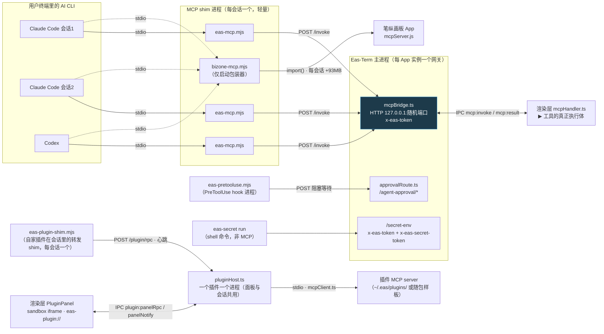

# 11 · MCP 工具网络图

> **更新触发**：增删 MCP 工具 · 改超时 · 改鉴权 · 改注册方式。**与代码同 commit 提交。**

## 网络图

**进程模型**（容易误传，钉死）：

- **shim 每会话一个**（MCP 协议天然行为，非本项目设计），但它们**共享同一个 HTTP 网关**（网关
  每 App 实例一个，端口/token 落盘 `userData/mcp-endpoint.json`）—— **不是每会话一套后端**。
- **例外：`bizone-canvas` 真的是每会话一个进程**（用 `ELECTRON_RUN_AS_NODE`），
  实测每个活跃 MCP 客户端**增量约 93MB**（画板本体一次性共享）。会话开多了要留意内存。

## 三道锁

1. 只监听 `127.0.0.1`
2. 随机 token 经 PTY 环境变量注入（`EAS_TERM_PORT` / `EAS_TERM_TOKEN`）；缺这两个变量时
   `tools/list` 返回空工具面，对外无感。**但不是「只经 env」**：同一个 token 还明文落在
   `userData/mcp-endpoint.json`（权限 0600）供手动配置读取 —— 它是「本机同用户可读」级别的凭证，
   不是每终端独有的密钥（密钥柜另用一张 `x-eas-secret-token`，两张都要过，见 `eas-secret.mjs`）
3. `canvas_open_file` / `canvas_open_html` 有**项目内路径白名单**（防渲染 `~/.ssh`）

## 四道超时闸（分布在三层，不等式必须成立：外层 > 内层）

| 层 | 位置 | 普通 | 长等待 |
|---|---|---|---|
| ① shim http.request timeout | `mcp/eas-mcp.mjs` 的 `CALL_TIMEOUT_MS` | 30s | 15min |
| ② `invokeRenderer` | `src/main/mcpBridge.ts` 的 `LONG_WAITS` 分支 | 15s | 10min |
| ③a 渲染层等待窗口（`team_status` 的 `wait:true`）| `src/renderer/src/mcpHandler.ts` 的 `TEAM_WAIT_MS` | — | 8min |
| ③b 渲染层等待窗口（`team_spawn` 的批次清单等用户点头）| `src/renderer/src/features/team/batchRequest.ts` 的 `WAIT_MS` | — | 9min |

> **③ 是两个独立常量，不是一个**：服务不同工具、值也不同，只按 `batchRequest.ts` 去调
> `team_status` 的超时会改错文件、改错值。不等式要对两条分别成立（8 < 10、9 < 10），动 ② 两处都得回来核。
>
> **`wiki_archive_plan` 虽在 `LONG_WAITS` 里，却没有第 ③ 层** —— `store/uiSlice.ts` 的
> `requestArchivePlan` 只挂 Promise、不带定时器，唯一的闸是 ② 的 10min，那句「已等 10 分钟」也是 ② 发的。
>
> **破坏不等式的症状**：用户看到「连接错误」而不是业务提示。③b 被放大到 ≥10min 更糟：主进程先
> 超时清掉自己那份 pending，用户随后才点「开工」，Frame 被脏标记成「有批次在跑」而实际一个 agent
> 都没起 —— 除非重启 app，这个项目再也派不了活（经过记在 `batchRequest.ts` 的 `WAIT_MS` 注释里）。
>
> **`LONG_WAITS` 在 `eas-mcp.mjs` 与 `mcpBridge.ts` 各存一份，加长等待工具两处都要改。**

## 工具清单

以 `mcp/eas-mcp.mjs` 的 `TOOLS` 为准（前缀即分类：wiki · canvas · team · secret · skill · dict，
另有 `notify` / `todo_list` / `board_read` / `board_note` / `merge_preflight` / `repo_impact`），真正的执行体在渲染层 `mcpHandler.ts`。
`tools/list` 不做任何过滤 —— 缺 `EAS_TERM_PORT`/`TOKEN` 时整份返回空，否则全量对外可见。

已知这几条从名字推不出来（不保证穷尽，改工具时自己再看一眼 `TOOLS`）：

| 工具 | 反直觉处 |
|---|---|
| `team_spawn` ⏳ | **五道闸**见 [03](03-agent角色边界.md)。`agents[].role_id` 可选 —— `checkBatch` 拿**当前角色卡的 id 列表**校验，对不上号**整批拒**（不是忽略），填了就走 `openAgentPane({ roleId })` |
| `team_dissolve` | 停整批、报产出，但**不清理 worktree**（读 `.plans/<role>/findings.md`）|
| `secret_check` | **只回有无，不回值**（`src/main/secrets.ts`）|
| `skill_categorize` | 只写分类配置，**不碰 skill 文件本身** |
| `dict_add` | 逐条校验，可拒收 |
| `wiki_archive_plan` ⏳ | **阻塞等用户**在弹窗里确认 |
| `canvas_snapshot` | 截图落盘到项目 `screenshot/` |
| `board_read`（角色工作流 P1）| **先 `refresh` 再 `read`**（`main/collabBoard.ts` 现算 + 落盘 `.eas/board.md`），拿到的板文永远是这一次算出来的；返回 `{ board, note?, path, ledgers? }`，`path` 已 `projectRootOf()` 归一到项目根 + `BOARD_REL`（不归一的话角色会话拿到的是它那棵 worktree 底下一个不存在的路径）。**可选入参 `ledgers: true`**（P3）才带 `ledgers`：`main/branchLedger.ts` 的 `readLedgers` 扫 `.eas/board/` 目录 ∪ 板上分支，每份只留尾部 60 行，按分支名索引；不传就不返回 —— 写码角色每次读板不该为合并官付这份 token。`read` 只在 1 秒内复用刚才那次 `refresh` 算出的 rows（省掉重复跑一整套 git），过期照常重算。数据来源与刷新时机见 [03](03-agent角色边界.md) 协同板段 |
| `board_note`（角色工作流 P3）| 往一条分支的台账 `.eas/board/<branch>.md` 的「## 记录」段**只追加**（`main/branchLedger.ts` 的 `appendNote`，经 `board:note` IPC）。**按调用方 cwd 定位**（`ctx.project`，角色会话在 worktree 里时就是 worktree 路径；故意不用 `resolveFrame` 的项目根 —— 那会把每条分支的记录都写到主工作区）；cwd 在主工作区（没有自己的分支）时**必须带 `branch`**，否则报错。`note` 上限 4000 字截断；`note` 非字符串 / `branch` 传了但非字符串都直接抛错，不静默退回。返回 `{ rel }`。**不在 `LONG_WAITS`**：就是一次追加写 |
| `merge_preflight` ⏳（角色工作流 P2）| **只读，不动工作区**。执行体 `mcpHandler.ts`（定位项目与 `board_read` 同一手法），事实来源 `main/mergeTools.ts`：冲突用 `git merge-tree --write-tree` 算，git < 2.38 时 `conflicts` 为 null 并附 `conflictNote`；撞车清单从协同板反查；`testCmd` 是对象 `{ value, source }` **永不为 null**，`source: 'none'` 才是「没有回归命令」。传入路径经 `projectRootOf()` 归一到项目根 —— 角色会话在 worktree 里调它，算的仍是整个仓库。`changed` 相对**仓库根**；项目注册在仓库子目录时附 `note` |
| `repo_impact` ⏳（角色工作流 P2）| **只读**。执行体 `mcpHandler.ts`，事实来源 `main/mergeTools.ts` 调代码地图的 `analyzeProject` 建图（**取自主干工作区**，不是调用方的 worktree，分支新增文件会落在 `unknown`），**图按项目缓存 5 分钟**（`graphCache`，每次 `preflight` 清掉重算），返回带 `cachedAt`。`dependents.indirect` 只到第二层不是闭包；`suggestedTests` 只认同目录同名 `*.test.*`。路径同样 `projectRootOf()` 归一；项目注册在仓库子目录时（`rev-parse --show-toplevel` ≠ 项目根）**自动剥掉子目录前缀**再查图，所以 `preflight.changed` 可以原样喂进来。渲染层只收非空字符串的 `files`，全滤掉了才报「files 不能为空」 |

⏳ = 在 `LONG_WAITS` 名单里（`merge_preflight` / `repo_impact` 进名单不是因为等人，是**慢**：merge-tree 给了 30s、`analyzeProject` 大仓库几十秒，都超过普通 15s 那道闸）。

> 增删工具时，[README](README.md) 索引表里的「N 个工具」也得手抄一遍，没有校验。
>
> **已移除**：`dict_pending`（`790e476 refactor(dict): 拆掉自动沉淀`）。
> 某个 agent 会话的工具面里还有它 = 会话缓存的旧工具面，不是代码库现状。

## 三个入口为什么拆开（2 个 MCP server + 1 个 shell 命令）

| 文件 | 是什么 / 为什么单独 |
|---|---|
| `mcp/eas-mcp.mjs` | 真正的 MCP server，本项目自身能力（零依赖手写 JSON-RPC，stdio 换行分隔）|
| `mcp/bizone-mcp.mjs` | **启动包装器，不是工具实现**：确保笔纵画板 App 在跑（没开则 `open -g -a`，最多等 12s），然后 `import()` 画板包内的 `mcpServer.js` 把 stdio 交给它。那些工具属于画板自己的代码，本项目不拥有 |
| `mcp/eas-plugin-shim.mjs` | **自家插件的转发 shim**（设计稿 2026-09-05 决定 #2）：harness 起的是它、不是插件本体；`initialize / tools/list / tools/call / resources/read` 原样 POST 到网关 `/plugin/rpc`，网关转给 `pluginHost.ts` 里**唯一**的插件进程。同一把 `x-eas-token`，缺 `EAS_TERM_PORT/TOKEN` 时 `tools/list` 回空（同 eas-mcp.mjs 纪律）。`EAS_PLUGIN` 由 `agent-mcp.json` 写死，`EAS_PROJECT` 塞进 `tools/call` 的 `_meta.eas.context.cwd` |
| `mcp/eas-secret.mjs` | **不是 MCP server，是 shell 命令**：`eas-secret run --group/--vars -- <cmd>` 向 `/secret-env` 取密钥注入子进程 env 后 exec，定位是「给运行中的终端补发凭证」，与 MCP stdio 协议无关。鉴权是在全局 `x-eas-token` **之上再加**一张每个 PTY 独有的 `x-eas-secret-token`（spawn 时下发），**两张都要过** —— 全局 token 每个终端都一样、还明文落在 `mcp-endpoint.json` 里，单靠它等于没门 |

## MCP server 怎么注册进用户的 CLI

| 目标 | 函数 | 写入策略 |
|---|---|---|
| `~/.claude.json` 的 `mcpServers` | `writeClaudeConfig()` | JSON 解析失败/结构异常时**绝不写**；写前备份 `.eas-backup` |
| `~/.codex/config.toml` 的 `[mcp_servers.eas-term]` | `writeCodexConfig()` / `writeCodexSection()` | 无 TOML 库，**逐行扫描定位替换**，不解析整份文件（避免丢注释） |
| App 内 AI 对话节点专用 | `agentMcpConfigPath(pluginId?)` | 生成 `agent-mcp.json` 配合 `--strict-mcp-config`，**只含 `eas-term` + `bizone-canvas` + 用户选中的一个插件** —— 插件过多会把系统提示词撑爆 |

- 安装时机：`registerMcpBridge()` 的 `listen` 回调里调 `setupAgents()`；
  **开发环境（`!app.isPackaged`）默认跳过**写全局配置，避免污染用户日常使用的打包版配置。
- opt-out 记在 `userData/mcp-optout.json`，`removeMcpConfig()` 一键移除并记 opt-out；
  `purgeLegacyDshMcp()` 清 0.4.27–0.4.30 误写进 DeepSeek Harness 的配置。
- **角色边界在 Codex 上**：内置工具走 `--disable <feature>`（`shell_tool` / `image_generation`，
  2026-09-05 实测前者生效），MCP 走 `-c mcp_servers.<名>.enabled=false`（名字必须存在）；
  `-c` 不校验键名，**写错静默无效**。
- **工具级精确禁用**（2026-09-06 阶段三第二项探针实测）：`-c mcp_servers.<名>.disabled_tools=[…]`
  能把指定工具从模型的工具面前摘掉（判据是延迟工具搜索结果，加了这条之后指定工具名不再
  出现，不是问模型"你还有这个工具吗"）。**只认精确工具名的数组，不认通配**——
  `caps.mcp.denyTools` 里写得出确切工具名的条目（`<server>__<tool>`）才会落成这条 `-c`，
  通配条目仍走上面那条按 server 名整个 `enabled=false` 的老路（`roleBinding.ts` 的
  `codexDisabledToolsArg()`）。**命名差异要注意**：Codex 给 MCP 工具的名字是
  `mcp__<server>.<tool>`（点号分隔），Claude 是 `mcp__<server>__<tool>`（双下划线）——
  两边的 deny 写法字面上长得像但分隔符不同，抄错会静默不匹配。
  ⚠️ 同 `skills.config` 一样，这条 `-c` 是**整键覆盖**用户 `~/.codex/config.toml` 里同一个
  server 已有的 `disabled_tools`，不是追加。
- **系统 skill 按路径禁用**（2026-09-06 阶段三探针）：Codex 内置 `image_gen` 本机实测从未
  进过工具清单，模型自称有的「imagegen 工具」其实是系统 skill
  `$CODEX_HOME/skills/.system/imagegen/SKILL.md`；真正摘掉它要走
  `-c 'skills.config=[{path="<SKILL.md 完整路径>",enabled=false}]'` ——
  **路径必须是 `SKILL.md` 文件的完整路径，写目录无效**（实测过）。
  ⚠️ **这个 `-c` 是整体覆盖用户 `~/.codex/config.toml` 里的 `skills.config`，不是追加** ——
  用户自己手写的 skills.config 会被这条一并冲掉，Eas-Term 没有做读用户配置合并。

## 契约红线

- `mcp/*.mjs` 的字段格式 —— 改了，用户 `~/.claude.json` 里已注册的旧配置连不上
- **插件面板协议的方法名只在 `src/shared/pluginProtocol.ts`**（以 `@modelcontextprotocol/ext-apps` 1.7.5 核对：协议 `2026-01-26`、`_meta["ui/resourceUri"]`、`text/html;profile=mcp-app`）；渲染层 `appsProtocol.ts` 与主进程 `pluginHost.ts` 都从它 import，规范再变只改那一处
- `/plugin/rpc` 只接受 `initialize / tools/list / tools/call / resources/read|list`；面板桥的 `eas/canvas.call` 只透传 `CANVAS_CALL_ALLOWLIST` ∩ 清单声明的工具，执行仍走 `invokeRenderer`（同一路径白名单）—— **不许绕过它直接给插件网关 token**
- `LONG_WAITS` 两处必须一致；四道超时闸的不等式不能破（③ 是两个独立常量，别只改一个）
- `approvalRoute.ts` 的 `hookResponseBody()` ↔ `resources/agent-hooks/responseBody.mjs`：
  跨进程无法 import，**两处注释互相钉死，改一处必须改另一处**；
  `APPROVAL_TIMEOUT_MS` ↔ hook 脚本里的 `FETCH_TIMEOUT_MS` 同理

## 内置能力装配改造进行中

AI 对话工作台：会话 owner → `capabilitySessionEnv` → CLI 显式配置 → `eas-capability-shim.mjs` → `/capability/rpc`（独立租约鉴权）→ 现有 pluginHost 内置绑定 → `invokeRenderer`。旧全局 token 不授权新路由；工具调用体的 ctx/_meta 不参与权限定位。`EAS_TERM_PORT`、`EAS_CAPABILITY_LEASE` 按变量名转发，不把凭证写进 argv/配置。旧业务插件暂仍转发 `EAS_TERM_TOKEN`、`EAS_PTY_ID`、`EAS_PROJECT`、`EAS_TEAM_ROLE`。

PTY：`capabilityPtyEnv` 给 shell 父租约；app-owned PATH 入口 → `eas-pty-launcher` → `/capability/launch` 按实际 cwd 发子租约。启动 CLI 前清除父租约和旧全局工作台授权；CLI 退出仅关闭自己的子租约，PTY 退出递归撤销全部所属租约。zsh 的 zshrc/zlogin 都保持入口优先。任意绝对路径/用户 alias 绕过 PATH、Windows cmd 原生 CLI、profile-v2 等尚有未完成边界，不能宣称验收通过。

工具 schema 从 `mcp/workbench-tools.json` 读取，旧 stdio 入口保持外部终端零工具的行为。基础/业务服务器在 Codex 的每次 restart 前重新合并 knownMcpServers，保留 enabled=false/disabled_tools。Claude/omp JSON 使用不可变会话快照。

内置服务共享同一个 HostRegistry；保留 key 不能被普通清单占用。每个 shim 有独立 connectionId，每个在飞工具有内部独立引用；close 只释放该连接，撤销 owner 释放其连接但不杀已发出的任务。读取请求体、等待目录及笔纵后端就绪之后重新认证，避免撤销后才开始执行。

轻量 shim 每 15 秒心跳，宿主借已有 sweep 回收超过 45 秒失联的连接引用；在飞调用引用等 finally 才释放。心跳不重放工具。Codex 的受管启动器用原生 app-server config/read 合并用户指引/禁用数组，探针失败不执行模型；PTY 用户参数与受管参数分开传递。omp PTY 用原生 `-e` 标准插件入口，MCP 名带 `eas-capabilities:` 前缀，实际 Frame 仍从租约解析。

验证：`capabilityTransport.test.ts` 执行真实网关路由、Node HTTP 与 stdio shim（执行体为隔离夹具）；不等于正式包三 CLI 模型调用。正式验收和剩余迁移见 builtin-capabilities 计划。

### 内置笔纵连接器生产装配（2026-09-08）

托管会话的 `bizone-canvas` 与 workbench 共用 `eas-capability-shim.mjs`，仅传当前租约和网关端口，由 `EAS_CAPABILITY_MODULE=bizone` 选择模块。`mcpBridge` 在既有 `builtinCapabilityHost` 注册 `createBizoneHosted`；底层仍是 pluginHost 的同一个 HostRegistry，不增加独立插件宿主。旧 `bizone-mcp.mjs` 仅保留给显式全局配置兼容路径。

`bizoneHosted.ts` 将 `createBizoneRuntime`、官方包内 MCP 的 `McpClient`、`createBizoneConnector`、持久化 `createBizoneGenerationGuard` 串接起来。目录握手不启动 GUI；真正调用前才检查本地服务，端口/令牌 revision 改变后重建官方客户端。NodeRunner 支持 Dock 精简 PATH 和内置 Electron 回退；子进程只继承环境白名单及本地认证文件路径，不传 Eas 租约、模型密钥。MCP 就绪仅代表工具目录握手成功，不代表已登录模型账户或完成生成。

Mac 只接受 `/Applications` 和用户 `Applications` 下验证了官方脚本、可执行文件及 SDK 依赖的安装。Windows 通过 Electron `getApplicationInfoForProtocol('bzone://')` 只读发现已注册处理器的可执行文件路径，严格验证邻接 `resources/app/package.json` 的 name/main/type 及正式 server/main/SDK，不执行注册命令串、不猜便携 ZIP 解压位置。启动时异步预读；首次工具目录握手和调用都等待发现，避免首会话因缓存未就绪漏工具。无注册或验证失败显示缺失。模块偏好及租约授权继续由网关统一执行，生成防重复由持久化 guard 执行，不会因 reconnect 自动重放调用。

Selected native stdio servers now share the same base-plus-selected snapshot across AI adapters; credentials stay in app-owned 0600 snapshots rather than argv. Remote business servers preserve existing native behavior: Claude receives the original config, Codex retains native/global registration, and OMP reports unsupported remote entries. This is compatibility preservation, not a new three-CLI remote transport.

## 2026-09-08 · 工具行为注解与安全图片预览

共享目录 `mcp/workbench-tools.json` 现为 38 项，旧 stdio 与受管宿主均保留 MCP annotations。注解描述执行体实际行为，不覆盖 CLI 审批策略、用户禁用或权限：查询工具标只读；本地追加/视口操作标非只读、非破坏、closed-world；删改、团队执行和外部浏览保持限制。`canvas_snapshot` 可能按已存偏好不可撤销清标记，不能标为非破坏；`board_read` 会刷新派生台账，不标只读。

旧 `canvas_open_file` / `canvas_open_html` 能加载可执行网页，且内容限额会驱逐旧节点，仍标 `destructiveHint:true, openWorldHint:true`。不能为绕过 Codex `approval_policy=never` 拒绝而伪造安全元数据。

新增 `canvas_open_image` 是受限替代：仅项目内 PNG/JPEG/GIF/WebP/BMP/ICO/AVIF，不接受 SVG/HTML/视频/外部网址。`fs:validateRasterImage` → `main/rasterImage.ts` 校验 guardPath/guardDir、真实路径属于当前会话项目、大小与文件头（不是完整图片解码保证）；renderer 在 IO 后重新确认租约 Frame 和当前容量，然后同步新增图片节点，满额拒绝且不驱逐。它明确是画布写操作：`readOnlyHint:false, destructiveHint:false, openWorldHint:false`，未声称幂等。普通业务插件 canvas 白名单不扩大。

回归：`workbenchSchema.test.ts` 通过实际 stdio initialize/tools/list 验证公共目录和注解；`rasterImage.test.ts` 验证真实文件、跨项目软链与格式；`canvasOpenImage.test.ts` 执行生产 handler 分支，覆盖异步验证后的容量/身份变化。正式包 CLI 调用证据由发布验收另行记录。

## OMP PTY 配置与账号目录（2026-09-08）

`/capability/launch` 的 OMP 分支先经 `prepareOmpPtyConfig` 核对执行体真实路径等于随包 OMP，再复用 `writeManagedConfig` 写 app-owned 配置。返回给 PTY 的仅是 `HOME / PI_CONFIG_DIR / PI_CODING_AGENT_DIR / OMP_SKIP_SETUP` 四个路由值和该次能力租约，不返回主进程完整环境或 API key。认证仍由 OMP 在同一 `<userData>/omp/agent` 读取，审批档位仍取应用设置，未重置用户 `~/.omp`。

`eas-pty-launcher` 仅对 OMP 清除继承的 profile / XDG / 旧目录覆盖，再叠加上述四项；保留终端原有用户 secrets。显式 `--profile` / `--session-dir` 会脱离受管认证/会话目录，目前明确拒绝。自定义 OMP 执行体不能获得受管目录配置。`ompBaseEnv` 顺序必须是先删继承配置、后写受管绝对目录；反过来会把刚设的 `PI_CODING_AGENT_DIR` 删除。

验证包含真实 launcher 子进程环境、生产 HTTP route 分支、完整 OMP paths/launch 回归、应用保存的 always-ask 档位保持及用户 `.omp` 文件未变；真实正式包 PTY 模型/恢复测试另由发布 runner 提供证据。
