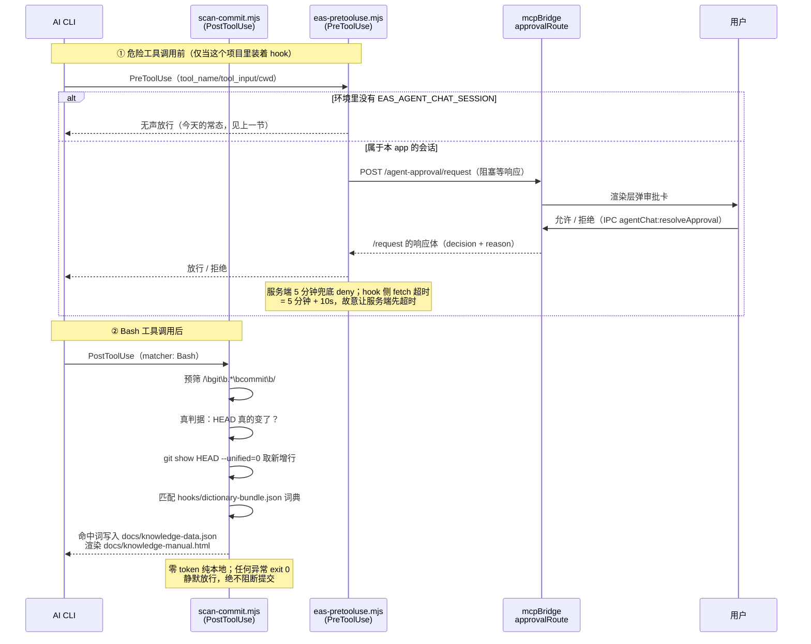

# 12 · Skill + Hooks 流程图

> **更新触发**：新增注入面 · 改 skill 内容 · 改 hook 时机 · 改托管区围栏格式。
> 这张图管的是**本 app 往用户机器上写什么**——写错了症状是"agent 忽然不听话"，且极难查。

## 六个注入面

本 app 通过 **6 个面**改用户机器上 AI CLI 的行为。每个面都有明确的**托管区机制**，
保证只动自己那部分、不碰用户内容。

```mermaid
graph TB
    APP["Eas-Term"]

    subgraph CLAUDE["Claude Code 的家 ~/.claude*"]
        A1["~/.claude.json<br/>mcpServers 段"]
        A2["~/.claude/skills/eas-term/<br/>整目录 · chmod 444"]
        A3["~/.claude/settings.json<br/>hooks.PostToolUse"]
        A5["~/.claude/settings.json<br/>statusLine.command"]
    end

    subgraph PROJ["用户项目根 &lt;cwd&gt;（逐项目一份 · 过 fsGuard）"]
        P1["&lt;cwd&gt;/.claude/settings.json<br/>hooks.PreToolUse"]
    end

    subgraph CODEX["Codex 的家 ~/.codex"]
        B1["config.toml<br/>[mcp_servers.eas-term]"]
        B2["AGENTS.md<br/>begin/end 围栏内"]
        B3["hooks.json"]
    end

    subgraph WIKI["用户知识库根目录"]
        W1["CLAUDE.md / AGENTS.md<br/>wiki-schema 围栏内"]
        W2[".eas-wiki.json<br/>taxonomy 配置"]
    end

    APP -->|"mcpBridge.ts<br/>writeClaudeConfig"| A1
    APP -->|"mcpBridge.ts<br/>writeCodexConfig"| B1
    APP -->|"agentRules.ts<br/>syncRules · writeDistributed"| A2
    APP -->|"agentRules.ts<br/>syncRules（围栏）"| B2
    APP -->|"agentHook.ts<br/>install（_easTerm 标记）"| A3 & B3
    APP -->|"agentChat/session.ts<br/>installApprovalHook（今天只剩手机端那条路会写）"| P1
    APP -->|"statuslineInstall.ts"| A5
    APP -->|"wiki/schema.ts<br/>initWiki · upgradeSchemaFile"| W1 & W2

    classDef fenced fill:#1d3a4a,stroke:#3498db,color:#fff
    class A2,B2,W1 fenced
```

| # | 注入面 | 写到哪 | 负责文件 | 何时写 | 托管区机制 |
|---|---|---|---|---|---|
| 1 | **MCP 注册** | `~/.claude.json` / `~/.codex/config.toml` | `mcpBridge.ts` | 检测到 CLI 就自动配 | 按 server 名整段替换，不动其余 server |
| 2 | **使用指引** | Claude → `~/.claude/skills/eas-term/*.md`（整目录） Codex → `~/.codex/AGENTS.md` 内一段 | `agentRules.ts` | 面板点安装/同步；**启动时自动 refresh 已装的**（`rulesRefresh.ts`，只更新不新装） | Claude 侧写完 `chmod 444`（分发产物） Codex 侧 `<!-- eas-term:begin -->…end -->` 围栏 |
| 3 | **提交钩子** | `~/.claude/settings.json` PostToolUse / `~/.codex/hooks.json` | `agentHook.ts` | **用户显式点安装**（侵入性最高，需显式同意） | `_easTerm` 字段认领自己那条；写前备份 `.eas-backup`；`findForeign()` 识别用户手配的同款避免重复 |
| 4 | **审批钩子** | `<cwd>/.claude/settings.json` PreToolUse —— **项目级，一个项目一份，不在 `~/.claude/`**（`hookConfigPath()`）| `agentChat/session.ts`（装/卸，写前过 `guardPath`）+ `agentChat/hookInstall.ts`（合并规划，纯函数不落盘）+ `resources/agent-hooks/eas-pretooluse.mjs`（脚本本体）| 见下方「审批：两条路」——桌面对话已经不装，手机端起的会话仍会装 | 只往 matcher `*` 的分组里放自己那条；`guardPath` 拦住不在已注册项目/知识库内的 cwd；靠 `EAS_AGENT_CHAT_SESSION` 环境变量认领归属，**没有这个变量的会话一律无声放行** |
| 5 | **statusline** | `~/.claude/settings.json` statusLine | `statuslineInstall.ts` + `eas-statusline.mjs` | 开启额度显示时 | `_easTerm`/`_easWrapped` 标记，**卸载时把原命令原样放回** |
| 6 | **知识库约定** | 知识库根 `CLAUDE.md`/`AGENTS.md`、`.eas-wiki.json` | `wiki/schema.ts` | 建库/升级时 | `<!-- eas-term:wiki-schema:begin v4 -->` 围栏，围栏外用户随便写 |

> **遗留清理**：`agentRules.ts` 仍保留对 0.4.27–0.4.30 版 DeepSeek Harness（`~/.dsh/AGENTS.md`）
> 与旧 `eas-wiki` skill 目录的清理逻辑 —— **只删不写**。

### 审批：两条路，今天默认走软的那条

| | 硬拦截（PreToolUse hook） | 软约定（伪无头） |
|---|---|---|
| 机制 | 进程真停在那儿等人点，模型绕不过去 | 把 `ASK_FIRST_PROMPT` 附进系统提示，让模型自己先说打算 |
| 代价 | 要往**用户自己的项目**里写 `.claude/settings.json`，每次工具调用打断一次 | **不写任何文件**；但靠模型自愿遵守，没有任何机制保证 |

桌面对话入口现在恒 `skipApprovalHook: true`（`AgentChatView.tsx`），走软的那条。
**但「不再装 hook」不是绝对的**：手机端新建对话那次 `start()`（`phone/provider.ts`）
没带这个标志，`restartAndDeliver` 于是照旧调 `installApprovalHook()`，把 hook 写进那个项目。

⚠️ **装了 ≠ 会拦**。`approvalEnv()` 只在 `skipApprovalHook === false` 时才注入
`EAS_AGENT_CHAT_SESSION`，而今天没有任何调用方传 `false` —— 所以现存的 hook 一律走无声放行。
这条判据是 2026-08-31 那个 bug 的修法：用户在设置里关掉「先问再做」却照样跳审批，
根因是**旧版本装进他仓库的 hook 还在**，而标记当时无条件注入。缺省按「不打标记」处理，
是因为放行才是安全的默认（老会话记录里没有这个字段，倒过来判会把它们全拦上）。
**卸掉旧 hook 的唯一入口是把那个开关关一次**（`SettingsPanel.tsx` 的 `toggleApprovalHook`
逐个已注册项目调 `hookUninstall`）—— 界面上再没有别处能卸它。

## 核心设计：常驻区只放指针，正文按需读盘

`syncRules` 的文件头记着这条教训，**新增注入内容时必须遵守**：

> 曾经把完整 SKILL.md 全文塞进 `AGENTS.md`，导致该文件 3306 字符里 **3284 字符（99%）**
> 是画板说明 —— **每次对话都要为此付 token**。

现在的做法：常驻区（Codex 的 AGENTS.md 段）只放**触发条件 + 路径指针**，
正文放 `~/.eas/agent/*.md` 按需读盘。

## Hook 时序

下面两条 hook（外加 statusline 那个转发脚本）**互不相关、各自独立机制**，不存在"编排顺序"：

> `scan-commit.mjs` 在 **2026-08-31 已阉割**"自动补全词条到待办"那半
> （归类靠猜、产不出示意图、花用户没看到的钱），现在只做"记录本次用到了哪些已收录概念"。

## Skill 体系

### 本项目分发给用户的：`skills/eas-term/`

渐进式披露 —— `SKILL.md` 是入口（触发条件写在 frontmatter description 里的 **A–F 六种情境**），
细节分 6 个文件按需读：

| 文件 | 教 agent 做什么 |
|---|---|
| `SKILL.md` | 六种触发情境：生图 / 送到画布 / 凭证卡住 / 重建知识库 / 插件缺失 / 辞典加词。**纯读代码调试不触发** |
| `canvas.md` | 画布工具场景对照表（何时用 `open_html`/`open_url`/`add_note`/`tidy_frame`） |
| `secrets.md` | 密钥三步：`secret_check` → `request_secret` → 用完 `report_secret_invalid`。**绝不让密钥进对话** |
| `generate.md`（352 行，最长） | 生图/视频完整流程。2026-08-26 起吞并了已卸载的 `bizone-canvas` skill 全部内容，**是画板路径唯一说明文档** |
| `plugins.md` | 插件是"工具+提示词"不是界面；先查装没装，装了**只给命令不代跑** |
| `dict.md` | 辞典加词五步（定分类→补结构→做示意图→写提示词→`dict_add`），**每步须停下确认** |
| `wiki-architect.md` | 重建知识库引导，声明"老库不搬不改不删" |

### `skills/team-research/`

触发闸门是 **Frame 标题栏的多 agent 开关**：关着就完全不读。
只含**只读角色**（researcher / reviewer / cross-checker）—— 改代码的活不归它管，避免并发写覆盖。

### `src/main/skillLibrary/` —— 管理用户机器上的 skill

扫描目录：`~/.claude/skills`、`~/.codex/skills`、`~/.claude/design-skills`、`~/.claude/motion-skills`
+ 用户自定义目录 + 各已注册项目的 `<项目>/.claude/skills`。

**四条已拍板的边界**（`skillLibrary/README.md`）：

1. 只写自己的配置 `userData/skills.json`，**分类和禁用都不碰用户 skill 文件本身**
2. **禁用只写清单，CLI 仍会加载** —— 这是展示层功能，不改变任何 CLI 行为
3. 唯一真正写用户 skill 目录的操作是"复制"（`write.ts` 的 `copySkillDir`），
   有专属窄边界 `skillWriteRoots`，**重名一律拒绝，不覆盖不改名**
4. **分类口子四处一起维护**（逐字对齐 `README.md` 那张表）：`mcp/eas-mcp.mjs` schema
   + `mcpHandler.ts` 执行 + `skillLibrary/index.ts` 落盘（IPC、`saveConfig` 的 patch 语义、
   `skippedLocked`）与同目录 `category.ts` 校验（`validateCategoryBatch`，有单测）
   + `.claude/skills/skill-organizer/SKILL.md` 说明。**只改 `category.ts` 会漏掉落盘那半。**

## 知识库与辞典

### `src/main/wiki/`

- 路径记在 `userData/wiki.json`
- 内置 8 个顶层目录：`00-inbox` `me` `people` `methods` `domains` `projects` `sources` `_templates`
  （老库有中文名回落表 `LEGACY`）
- **taxonomy 三态判定**（`taxonomy.ts`）：`none` / `valid` / `broken`。
  自定义分类需**恰好一个** `role:"inbox"`，可选一个 `role:"templates"`，可选多个 `role:"raw"`
- **配置损坏时绝不回落覆盖** —— 冻结整套归档功能，防止把用户自定义库改写成内置形状
- `index.md` / `START-HERE.md` **只在文件不存在时写**，无升级机制（与围栏文件不同）
- `git.ts` 是唯一的整体撤销机制，提交带 `[eas]` 前缀，`execFileSync` 参数数组防注入

### `src/main/dict.ts`

用户词条存 `~/.eas/dict-user.json`（`version: 2`，`writeUser()` 落盘），
与内置词条**直接拼接**显示（`DictView.tsx` 的 `[...dict.terms, ...userTerms]`，不去重）。
写入走 `dict:add` IPC，五步校验（en / zh / logic≥20字 / category 三选一 / 二级分类校验），
**SVG 走白名单式 sanitize 防 XSS**。
2026-08-31 起删除自动沉淀，`dict-pending.json`/`dict-sink.json` 不再读写但保留旧文件不删。

**内置那份是 `src/renderer/src/features/dict/dictionary-bundle.json`**（Vite 静态 import，
编译期定死）。**条数以它的 `count` / `terms.length` 为准，别信注释**：现为 381 条，而
`dict.ts` / `DictView.tsx` / `types.ts` / `PaneView.tsx` / `README.md` 里那些「内置 242 条」
的说法都停在补齐之前。（`DictView.tsx` 讲 `prompt` 格式的那个 242 不算 ——
381 = 新写的 242 条六段式 + 原有 139 条动效格式。）

> ⚠️ **仓库里有两份同名 bundle，互不同步**：`hooks/dictionary-bundle.json` 是提交钩子
> 自己的副本，`scan-commit.mjs` 的 `loadDict()` **只从脚本同目录读**，辞典气泡永远读不到它。
> 要改界面上看得见的词条，改 renderer 那份；改 `hooks/` 那份只影响提交扫描。
>
> ⚠️ **`dict_add` 的查重集合只由 `readUser()` 构成，不含内置词条** —— 已经在 bundle 里的词
> 再加一次不会被拒，界面上会并排出现两个同名胶囊。所以「加词前查有没有」得自己去
> renderer 那份 bundle 里查，指望不上 `dict_add` 兜底。

## ⛔ 托管区：人和 AI 都不该手改

| 路径 | 原因 |
|---|---|
| `~/.claude/skills/eas-term/*.md`、`~/.eas/agent/*.md` | `writeDistributed()` 写完 `chmod 444`；改坏了 agent 忽然不听话且难查 |
| `~/.codex/AGENTS.md` 的 `eas-term:begin…end` 围栏内 | 每次 syncRules 整段重写 |
| 知识库根 `CLAUDE.md`/`AGENTS.md` 围栏内段 | 升级时重写 |
| 知识库根 `.eas-wiki.json` | 手改错格式 → 判定 broken → **冻结整套归档功能**（不回落，防误改写） |
| `hooks/dictionary-bundle.json`、`hooks/scan-commit.mjs` | app 自带资源，随版本分发；那份 bundle 是**提交钩子的独立副本，不是辞典气泡的数据源**（见上节） |

> `~/.claude/settings.json`、`~/.claude.json`、`~/.codex/config.toml` 是**部分托管**——
> 靠 `_easTerm` 标记只认领自己那一条，用户文件其余部分完全不受影响，也不设只读。
