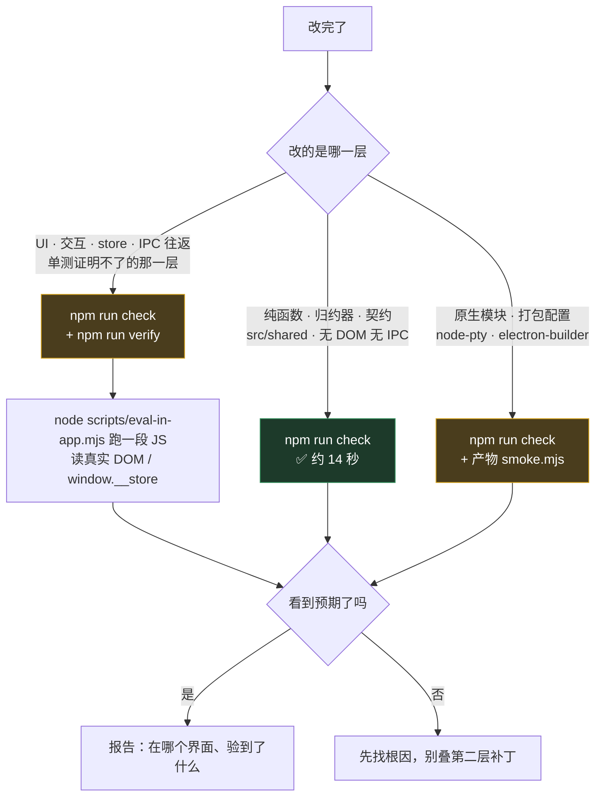

# 14 · 验证与调试（改完怎么证明它真的好了）

> **"代码改了" 不等于 "改好了"。** 这份图纸只回答一个问题：手上这个改动，走哪条验证、怎么走、
> 什么时候可以说"已修复"。
> **更新触发**：改 `scripts/verify-*.mjs` / `check-*.mjs` / `smoke.mjs` · 改 `npm run check` / `verify` 的组成 ·
> 新增调试入口（`window.__*` 之类）· 端口或 target 判据变了。
> **与代码同一个 commit 提交。**

## 风险等级图例

| 标记 | 含义 |
|---|---|
| ✅ | 照做即可 |
| ⚠️ | 有前提条件，看清再用 |
| ❗ | 判据 / 纪律，改动前先想清楚后果 |
| 🚫 | 不要做 |

> 本篇是**流程**文档，故意不用 🟢🟡🔴⛔ —— 那四个符号在
> [10-模块领地图](10-模块领地图.md) 与 [13-所有权矩阵](13-所有权矩阵.md) 里是
> **领地风险等级**（常规 / 高耦合 / 安全边界 / 分发产物），语义不同，混用会误判。

## 先选路



| 通路 | 命令 | 证明了什么 | **证明不了什么** |
|---|---|---|---|
| 静态闸 | `npm run check` | 类型、hook 顺序、CSS 平衡、对比度、1278 条用例 | 界面长什么样、点得动吗、IPC 通不通 |
| 真机验证 | `npm run verify` + `eval-in-app.mjs` | 真实渲染树、真实 IPC 往返、真实 store | 打包签名后的产物行为 |
| 冒烟 | `scripts/smoke.mjs <可执行文件>` | 打出来的包**能跑**（不白屏、preload 桥在、node-pty 能开终端） | 具体功能对不对 |

---

## A · 纯逻辑改动 → `npm run check`

`npm run check` = `typecheck` → 四个 `check-*.mjs` → `npm test`，**串行短路**（前面挂了后面不跑）。
整套本地实测约 14 秒，没有理由跳过。

| 环节 | 盯的是什么 | 为什么值得单独一条 |
|---|---|---|
| `typecheck` | `tsconfig.node.json` + `tsconfig.web.json` 两套各跑一次 | 主进程和渲染层是两套 lib，只跑一套等于漏一半 |
| `check-hooks.mjs` | 组件里的 hook 出现在条件 `return` 之后 | 触发 `Minified React error #300`，**tsc 抓不到**，本项目没有 eslint。用 AST 判同一函数体，不下钻回调 —— 正则版本曾误报 343 处 |
| `check-accent-contrast.mjs` | 实心 `--accent` 底上的亮色前景 | 要同时覆盖字面量、`var(--x, #fff)` 带 fallback、以及全仓库未定义的变量三种写法。当初 grep `color: #fff` 就漏掉了第二种 |
| `check-css-balance.mjs` | CSS 大括号平衡 | 少一个 `}` 的后果不是"那条规则失效"，是**整个 app 变成毛坯房**（Vite 把 CSS 拼成一份，`base.css` 恰好在最后被吞掉）。构建、typecheck、单测全绿 |
| `check-animations.mjs` | `infinite` 动画补间了 `box-shadow` / `background` / `filter` | `infinite` = 开着就永远在烧。实测同一台机器：box-shadow 呼吸 8 秒内样式重算 960 次，opacity 版 25 次 |
| `npm test` | `node --test 'src/**/*.test.ts' 'src/**/*.test.mjs'` | 95 个测试文件（93 个 `.test.ts` + 2 个 `.test.mjs`），本地实测 1278 条用例全绿 |

**跑单个测试**（Node 26 直接吃 `.ts`，类型擦除，不需要任何 loader 或编译步骤）：

```bash
node --test src/shared/quota.test.ts                              # 单个文件
node --test --test-name-pattern="isHot" src/shared/quota.test.ts  # 单条用例（按名字正则）
node --test 'src/main/**/*.test.ts'                               # 一个目录
```

> `src/shared/` 那条"禁 `import electron` / `fs` / `net`"的约束（见 [13-所有权矩阵](13-所有权矩阵.md)）
> 就是为了这条路走得通 —— 契约层必须能被裸 node 直接跑起来。

🚫 **`npm run check` 没有 CI 兜底。** `.github/workflows/build.yml` 只跑 `npm run dist:ci`
（内含 `check-renderer-entries.mjs`）和 `smoke.mjs`，**不跑 check**。本地忘了跑就是没跑。
`npm run build` 也不跑任何检查，它就是一次 `electron-vite build`。

---

## B · UI / IPC 改动 → `npm run verify`

`npm run verify` = `npm run build && node scripts/verify-app.mjs --seed`。
它起的是**构建产物 + 显式隔离的 userData**，不打包、不升版本号。

| 步 | 发生了什么 | 在哪核对 |
|---|---|---|
| 1 | `electron-vite build` 出 `out/{main,preload,renderer}` | `package.json` scripts |
| 2 | `mkdtempSync($TMPDIR/eas-verify-*)` 当 userData | `verify-app.mjs` |
| 3 | `--seed`：按白名单从真实 userData 复制 8 个 json + `agent-history/*.json` | `SEED_WHITELIST` |
| 4 | `spawn(node_modules/.bin/electron, ['.', '--remote-debugging-port=9333', '--user-data-dir=<临时目录>'])`，env 带 `EAS_VERIFY=1` | `verify-app.mjs` |
| 5 | 5 秒后探一次 `/json/list` 报"CDP 就绪" | 同上 |
| 6 | Ctrl-C / 子进程退出 → kill + `rmSync` 掉临时目录 | `cleanup()` |

**在 app 里跑 JS：**

```bash
node scripts/eval-in-app.mjs "document.querySelectorAll('.fp-row').length"
node scripts/eval-in-app.mjs "JSON.stringify(window.__store.getState().canvas.viewport)"
node scripts/eval-in-app.mjs --file /tmp/probe.js          # 长脚本走文件
node scripts/verify-app.mjs --port 9444                     # 换端口时
node scripts/eval-in-app.mjs --port 9444 "…"                # 两边都要带
```

它走的是 CDP `Runtime.evaluate`（`returnByValue` + `awaitPromise`），所以表达式可以是 async。
JS 抛错时脚本以非零码退出并打印异常，**不会静默返回 undefined**。

❗ **端口默认 9333，不要用 9222** —— 本机另一个 Electron 应用长期占着它，会 `Address already in use`。

🚫 **不要为了挂 CDP 去改 `src/main/index.ts`。** 端口是 `verify-app.mjs` 通过 argv 传给 Electron 的，
主进程源码里现在一处 `remote-debugging-port` 都没有（`grep -rn remote-debugging-port src/main` 应为空）。
`memory/CDP眼验法-破解多实例抢焦点.md` 里"临时在 index.ts 加一行"是这条路还不存在时的做法，别照抄。

### `--seed` 是白名单，不是黑名单 ❗

复制进隔离目录的只有：`projects.json`（没它画布是空的）、`canvas.json`（Frame / 节点 / teamMode）、
`prefs.json`、`skill-prefs.json`、`gantt.json`、`board.json`、`wiki.json`、`quota.json`（没它 QuotaBar 直接
`return null`），外加 `agent-history/` 里的 `.json`（跨重启恢复那条路只能靠它验）。

**`secrets.json` 与 `mcp-endpoint.json` 永远不在列** —— 一个是密钥柜，一个是本地服务的访问令牌，
验证环境不需要它们，复制进去只是多一处副本。真实 userData 里现在还有 `skills.json`、`phone-identity.json`、
`cli-contracts.json`、`agent-mcp.json`、`mcp-optout.json` 等，**默认一律不复制**。
要往白名单加东西，先回答"这份文件漏出去会怎样"。

---

## C · 打包产物 → `scripts/smoke.mjs`

```bash
node scripts/smoke.mjs "release/win-unpacked/Eas-Term.exe"   # CI 里就是这么跑的
```

端口 9321，自己开一份独立 userData（否则会覆盖开发机上正在用的 `canvas.json`），
断言五项：界面不是白屏 / preload 桥有 `pty·fs·projects·mcp` / **node-pty 真能开终端并回显** /
IPC 往返 / 渲染层没抛错，最后截图存 `smoke-out/`。需要 Node 22+（用原生 `WebSocket`）。

它验的是"能跑"，不是"功能对"。只看进程存活等于没测 —— 白屏和原生模块加载失败时主进程照样活着。

⚠️ 本地跑它得先有产物，而打包属于"不经用户明确指示不做"的事（见下方收尾纪律）。

---

## 🚫 为什么不能用 `npm run dev` 做验证

不是口号，是四条可以当场核对的事实：

| 事实 | 自己核对的方式 |
|---|---|
| **dev 的 userData 就是正式版那个目录** | `package.json` 的 `productName: "Eas-Term"` 决定 `app.getName()`；`ls ~/Library/Application\ Support/Eas-Term/` —— `secrets.json`（密钥柜）、`mcp-endpoint.json`、`agent-history/`、`canvas.json` 全在里面 |
| **用户开着 app 时 dev 实例根本起不来** | `src/main/index.ts` 的 `requestSingleInstanceLock()`：锁文件（`SingletonLock`）就躺在 userData 里，第二个实例直接 `app.quit()`。症状是"进程闪一下就没了、CDP 端口永远不通"，很容易误判成构建坏了 |
| **想隔离也不顺手** | `electron-vite dev --user-data-dir=…` 会被它的 cac 参数解析拦下：`` Unknown option `--userDataDir` ``（它只声明了 `--remoteDebuggingPort`、`--inspect` 等几个） |
| **dev 跑的不是最终产物** | 用户拿到的是构建产物：`import.meta.env.DEV` 为假、`index.html` 与 `island.html` 分文件、各自 CSP。`check-renderer-entries.mjs` 挡的那类事故只在产物上存在 |

⚠️ **确实有个逃生口，但别走它**：`electron-vite dev -- --user-data-dir=…` 能经 `ELECTRON_CLI_ARGS`
把参数透传给 Electron（`node_modules/electron-vite/dist/chunks/` 里那段 spawn 逻辑）。
问题是**没有任何脚本兜住它** —— 少打一个 `--` 就直接写在真实密钥柜上，
而 `verify-app.mjs` 那条路默认就是隔离的、用完还自己删。

> 全局 `open-app-verify` skill 写的是"Electron 项目通常 `npm run dev`"，那是通用建议。
> **在本仓库，那一步换成 `npm run verify`。**

---

## 选对目标窗口（连错 = 整轮结论作废）❗

判据只有一条，见 `eval-in-app.mjs`：

```js
list.find((p) => p.type === 'page' && p.title === 'Eas-Term')
```

一个实例里同时存在这些 target：

| target | 构建产物里的 url | title |
|---|---|---|
| 主窗口 | `file://…/out/renderer/index.html` | `Eas-Term` |
| 灵动岛 | `file://…/out/renderer/island.html` | `Eas-Term 状态` |
| 灵动岛加载失败的兜底页 | `data:text/html;charset=utf-8,…` | 空（那段 HTML 没写 `<title>`）|
| 画布上每个网页节点（`<webview>`）| 用户打开的任意网址 | 网页自己的标题 |

**为什么按 title 不按 url**：dev 与构建产物的 url 是两套（dev 下是 `http://localhost:5173/`
和 `…/island.html`），而 title 两边一样。

- 按 `url.includes('out/renderer')` 判 → dev 下一个都匹配不上，报"找不到主窗口"
- 按 `url 含 localhost:5173` 判（旧 memory 的写法）→ dev 下**两扇窗都匹配**，抓到哪个看列表顺序，而那个顺序不稳定
- 按 `title === 'Eas-Term'` 判 → 两种启动方式下都只命中主窗口

用 `===` 不要用 `includes` —— 灵动岛的 title 里也含 `Eas-Term`。

⚠️ **已知不一致**：`verify-app.mjs` 末尾那句就绪自检、以及 `probe-perf.mjs` 选 page，都还在用
`url.includes('out/renderer') && !url.includes('island')`。跑构建产物时它俩碰巧成立
（两个 html 是分开的文件），但仓库里对"哪个是主窗口"存着两套判据，早晚咬人 ——
动到这两个脚本时顺手统一成 title。

**连错的症状**：所有 `querySelectorAll` 返回 0、`window.__store` 是 `undefined`，
读起来像"React 崩了"。它不是。

---

## `window.__store` 什么时候有

挂载条件写在 `src/renderer/src/main.tsx`：`import.meta.env.DEV || window.__easVerify`；
`__easVerify` 由 preload 末尾 `contextBridge.exposeInMainWorld('__easVerify', process.env.EAS_VERIFY === '1')` 提供。

| 场景 | 有没有 | 为什么 |
|---|---|---|
| `npm run dev` | ✅ | `DEV` 为真 |
| `npm run verify` 起的隔离实例 | ✅ | `verify-app.mjs` 显式传 `EAS_VERIFY=1` |
| 用户装的正式包 | ❌ | 两个条件都不成立 —— **这是有意的**，用户版本不该有全局状态入口 |
| `smoke.mjs` 跑的产物 | ❌ | 它只设 `EAS_SMOKE=1`，而源码里没人读这个变量；它靠 DOM 与 `window.api` 断言 |

**读到 `undefined` 时的排查顺序（最后才怀疑 React）：**

1. 连错窗口了？—— 先 `node scripts/eval-in-app.mjs "document.title"`，不是 `Eas-Term` 就别往下看了
2. 连的是不是 verify 实例？—— `curl -s http://127.0.0.1:9333/json/list | head` 看有没有东西
3. 产物是不是旧的？—— `npm run verify` 每次都重新 build，手动起实例时最容易漏这步
4. 有人改坏了 `main.tsx` 那个条件？—— 这时候才去看代码

---

## 收尾纪律 ❗

| 事项 | 怎么做 |
|---|---|
| 关掉验证实例 | 优先 Ctrl-C 交给 `verify-app.mjs`（它在 SIGINT 里 kill 子进程 + 删临时目录）；否则按**端口** `lsof -ti tcp:9333 \| xargs kill` 或**精确路径** `node_modules/electron/dist` 定位 |
| 🚫 绝不宽匹配 kill | `pkill -f "Eas-Term"` 在 2026-07-23 把用户正在用的 release app（`~/Eas-Term-release/mac-arm64/Eas-Term.app`）一起杀了 —— 窗口壳在、内容白屏。见 `memory/工作规则-验证只在dev端-不擅自动release-app.md` |
| 🚫 不擅自动 release | 不跑 `npm run dist`、不 `open` release app、不替换 `/Applications` —— 用户的原话是"我让你安装 app 再安装" |
| 收干净临时目录 | 被 `kill -9` 打断时 `cleanup()` 不会执行，`$TMPDIR/eas-verify-*` 会留下，顺手清 |
| 报告时说人话 | 验到什么说什么、在哪个界面验的；**没验到的部分明确写"未验证"**，不写"应该可以了" |

---

## 什么时候真的需要 `electron-rebuild`（多数时候答案是"不需要"）

触发条件基本只有一个：**这台机器上跑过 `npm install`**。npm 的 allow-scripts 会拦掉原生包的安装脚本 ——
`electron@37` 的 postinstall（下载解压完整 dist）、`node-pty` 的 install（含 `chmod +x spawn-helper`）、
以及项目自己的 `postinstall: electron-rebuild -f -w node-pty` 全都不跑。

| 症状 | 先核对 | 修法 |
|---|---|---|
| `Error: Electron uninstall` | `cat node_modules/electron/path.txt`（应为 36 字节 `Electron.app/Contents/MacOS/Electron`，**不带换行**）| 重写那一行 |
| `dyld: Library not loaded: @rpath/Electron Framework.framework` | `du -sh node_modules/electron/dist`（健康值约 265M；残缺时只剩几百 K 的 launcher）| 从 `~/Library/Caches/electron/*/electron-v<版本>-darwin-arm64.zip` 手动解压。**跑 `install.js` 没用**（它 exit 0 却不解压、不写 path.txt）|
| 点"打开终端"无反应、CDP 里 `pty.create` 报 `posix_spawnp failed` | `ls -l node_modules/node-pty/prebuilds/darwin-arm64/spawn-helper`（要有 x 位）| `chmod +x` 那一个文件 |

⚠️ **第三条不需要 electron-rebuild**：node-pty 1.1.0 走 N-API prebuilds，ABI 稳定。
它自带的 post-install 只 chmod `build/Release`（这份安装里根本没有那个目录），
所以脚本即便跑了也修不到 `prebuilds/`。完整账见
[`memory/npm-install-会破坏electron和nodepty原生模块.md`](../../memory/npm-install-会破坏electron和nodepty原生模块.md)。

> 结论：**能不 `npm install` 就别在这台机器上装。** 非装不可，装完立刻按上表逐条自检再谈验证 ——
> 否则你会花半天调试一个"代码根本没问题"的现象。
>
> Windows 侧不受这条约束：CI 的 runner 每次全新 `npm install`，postinstall 正常执行、
> 在 Windows 上真的编译 node-pty，之后由 `smoke.mjs` 兜住"编译出来的东西能不能用"。

---

## 更专的验证脚本（不在默认通路上）

| 脚本 | 干什么 | 用之前要知道 |
|---|---|---|
| `probe-perf.mjs` | 毛玻璃 A/B、内存累加实测 | 连 verify 实例的 9333。**只有同一时刻的对照有意义** —— 同机同刻的绝对读数能差一倍。用 rAF 间隔分布而不是 `Performance.getMetrics`（累计值不告诉你掉不掉帧）|
| `verify-agent-chat.mjs` | agentChat 会话内核端到端（审批闭环、hook 链路） | ⚠️ 会**真的起一条 Claude CLI 会话，花额度**。自我重启成 Electron 进程跑（`session.ts` import 了 electron，裸 node 起不来）|
| `verify-agent-chat-ui.mjs` | 对话 UI 真机点击 —— 用 `Input.dispatchMouseEvent` 真坐标，**不用 `el.click()`**（待办清单模块踩过：渲染完美、`el.click()` 有反应，真实鼠标全部穿透，因为整层 `pointer-events: none`）| ❗ 它会**临时改写 `src/renderer/src/main.tsx` 与 `src/preload/index.ts`** 再构建，`finally` 里无条件还原并重新 build。**当前 main.tsx 的补丁锚点 `if (import.meta.env.DEV) {` 已经不存在**（那行现在带着 `\|\| __easVerify`），脚本会在打补丁第一步抛"补丁锚点没找到"。fail-fast + 无条件还原意味着不会留下脏源码，但也意味着**它现在跑不通**，要用得先更新锚点 |

跑这三个之前 `git status` 应该是干净的，跑完再看一次。

---

## 常见的"假通过"

| 现象 | 真因 |
|---|---|
| 所有查询返回 0、`__store` 是 undefined，像 React 崩了 | 连错窗口（见上文 target 表）|
| `verify-app` 报"端口通了但没找到主窗口" | 它固定在第 5 秒探一次。窗口起得慢就会这么报 —— 等几秒直接 `eval-in-app.mjs` 试一次再下结论 |
| `el.click()` 有反应，用户却点不动 | 上层有 `pointer-events: none` 的遮罩。交互验证要用真实坐标事件 |
| `element.focus()` 不触发 `focusin` | 窗口没有 OS 焦点时 `focus()` 是 no-op。破解：`host.dispatchEvent(new FocusEvent('focusin', { bubbles: true }))` |
| 改 `input.value` 界面没反应 | 受控 input 要走原生 setter：`Object.getOwnPropertyDescriptor(HTMLInputElement.prototype,'value').set.call(inp, v)` 再 `dispatchEvent(new Event('input',{bubbles:true}))` |
| 想给 `window.api` 打桩，赋值后没报错也没生效 | contextBridge 暴露的是只读对象，monkey-patch 静默失败。改用截图看真实结果 |
| 读 store 立刻能读到、读 DOM 却是旧的 | zustand `setState/getState` 同步；React 渲染要等一帧，读 DOM 前先 sleep |

> 上表后五条出自 [`memory/CDP眼验法-破解多实例抢焦点.md`](../../memory/CDP眼验法-破解多实例抢焦点.md)，
> 那份里的 React 驱动技巧仍然有效；只有"临时改 `src/main/index.ts` 挂 CDP"和"按 url 找 page"
> 两步已被本页取代。

## 相关图纸

[10-模块领地图](10-模块领地图.md)（我在哪块地）·
[03-agent角色边界](03-agent角色边界.md#3b--开发期-agent你的边界)（改了会静默失效的位置）·
[13-所有权矩阵](13-所有权矩阵.md)（哪些文件动之前要先读注释）
